# 开发用于实时视频处理的 streamlit-webrtc 组件

> 原文：<https://towardsdatascience.com/developing-a-streamlit-webrtc-component-for-real-time-video-processing-5d4c07405c4d?source=collection_archive---------10----------------------->

## [实践教程](https://towardsdatascience.com/tagged/hands-on-tutorials)

## 介绍用于实时媒体流的 WebRTC 组件

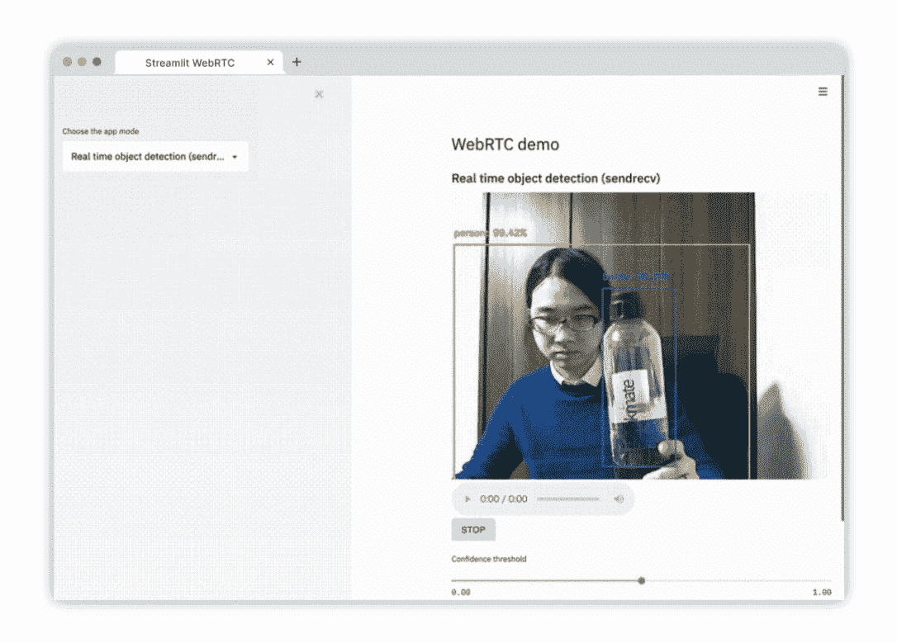

在开发各种计算机视觉或机器学习模型时，实时视频处理是最重要的应用之一。它很有用，因为它允许用户通过自己的设备(如网络摄像头或智能手机)快速验证他们的模型可以做什么。

但这也给我们这些使用 Streamlit 的人带来了挑战，因为 Streamlit 本身并不支持实时视频处理。

我创建了 [streamlit-webrtc](https://github.com/whitphx/streamlit-webrtc) ，一个使 streamlit 能够通过网络处理实时媒体流的组件来解决这个问题。在这篇深入的教程中，我还将简要地向您介绍 WebRTC(查看[我的文章，这里有](https://dev.to/whitphx/python-webrtc-basics-with-aiortc-48id)关于 WebRTC 的更深入的信息)。如果你想直接玩组件[，这里有一个示例](https://share.streamlit.io/whitphx/streamlit-webrtc-example/main/app.py)应用程序。

准备好了吗？

让我们开始吧。

(本教程需要 Python >= 3.6 和网络摄像头。)

## 现有方法的问题是

Streamlit 被许多开发人员和研究人员积极用于构建由计算机视觉和机器学习模型支持的应用原型，但它还不能天生支持实时视频处理。

利用 Streamlit 实现实时视频处理的一种现有方法是使用 OpenCV 来捕获视频流。然而，这仅在 Python 进程可以访问视频源时有效，换句话说，仅当摄像机连接到运行应用程序的同一主机时有效。

由于这一限制，将该应用程序部署到远程主机并将其用于本地网络摄像头的视频流一直存在问题。`cv2.VideoCapture(0)`消耗来自第一个(索引为 0)本地连接设备的视频流，当应用托管在远程服务器上时，视频源是连接到*服务器*的摄像设备——而不是本地网络摄像头。

## WebRTC 如何解决这个问题

webRTC (Web 实时通信)使 Web 服务器和客户端(包括 Web 浏览器)能够通过网络以低延迟发送和接收视频、音频和任意数据流。

它现在受到 Chrome、Firefox 和 Safari 等主流浏览器的支持，其规范是开放和标准化的。像 Google Meet 这样基于浏览器的实时视频聊天应用是 WebRTC 使用的常见例子。

WebRTC 扩展了 Streamlit 在前端和后端进程(如浏览器 JavaScript 和服务器端 Python)之间传输视频、音频和任意数据流的强大功能。

# WebRTC 基础知识

下面的教程使用了关于 WebRTC 概念的知识，比如“信令”、“提供”和“应答”。下图简单总结了如何建立 WebRTC 连接。

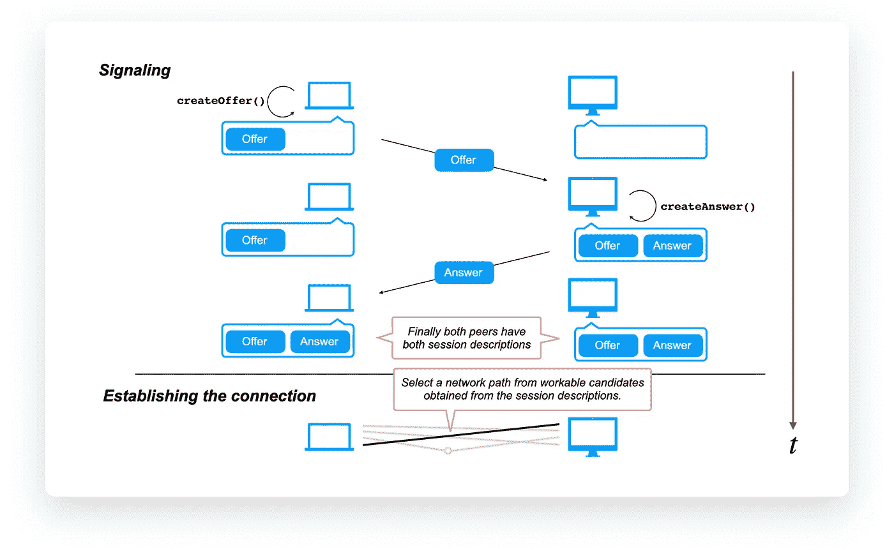

*   WebRTC 有一个称为“信令”的准备阶段，在此期间，对等体交换称为“提供”和“回答”的数据，以便收集必要的信息来建立连接。
*   开发人员可以选择任意的信令方法，比如 HTTP req/res 机制。

如果你想了解更多这些概念，请阅读[这篇文章](https://dev.to/whitphx/python-webrtc-basics-with-aiortc-48id)。

正如在上面链接的文章中一样，**本教程将使用用于 WebRTC 的 Python 库** `**aiortc**` **，以及来自** `[**aiortc**](https://github.com/aiortc/aiortc/tree/2362e6d1f0c730a0f8c387bbea76546775ad2fe8/examples/server)` [**资源库**](https://github.com/aiortc/aiortc/tree/2362e6d1f0c730a0f8c387bbea76546775ad2fe8/examples/server) **的** [**示例作为我们示例项目的基础。**](https://github.com/aiortc/aiortc/tree/2362e6d1f0c730a0f8c387bbea76546775ad2fe8/examples/server)

# Streamlit 执行模型的基础

要进一步阅读，您应该了解 Streamlit 双向定制组件的开发以及 Streamlit 的执行模型。你可以在这里了解一下[。](https://docs.streamlit.io/en/stable/streamlit_components.html)

这里有一个简短的总结:

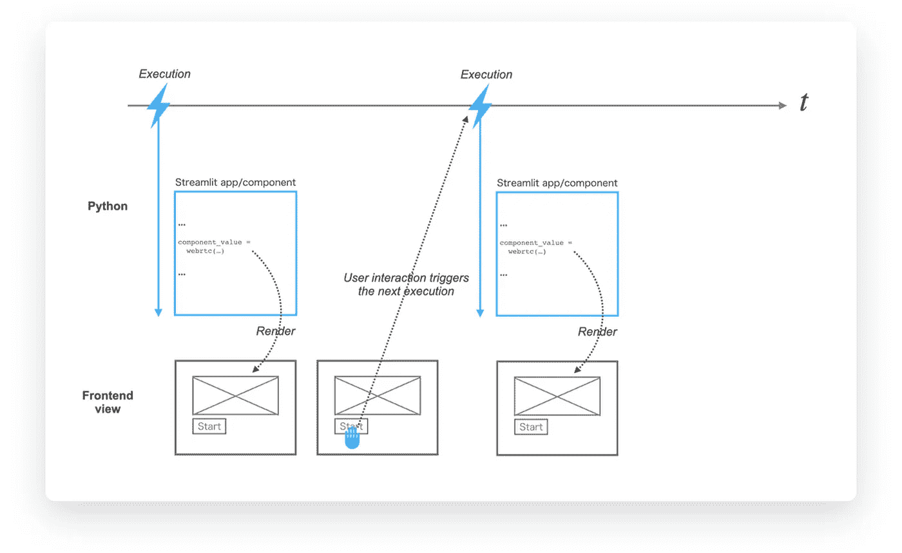

*   每次执行时，Python 脚本都是从上到下执行的。
*   Python 脚本的每次执行都会呈现前端视图，将数据作为组件的参数从 Python 发送到 JS。
*   前端通过`Streamlit.setComponentValue()`触发下一次执行，将数据作为组件值从 JS 发送到 Python。

# 将`aiortc`集成到一个简化组件中

在本节中，为了理解如何将 WebRTC 实现集成到 Streamlit 定制组件中，我们将创建一个名为`tiny-streamlit-webrtc`的`streamlit-webrtc`的最小版本，作为实践教程。

`tiny-streamlit-webrtc`的源代码[托管在 GitHub](https://github.com/whitphx/tiny-streamlit-webrtc) 上。在本教程中，我们将参考这个存储库，一步一步地检查每个中间提交，以获得最终版本。

建议您克隆存储库:

```
$ git clone [https://github.com/whitphx/tiny-streamlit-webrtc.git](https://github.com/whitphx/tiny-streamlit-webrtc.git)
$ cd tiny-streamlit-webrtc
```

使用下面的命令，您可以检查每个部分中引用的特定修订，以便查看整个代码库并实际尝试运行它。

```
$ git checkout <revision>
```

## 安装依赖项

安装必要的软件包。注意，本教程不适用于最新版本的`aiortc` ( `1.1.1`)，必须使用`1.0.0`。

```
$ pip install streamlit opencv-python
$ pip install aiortc==1.0.0
```

## 设置项目

像往常一样，我们从双向组件的[官方模板开始。参考](https://github.com/streamlit/component-template/tree/4b90f5277379a548792af51506254aee31854316/template)`[tiny-streamlit-webrtc](https://github.com/whitphx/tiny-streamlit-webrtc)` [实施](https://github.com/whitphx/tiny-streamlit-webrtc)基于修订`4b90f52`。

复制模板文件后，完成其余的设置，包括以下步骤。

*   将`my_component`重命名为`tiny_streamlit_webrtc`。
*   在`tiny_streamlit_webrtc/frontend`中运行`npm install`。
*   删除现有的代码、注释和文档字符串。
*   添加必要的文件，如`.gitignore`

查看[这部分做什么](https://github.com/whitphx/tiny-streamlit-webrtc/compare/13660f3..f6daf28)，代码版本`[f6daf28](https://github.com/whitphx/tiny-streamlit-webrtc/tree/f6daf280c650c04ae45f114fff4a4d0fd39a14c1)`。

## 推出第一个前端实施

让我们开始写代码。

首先，我们将简单地从`[aiortc](https://github.com/aiortc/aiortc/tree/2362e6d1f0c730a0f8c387bbea76546775ad2fe8/examples/server)`[示例](https://github.com/aiortc/aiortc/tree/2362e6d1f0c730a0f8c387bbea76546775ad2fe8/examples/server)中的`index.html`和`client.js`复制并粘贴一些代码到我们的 React 组件中，但是做了一些修正。

`[e3f70e4](https://github.com/whitphx/tiny-streamlit-webrtc/commit/e3f70e44bbd17d383abfdbef2f2d9e961d1a47e6)`是实际的编辑，您可以通过检查提交来尝试这个版本，如上所述。

```
$ git checkout e3f70e4
```

该视图只包含一个带有`autoPlay`和`playsInline`属性的`<video />`元素，就像在最初的`index.html`中一样，以及一个启动 WebRTC 会话的按钮元素。开始按钮的`onClick`处理程序被绑定到`start()`方法，该方法是从`client.js`复制过来的，并稍作修改，删除了本教程不需要的一些行，并调整为基于 React 类的组件样式。我们将对`negotiate()`和`createPeerConnection()`做同样的事情。

让我们以简化定制组件开发的通常方式运行这个组件。

```
$ cd tiny_streamlit_webrtc/frontend/
$ npm start$ streamlit run tiny_streamlit_webrtc/__init__.py
```

用网络浏览器打开应用程序后，打开开发者工具，点击“开始”按钮。您可以在控制台中看到报价的生成和打印，如下所示。

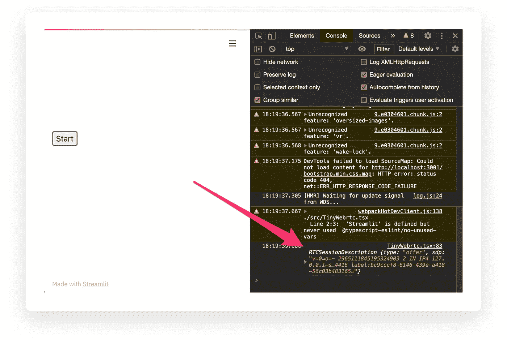

这是通过[这条线](https://github.com/whitphx/tiny-streamlit-webrtc/commit/e3f70e44bbd17d383abfdbef2f2d9e961d1a47e6#diff-c0bb5335a5a993d716414831b4151b2a7070e4533adb552831b5f22a4b32da1cR83)打印的。请按照步骤进行。这段代码相当于在向 Python 服务器发送要约之前[原始示例](https://github.com/aiortc/aiortc/blob/2362e6d1f0c730a0f8c387bbea76546775ad2fe8/examples/server/client.js#L70) *中的代码。是的，这个案例与原来的例子不同。我们如何将提议发送到 Python 流程？*

(您还可以看到，自从`[navigator.mediaDevices.getUserMedia()](https://github.com/whitphx/tiny-streamlit-webrtc/commit/e3f70e44bbd17d383abfdbef2f2d9e961d1a47e6#diff-c0bb5335a5a993d716414831b4151b2a7070e4533adb552831b5f22a4b32da1cR95)`请求使用以来，您的网络摄像头已变为活动状态。)

## 将报价从 JS 发送到 Python

为此，`streamlit-webrtc`使用了`Streamlit.setComponentValue()`。我们将在本节中了解它。

`[7b7dd2d](https://github.com/whitphx/tiny-streamlit-webrtc/commit/7b7dd2d2f9289b7f6697a3ab915fd8dc6438afd9)`是下次更新。使用`git checkout 7b7dd2d`来检查它。

通过这种改变，报价作为组成值从前端发送到服务器。

```
const offerJson = offer.toJSON()
Streamlit.setComponentValue({
  offerJson,
})
```

该报价可以在服务器端读取，如下所示。

```
component_value = _component_func(key=key, default=None)
if component_value:
    offer_json = component_value["offerJson"]
```

让我们运行这个版本，并确认在单击“Start”按钮后显示要约，这意味着要约被 Python 进程接收，并在这里显示为`st.write()`。

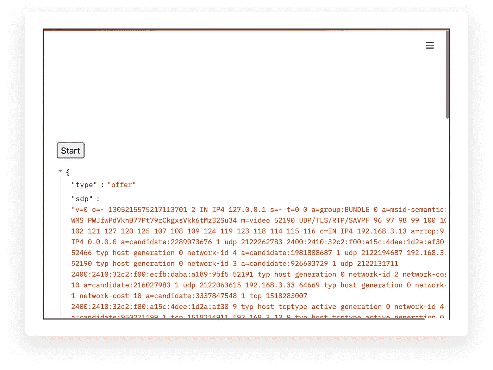

## 使用`asyncio`的服务器端实现

现在要约在服务器端被接收，所以让我们实现代码来处理它。就像我们做前端一样，让我们从示例`server.py`复制粘贴到我们的`streamlit_webrtc/__init__.py`，像[这个](https://github.com/whitphx/tiny-streamlit-webrtc/commit/92416e63b6d09ee77f6b5739af73a888d15fe96b)，它是从示例 `[server.py](https://github.com/aiortc/aiortc/blob/2362e6d1f0c730a0f8c387bbea76546775ad2fe8/examples/server/server.py#L102-L167)`中的`[offer()](https://github.com/aiortc/aiortc/blob/2362e6d1f0c730a0f8c387bbea76546775ad2fe8/examples/server/server.py#L102-L167)` [协程复制过来的。](https://github.com/aiortc/aiortc/blob/2362e6d1f0c730a0f8c387bbea76546775ad2fe8/examples/server/server.py#L102-L167)

注意，暂时从`track`事件监听器[中省略了一个视频转换器，就像现在的](https://github.com/whitphx/tiny-streamlit-webrtc/commit/92416e63b6d09ee77f6b5739af73a888d15fe96b#diff-6abc149a63c4cc57ae904cb1f4bad9f0d063f70011a4cb9266fb4411ec839a7eR37)一样，以专注于 WebRTC 部分。它现在只是通过输入轨道到达输出。

然而，正如您所看到的，这段代码包含了`async`和`await`，并且在函数中不起作用。因此，我们必须将这部分封装在一个像 [this](https://github.com/whitphx/tiny-streamlit-webrtc/commit/a6f7cc050b5fd07f49800bf264ec7fc34d70bdbb) 这样的协程中。

请运行[此版本:](https://github.com/whitphx/tiny-streamlit-webrtc/commit/a6f7cc050b5fd07f49800bf264ec7fc34d70bdbb) `[a6f7cc0](https://github.com/whitphx/tiny-streamlit-webrtc/commit/a6f7cc050b5fd07f49800bf264ec7fc34d70bdbb)`并确认答案显示在[此处](https://github.com/whitphx/tiny-streamlit-webrtc/commit/a6f7cc050b5fd07f49800bf264ec7fc34d70bdbb#diff-6abc149a63c4cc57ae904cb1f4bad9f0d063f70011a4cb9266fb4411ec839a7eR55)的报价之后。这意味着服务器端的`pc`对象已经处理了报价并生成了答案。

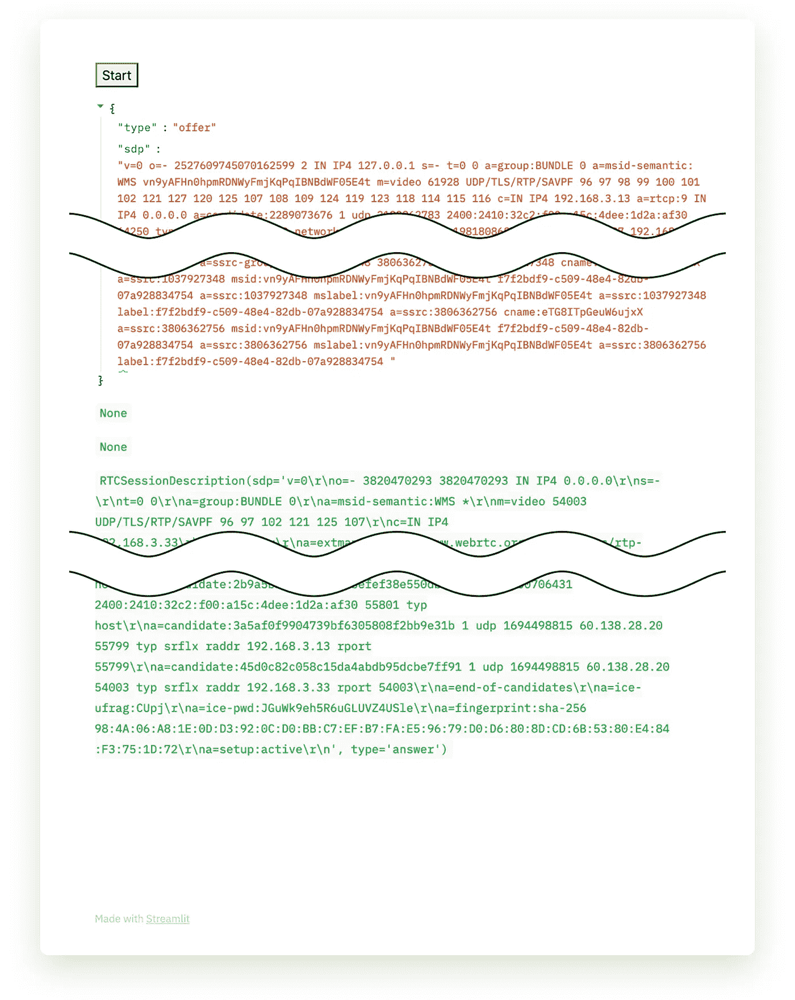

接下来我们要做的就是把它送回前端。

## 将答案从 Python 发回 JS

要做到这一点，`streamlit-webrtc`只需依赖如下所示的 Streamlit 从 Python 到 JavaScript 的数据发送机制。

```
_component_func(key=key, answer=answer)
```

然而，一个问题出现了。我们已经打电话给`component_value = _component_func(...)`并从它那里得到了报价。之后，我们生成了答案。那么，我们如何再次将参数设置为已经调用过的`_component_func()`？

简单地像下面这样调用第二个`_component_func()`不起作用，因为在 Streamlit 应用程序中，不同的`_component_func()`调用被识别为组件的不同实例。

```
component_value = _component_func()
offer = component_value["offer"]
answer = generate_answer(offer)  # Pseudo code
_component_func(answer=answer)  # This does not work!
```

为了解决这个问题，我们不得不介绍一个黑客:`SessionState`和`st.experimental_rerun()`。使用这些工具，我们可以重新运行脚本，再次调用同一行中的`_component_func()`,并在运行期间保存一个变量，以便在第二次和以后的执行中将其提供给`_component_func()`。

`SessionState`已在本论坛主题的[中讨论过，来源可在](https://discuss.streamlit.io/t/is-there-any-working-example-for-session-state-for-streamlit-version-0-63-1/4551)[本页面的](https://gist.github.com/tvst/036da038ab3e999a64497f42de966a92)要点中找到。

`st.experimental_rerun()`顾名思义，似乎是一个实验性的 API，还没有文档。这个 GitHub 问题已经讨论过了，现在可以用了。

请看[这个版本的服务器端代码](https://github.com/whitphx/tiny-streamlit-webrtc/commit/aa2ab49606060e4a038f392500aecbe95c4ec758#diff-6abc149a63c4cc57ae904cb1f4bad9f0d063f70011a4cb9266fb4411ec839a7e)，其中`SessionState`和`st.experimental_rerun()`用于将生成的答案反馈给组件。

这说明了它是如何工作的。

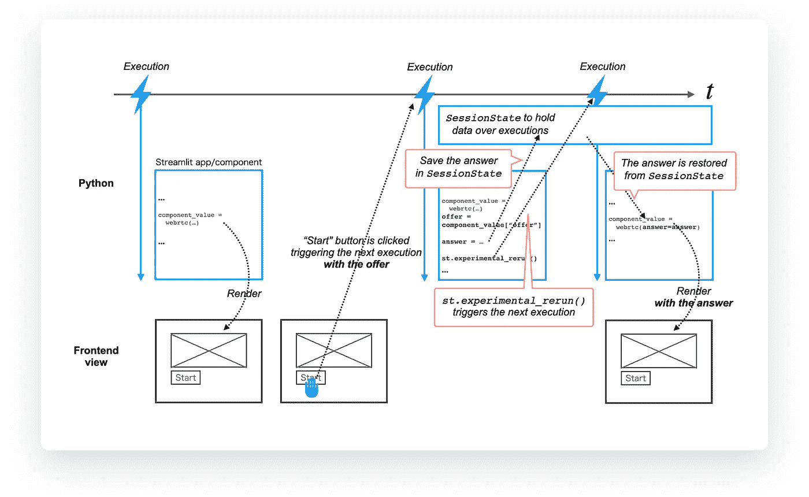

这里另一件重要的事情是`key`参数不再是可选的，而是必须像 [this](https://github.com/whitphx/tiny-streamlit-webrtc/commit/aa2ab49606060e4a038f392500aecbe95c4ec758#diff-6abc149a63c4cc57ae904cb1f4bad9f0d063f70011a4cb9266fb4411ec839a7eR83) 一样被显式提供。由于答案是作为参数提供给`_component_func()`的，并且它的值会随着运行而变化，因此`key`作为组件实例的稳定标识符是必要的。

如果`key`是`None`，则 Streamlit 基于`key`之外的参数来标识组件实例，因此当答案改变时，Streamlit 无法在运行期间跟踪组件实例的身份。

注意[这个 if 子句](https://github.com/whitphx/tiny-streamlit-webrtc/commit/aa2ab49606060e4a038f392500aecbe95c4ec758#diff-6abc149a63c4cc57ae904cb1f4bad9f0d063f70011a4cb9266fb4411ec839a7eR64)被添加来仅在服务器端进程第一次从前端获得提议时调用`st.experimental_rerun()`。一旦报价被传递给 Python，这也可以通过在前端重置组件值来实现。

用[这个版本:](https://github.com/whitphx/tiny-streamlit-webrtc/commit/aa2ab49606060e4a038f392500aecbe95c4ec758) `[aa2ab49](https://github.com/whitphx/tiny-streamlit-webrtc/commit/aa2ab49606060e4a038f392500aecbe95c4ec758)`，可以看到答案是作为`args`道具的一个字段提供的，就像[这个](https://github.com/whitphx/tiny-streamlit-webrtc/commit/aa2ab49606060e4a038f392500aecbe95c4ec758#diff-c0bb5335a5a993d716414831b4151b2a7070e4533adb552831b5f22a4b32da1c)在前端一样。我们用浏览器的 devtools 确认一下吧。

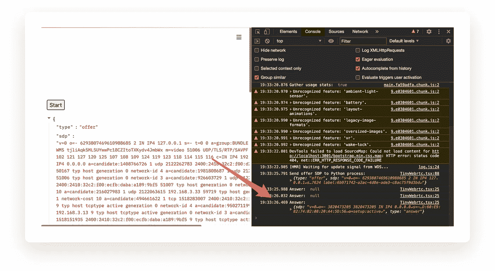

## 实施`processAnswer()`

现在我们在前端有了答案。让我们像[和](https://github.com/whitphx/tiny-streamlit-webrtc/commit/7fbf0eb5a72de4ea84b21708df80a396fa3222ff)一样实现其余的前端代码。

该代码是在收到示例 `[client.js](https://github.com/aiortc/aiortc/blob/2362e6d1f0c730a0f8c387bbea76546775ad2fe8/examples/server/client.js#L95-L99)`中的答案后从[部分复制的，并根据我们的进行调整。](https://github.com/aiortc/aiortc/blob/2362e6d1f0c730a0f8c387bbea76546775ad2fe8/examples/server/client.js#L95-L99)

## 引入一个运行脚本执行的线程

似乎我们已经做了所有我们要做的事情，但是当你用[这个版本:](https://github.com/whitphx/tiny-streamlit-webrtc/commit/7fbf0eb5a72de4ea84b21708df80a396fa3222ff) `[7fbf0eb](https://github.com/whitphx/tiny-streamlit-webrtc/commit/7fbf0eb5a72de4ea84b21708df80a396fa3222ff)`点击“开始”按钮时，没有视频出现。

问题出在服务器端。来自`aiortc`的服务器端 WebRTC 代码运行在一个事件循环上，这个事件循环现在是从`asyncio.run()` [隐式开始的。创建一个事件循环，在整个 Streamlit 脚本执行过程中，`aiortc`函数依赖于该事件循环。但是这个事件循环将在下一个脚本执行中被丢弃，并且`aiortc`不能继续工作。](https://github.com/whitphx/tiny-streamlit-webrtc/blob/7fbf0eb5a72de4ea84b21708df80a396fa3222ff/tiny_streamlit_webrtc/__init__.py#L67)

为了解决这个问题，我们将分叉一个线程，并在其中创建一个事件循环来运行`aiortc`函数。并且线程对象被存储在`SessionState`中以在多个 Streamlit 脚本执行期间被维护。

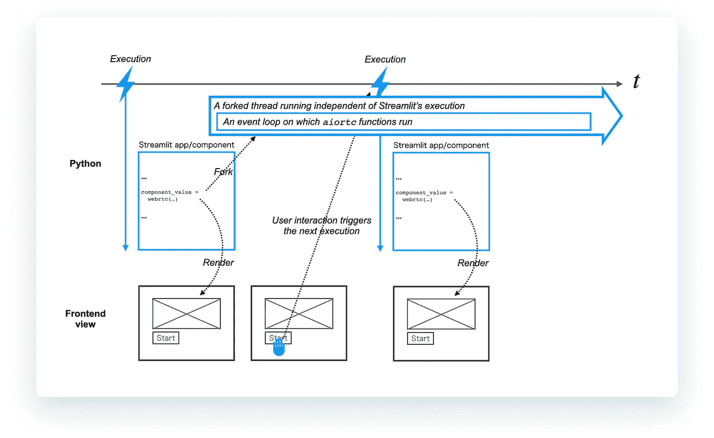

见[本版代码:](https://github.com/whitphx/tiny-streamlit-webrtc/commit/093f81be648ad66082e15448b90b74e24e5897b8) `[093f81b](https://github.com/whitphx/tiny-streamlit-webrtc/commit/093f81be648ad66082e15448b90b74e24e5897b8)`。[这个](https://github.com/whitphx/tiny-streamlit-webrtc/commit/093f81be648ad66082e15448b90b74e24e5897b8#diff-6abc149a63c4cc57ae904cb1f4bad9f0d063f70011a4cb9266fb4411ec839a7eR45-R67) `[webrtc_worker()](https://github.com/whitphx/tiny-streamlit-webrtc/commit/093f81be648ad66082e15448b90b74e24e5897b8#diff-6abc149a63c4cc57ae904cb1f4bad9f0d063f70011a4cb9266fb4411ec839a7eR45-R67)` [函数](https://github.com/whitphx/tiny-streamlit-webrtc/commit/093f81be648ad66082e15448b90b74e24e5897b8#diff-6abc149a63c4cc57ae904cb1f4bad9f0d063f70011a4cb9266fb4411ec839a7eR45-R67)在这里分叉为线程[。在这个线程中，](https://github.com/whitphx/tiny-streamlit-webrtc/commit/093f81be648ad66082e15448b90b74e24e5897b8#diff-6abc149a63c4cc57ae904cb1f4bad9f0d063f70011a4cb9266fb4411ec839a7eR93)[创建了一个新的事件循环](https://github.com/whitphx/tiny-streamlit-webrtc/commit/093f81be648ad66082e15448b90b74e24e5897b8#diff-6abc149a63c4cc57ae904cb1f4bad9f0d063f70011a4cb9266fb4411ec839a7eR48)并且`process_offer()`协程正在其上运行——在之前的代码版本中由`asyncio.run()`调用。有了这个变化，`[queue.Queue](https://github.com/whitphx/tiny-streamlit-webrtc/commit/093f81be648ad66082e15448b90b74e24e5897b8#diff-6abc149a63c4cc57ae904cb1f4bad9f0d063f70011a4cb9266fb4411ec839a7eR92)`T15 被引入到[在主线程](https://github.com/whitphx/tiny-streamlit-webrtc/commit/093f81be648ad66082e15448b90b74e24e5897b8#diff-6abc149a63c4cc57ae904cb1f4bad9f0d063f70011a4cb9266fb4411ec839a7eR97)中获取答案对象，现在在分叉线程中生成。

分叉线程有一个缺点——当你点击`Ctrl+c`时`streamlit run`命令不会停止。这是因为即使在主线程终止后，分叉线程仍然存在。

要强制终止进程，发送 SIGKILL 如下。

```
$ ps aux | grep python | grep streamlit # Find the process ID whitphx 19118 11.2 0.6 4759304 99928 s003 S+ 5:27PM 0:02.06 /path/to/venv/bin/python3.8 /path/to/venv/bin/streamlit run tiny_streamlit_webrtc/__init__.py
$ kill -9 19118 # Send SIGKILL to the process specified with the ID
```

要修复它，分叉螺纹的`daemon`选项设置为`True`，就像[这个](https://github.com/whitphx/tiny-streamlit-webrtc/commit/fc48060224bd69e85528a4b0859107a70dfbe0bf)一样。有了这个标志，脚本会在必要时正确停止。

> *线程可以被标记为“守护线程”。这个标志的意义在于，当只剩下守护线程时，整个 Python 程序退出。* [*【线程对象】*](https://docs.python.org/3/library/threading.html#thread-objects)【Python.org】

## *组件高度调节*

*让我们试试[现在的版本:](https://github.com/whitphx/tiny-streamlit-webrtc/commit/fc48060224bd69e85528a4b0859107a70dfbe0bf) `[fc48060](https://github.com/whitphx/tiny-streamlit-webrtc/commit/fc48060224bd69e85528a4b0859107a70dfbe0bf)`。现在，WebRTC 工作了，视频出现了这个组件！但是，显示的视频被裁剪，其下部被隐藏，如下图所示。*

*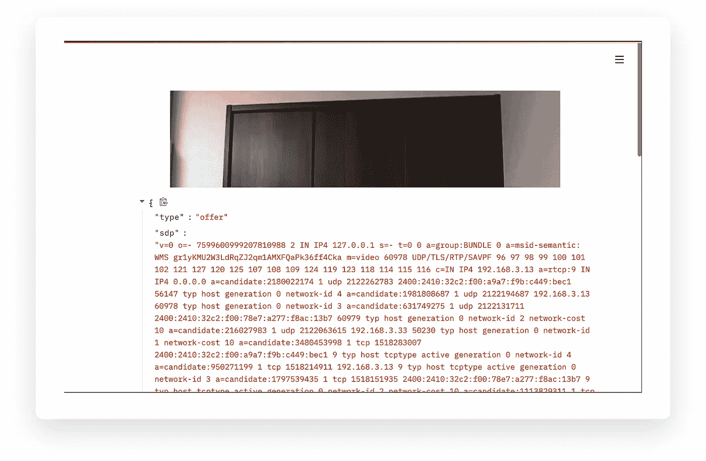*

*要修复它，我们必须在`<video />`元素的大小改变时调用`Streamlit.setFrameHeight()`。虽然它是在道具更新时自动调用的，但元素 resize 与道具更新无关，而是与开始视频流相关。*

*现在在`<video />`元素上附加`onCanPlay`事件处理程序，并像 [this](https://github.com/whitphx/tiny-streamlit-webrtc/commit/1a57a9755e0325ed3839bb259a7655bfe94b679e#diff-c0bb5335a5a993d716414831b4151b2a7070e4533adb552831b5f22a4b32da1cR39) 一样从它调用`Streamlit.setFrameHeight()`。(虽然使用`[ResizeObserver](https://developer.mozilla.org/en-US/docs/Web/API/ResizeObserver)`可能是观察 DOM 元素调整大小的正确方法，但为了简单起见，我们在这里使用`onCanPlay`事件作为替代。)*

*酷！现在它工作正常。🎉`[1a57a97](https://github.com/whitphx/tiny-streamlit-webrtc/commit/1a57a9755e0325ed3839bb259a7655bfe94b679e)`就是这个版本。*

*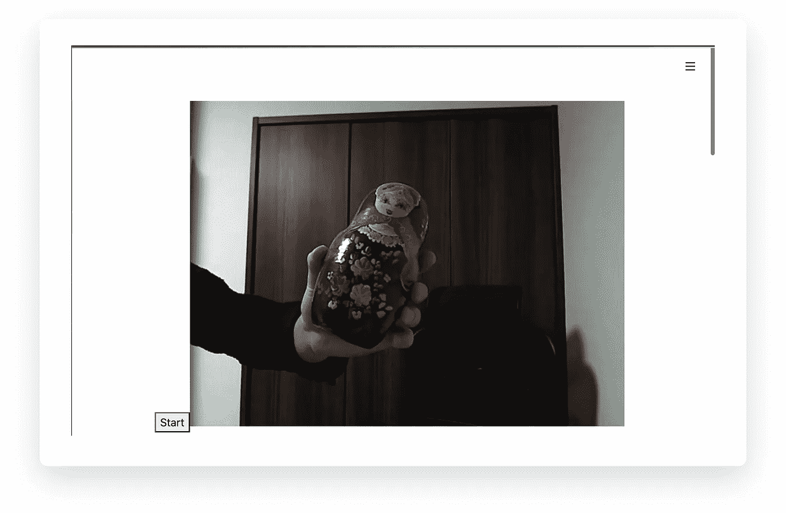*

*现在，WebRTC 的所有核心部分都完成了。我们将在接下来的小节中实现其余部分。*

## *实现您自己的视频过滤器*

*首先，让我们尝试实现一些视频过滤器。`[3ba703d](https://github.com/whitphx/tiny-streamlit-webrtc/commit/3ba703d1604c9edecedcf9bb3bed32706ada023a)`是一个简单的边缘提取器的例子，复制自 `[aiortc](https://github.com/aiortc/aiortc/blob/2362e6d1f0c730a0f8c387bbea76546775ad2fe8/examples/server/server.py#L66-L75)`的[示例代码。](https://github.com/aiortc/aiortc/blob/2362e6d1f0c730a0f8c387bbea76546775ad2fe8/examples/server/server.py#L66-L75)*

## *实现一个停止按钮*

*参考`[aiortc](https://github.com/aiortc/aiortc/blob/2362e6d1f0c730a0f8c387bbea76546775ad2fe8/examples/server/client.js#L184-L210)`[示例](https://github.com/aiortc/aiortc/blob/2362e6d1f0c730a0f8c387bbea76546775ad2fe8/examples/server/client.js#L184-L210)创建一个停止按钮来优雅地停止流。是当前版本。*

# *`streamlit-webrtc`的执行模式*

*我们按照步骤使用 WebRTC 开发了一个最小的 Streamlit 组件来传输视频。*

*正如我们在该组件中看到的，我们选择了一种设计，其中计算机视觉代码在分叉线程的回调中运行，由来自输入流的新帧触发，与 Streamlit 的脚本执行时间无关。第一次看到它时，它看起来有点奇怪，但在处理实时流时，这是必要和自然的。*

*让我们从更抽象的角度来看。当处理来自实时流的帧时，流是除了通过前端视图的用户交互之外的附加事件源。在普通的 Streamlit 应用中，所有触发 Python 脚本执行的事件都只来自前端，它们被 Streamlit 很好地封装起来。*

*有了它的执行模型，开发者可以在一个干净的世界里编写应用程序，没有回调，没有(或很少)副作用。反过来，如果我们希望以良好的性能处理流，我们必须显式地处理来自流的事件，如帧生成，这打破了优雅的封装，导致回调和事件出现在脚本中。*

# *`tiny-streamlit-webrtc`缺少什么*

*尽管我们已经创建了`[streamlit-webrtc](https://github.com/whitphx/streamlit-webrtc)`、`tiny-streamlit-webrtc`的一个小子集，但它仍然缺少`streamlit-webrtc`拥有的许多重要特性。在这里，我们将回顾其中的一些。*

## *来自 Streamlit 组件的参数输入*

*使用 Streamlit 的最大好处之一是交互式控件，如滑块和单选按钮。通过计算机视觉和机器学习模型，这些控制对于在执行过程中改变参数非常有用。*

*因为计算机视觉代码在这个组件的分叉线程中运行，所以我们必须通过线程将从 Streamlit 小部件获得的值传递给 CV 代码。但这并不困难，就像中的 `[streamlit-webrtc](https://github.com/whitphx/streamlit-webrtc/blob/f03d3150adfa27c44bb7f2d22d495351090d9341/app.py#L184)`中的[样](https://github.com/whitphx/streamlit-webrtc/blob/f03d3150adfa27c44bb7f2d22d495351090d9341/app.py#L184)。*

*使用`tiny-streamlit-webrtc`，您可以通过向`VideoTransformTrack`添加一个公共属性，并从每个线程中读取和写入它，就像上面链接的示例代码一样。有兴趣的请尝试一下，传递复杂值时注意线程安全。*

## *丢帧*

*我们在教程中使用了边缘提取作为例子。然而，如果你用像深度神经网络这样计算更昂贵的过滤器来代替它，你会看到显示的视频变慢。只需将`time.sleep(1)`放入`VideoTransformTrack.recv()`中即可测试。*

*这是因为`VideoTransformTrack.recv()`逐个处理所有的输入帧——如果它延迟，产生输出帧也会延迟。*

*为了解决这个问题，`VideoTransformTrack.recv()`不得不在每次运行时丢弃一些输入帧并选择最新的一个。在`streamlit-webrtc`中，当`[async_transform](https://github.com/whitphx/streamlit-webrtc/blob/f03d3150adfa27c44bb7f2d22d495351090d9341/streamlit_webrtc/__init__.py#L98)` [](https://github.com/whitphx/streamlit-webrtc/blob/f03d3150adfa27c44bb7f2d22d495351090d9341/streamlit_webrtc/__init__.py#L98)选项设置为`True`时，在这里[完成。](https://github.com/whitphx/streamlit-webrtc/blob/f03d3150adfa27c44bb7f2d22d495351090d9341/streamlit_webrtc/transform.py#L97-L98)*

*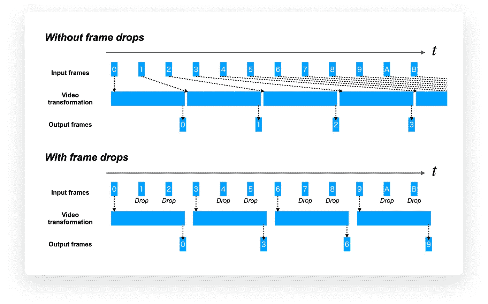*

## *可扩展性*

*在`tiny-streamlit-webrtc`中，视频转换被硬编码在`VideoTransformTrack.recv()`中，但当然，作为一个库，这是糟糕的设计。为了可重用，它应该公开一个可注入的接口，开发人员可以通过该接口实现任意类型的视频转换，封装细节，如`VideoTransformTrack.recv()`和 WebRTC 相关代码。*

*有了`streamlit-webrtc`，开发者可以通过创建一个类扩展`VideoTransformerBase`类来实现自己的视频转换，比如[这个](https://github.com/whitphx/streamlit-webrtc/blob/f03d3150adfa27c44bb7f2d22d495351090d9341/app.py#L233)和[这个](https://github.com/whitphx/streamlit-webrtc/blob/f03d3150adfa27c44bb7f2d22d495351090d9341/app.py#L129)。*

# *关键要点*

*Streamlit 是一个漂亮的框架，有一个有用的库，但它本身不能很好地处理实时视频处理。*

*WebRTC 通过支持服务器端流程和客户端以低延迟通过网络发送和接收数据流，使 Streamlit 更加出色。*

*在脑海中有一个使用 WebRTC 的惊人项目吗？请在评论中与我们分享或给我发消息。*

# *信用*

*由 Yu Tachibana([@ z _ reactor](https://twitter.com/z_reactor))审核*

**原载于 2021 年 2 月 12 日*[*https://blog . streamlit . io*](https://blog.streamlit.io/how-to-build-the-streamlit-webrtc-component/)*。**