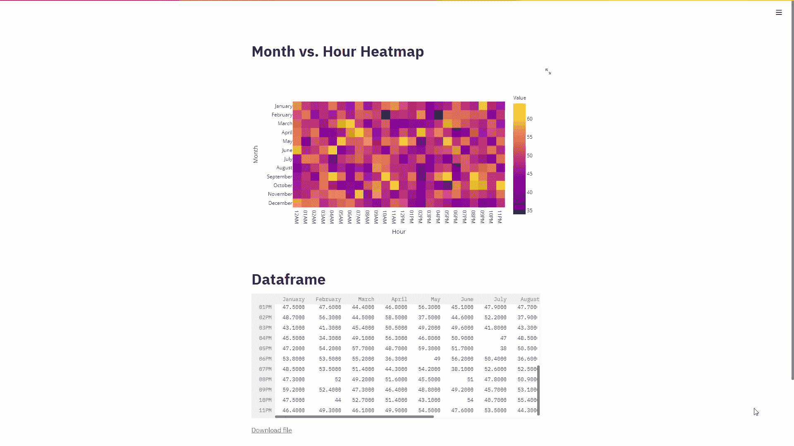
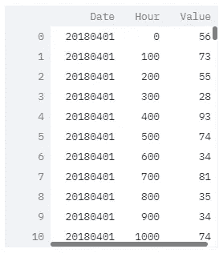

# 使用 Plotly 在 Python 中开发时间序列热图

> 原文：<https://towardsdatascience.com/developing-a-timeseries-heatmap-in-python-using-plotly-fcf1d69575a3?source=collection_archive---------8----------------------->

## 使用 Plotly 创建每月和每小时数据的可视化热图



作者视觉。

## 介绍

任何接触过数据的人都知道，时间序列数据可以说是我们日常处理的最丰富的数据类型。用日期、时间和/或两者索引的数据因此被分类为时间序列数据集。通常，将我们的时间序列呈现为每月和每小时的热图是有帮助的。这种强大的可视化非常有助于消化以其他方式呈现的数据，这些数据可能不会被我们高度可视化的自我吸收。这些渲染图通常水平描绘小时，垂直描绘月，并利用颜色来传达底层单元格所代表的值的强度。在这里，我们将把一个随机生成的时间序列数据集转换成一个交互式热图，这是 Python 最强大的绑定之一。

## 编程堆栈

除了 Python，我们还将利用 Plotly、Pandas 和 Streamlit——数据科学社区中一些最强大的工具。我想很多人会对熊猫更加熟悉；另一方面，Plotly 和 Streamlit 可能没有敲响多少钟。以下是对每一项的快速回顾:

**1。熊猫**

在处理数据时，Pandas 无疑是 Python 中最有效的绑定之一。Pandas 允许你在你的设备上执行一系列的变换，所有这些都是通过调用几个简短的命令来完成的。在我们的应用程序中，我们将使用 Pandas 从/向 CSV 文件中读取/写入我们的数据，并将我们的时间戳重组为一天中的月份和小时。

**2。阴谋地**

Plotly 是一个健壮、敏捷的数据可视化库，专门为机器学习和数据科学工具定制。虽然它基于 plotly.js，而 plotly . js 本身是一个本地 Javascript 绑定，但它已经扩展到支持 Python、R 和其他流行的脚本语言。通过在 Python 脚本中使用几行 JSON，您可以轻松地调用交互式可视化，包括但不限于折线图、直方图、雷达图、热图等等。在这种情况下，我们将使用 Plotly 来呈现我们的月与小时热图。

**3。流线型**

Streamlit 是 Python 库的无名英雄。它是一个纯粹的 Python web 框架，允许你开发和部署你的应用程序作为 web 应用程序，而不需要编写一行 HTML 或 CSS，别开玩笑了。对我个人来说，我在 2020 年夏天开始使用 Streamlit，从那以后我不记得在我写的脚本中没有使用过它。Streamlit 允许您使用优雅且高度互动的用户界面即时呈现您的应用程序。对于此应用程序，我们将使用 Streamlit 在本地浏览器上描绘我们的热图和数据框。

## 安装软件包

首先，在您选择的 Anaconda 环境中安装下面的包。

每个包都可以通过在 Anaconda 提示符下键入以下相应的命令来安装。

```
pip install plotly
```

## 资料组

我们将使用[这个](https://raw.githubusercontent.com/mkhorasani/timeseries_heatmap/main/data.csv)随机生成的数据集，它有一个日期、小时和值的列，如下所示。



图片作者。

日期格式如下:

```
YYYYMMDD
```

而小时的格式为:

```
HHMM
```

您可以使用任何其他适合您需要的格式来设置日期和/或小时的格式，但是您必须确保在您的脚本中声明它，如下一节所述。

## 数据预处理

在我们继续之前，我们需要预处理数据集，以确保日期和时间的格式可以进一步处理。

最初，我们需要删除 hour 列中值的所有尾随小数位，并添加前导零以防时间少于一个整小时，即 12:00AM 引用为 0。随后，我们需要将日期添加到小时中，并使用 Python 中的 **datetime.strptime** 绑定，以可理解的格式解析它们。最后，我们可以通过使用 **strftime** 函数将日期转换为月份，将小时转换为 12 小时制:

为了使用其他日期时间格式，请参考[这篇](https://docs.python.org/3/library/datetime.html)文章。

一旦我们的数据经过预处理，我们就可以使用 Pandas 中强大的**group by**类将我们的数据集重新分组为月和小时的时间平均值，如下所示:

请注意，可以使用其他方法代替平均值，即求和、最大值或最小值，方法是改变:

```
df.groupby(['Month','Hour'],sort=False,as_index=False).mean()
```

到

```
df.groupby(['Month','Hour'],sort=False,as_index=False).sum()
```

## 热图功能

现在，我们已经将数据重新分组为月和小时，我们首先需要将 Pandas 数据框转换为一个字典，然后转换为一个数组，可以输入到 Plotly 中来创建热图。

声明一个字典，请确保添加一年中的所有月份，不要截断，如下所示:

随后，我们将把 Pandas 数据框中的值插入到字典中，并使用它创建一个数组，分别对应于每月和每小时的平均值，如下所示:

最后，我们将使用之前创建的数组来渲染我们的 Plotly 热图:

## 下载 CSV

您可能会发现将重新分组的月与小时数据框下载为 CSV 文件非常方便。如果是这样，请使用以下功能在您的 Streamlit 应用程序中创建一个可下载的文件。

该函数的参数— *name* 和 *df* 分别对应需要转换为 CSV 文件的可下载文件和数据帧的名称。

## 简化应用程序

最后，我们可以将所有内容以 Streamlit 应用程序的形式组合在一起，该应用程序将呈现热图、数据框和一个链接，以便将我们重新分组的数据下载为 CSV 文件。

您可以通过在 Anaconda 提示符下键入以下命令来运行您的最终应用程序。首先，将根目录更改为保存源代码的位置:

```
cd C:/Users/...
```

然后键入以下内容运行您的应用程序:

```
streamlit run file_name.py
```

## 结果

这就是交互式渲染，使您能够将时间序列数据集可视化为月与小时的热图。


图片作者。

如果您想了解更多关于数据可视化和 Python 的知识，请随时查看以下(附属链接)课程:

## 使用 Streamlit 开发 Web 应用程序:

[](https://www.amazon.com/Web-Application-Development-Streamlit-Applications/dp/1484281101?&linkCode=ll1&tag=mkhorasani09-20&linkId=a0cb2bc17df598006fd9029c58792a6b&language=en_US&ref_=as_li_ss_tl) [## 使用 Streamlit 开发 Web 应用程序:开发和部署安全且可伸缩的 Web 应用程序…

### 使用 Streamlit 开发 Web 应用程序:使用……开发安全且可扩展的 Web 应用程序并将其部署到云中

www.amazon.com](https://www.amazon.com/Web-Application-Development-Streamlit-Applications/dp/1484281101?&linkCode=ll1&tag=mkhorasani09-20&linkId=a0cb2bc17df598006fd9029c58792a6b&language=en_US&ref_=as_li_ss_tl) 

## 使用 Python 实现数据可视化:

[](https://www.coursera.org/learn/python-for-data-visualization?irclickid=xgMQ4KWb%3AxyIWO7Uo7Vva0OcUkGQgW2aEwvr1c0&irgwc=1&utm_medium=partners&utm_source=impact&utm_campaign=3308031&utm_content=b2c) [## 用 Python 实现数据可视化

### “一图胜千言”。我们都熟悉这个表达。它尤其适用于试图…

www.coursera.org](https://www.coursera.org/learn/python-for-data-visualization?irclickid=xgMQ4KWb%3AxyIWO7Uo7Vva0OcUkGQgW2aEwvr1c0&irgwc=1&utm_medium=partners&utm_source=impact&utm_campaign=3308031&utm_content=b2c) 

## 面向所有人的 Python 专业化:

[](https://www.coursera.org/specializations/python?irclickid=xgMQ4KWb%3AxyIWO7Uo7Vva0OcUkGQgW16Ewvr1c0&irgwc=1&utm_medium=partners&utm_source=impact&utm_campaign=3308031&utm_content=b2c) [## 面向所有人的 Python

### 学习用 Python 编程和分析数据。开发收集、清理、分析和可视化数据的程序…

www.coursera.org](https://www.coursera.org/specializations/python?irclickid=xgMQ4KWb%3AxyIWO7Uo7Vva0OcUkGQgW16Ewvr1c0&irgwc=1&utm_medium=partners&utm_source=impact&utm_campaign=3308031&utm_content=b2c) 

## GitHub 资源库:

[](https://github.com/mkhorasani/timeseries_heatmap) [## mkhorasani/timeseries_heatmap

### 使用 Plotly 创建每月和每小时数据的可视化热图

github.com](https://github.com/mkhorasani/timeseries_heatmap) 

# 新到中？您可以在此订阅和解锁无限文章[。](https://khorasani.medium.com/membership)