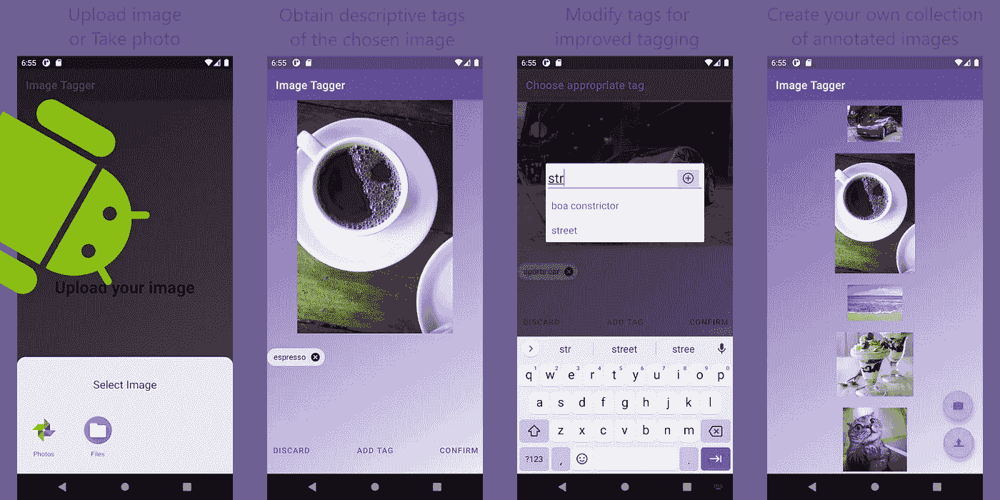
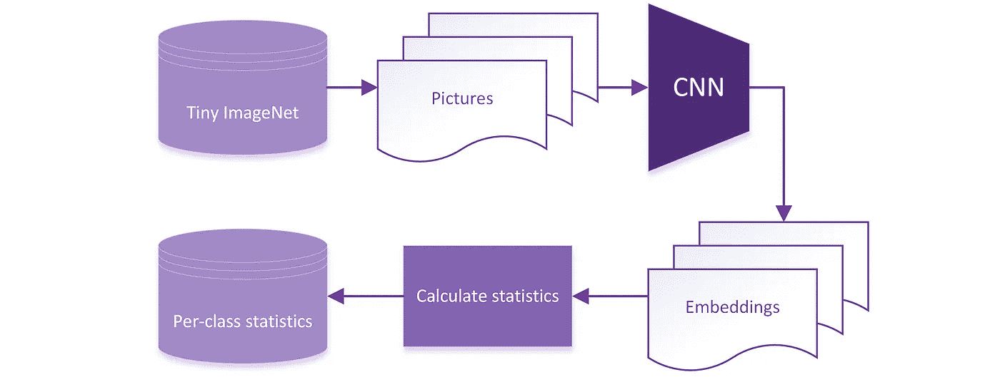
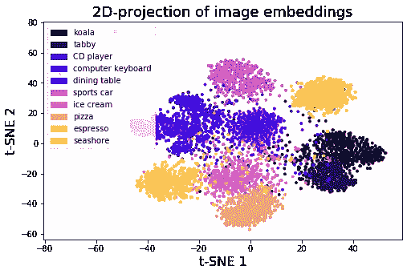
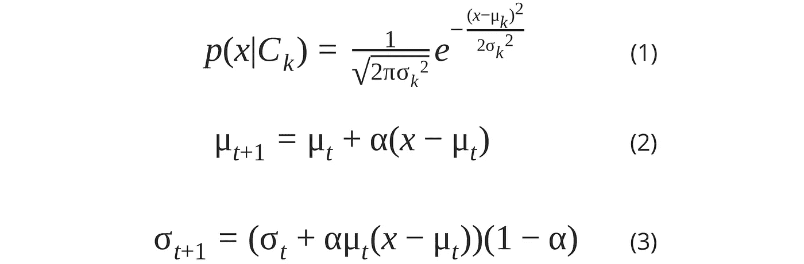
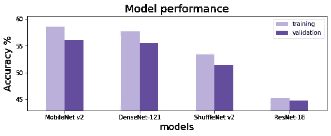
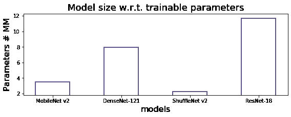
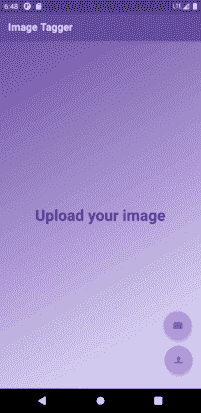

# 开发基于人工智能的 Android 图像注释应用程序

> 原文：<https://towardsdatascience.com/developing-an-ai-based-android-app-for-automated-image-annotation-30ab82cb8a31?source=collection_archive---------33----------------------->

## 易于使用的 Android 应用程序，用于生成使用 PyTorch、Kotlin 和 SQLite 构建的图像的描述性标签

作者图片

# 项目定义和总结

大数据和新兴技术对我们的日常生活产生了深刻的影响，这一点很难忽视。具体来说，视觉信息(如照片和社交媒体图像)的数量近年来呈指数级增长，这推动了可以高效处理大容量图像集合的软件的开发。[图像标记](https://en.wikipedia.org/wiki/Automatic_image_annotation)被认为是常见的计算机视觉问题之一，意指基于图像的视觉内容生成文本标记的过程。因此，自动检索图像的相关文本标签的能力允许自动化图像标记(例如，在线目录)，组织高容量图像内容(例如，照片管理器)，并且有益于现有的图像搜索和共享应用(例如，推荐引擎)。

为了解决这些问题，开发了一个 Android 应用程序 ImageTagger，用于自动生成图像的相关文本描述。为此，应用了深度学习和经典机器学习技术的组合。使用预训练的卷积神经网络(CNN)实现特征提取，使用非参数高斯朴素贝叶斯分类器定义相关标签。在这里，一个通用的图像分类数据集 Tiny ImageNet 被用于使用 MobileNet V2 生成图像嵌入，后者的性能使用精确度度量进行评估，精确度度量被广泛用于多类分类问题。这种方法的优点是不需要超参数调整，因为所选择的分类器没有超参数调整。

由此产生的 Android 应用程序允许用户上传他们想要描述的图像，并获得给定图像的相关标签。此外，ImageTagger 使用户能够更新现有的标签并向图像添加新的标签。随着时间的推移，系统基于明确的用户反馈，以在线方式从新的输入图像中学习标签，并更好地预测自己的描述。

# 方法学

## 利用计算机视觉进行嵌入生成

在这里，深度学习和经典机器学习技术的结合已经被应用。整个分析可以分为两个步骤，即特征提取和分类。特征提取部分使用深度[卷积神经网络](/bird-by-bird-using-deep-learning-4c0fa81365d7) (CNN)实现，待分配的标签使用非参数高斯朴素贝叶斯模型计算。图 1 显示了对以前看不到的数据进行贝叶斯推理所需的图像处理和计算机视觉管道。首先，图像通过 CNN，CNN 产生相应的图像嵌入 *x* 。然后，计算每个类别的统计数据(平均值 *μ* 和标准偏差 *σ)* 并存储到数据库中。

图一。ImageTagger 的数据处理和计算机视觉组件

# 结果

## 通过成千上万的图像学习概念

为了生成图像嵌入，使用了通用图像分类数据集 [Tiny ImageNet](http://cs231n.stanford.edu/reports/2017/pdfs/930.pdf) 。该数据集是完整 ImageNet 的较小版本，包含 10 万多张图像，均匀分布在 200 个类别中，属于不同的类别，如动物、设备、衣服等。因此，使用微小的 ImageNet 数据允许 CNN 模型从不同的知识领域学习图像的表示和描述。

出于项目目的，使用了在 ImageNet 数据集上预先训练的 CNN 模型。为了统一图像表示(形状和颜色分布)，输入图像被缩放并居中裁剪到 256 x 256 px 的大小，还使用完整 ImageNet 的统计数据以每个通道的方式进行标准化。上述程序适用于培训和评估步骤。

图二。归一化图像嵌入的 2D 投影

图 2 显示了属于 10 个随机选择的微型 ImageNet 类并使用 MobileNet V2 模型生成的图像嵌入的低维表示。定性分析清楚地表明语义相似的实体在嵌入空间中也是接近的，导致相关联的图像(例如，与食物相关的)在投影表面中分散在一起(例如，浓咖啡、冰淇淋和比萨饼在图的左下方)。

## 为输入图像生成相关标签

接下来，基于从图像嵌入中提取的预先计算的统计量，使用高斯朴素贝叶斯分类器(Eq)计算类别概率。1)并且后者被过滤，仅保留那些最大的并且总计总概率至少为 0.9 的。如果用户修改了任何分配的标签，则完成推断后校正。在这种情况下，包含每个类统计数据的应用程序数据库正在使用 Welford 的在线算法(Eq)进行更新。2，3)，其中动量项 *α* =0.1。

## 模型评估和论证

四种网络架构被认为是特征提取步骤的可能主干: [ResNet-18](https://arxiv.org/abs/1512.03385) 、 [DenseNet-121](https://arxiv.org/abs/1608.06993) 、 [MobileNet V2](https://arxiv.org/abs/1801.04381) 、 [ShuffleNet V2](https://arxiv.org/abs/1807.11164) 。为了选择最合适的 CNN 模型来生成图像嵌入，使用[准确性](https://developers.google.com/machine-learning/crash-course/classification/accuracy)度量在微型 ImageNet 数据集上评估了模型性能(图 3 ),该度量提供了正确预测与使用该模型得出的预测总数的比率。由于数据集[的作者提供了](http://cs231n.stanford.edu/reports/2017/pdfs/930.pdf)正式的训练和验证数据分割，因此没有必要使用交叉验证方法。因此，V2 移动网络被选为进一步分析的对象，因为该架构表现出最佳性能。

图 3。CNN 模型在微型 ImageNet 数据集上的性能

模型的大小作为其计算复杂性的间接度量，并且易于计算的神经架构是优选的，因为该模型将被部署在移动设备上。为了访问模型的大小，如图 4 所示计算可训练参数的数量。结果表明，ShuffleNet-18 架构的模型规模最小，其次是 V2 移动网络、V2 shuffle net 和 ResNet-18。

图 4。CNN 模型的可训练参数数量和性能的比较

最后，选择 MobileNet V2 模型架构是基于其准确性和大小的组合，因为它提供了最高的性能，同时提供了较少数量的可训练参数。

## 优化-使用量化加速网络

由于深度神经网络在计算上非常昂贵，推理速度通常成为瓶颈，尤其是在移动设备上。为了解决这个问题并增加模型的吞吐量，将模型[量化](https://pytorch.org/tutorials/recipes/quantization.html)应用于 MobileNet V2。该方法是指通过使用基于半精度浮点( *float16* 或整数( *int8* )数执行计算的低精度算术来降低计算复杂度。这种优化允许以验证准确度的边际降低(从 56.09%到 55.67%)为代价，显著减少执行特征提取步骤所需的时间(在诺基亚 7.1 上从 212.0 +/- 12.6 毫秒到 50.1 +/- 9.1 毫秒)。

## 设计移动应用架构

随着计算机视觉组件的开发，ImageTagger 的 UI 被设计(图 5)并实现，如后面所演示的。在左侧，有一个初始图片选择过程的概述，该过程导致将所选图片传递到私有图像集合中。用户可以上传设备上现有的图像或拍摄照片。在右边，流程图描述了从图像集合中获取图片并将它们显示给用户。后者可以选择它们中的一个来获得自动描述并对分配的标签进行编辑。

图 5。ImageTagger 的用户交互流程图

## ImageTagger 的现场演示

这是最终的 Android 应用程序的样子(图 6):

图 6。现场演示:Android 版 ImageTagger

# 结论和未来工作

在这里，开发了用于 Android 的应用程序 ImageTagger 来自动生成用户图像的相关文本注释。考虑在目标(例如，MS COCO)上微调 CNN 或者在更大的数据集(例如，YFCC100M)上训练它，可以实现进一步的精度提高。此外，使用支持基于 GPU 的推理的现代设备可以提高模型速度。

未来的发展可以通过引入使用客户端-服务器或点对点技术(例如区块链的 torrent)的用户间照片共享来实现，从而允许以安全和隐私保护的方式执行分布式图像搜索和检索。

# **在您的设备上获取 image tagger**

为了在您的移动设备上启动 ImageTagger，请遵循清单并确保您采取了所有步骤来成功安装它:

1.  从 GitHub 下载 [ImageTagger](https://github.com/slipnitskaya/image-tagger/releases/download/v1.0-alpha/image-tagger-v1.0-alpha.apk) 到您的 Android 设备
2.  在您的 Android 设备上打开应用程序
3.  享受自动图像标记

**注意:**移动设备预计运行 Android 8.1 及以上版本；应该允许安装来自未知来源的 apk。

担心隐私和安全？对安装来源不明的应用程序感到怀疑？只需克隆[项目库](https://github.com/slipnitskaya/image-tagger)并使用 Android Studio 4.1 或更新版本自行构建 ImageTagger。

 [## slipnitskaya/图像标签

### 这个项目演示了基于人工智能的 Android 应用程序，允许生成给定图像的标签。视觉的总量…

github.com](https://github.com/slipnitskaya/image-tagger)