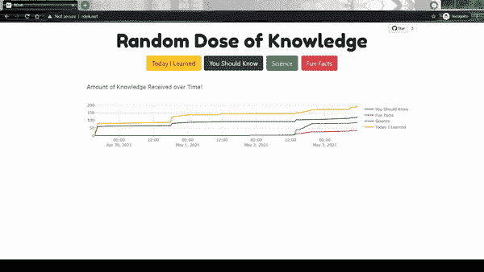
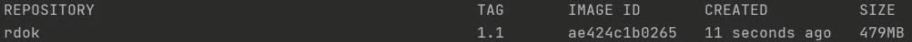
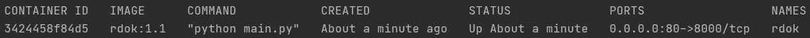
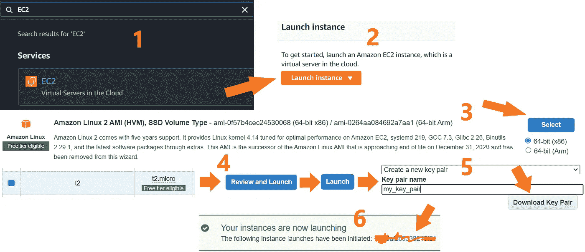
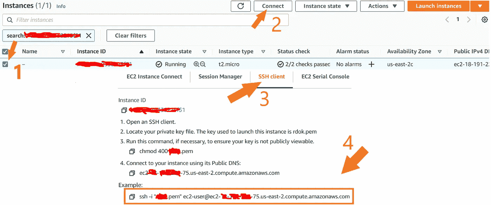
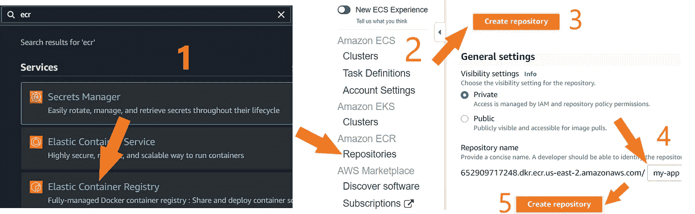
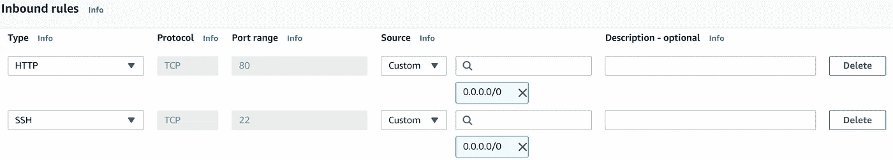

# 使用 FastAPI、Jinja2、SQLAlchemy、Docker 和 AWS 开发和部署一个完整的项目

> 原文：<https://towardsdatascience.com/developing-and-deploying-a-complete-project-using-fastapi-jinja2-sqlalchemy-docker-and-aws-1b504a1a2be4?source=collection_archive---------8----------------------->



作者 Gif。

# 介绍

你可以在 rdok.net 的[上访问最终版 app。代码在](http://rdok.net/) [GitHub](https://github.com/Deffro/random-dose-of-knowledge) 上是开源的。这主要是一篇程序性文章。目的是描述创建应用程序的完整过程，而不是用代码片段轰炸读者。

**这个应用程序是关于什么的？**这款应用名为“随机知识剂量”,外观如下


图片由作者提供。

有 4 个按钮，每个按钮来自一个特定的子编辑。当用户点击一个按钮时，会显示这个子编辑的随机帖子以及顶部的评论。我想你对 Reddit 很熟悉，但不熟悉也没关系。你可以把这款应用想象成一个用户可以不断点击按钮来了解一些很酷的事实的地方。在页面的底部，有一个交互式图表，显示每个按钮的累计点击次数。

## 如何阅读这篇文章

*   **潜在读者 1:** 只对过程感兴趣。希望以一种非常抽象和快速的方式看到创建这样一个项目的步骤。

> 如果你是 reader 1，不要像这样分块读内容，不要读代码片段。

预计时间:5 分钟。

*   **潜在读者 2:** 对自己不知道的具体部分感兴趣。如何用 FastAPI 使用 HTML？如何对项目进行归档？如何在 EC2 上部署？

> 如果你是读者 2，快速浏览文章，找到你想了解的内容和/或关键词。

预计时间:视情况而定。

*   **潜在读者 3:** 对流程和代码感兴趣。想要为自己重新创建这个应用程序。

> 如果你是 reader 3，克隆 GitHub 代码。阅读文章中的所有内容。再读一遍。复制它。

预计时间:最多 8 小时。

**使用的框架/软件/技术/平台:**

*   饭桶
*   米尼康达
*   FastAPI
*   SQLAlchemy
*   HTML，CSS
*   Jinja2
*   Reddit API
*   蟒蛇(熊猫，Plotly)
*   码头工人
*   AWS EC2，ECR

# 1.Git 和虚拟环境

首先，创建一个将承载您的应用程序的文件夹。我的叫做*随机知识剂量。* [下载](https://docs.anaconda.com/anaconda/install/) anaconda 或 miniconda 创建虚拟环境。进入文件夹，打开终端，键入:

```
git init. # initialize git repository
conda create -n *rdok* python=3.8 # create a virt. env. called rdok
conda activate rdok # activate it
```

创建一个名为 requirements.txt 的文件，并在其中写入:

```
fastapi
uvicorn
SQLAlchemy
pandas
plotly
aiofiles
requests
Jinja2
python-multipart
```

在终端类型:`pip install -r requirements.txt`

我们现在有了 git 和一个虚拟环境，其中包含了我们需要的所有包。

# 2.在本地创建应用程序

在这一部分，我给出了文件结构，解释了文件，我们**看了一眼**一些文件中最重要的部分。完整的文件在 GitHub 上。

```
**random-dose-of-knowledge/**
    |-- .gitignore
    |-- Dockerfile
    |-- requirements.txt
    **|-- app/**
    |-- __init__.py
    |-- main.py
        **|-- db/**
        |    |-- __init__.py
        |    |-- database.py
        |    |-- random-knowledge.db
        **|-- models/**
        |    |-- __init__.py
        |    |-- sql_table_entities.py
        **|-- utils/**
        |    |-- __init__.py
        |    |-- reddit_api.py
        **|-- templates/**
        |    |-- base.html
        |    |-- index.html
        **|-- static/**
        |    **|-- css/**
        |    |    |-- style.css
        |    **|-- images/**
        |    |    |-- favicon.png
```

## 。gitignore

包含 git 不会跟踪的所有文件和文件夹。[这里是](https://drive.google.com/file/d/1FxxGSsw4SNGncHsKSgZsgc9aZgwbIIFy/view?usp=sharing)

## Dockerfile 文件

包括组装 docker 图像的命令。稍后会有更多内容

## __init__。巴拉圭

将这个空文件包含在目录中，让 python 将它们视为包

## 随机知识数据库

我们的数据库

## database.py

使用 SQLAlchemy 创建数据库连接的脚本

## sql _ 表 _ 实体. py

包括我们数据库的表的定义

在表‘posts’和‘comments’之间存在一对多的关系，因为一篇文章可以有多个评论。

## 如何将数据插入这些表格:

下面是 main.py 在表中插入数据的主要部分。特别注意第 25 行。

> 在第 4 行的`subreddit: str = Form('todayilearned')`中，我们定义了一个类型为`str`的参数`subreddit`。它的值将是按钮单击的表单输出。例如，如果用户点击“科学”按钮，表单的输出将是“科学”。
> 
> 
> 从第 4 行可以看出，默认值是“todayilearned”。

## reddit_api.py

Python 工作完成的文件。定义连接到 Reddit API、获取请求、预处理从 Reddit 帖子和评论中提取的数据的函数。此外，还要定义创建应用程序情节的函数。

> **如何使用 Reddit API** 。到这里[去](https://www.reddit.com/prefs/apps)。滚动到底部。点击“创建另一个应用程序”。插入一个名称，选择脚本，将描述和关于 url 留空，输入一个网站(可以是你的个人网站，github 或 linkedin)到重定向 uri。您的 CLIENT_ID 是“个人使用脚本”。你的秘密钥匙就是“秘密”。为了连接，您还需要您的 REDDIT_USERNAME 和 REDDIT_PASSWORD。将后者保存在. txt 文件中

## base.html 和 index.html

这些文件位于需要在 main.py 中定义的 templates 文件夹中(见下面 main.py 脚本第 2 行)
可以用 FastAPI 创建一个完整的网站，而不仅仅是返回 json 文件。我的应用程序是一个单页网站。index.html 是包含在网站所有其他页面中的基础文件(在我的例子中，只有 index.html)。index.html 是该应用程序的登录页面。

> **FastAPI + Jinja2 + HTML** 。将 FastAPI 函数的结果返回到 HTML 页面:
> 1。在函数
> `@app.get('/', response_class=HTMLResponse)`的装饰器中定义 response_class
> 
> 2.在请求类型
> `*def my_function(request: Request):*`的函数中定义一个参数
> 
> 3.返回指定着陆的 TemplateResponse。html 页面、请求参数和要传递的变量
> 
> `return templates.TemplateResponse('index.html', { 'request': request, 'variable1': var_1, 'variable2': var_2})`
> 
> 4.使用 Jinja2
> 在 HTML 中使用传递的变量，例如，如果 var_1 是一个数据帧，我们可以这样使用它:
> `*
> <div class="row">
> {{row['body']}}
> </div>
> *`

## main.py

调用和运行应用程序的脚本。下面的代码包含 main.py 文件的**最基本的**(导入除外)

第 12 行运行名为“app”的应用程序，如文件“main”的第 1 行所定义。该应用程序将在本地 **localhost:8000** 上提供

**此时应用程序已经准备好，你可以在本地运行它:** `python main.py`

# 3.将应用程序归档

[安装](https://www.docker.com/get-started)对接器。

请参考文件结构以了解路径。**创建 Dockerfile** :

```
# install python in the container
FROM python:3.8.8-slim # copy the local requirements.txt file to the 
# /app/requirements.txt in the container
# (the /app dir will be created)
COPY ./requirements.txt /app/requirements.txt# install the packages from the requirements.txt file in the container
RUN pip install -r /app/requirements.txt# expose the port that uvicorn will run the app
EXPOSE 8000# copy the local app/ folder to the /app fodler in the container
COPY app/ /app# set the working directory in the container to be the /app
WORKDIR /app# execute the command python main.py (in the WORKDIR) to start the app
CMD ["python", "main.py"]
```

**从 docker 文件构建一个 docker 映像**。转到 Dockerfile 所在的文件夹。类型:

`docker build -t rdok:1.1 .`

别忘了圆点！图像的名称是 rdok，标签是 1.1

**查看图像**:

`docker images`



**从图像创建一个容器:**

`docker run --name rdok -d -p 80:8000 rdok:1.1`

使用 name，我们用-d 指定容器的名称
，容器将在分离模式下运行
使用-p 80:8000，我们将本地端口 80 绑定到 docker 端口 8000
rdok:1.1 是映像的名称

> **奖金。**我们可以把本地 app 文件夹和 docker app 文件夹连接起来。docker 应用程序中的更改将被复制到本地文件夹中，反之亦然。容器也将是持久的。如果我们停止甚至删除容器，更改将会保留。为此，将以下内容添加到 docker run 命令中:
> 
> `-v absolute/path/to/the/local/app:/app`
> 
> 左侧是我们的/app/文件夹所在的本地机器上的绝对路径。右边部分是我们之前在容器中创建的/app/文件夹(在 Dockerfile 中)。

检查运行容器:

`docker ps`



应用程序正在运行！转到 localhost:80 或者简单的 **localhost** 。

# 4.在 AWS 上部署

在 [AWS](https://aws.amazon.com/) 上记账并连接。按照图片中的步骤创建一个 **EC2** 实例。这将是我们的服务器，将托管我们的应用程序:



图片由作者提供。

在终端中，导航至`.pem`键并键入:

`chmod 400 my_key_pair.pem`

如果你在 windows 机器上[这样做，而不是](https://superuser.com/questions/1296024/windows-ssh-permissions-for-private-key-are-too-open)。

继续连接到您的实例。在你的终端中(你在一个有`.pem`键的文件夹中)运行下图中的最后一个命令。



图片由作者提供。

你现在在你的实例里面。运行以下命令在实例中安装 Docker:

```
sudo yum update -y
sudo yum install docker
sudo service docker start
sudo usermod -a -G docker ec2-user
sudo dockerd
```

现在重新启动实例，并按照上述相同的步骤再次连接。

类型:

```
systemctl start docker
sudo service docker start
```

Docker 已安装！

## 现在让我们在 AWS 上创建一个 **ECR** Docker 容器注册表。



图片由作者提供。

在继续之前，[下载 AWS CLI](https://docs.aws.amazon.com/cli/latest/userguide/install-cliv2.html) ，并通过[使用您的 AWS 凭证验证](https://docs.aws.amazon.com/cli/latest/userguide/cli-configure-quickstart.html)进行配置。

认证后，转到您的 ECR，选择存储库并单击“查看推送命令”。

将会打开一个窗口，指导您如何将本地 docker 映像推送到 ECR 实例。

这些命令将在您的本地计算机上运行:

1.  `aw ecr get-login-pa...`验证本地机器和 ECR 之间的连接。
2.  `docker build..`建立形象。我们已经在 docker 部分建立了我们的应用程序的 Docker 图像。
3.  它复制并重命名本地图像。键入`docker images`查看。
4.  `docker push..`将复制的图像推送到 ECR 存储库。

我们的图像现在存放在我们的 ECR 存储库中。让我们把它放到我们的 EC2 存储库中。

转到 EC2 实例中的终端。

我们首先必须认证 EC2 和 ECR 之间的连接。像在本地机器上一样运行相同的`aw ecr get-login-pa...`命令，然后执行`docker pull name-of-the-copied-image`。

现在我们的图像在我们的服务器里了！键入`docker images`即可查看。

让我们运行它:

`docker run --name my-app -d -p 80:8000 IMAGE_NAME:TAG`

## 超级重要的一步

在 EC2 仪表板上转到 AWS 网站，单击存储库，然后转到“安全”选项卡。单击“安全组”下的链接。接下来，单击“编辑入站规则”。单击“添加规则”。类型:HTTP，协议 TCP，端口范围 80，源自定义 0.0.0.0/0 并保存。

您的规则应该是这样的:



图片由作者提供。

要访问你的应用，请访问**公共 IPv4 地址**，但要写 http 而不是 https。

恭喜你！您已到达这篇文章的结尾。我希望你在这个项目中学到了和我一样多的东西。

最后，我再次分享这个项目的 [GitHub 链接](https://github.com/Deffro/random-dose-of-knowledge/tree/main)。

你可以在 [LinkedIn](https://www.linkedin.com/in/dimitrios-effrosynidis/) 上和我联系。

回头见！