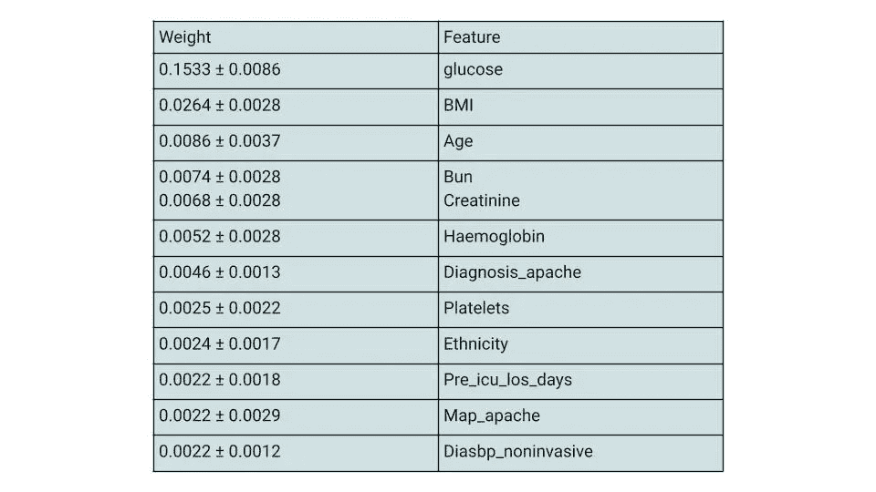
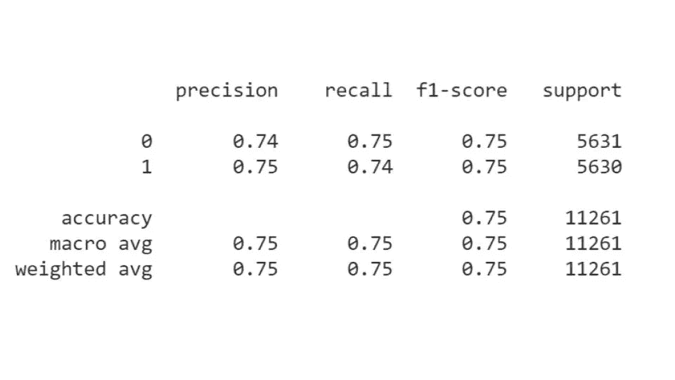
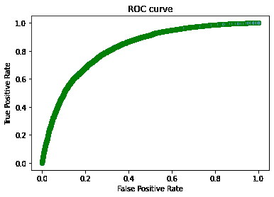
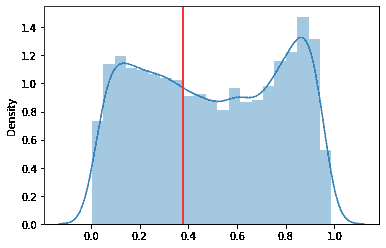
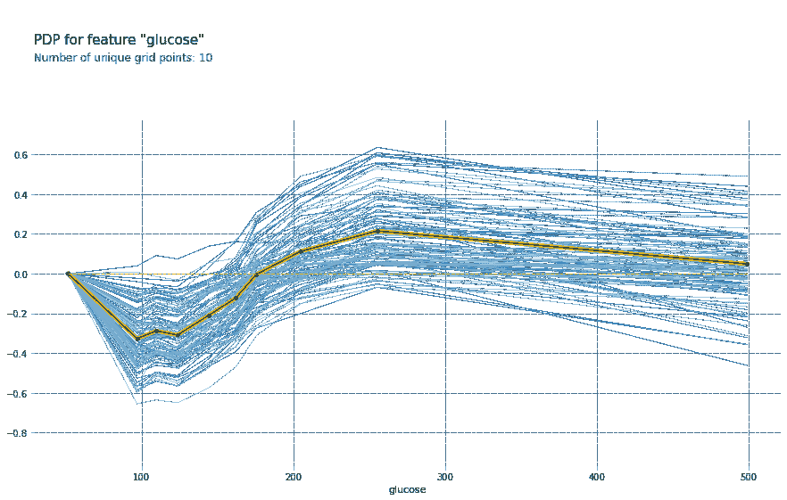
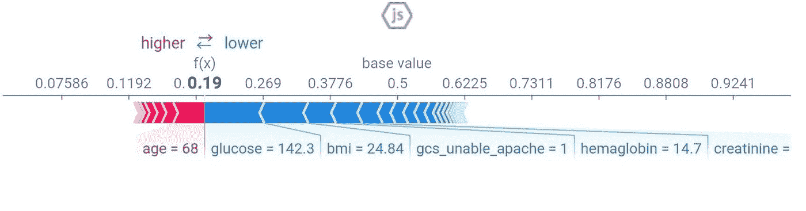

# 为非侵入式数字健康可穿戴设备开发机器学习模型

> 原文：<https://towardsdatascience.com/developing-machine-learning-models-for-non-invasive-digital-health-wearables-a-review-on-feature-362bf813baba?source=collection_archive---------41----------------------->

## **关于特征选择、生物标记识别和疾病预测的综述**

[弗洛菲](https://unsplash.com/@theflouffy?utm_source=medium&utm_medium=referral)在 [Unsplash](https://unsplash.com?utm_source=medium&utm_medium=referral) 上的照片

# 介绍

精准医疗与大健康数据相结合，为健康监测提供了一个机会，让人们能够更好地控制自己的健康。智能手表等数字健康可穿戴设备为健康监测增加了一个强大的维度。数字健康可穿戴设备使持续监测健康成为可能，而不是依赖于医生出诊和定期检查期间获得的信息快照。有了这项技术，医疗保健提供者可以对健康和疾病进展有全面的了解。

这是一场创造终极智能手表的竞赛。很快，智能手表不仅可以监测血压、含氧量、体温、身体活动、睡眠模式和血糖，还可以预测几种疾病状况。

这种能力的增加将意味着个人健康数据的增加。可穿戴设备的发展依赖于识别和开发能够检测生物标记的传感器。然后，获得的数据可用于训练稳健的机器学习(ML)算法。该项目旨在使用机器学习模型来选择特征，识别生物标志物和预测糖尿病。此外，该项目希望阐明为数字健康可穿戴设备开发鲁棒的机器学习模型的过程。

# **数据和型号概述**

本节概述了全球 COVID 患者入院健康数据、数据集、特征和预测模型。

**数据集**:用于训练和评估模型的数据集包括从全球 COVID 患者入院处获得的常规健康记录。这个数据集被放在一起预测糖尿病，并将其用作 COVID 疾病严重程度的指标。该训练数据集包含 180 个特征和 150，000 个观察值。缺失值和唯一标识符超过 40，000 个的列将从数据集中移除，从而生成包含 100 个要素的数据集。

**目标:**糖尿病是本次预测的目标。目标有一个不平衡类。数据集中有 78.4%的非糖尿病患者和 21.7%的糖尿病患者。这种类别不平衡在预测非糖尿病患者方面表现良好，准确率约为 85%，而预测非糖尿病患者的准确率仅为 65%。通过对非糖尿病类进行欠采样，对这些类进行重新采样，得到 56，302 个观察大小。

## **预测变量**

医院数据包含 100 个特征，经过特征工程和数据争论后减少到 49 个。这些特征分为 ICU 状态、疾病状态、血液化学、生物统计学和生理学。

然后将得到的数据集以 80:20 的比例分成训练和验证两部分，并使用目标变量进行分层。

## **预测模型**

随机森林和 Xgboost 分类器模型用于预测糖尿病。随机森林分类器的特征重要性使用 ELi5 来识别。任何要素重要性为零或更低的要素都将被移除，因为它们对生成 39 个要素的模型没有贡献。这些特征和目标用于训练 Xgboost 分类器。

表 1:特性的重要性(前 14 个特性)(按作者排序的表)

# **绩效指标**

**准确度、精确度和召回率:**基线模型准确度——与多数类百分比相同，为 50%。Xgboost 分类器模型的准确率为 75%。如下面的分类报告所示，糖尿病分类(1)的召回率和精确度分别为 0.74 和 0.75。

XGboost 分类器模型的分类报告(图片由作者提供)

# AUC-ROC

Xgboost 模型的 AUC- ROC 评分为 0.82。该模型擅长区分糖尿病和非糖尿病的观察结果。下图显示了 AUC-ROC 曲线。将阈值概率设置为 0.38 将召回率从 1 类(糖尿病)的 74%增加到 84%。这个概率下的精度是 0.70。对于疾病预测来说，回忆尤其重要，因为预测中的所有资源都被分配以确保每个有疾病的人都被识别。

ROC 曲线(图片由作者提供)

将阈值概率设置为 0.38 以提高召回率。(图片由作者提供)

**部分相关图**

糖尿病葡萄糖的部分相关图(PDP)如下图所示。PDP 显示概率从 50 毫克/升开始下降，直到达到 100 毫克/升，并开始增加到 250，然后趋于平稳。

(图片由作者提供)

**沙普利值**

下图显示了 68 岁老人的 Shapley 值。0.19 的预测值预测此人患有糖尿病，因为它低于 0.5 的阈值。概率在 0.5 以上的人在这个预测中不是糖尿病。降低概率从而增加某人患糖尿病的机会的特征包括葡萄糖、身体质量指数、gcs_unable_apache、血红蛋白、肌酸酐等。增加概率并因此增加一些人不患糖尿病的机会的特征包括年龄、ICU _los_days、WBC 等。

68 岁个体的 Shapley 结果(图片由作者提供)

# **调查结果**

**发现一:**医疗保健提供者使用糖尿病来衡量某人患 COVID 疾病严重程度的可能性。血糖水平对这一预测贡献最大。开发能够有创测量血糖水平的数字健康产品不仅为消费者提供了管理血糖的机会，还可以预测 COVID 等病毒引起的疾病的严重程度。

**发现二:**数字健康可穿戴设备的出现有助于医疗保健提供商对患者的健康状况有全面的了解，也有助于人们对自己的健康采取积极的态度。正如在预测中所看到的，糖尿病的前两个预测因子是葡萄糖和身体质量指数，它们都可以通过生活方式的调整来改变。

**发现三:**生物标志物血红蛋白，是糖尿病预测的第四个贡献因素，可以使用传感器非侵入性地确定。这种生物标志物通常用于预测贫血的医疗保健。使用机器学习研究健康数据可以帮助重新利用生物标记来预测其他疾病，从而使数字健康可穿戴设备变得强大。

# **结论**

机器学习模型有助于数字健康可穿戴设备的生物标记研究，并通过重新利用预测多种状况的特征来提高传感器的鲁棒性。

在这里找到 GitHub repo:[https://GitHub . com/felly love/Biotech/blob/master/build week 2 _ sburris . ipynb](https://github.com/Fellylove/Biotech/blob/master/BUILDWEEK2_SBurris.ipynb)

**来源:**

W.Luo，D. Phung 和 T. Tranet，生物医学研究中开发和报告机器学习预测模型的指南:多学科观点(2016)。医学互联网第 18(12)号决议

动词 （verb 的缩写）Kannan，M. Shapiro 和 M. BilgicKannan，芝加哥食品检验预测模型的事后分析(2019)。在 2019 年 AAAI 秋季研讨会系列(FSS)上发表:

A.Vaid，S. Jaladanki 和 J. Xu，联合学习电子健康记录以改善新冠肺炎住院患者的死亡率预测:机器学习方法(2021)。JMIR 医学信息学第 9 卷

长度 Muhammad，E. Algehyne 和 S. Usman，使用流行病学数据集预测 COVID-19 感染的监督机器学习模型(2021)。SN 计算机科学 2:11