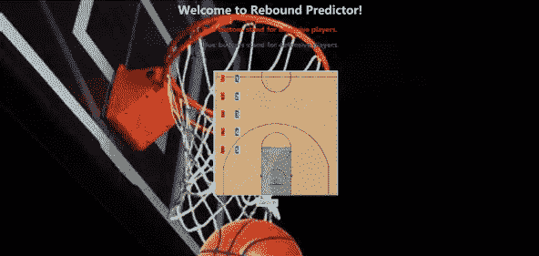
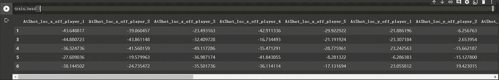
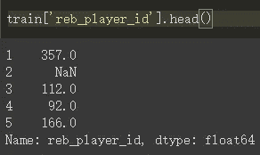
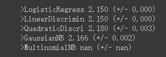
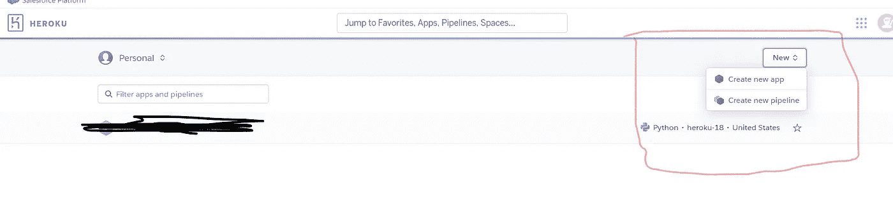
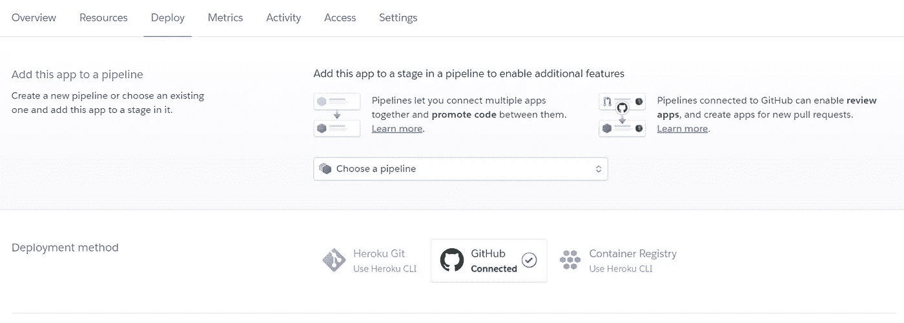
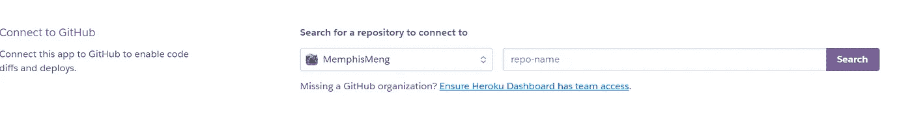
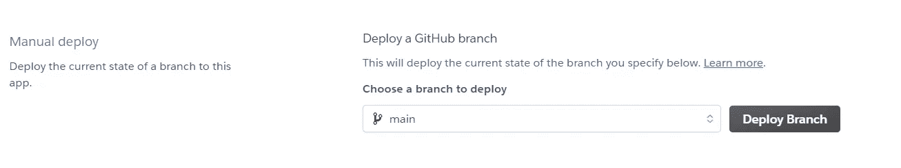

# 预测反弹概率的全栈机器学习网络应用

> 原文：<https://towardsdatascience.com/developing-rebound-probability-predicting-app-using-ml-and-flask-803a6990fd56?source=collection_archive---------59----------------------->

## 在这篇文章中，我将介绍如何开发一个基于 ML 的 web 应用程序，它可以预测单个球员和球队在球场上抢篮板的几率。

首先，让我展示一下这个应用最终的样子:



去看看[http://okc-thunder-rebounds.herokuapp.com/](http://okc-thunder-rebounds.herokuapp.com/)(图片作者)

从上图可以看出，用户将可以得到每个球员/每一方抢到篮板球的概率，这对于篮球经营者需要安排关于篮板球的**战术是很有用的。从上面的 GIF 中可以看出:**

1.  我们需要在前端的一个界面，允许用户通过拖动项目放置在球场上的球员；
2.  我们需要一个后端内核，它可以根据球员在球场上的位置预测球员抢篮板的任何个人概率(以及球队的总概率)；
3.  我们需要一台 24/7 全天候托管网站的服务器。

在文章的其余部分，我将按照这个顺序描述我的想法。

# 前端设计

在开发过程中，我们需要解决两个主要困难:

1.  我们如何让用户通过拖动面板上的元素来放置播放器？
2.  我应该如何将数据从前端传输到后端，以便我们的模型使用它进行预测？

对于第一个困难，我幸运地发现了这个[有用的链接](https://www.w3schools.com/howto/howto_js_draggable.asp)，它可以在网页上拖动任何元素。我更新的是我限制了面板中代表玩家的 *div* 元素:

对于难度#2，我的变通方法是在

内插入一个不可见的<textarea>，然后机器学习中需要的所有数据都要在这里赋值。</textarea>

到目前为止，我们可以让用户把播放器放在他们想放的任何地方，而且机器也能够识别位置。

# 机器学习模型训练

为了明确这一点，我们需要一个模型来预测球场上任何一个球员或一支球队获得篮板的几率。换句话说，输入将是球员位置的坐标，而输出是被反弹的球员的名字和他的球队。

来看看我的原始数据:



输入列(作者图片)



输出栏(作者图片)

> 注意:

1.  位置代表一个球员在投球时所站的位置，用 x-y 坐标表示。
2.  X 坐标以英尺为单位，代表从球场中心到球场长度方向的距离。-47 代表进攻队结束的底线。47 代表卫冕队的底线。
3.  Y 坐标以英尺为单位，表示从篮筐开始的横向距离。-25 代表球场右侧，25 代表球场左侧(对于面对进攻篮下的人)。
4.  在输出中，有空值，这意味着进行了相应的投篮或罚球。因为我们只关心有反弹的场景，所以我们需要以后再处理这个问题。

## 数据清理

首先，让我们去掉不需要的行值:

```
# remove the rows where the shots or free throws were made
train = train[train['f.oreb'].isna()==False]
```

接下来，将篮板球员 id 与他在球队中的位置和球队状况(进攻/防守)进行匹配:

```
# target columns is a list containing the input columns' names
target_columns = []
for event in ['off', 'def']:
    for i in range(1, 6):
        target_columns.append('playerid_' + event + '_player_' + str(i))reb_player_id_df = train[target_columns].eq(train['reb_player_id'], axis = 0)
reb_player_position_df = reb_player_id_df.idxmax(1).where(reb_player_id_df.any(1)).dropna()# encode all players on court
# 1~5 means a player is an offending one while 6~10 means a defending one
position_code = {
'playerid_off_player_1': 1,
'playerid_off_player_2': 2,
'playerid_off_player_3': 3,
'playerid_off_player_4': 4,
'playerid_off_player_5': 5,
'playerid_def_player_1': 6,
'playerid_def_player_2': 7,
'playerid_def_player_3': 8,
'playerid_def_player_4': 9,
'playerid_def_player_5': 10
}
output = reb_player_position_df.apply(*lambda* x: position_code[x])# reset the index
output = output.reset_index(drop=True)
```

现在，在很大程度上，标准化数据通常在机器学习中表现更好，因为它减少了离群值的影响，避免陷入局部最优点。因此，由于 x 和 y 坐标都有一定的范围，我们可以尝试最小-最大归一化器:

```
train[[col for col in location_columns if '_y_' in col]] = (25 - train[[col for col in location_columns if '_y_' in col]]) / (25 - (-25))
train[[col for col in location_columns if '_x_' in col]] = (47 - train[[col for col in location_columns if '_x_' in col]]) / (47 - (-47))
```

现在数据已经准备好了！

## 型号选择

我尝试了一套预计在概率预测方面表现良好的模型，包括逻辑回归、线性判别分析、二次判别分析、高斯朴素贝叶斯分类器和多项式朴素贝叶斯分类器。

```
# define models
models = [LogisticRegression(n_jobs=-1), LinearDiscriminantAnalysis(), QuadraticDiscriminantAnalysis(), GaussianNB(), MultinomialNB()]
```

交叉验证:

```
names, values = [], []# evaluate each model one by one
# and store their names and log loss values
for model in models:
# get a name for the model
    name = type(model).__name__[:15]
    scores = evaluate_model(train, LabelEncoder().fit_transform(output), model)
    # output the results
    print('>%s %.3f (+/- %.3f)' % (name, np.mean(scores), np.std(scores)))
    names.append(name)
    values.append(scores)
```



作者图片

结果表明，线性判别分析优于所有其他同行，所以我选择它作为我的核心算法。

```
# save the model
dump(LDA, 'LDA.joblib')
```

# 后端设计

有了模型在手，就该把它合成一个使用它的模型了。在这个阶段，我的主要工具是 Python 和 Flask。 [Flask](https://en.wikipedia.org/wiki/Flask_(web_framework)) 是一个用 Python 编写的 lite web 开发框架，常用于机器学习产品。它简单、灵活，允许用户决定实现什么以及如何控制他们的应用程序。

基本上，我们需要一个网页(主页)显示面板和其他位置时，分配。当会话开始时，通过“GET”方法访问主页，而通过“POST”方法访问结果页，因为直到用户单击“submit”按钮，结果页才会显示。

哇！现在我们成功了，我们的开发完成了！只要在工作目录下做以下命令，就可以在浏览器上看到 127.0.0.1:5000 的 app。

```
> set FLASK_APP=app.py (for windows; for linux, it should be "export FLASK_APP=app.py")
> flask run
```

# 服务器部署

你可以有很多选择来托管一个 web 应用。现在我的选择是 Heroku，因为它简单。通常，我会通过 GitHub 部署我的应用程序，这个也不例外。所以现在第一步是为你的程序创建一个新的 repo，包括你的主函数( *app.py* )、*静态*目录，以及*模板*目录。下面是您的文件夹现在的样子:

```
├── README.md  
├── app.py    
├── LDA.joblib   
├── templates   
│   ├── index.html    
│   ├── output.html
│   └── output2.html     
├── static  
    ├── bar.png    
    ├── basketball.jpg
    └── court.png
```

当你收集这些东西时，还应该包括另外两件东西:

1.  requirements.txt，这是需要的依赖项列表，您可以通过以下方式快速收集它们:

```
pip freeze > requirements.txt
```

注意，冻结后，一定要在 *requirements.txt* 中追加 *gunicorn* 。

以下是整个开发过程中需要的内容:

```
Flask==1.1.2 
joblib 
matplotlib 
pandas 
scikit-learn 
gunicorn
```

2.Procfile，它记录了让 Heroku 服务器知道如何激活应用程序的命令。因为我们的应用程序是使用 Flask 开发的，所以我们的命令应该是:

```
web: gunicorn app:app --log-level debug
```

一切就绪！您现在可以将此文件夹上传到您新创建的存储库中:

```
git init
git clone your_github_repo_link
git add .
git commit -m "Initial Commit"
git push
```

当我们处理完 GitHub 上的问题，是时候看看 Heroku 了。确保你已经[在 Heroku 上注册了](https://signup.heroku.com/)并且还有空位。

如果是，请在您的个人仪表板上创建一个新应用程序:



作者图片

完成后一般会重定向到 app 的首页。所以你点击“部署”标签，选择通过 GitHub 部署应用程序:



作者图片

并选择您希望它连接的存储库:



作者图片

最后，只差一步了:点击“部署分支”。



作者图片

霍雷。你成功了，现在你可以在插槽提供的链接上看到你所创建的东西了！

# **结论**

这是我第一次使用传统的前端工具(即 HTML、JS 和 CSS)做一些事情，所以我会将它视为我挑战极限的尝试之一，因为我通常会使用更方便的工具，如 Python 和 streamlit。因此，我从这个项目中得到的启示是，永远不要让你的工具限制你，相反，让它们为你的需要服务！

而且你需要这个项目的全部源代码，下面是链接:

[https://github.com/MemphisMeng/rebound-app](https://github.com/MemphisMeng/rebound-app.git)