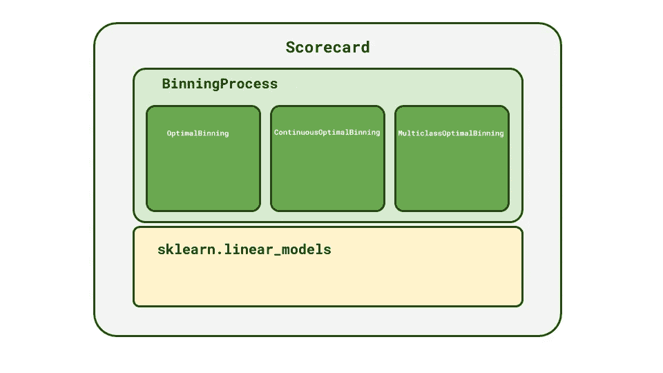
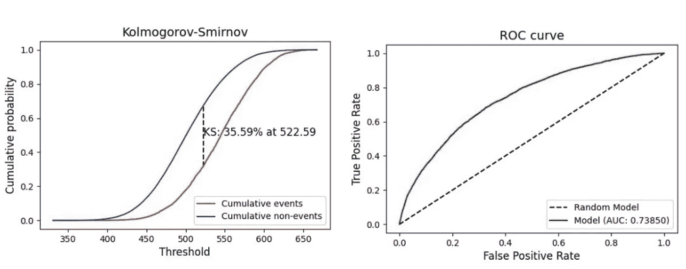

# 使用 OptBinning 在 Python 中开发记分卡

> 原文：<https://towardsdatascience.com/developing-scorecards-in-python-using-optbinning-ab9a205e1f69?source=collection_archive---------1----------------------->

## 仅用几行代码创建行业级记分卡


照片由[艾弗里·埃文斯](https://unsplash.com/@averye457?utm_source=medium&utm_medium=referral)在 [Unsplash](https://unsplash.com?utm_source=medium&utm_medium=referral) 拍摄

# 1.介绍

记分卡是贷款企业用来评估试图获得信贷的客户的风险模型。一个完善的记分卡可以为金融机构带来很多价值，并且对于制定信贷政策至关重要。尽管记分卡背后的数学和逻辑并不复杂，但开发一个性能良好的模型可能很难，因为组织和处理数据需要花费大量时间。

传统的方法是将变量按数字或分类进行分离，并应用宁滨方法，使用每个值的证据权重对与目标(通常为二进制)显示相似关系的值进行分组。宁滨的这个过程可能是耗时的和不完美的，因为关于是否合并库的一些决定可能是判断性的，并且受到记分卡开发者的影响。这也是银行和其他机构需要几个月时间来开发或重新训练记分卡模型的原因之一。

# 2.选择救援！

[OptBinning](https://github.com/guillermo-navas-palencia/optbinning) 试图填补宁滨功能和记分卡开发的可靠性与用 Python(一种广泛用于数据分析的语言)编写库的灵活性之间的差距。

> **“opt binning**是一个用 Python 编写的库，实现了一个严格而灵活的数学编程公式，用于解决二进制、连续或多类目标类型的最优宁滨问题，合并了以前未解决的约束”。

OptBinning 不仅提供了执行宁滨的强大方法，还提供了选择特性、创建记分卡和可视化开发过程中的性能所需的各种工具。

OptBinning 使用 Scikit-Learn `BaseEstimator`作为其宁滨类的结构，通过`fit`和`transform`方法使其使用起来很直观，就像任何 Scikit-Learn 估计器一样。

# 3.最优宁滨背后的逻辑

宁滨是将一个连续变量的值分成在某个特征方面具有相似行为的组的过程。这种将值离散到桶中的技术对于理解要素和目标之间的关系非常有价值。宁滨是记分卡开发中的一个重要步骤，因为每个 bin 都与一个记分卡值相关联，有助于为模型带来可解释性。

> 从建模的角度来看，宁滨技术可以解决普遍存在的数据问题，如缺失值的处理、异常值和统计噪声的存在以及数据缩放
> 
> — **最优宁滨:数学规划公式，纳瓦斯-帕伦西亚公司**

存在许多可用于执行宁滨的技术，并且尽管一些可以被成功实现，但是不能保证它们能够达到最优的仓。变量的最佳宁滨是一个过程，在此过程中，您将样本分组离散化，以满足特定的约束条件，同时优化散度(或性能)指标。该约束可以是特定数量的箱或每个箱的最小样本数。

OptBinning 提供了最佳宁滨过程的有效实施，使您能够控制参数和约束。

# **4。未理解的选择类**

OptBinning 有 3 种主要的类类型，它们在等级上相互关联，执行绑定要素和创建记分卡所需的所有处理。以下课程简要介绍了这些课程的结构。更多详情请参考 OptBinning [官方文档。](http://gnpalencia.org/optbinning/index.html)

## 4.1.**优化组合、连续优化组合和多类优化组合**

`OptimalBinning`是用二进制目标执行特征宁滨的基类。对于连续或多类目标，还有另外两类可用:`ContinuosOptimalBinning`和`MulticlassOptimalBinning`。

如前所述，这 3 个类是按照`sklearn.base.BaseEstimator`结构用`fit`和`transform` 方法构建的。宁滨使用上述类的一个特性就像下面的代码一样简单:

```
**# 1) Define your feature and target arrays** X = df_train['feat_name']
y = df_train['target']**# 2) Instantiate class and fit to train dataset** optb = OptimalBinning(name='feat_name', dtype="numerical")
optb.fit(X, y)**# 3) To perform the binning of a dataset** X_binned = optb.transform(X)**# 4) To visualize the results table and plot** optb.binning_table.build()
optb.binning_table.plot(metric="woe")
```

默认情况下，宁滨类返回相应 bin 类别的证据权重值。除了要素名称和数据类型(数值型或分类型)之外，还有更多的参数可供使用，为这个过程提供了相当大的自定义级别。

## 4.2.装箱过程

构建类`BinningProcess`的目的是在整个数据集上执行最优宁滨，而不仅仅是上面会话中举例说明的一个要素。

所以查看`BinningProcess`的最好方式是作为`OptimalBinning`的包装器。用法相当简单，只需要几个参数就可以执行完整数据集的宁滨。

```
**# 1) Define list of features and categorical ones** list_features = df_train.drop(columns=['TARGET']).columns.values
list_categorical = df_train.select_dtypes(include=['object', 'category']).columns.values**# 2) Instantiate BinningProcess** binning_process = BinningProcess(
    categorical_variables=list_categorical,
    variable_names=list_features)**# 3) Fit and transform dataset** df_train_binned = binning_process.fit_transform(df_train, y)
```

## 4.3.记分卡

类`ScoreCard`提供了将从`BinningProcess`生成的入库数据集与 Scikit-Learn 的线性估计器相结合的可能性，以生成生产就绪记分卡。

```
**# 1) Define a linear estimator (model)** from sklearn.linear_model import LogisticRegression
logreg = LogisticRegression()**# 2) Instatiate a ScoreCard and fit to dataset** scaling_method = "min_max"
scaling_method_data = {"min": 0, "max": 1000}
scorecard = Scorecard(
    target='TARGET',
    binning_process=binning_process,
    estimator=logreg,
    scaling_method=scaling_method,
    scaling_method_params=scaling_method_data,
    intercept_based=False,
    reverse_scorecard=True,
)scorecard.fit(df_application_train)
```

因此，只需几行代码，您就可以创建一个随时可以测试并投入生产的记分卡模型！关于如何创建和验证记分卡的教程将在下一节课中详细介绍。

图 1 总结了 OptBinning 中的类之间的关系。



图一。选择类的层次结构。

# 5.教程:使用 OptBinning 创建记分卡

为了说明使用 Optbinning 创建生产就绪记分卡的流程，我们将使用 [Kaggle 的家庭信用风险违约数据集](https://www.kaggle.com/c/home-credit-default-risk/data)。你可以在[**教程资源库**](https://github.com/GabrielSGoncalves/optbinning_tutorial) **上找到有代码的 Jupyter 笔记本。**

## 5.1.加载数据集

从 Kaggle 的页面下载数据集文件并解压文件夹后，您将得到几个 CSV 文件。这些文件是 Kaggle 的挑战描述的一部分，其中包含有关功能和表格的信息。我们将使用`application_train.csv`文件来演示 OptBinning。在将数据集作为 Pandas Dataframe 加载后，我们将列`SK_ID_CURR`设置为索引(第 8 行),并将数据集分为 train 和 test(第 11 行)。

## 5.2.探索功能和入库流程

特征工程是任何模型开发中最重要的步骤之一，记分卡也不例外。由于我们的重点是演示记分卡开发的 OptBinning 用法，因此我们不会从数据集中探究太多工程特性的可能性。我们的方法是将分类特征从数字特征中分离出来，并在实例化`BinningProcess`时定义它们，因为最佳宁滨过程以不同的方式处理这些类型的特征。我们在这个阶段需要设置的另一个参数是`selection_criteria`，它是用来定义最优 bin 的约束。

## 5.3.选择线性估计量

OptBinning 的一个很大的特点是可以灵活地选择 Scikit_learn 的任何[线性模型(估计器)用于您的记分卡。通过调整线性估计器的参数，您可以提高记分卡的性能。我们将使用逻辑回归来说明这种用法，但也可以随意探索其他估计量。](https://scikit-learn.org/stable/modules/classes.html?highlight=linear#module-sklearn.linear_model)

## 5.4.创建记分卡

在实例化了一个`BinningProcess`和一个线性估计器之后，您需要指定缩放参数(第 2 行和第 3 行)并将它们传递给您的`Scorecard`实例。接下来，对数据集运行 fit 方法(第 16 行),就这样！几秒钟后，您的记分卡就可以进行绩效验证了。

## 5.5.可视化和验证记分卡

OptBinning 为您提供了多种可视化和评估记分卡的方法。您可以访问包含每个入库特性指标的记分卡表，并将其保存为 CSV 格式，以记录模型开发。

下面您可以看到记分卡表的一部分:

最后，您可以使用`optbinning.scorecard.plots`模块中的函数来可视化您的记分卡绩效。



图。经过训练的记分卡模型的 KS 和 ROC-AUC 图。

## 5.6.在生产中使用记分卡

OptBinning 最令人难以置信的特性之一是其易于投入生产的能力。您可以用 pickle 保存您的记分卡模型，存储它并在生产中使用它。要执行预测，您只需解开记分卡对象，用您用来开发模型的特性对 Pandas 数据框架中的样本进行评分。

# 5.结束语

多年来，记分卡的发展局限于大型金融机构，这些机构有钱购买像 SAS 这样昂贵的软件工具。**我们展示了 OptBinning 在宁滨变量和创建记分卡方面的强大功能和多功能性。**

> 将 Optbinning 与 Python 的数据科学和分析库(Pandas、Numpy、Matplotlib、Scikit-Learn)相结合，可以提供开发行业级记分卡模型所需的所有工具。

这可能会改变小企业和金融科技公司的游戏规则，因为所有这些提到的库都是开源的，这意味着这些公司需要做的唯一投资是人力资源。

# 非常感谢你阅读我的文章！

*   你可以在我的[个人资料页面](https://medium.com/@gabrielsgoncalves) **找到我的其他文章🔬**
*   如果你喜欢它并且**想成为中级会员**，你可以使用我的 [**推荐链接**](https://medium.com/@gabrielsgoncalves/membership) 来支持我👍

# 资源

有关 OptBinning 的更多信息，请查看[项目 GitHub 页面](https://github.com/guillermo-navas-palencia/optbinning)和[文档页面](http://gnpalencia.org/optbinning/)。有关最优宁滨背后的逻辑和数学的信息，您可以在 Guillermo Navas-Palencia 的文章[“最优宁滨:数学规划公式”](https://arxiv.org/abs/2001.08025)中找到描述。

<https://github.com/guillermo-navas-palencia/optbinning>      <https://github.com/GabrielSGoncalves/optbinning_tutorial> 