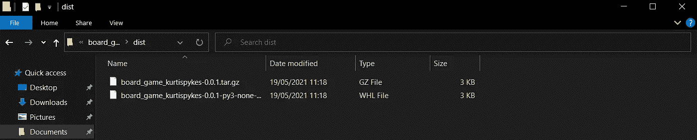
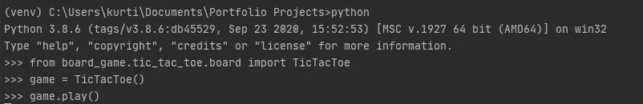

# 为 ML 工程师的角色开发软件工程技能

> 原文：<https://towardsdatascience.com/developing-software-engineering-skills-for-a-role-as-a-ml-engineer-7cd27ebfc526?source=collection_archive---------34----------------------->

## 如何打包一个井字游戏上传到 PyPI


正在玩井字游戏；作者 GIF

我注意到数据科学领域的一个增长趋势是 MLOps 的兴起。MLOps 包含了将实验机器学习模型引入生产 web 系统的一组新兴最佳实践。

实验是伟大的，但总有一天你真的想建造一些有形的东西，让别人从中受益——至少我知道我的时间到了。正是因为这个原因，我一直在提高我的编程和软件工程技能，因为这些技能在将实验性机器学习项目投入生产中发挥着至关重要的作用。

[](/data-scientist-should-know-software-engineering-best-practices-f964ec44cada) [## 数据科学家应该知道软件工程的最佳实践

### 成为不可或缺的数据科学家

towardsdatascience.com](/data-scientist-should-know-software-engineering-best-practices-f964ec44cada) 

## 动机

我的文章的读者，特别是那些阅读了 [*的读者，当我意识到数据科学证书不会推动我的职业发展*](/the-moment-i-realized-data-science-certificates-wont-push-my-career-forward-efe2d404ab72) 时，他们会知道我更喜欢在发展新技能时采取动手的方式。因此，我决定自己开发一个有趣的井字游戏项目，让自己熟悉 Python 的面向对象编程(OOP ),然后我将项目打包并上传到 PyPI——是的，这意味着您可以直接安装我的项目。

[](https://github.com/kurtispykes/board_games) [## kurtispykes/棋盘游戏

### 井字游戏(Tic-tac-toe)是两个玩家 X 和 O 玩的纸笔游戏，他们…

github.com](https://github.com/kurtispykes/board_games) 

## 步骤 1 —添加结构

与我们数据科学家习惯于在我们的 Jupyter 笔记本上进行的实验不同，软件工程项目一开始就有非常好的结构，因为他们试图完成的事情已经有了明确的最终目标——这只能在数据科学的大量实验之后才能知道。

在机器学习项目中，实际编写的代码只占机器学习系统的一小部分，因此有理由将大规模的机器学习项目视为软件项目。因此，花时间[构建机器学习项目](/structuring-machine-learning-projects-be473775a1b6)从长远来看是有回报的，还有什么比创建一个真正的软件项目更好的获取经验的方式呢？

```
board_game/
├── LICENSE
├── pyproject.toml
├── README.md
├── setup.cfg
├── setup.py  # optional, needed to make editable pip installs work
├── tic_tac_toe/
│   └── __init__.py/
│   └── board.py
└── tests/
```

**分解文件/文件夹**

上面的代码单元格详细描述了项目的结构，但下面是每个文件的含义:

*   这告诉安装你的软件包的用户他们可以使用你的软件包的条款。如需挑选许可证的帮助，请参见[https://choosealicense.com/](https://choosealicense.com/)。
*   `pyproject.toml`:一个文件，通知构建工具，如`pip`和`build`，正在使用的系统以及构建所必需的东西。如果这个文件在您的项目中不存在，将会采用经典的 setuptools 构建系统，但是明确一点总是好的。
*   `README.md`:一个`README.md`通知其他人如何导航你的项目。阅读 [*如何让你的数据科学项目脱颖而出*](/how-to-make-your-data-science-projects-stand-out-b91d3861a885) 。
*   `setup.cfg` : `setup.cfg`是静态元数据，通知 setuptools 您正在创建的包(即包的名称、版本等)。)以及应该包含哪些代码文件。
*   `setup.py` : `setup.py`是动态元数据，用作 setuptools 的构建脚本。事实上，因为我使用了`setup.cfg`，所以我不需要包含`setup.py`——[文档](https://packaging.python.org/tutorials/packaging-projects/)更深入地解释了这是为什么。
*   这是我们保存源代码的目录。`board_game/tic_tac_toe/__init__.py`需要将目录作为一个包导入，并且应该为空。
*   `tests/`:该目录是测试文件的占位符。我目前还没有写任何测试，但是我计划在将来写——测试驱动开发(TDD)的倡导者为此毁了我，我认为软件工程师一般也会这么做。测试是至关重要的，因为它在交付给客户之前发现缺陷/错误，这保证了软件的质量(你不会搭上一辆没有经过测试的车吧？).

## 步骤 2 —构建应用程序

因为我已经非常熟悉编程了，所以我不想浪费太多时间去思考程序的逻辑——记住，我的主要精力是发展我的 OOP 技能，并获得打包项目的经验，然后可以上传到 PyPI。

为了避免项目的逻辑问题，我从[井字游戏——Python Tkinter GUI 教程](https://www.youtube.com/watch?v=xx0qmpuA-vM)中提取了代码，但是我没有按原样提取代码，而是将脚本转换成了 Python 对象。

**什么是阶级？**

A `class`定义了在 Python 中创建对象的模板——为了帮助简化对象的概念，考虑现实世界中的事物，比如人、汽车等。所有的物体都有特征，这被称为*属性，*例如，我是一个人(物体)，但我有区别于其他人的特征(属性)(例如，我身高 5 英尺 9 英寸，我有一头黑发，我是一名自由职业者，等等)。

除了我的属性之外，我还可以执行允许我在现实世界中有效运行的动作，这些动作被称为*方法*。例如，我可以锻炼，看书，看网飞等。

这实际上是 Python 中对象的组成部分。要用 Python 创建一个对象，我们必须调用`class`。下面是我用来创建井字游戏对象的代码。

> **注意**:在未来，我希望回到这个代码来重构和改进它，因此，我非常欢迎批评。

## 步骤 3 —生成分发归档文件

为了允许其他人在进行`pip install`时访问我们的包，我们必须为我们的包生成分发包。我使用的是 Windows 操作系统，所以我将用它来生成这个包——Unix/MAC OS 操作系统的用户应该参考 PyPA [文档](https://packaging.python.org/tutorials/packaging-projects/)。

流程的第一部分是确保我们安装了 PyPA 的`build`的最新版本。从终端，确保您处于项目虚拟环境中，并输入:

`py -m install --upgrade build`

接下来，导航到包含`pyproject.toml`的目录并输入:

`py -m build`

运行该命令后，您将在终端中看到大量文本，但是为了确保一切顺利进行，您可以检查运行该命令的目录中是否有一个包含 2 个文件的`dist/`目录。这是我的样子…



要加载到 Dist 目录中的示例文件；作者图片

## 步骤 4 —将包上传到 PyPI 测试

完成后，我们现在可以将我们的包上传到 Python 包索引(PyPI)中。

为了上传一个包，你必须在 PyPI 的索引中注册——这是你必须执行的最简单的步骤——使用下面的链接分别在 [PyPI](https://pypi.org/account/register/) 和 [TestPyPI](https://test.pypi.org/account/register/) 中注册。

> 注意 : PyPI 测试是 PyPI 的一个独立实例。它用于测试和实验。

注册后，我们可以上传`twine`包来帮助我们上传发行包。

```
# installing twine
py -m pip install --upgrade twine# uploading the archives under the dist directory
py -m twine upload --repository testpypi dist/*
```

从您的终端运行上面的命令将提示您插入用于注册 TestPyPI 的用户名和密码。完成后，您的包现在应该可以在 TestPyPI 上看到了。这是我的…

[](https://test.pypi.org/project/board-game-kurtispykes/0.0.1/) [## 棋盘游戏-kurtispykes

### 井字游戏(Tic-tac-toe)是两个玩家 X 和 O 玩的纸笔游戏，他们…

test.pypi.org](https://test.pypi.org/project/board-game-kurtispykes/0.0.1/) 

## 步骤 5 —安装软件包

为了验证我们的包能够工作，使用`pip`来安装它并测试它的功能是一个好主意。

```
pip install -i https://test.pypi.org/simple/ board-game-kurtispykes==0.0.1
```

接下来，转到一个新的终端，输入`py`,通过运行以下命令来测试这个包:



作者图片

输出应该会为井字游戏打开一个新窗口。

## 最后的想法

我现在已经将这个包上传到 PyPI，所以您可以简单地安装这个包并通过运行`pip install board_game_kurtispykes`来测试它。虽然我很清楚这个包符合 Scikit-Learn 或 NumPy 的标准，但我对我在整个过程中获得的经验非常满意，并期待在以后重新访问这个包，以改进我的代码、额外的测试和可能的更多功能(包括更多游戏)——我非常乐意接受批评，因为我知道软件工程技能不是我的强项。

感谢您的阅读！

如果你喜欢这篇文章，请通过订阅我的**免费** [每周简讯](https://mailchi.mp/ef1f7700a873/sign-up)与我联系。不要错过我写的关于人工智能、数据科学和自由职业的帖子。

## 相关文章

[](/3-ways-to-drastically-improve-your-programming-skills-on-your-own-9359ce670099) [## 3 种方法可以极大地提高你自己的编程技能

towardsdatascience.com](/3-ways-to-drastically-improve-your-programming-skills-on-your-own-9359ce670099) [](/how-to-create-a-compelling-github-portfolio-a229e7472a92) [## 如何创建引人注目的 Github 产品组合

towardsdatascience.com](/how-to-create-a-compelling-github-portfolio-a229e7472a92) [](/5-laws-for-self-taught-data-professionals-4bf351ac5c24) [## 自学成才的数据专业人员的 5 条法则

towardsdatascience.com](/5-laws-for-self-taught-data-professionals-4bf351ac5c24)