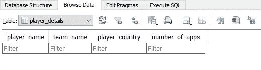
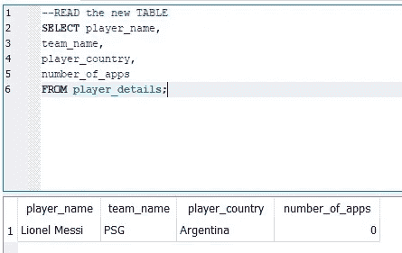
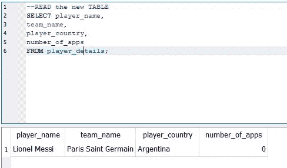
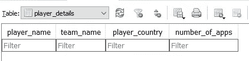

# 开发 SQL 表

> 原文：<https://towardsdatascience.com/developing-sql-tables-3f9b96bc21e1?source=collection_archive---------26----------------------->

只有通过创建和开发 SQL 表，我们才能理解如何最好地使用可用内存。

彼得·赫尔曼在 [Unsplash](https://unsplash.com?utm_source=medium&utm_medium=referral) 上的照片

# 介绍

本文旨在解决维护 SQL 表时所需的四个核心步骤。我们正在讨论的是四种运算；创建、读取、更新和删除，通常称为 CRUD。使用 CRUD，我们能够从数据库中当前可用的任何信息或者我们在最初创建数据库之后添加的任何信息构建 SQL 表。

[SQLite](https://www.sqlite.org/index.html) 用于完成以下分析。正在审查的示例将着眼于创建一个包含足球运动员详细信息的简单数据集。

## 创建和读取

创建表的操作有助于创建一个空壳。有了一个空的外壳，用户就能够用适当的数据填充它。理解正确的数据格式是创建这个空表的关键。有许多不同的变量格式可用，字符串和数字构成了变量值的大部分。因此，能够为所需的作业正确分配正确的格式确实需要一些规划。

而对表的读取可以被认为是查看包含在表中的数据。通过拍摄变量的快照，我们能够了解当前值的范围。此外，它还为开发人员提供了探索信息的机会，这些信息可以通过以不同方式查询数据来获得。

在表的初始开发过程中，很可能会涉及一些试错。特别是，如果要输入到表中的数据在计划阶段没有全部可用。我们将通过一些例子来了解如何克服这种未知的品质。

SQL 代码 1.1 使用不同的变量名和格式创建初始表

在 SQL 代码 1.1 中，我们用四个不同的变量创建了 player_details 表。通过使用字符串格式 VARCHAR()，它允许我们为数据集中的每一行提供不同长度的字符值。需要强调的一点是，对于 SQLite 数据库，括号中包含的值将被忽略，并且没有长度限制。下面的示例细节有助于读者理解在括号中赋值的概念。这个值最常见的情况是对许多其他具有更严格数据结构的 SQL 语言产生影响。第一个括号(100)中包含的值与可用于变量数据输入的 100 个唯一值相关。

如果我们为 player_name 包含的值只包含 4 个字符，则还会包含 96 个空字符。因此，这可能被视为内存使用效率低下，因为与填充的值相比，空值更多。但是，如果这个变量的最大值是 3，并且我们已经提供了值“Mark”，那么字符串将被截断以显示“Mar”，因为变量中没有足够的可用值。在 SQL 表中开发字符变量时，我们必须意识到这个未知的量。通过了解所有潜在输入值的最大长度，我们可以有效地为字符变量分配一个合适的最大值。

由于表中的前三个变量是字符串格式，因此在为输入值适当分配足够的空间方面，每个变量都面临着上述相同的挑战。第四个变量与表中唯一的数字变量有关。在这个实例中，整数格式值(INT)作为变量类型提供。由于所有要分配的值都是整数，没有球员会被分配半场出场，即使他们只打了半场比赛，整数格式也是最有意义的。如果数值变量需要十进制值，那么使用的格式应该是 float。了解将要使用的数值范围有助于分配有效的变量格式。

SQL 代码 1.2 从创建的表 player_details 中读取值

为了从创建的 SQL 表中读取值，我们尝试了 SELECT 语句。然而，当执行该查询时，没有返回任何结果。

输出 1.1 产生初始的 player_details 表

我们可以通过浏览数据库中可用的表来查看上面显示的输出值。在 player_details 表中，显示了变量名，但没有要查看的值。在接下来的部分中，我们将了解如何在这个新表中插入和删除数据行。

## 插入

有了这个表，我们现在可以插入值并开始执行数据分析。插入值时，我们总是希望确保正确的值与正确的变量对齐。这就是变量名与初始表设计顺序相同有助于避免混淆的地方。

SQL 代码 1.3 将值插入表变量

使用上面的 SQL 代码插入的值已经被分配给正确的变量。为了更好地理解这一点，我们突出显示了要插入数据的表。下面的括号中提供了需要填充的变量。变量顺序与表设计对齐后，可以更新括号中的值并将其插入到表中。

输出 1.2 插入新值后查看表格结果

运行 insert SQL 查询后，我们可以执行 select 语句来读取表中的值，并查看所有内容是否都已正确添加。这个简短的 insert 语句强调了如何将一行值插入到表中。此外，可以使用相同的方法提供和插入多行值。但是，随着行数的增加，使用这种方法可能会出现数据输入错误。因此，执行 select 语句从其他导入的表中检索数据并将这些数据插入表中有助于减少发生错误的可能性。

## 更新

随着数据插入到表中，有时开发人员需要调整已经分配的值。我们可以重新开始创建和插入过程。但是，如果表是使用已经被删除的数据创建的，那么这可能不是一个可行的选择。存在一个替代解决方案，这就是使用 update 语句。

SQL 代码 1.4 更新初始值以调整其中一个变量值

正如我们在 SQL 代码中看到的，使用了一个 update 语句将团队名称从最初的缩写调整为长名称格式。我们首先请求将 update 语句应用于适当的表。在这里，我们使用 set 语句来突出显示我们希望更新的变量，并提供相应的值。为了确保只更新需要更新的行值，我们使用 where filter 语句来选择行。因为这个表中只有一个值需要更新，所以添加这一行额外的代码可能没有意义。但是，习惯于过滤所需的适当行值是一个很好的实践。除了在一个变量上使用 set 语句之外，我们还可以提供多个变量名并更新值，如果这些都需要更改的话。

输出 1.3 确认新变量值已被正确更新

上面的输出结果显示，表中的更改已经按照预期进行了更新。如果需要更新变量但保留原始变量值的记录，可以向表中添加一个额外的变量。这种维护表格变化记录的过程可以被记录下来以供将来参考。

## 删除

最后，在创建、读取、插入和更新表中的值并执行适当的数据分析之后，我们可能必须删除不再需要的值。一种常见的做法是执行数据分析以产生与业务利益相关者共享的管理信息(MI)或商业智能(BI ),然后必须删除数据以供存储。我们能够维护使用所有 SQL 语句创建分析所需的流程步骤，但是可能需要删除信息才能执行其他分析。

SQL 代码 1.5 删除表中与 where 筛选器子句相关的值

类似于 insert 和 update 语句，对于 delete 语句，我们必须概述要执行查询的表。此外，我们还提供了 where filter 子句，以确保只删除需要删除的数据。如果没有指定 where 子句，则附加数据可能会被删除。

输出 1.4 删除值后的表格摘要

上面的输出表显示数据已从表中成功删除。在执行任何 delete 语句时，我们必须非常小心，确保所执行的操作是必需的。此外，我们可能需要更高级别的授权来执行该语句，因为应该始终谨慎处理数据的永久删除。在这个例子中，我们概述了可以用来确保只删除某些数据值的语句。

# 结论

在本文中，我们发现了作为 SQL 开发人员在使用表时的无限可能性。我们从创建一个初始表的过程开始，该表用于存储未来的值。在这里，我们展示了如何将值插入到表中，然后读取这些值以查看它们是否被正确插入。与任何表一样，有些值可能需要调整，这就是使用 update 语句更改变量值的地方。最后，我们看到了在执行所有数据分析后，我们如何能够删除数据集。正是这个删除步骤可以由数据库自动执行以节省内存。但是，如果我们有能力永久删除任何数据，我们应该始终保持谨慎。

*非常感谢您阅读*