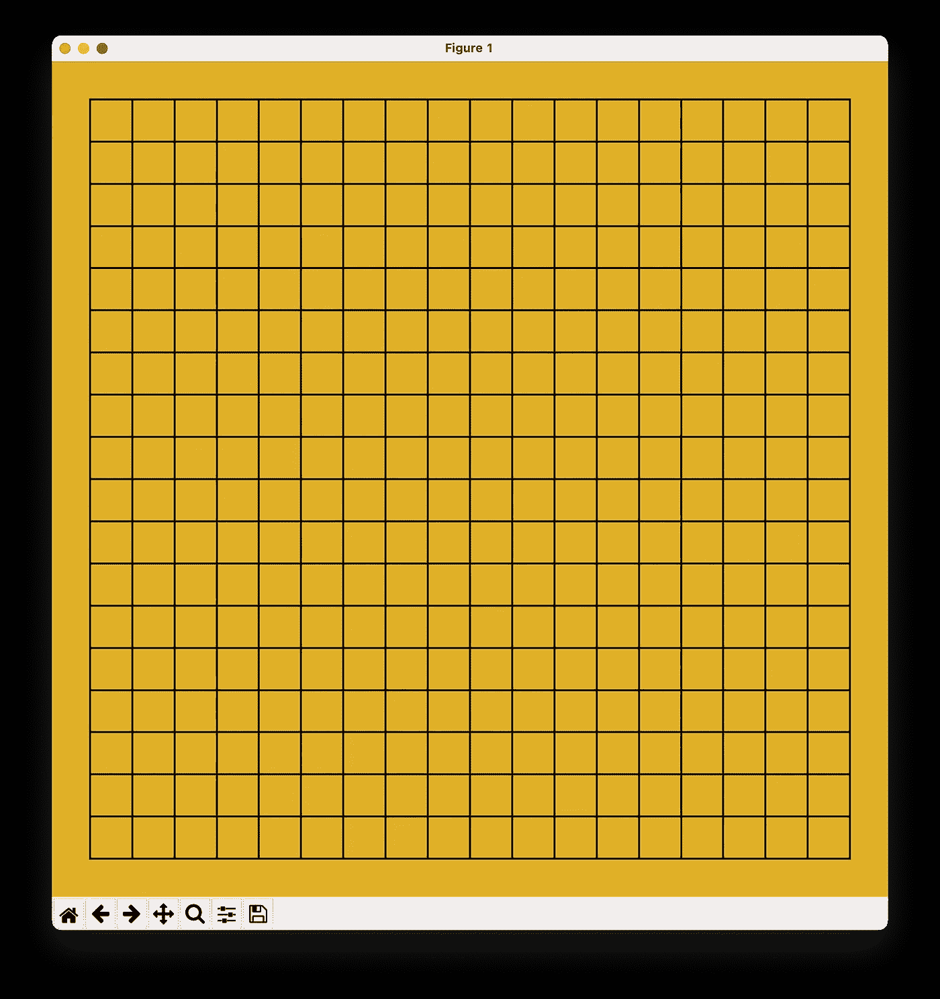

# Developing the Go Game (围棋) using matplotlib and NumPy — Part 1

> 原文：<https://towardsdatascience.com/developing-the-go-game-%E5%9B%B4%E6%A3%8B-using-matplotlib-and-numpy-part-1-3f94127d73e6?source=collection_archive---------21----------------------->

## 用 matplotlib 绘制围棋棋盘


来源:[https://en . Wikipedia . org/wiki/Go _(game)#/media/File:floor goban。JPG](https://en.wikipedia.org/wiki/Go_(game)#/media/File:FloorGoban.JPG)

大多数有抱负的数据科学家对 matplotlib 并不陌生，matplotlib 是一个数据可视化库，旨在用 Python 创建静态、动画和交互式可视化。大多数时候，您使用 matplotlib 的经验可能是用它来绘制图表，如条形图、直方图、饼图，甚至 3D 图表。

对我来说，我想探索如何将 matplotlib 用于更有趣的事情——用它来创建一个棋盘游戏，比如围棋。所以我开始挑战自己，看看我是否能创建一个允许用户玩围棋的应用程序。

> Go (or more commonly known in Chinese as Weiqi, Weichi (simplified Chinese: 围棋; traditional Chinese: 圍棋; pinyin: wéiqí) is an abstract strategy board game for two players in which the aim is to surround more territory than the opponent. Source: [https://en.wikipedia.org/wiki/Go_(game)](https://en.wikipedia.org/wiki/Go_(game))

我对这个项目的意图很简单:

*   使用 matplotlib 作为 UI 库来绘制围棋棋盘
*   探索 matplotlib 的交互特性，允许用户在围棋棋盘上放置棋子
*   使用 NumPy 来检测一组石头是否被包围并需要从棋盘上移除
*   计算玩家占领的领域数量，并决定游戏的赢家
*   使用套接字编程允许用户通过网络玩游戏
*   在未来，使用机器学习和深度学习使应用程序能够与人类对手进行比赛。

> 这在很大程度上是一个正在进行的项目，但我想分享一下事情是如何进行的。如果你有比我更好的技术，请一定在评论中与我分享。

在本系列的第一部分，我将向您展示我是如何使用 matplotlib 绘制围棋棋盘的。

# 画板

让我们开始画围棋棋盘。对于这个项目，我将创建一个名为 **go.py** 的文本文件。

为了绘制棋盘，我将定义一个名为`draw_board()`的函数，并将其添加到 **go.py** 文件中:

```
import matplotlib.pyplot as plt
import numpy as npdef draw_board():
    # create a figure to draw the board
    fig = plt.figure(figsize=[9,9]) # set the background color
    fig.patch.set_facecolor((0.85,0.64,0.125)) ax = fig.add_subplot(111) # turn off the axes
    ax.set_axis_off() return fig, axfig, ax = draw_board()
plt.show()
```

在上面的函数中，我:

*   创建了一个尺寸为 9 英寸乘 9 英寸(宽，高)的 matplotlib 图形
*   使用图形的`Patch`对象的`set_facecolor()`功能设置电路板颜色

> 一个`Patch`对象是一个具有面部颜色和边缘颜色的 2D 艺术家。

*   在当前图形中创建了一个绘图，它返回一个`Axes`对象
*   使用`set_axis_off()`功能关闭轴标签
*   将图形和轴对象返回给函数的调用者

要运行该应用程序，请在终端中键入以下内容:

```
$ **python go.py**
```

空的围棋棋盘现在看起来像这样:


作者图片

# 绘制网格

画板画好了，现在是画格子的时候了。一个标准的围棋棋盘有 19×19 的线网格，包含 361 个点。要绘制网格线，首先要绘制 19 条垂直线，每条线的坐标如下所示:


作者图片

可以用`plot()`功能画一条直线。plot 函数接受以下参数:


作者图片

对于水平线，坐标如下所示:


作者图片

现在，您可以将它编写成代码。为此，我定义了`draw_grids()`函数来绘制 19 条垂直线和 19 条水平线:

```
import matplotlib.pyplot as plt
import numpy as npdef draw_board():
    ...     return fig, ax**def draw_grids(ax):
    # draw the vertical lines
    for x in range(19):
        ax.plot([x, x], [0,18], 'k')** **# draw the horizontal lines
    for y in range(19):
        ax.plot([0, 18], [y,y], 'k')**fig, ax = draw_board()
**draw_grids(ax)**plt.show()
```

围棋棋盘现在看起来像这样:


作者图片

注意到网格周围有相当多的边界(也是偏心的)，所以让我们试着减少网格周围的空间。为此，让我们首先打印出地块的边界:

```
def draw_grids(ax):
    # draw the vertical lines
    for x in range(19):
        ax.plot([x, x], [0,18], 'k') # draw the horizontal lines
    for y in range(19):
        ax.plot([0, 18], [y,y], 'k') **print(ax.get_position().bounds)**
```

您将看到以下输出:

```
(0.125, 0.10999999999999999, 0.775, 0.77)
```

上面的输出对应于下面所示的点和尺寸:


作者图片

要使网格居中，请按如下方式设置轴的位置:

```
def draw_grids(ax):
    # draw the vertical lines
    for x in range(19):
        ax.plot([x, x], [0,18], 'k') # draw the horizontal lines
    for y in range(19):
        ax.plot([0, 18], [y,y], 'k') **ax.set_position([0, 0, 1, 1])**
    print(ax.get_position().bounds)
```

网格现在位于图形的中心:



作者图片

由于我想在底部留出一些空间(用于稍后的一些按钮)，我将进一步调整 y 值:

```
ax.set_position([0, **0.2**, 1, 1])
```

这是网格的最终位置:


作者图片

# 画出星点

围棋棋盘上有九个虚线点，称为**星点**。

> 中央的点也被称为**中央星**。

此时，了解网格中各点的坐标非常有用:


作者图片

因此，如果您想要绘制一个点，如下图所示，该点的坐标为 **(3，9)** :


作者图片

你现在可以定义一个名为`draw_star_points()`的函数来绘制所有的星点:

```
import matplotlib.pyplot as plt
import numpy as npdef draw_board():
    ...return fig, axdef draw_grids(ax):
   ...**def draw_star_points(ax, x, y):
    ax.plot(x,y,'o',markersize=8,
            markeredgecolor=(0,0,0),
            markerfacecolor='k',
            markeredgewidth=1)**fig, ax = draw_board()
draw_grids(ax)**# draw the 9 star points on the board
draw_star_points(ax, 3,3)
draw_star_points(ax, 3,9)
draw_star_points(ax, 3,15)****draw_star_points(ax, 9,3)
draw_star_points(ax, 9,9)
draw_star_points(ax, 9,15)****draw_star_points(ax, 15,3)
draw_star_points(ax, 15,9)
draw_star_points(ax, 15,15)**plt.show()
```

最终的围棋棋盘现在看起来像这样:


作者图片

# 摘要

至此，我已经使用 matplotlib 成功绘制了一个围棋棋盘。看起来不错，像一个真正的围棋棋盘。下一部分将是让用户把石头放在棋盘上，并有能力在白色和黑色的石头之间交替。敬请期待！

[](https://weimenglee.medium.com/membership) [## 加入媒介与我的介绍链接-李伟孟

### 作为一个媒体会员，你的会员费的一部分会给你阅读的作家，你可以完全接触到每一个故事…

weimenglee.medium.com](https://weimenglee.medium.com/membership)