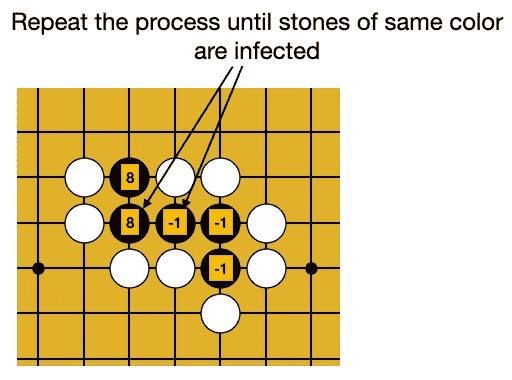

# Developing the Go Game (围棋) Using matplotlib and NumPy — Part 2

> 原文：<https://towardsdatascience.com/developing-the-go-game-%E5%9B%B4%E6%A3%8B-using-matplotlib-and-numpy-part-2-4985bef0ef39?source=collection_archive---------34----------------------->

## 执行围棋规则


来源:[https://en . Wikipedia . org/wiki/Go _(game)#/media/File:Four _ Arts _ China _ Japan . jpg](https://en.wikipedia.org/wiki/Go_(game)#/media/File:Four_Arts_China_Japan.jpg)

在我之前的文章中，我讨论了如何使用 matplotlib 绘制围棋棋盘:

</developing-the-go-game-围棋-using-matplotlib-and-numpy-part-1-3f94127d73e6>  

现在你已经能够画出围棋棋盘了，是时候做下一步了，在棋盘上放置石头——这是这个项目最有趣的方面之一。也就是说，您将允许用户在棋盘上放置石头，并以编程方式实现 Go 规则。您的计划将:

*   检查用户是否已将棋子放在围棋棋盘上的正确位置
*   确保被对手包围的一块(或一组相连的)石头将被从棋盘上移走
*   确保用户不会将石头放在导致他自己的石头(或一组相连的石头)被移走的位置

在我们开始之前，这里是我们在上一篇文章中开发的程序( **go.py** )。我们将从这里继续:

```
import matplotlib.pyplot as plt
import numpy as npdef draw_board():
    # create a figure to draw the board
    fig = plt.figure(figsize=[9,9]) # set the background color
    fig.patch.set_facecolor((0.85,0.64,0.125)) ax = fig.add_subplot(111) # turn off the axes
    ax.set_axis_off() return fig, axdef draw_grids(ax):
    # draw the vertical lines
    for x in range(19):
        ax.plot([x, x], [0,18], 'k') # draw the horizontal lines
    for y in range(19):
        ax.plot([0, 18], [y,y], 'k') ax.set_position([0,0.02,1,1])def draw_star_points(ax, x, y):
    ax.plot(x,y,'o',markersize=8,
        markeredgecolor=(0,0,0),
        markerfacecolor='k',
        markeredgewidth=1)#-----main-----
fig, ax = draw_board()
draw_grids(ax)# draw the 9 star points on the board
draw_star_points(ax, 3,3)
draw_star_points(ax, 3,9)
draw_star_points(ax, 3,15)
draw_star_points(ax, 9,3)
draw_star_points(ax, 9,9)
draw_star_points(ax, 9,15)
draw_star_points(ax, 15,3)
draw_star_points(ax, 15,9)
draw_star_points(ax, 15,15)plt.show()
```

# 处理代表围棋棋盘的图形上的事件

为了让用户在棋盘上放置石头，您需要处理 matplotlib 图形上的事件。要处理图形上的点击，使用`canvas.mpl_connect()`函数将一个事件连接到一个函数(事件处理器):

```
**# event handler to handle click on the board
def on_click(event):       
    print(f'x: {event.xdata} y: {event.ydata}')****fig.canvas.mpl_connect('button_press_event', on_click)**
```

`**button_press_event**` 事件是鼠标左键被按下时触发的事件。在连接到该事件的处理程序中，可以通过`event`参数知道用户点击图形的位置(`xdata`和`ydata`):

```
def on_click(**event**):       
    print(f'x: {**event.xdata**} y: {**event.ydata**}')
```

下图显示了代表 Go 板的图形的 x 和 y 坐标，供您参考:


作者图片

现在让我们将事件和事件处理程序添加到 **go.py** 文件中:

```
import matplotlib.pyplot as plt
import numpy as npdef draw_board():
    ...def draw_grids(ax):
    ...

def draw_star_points(ax, x, y):
    ...**# event handler to handle click on the board
def on_click(event):
    print(f'x: {event.xdata} y: {event.ydata}')
**    
fig, ax = draw_board()
draw_grids(ax)# draw the 9 star points on the board
draw_star_points(ax, 3,3)
draw_star_points(ax, 3,9)
draw_star_points(ax, 3,15)
draw_star_points(ax, 9,3)
draw_star_points(ax, 9,9)
draw_star_points(ax, 9,15)
draw_star_points(ax, 15,3)
draw_star_points(ax, 15,9)
draw_star_points(ax, 15,15)**cid = fig.canvas.mpl_connect('button_press_event', on_click)**plt.show()
```

让我们通过在终端中运行应用程序来试验代码:

```
$ **python go.py**
```

当你运行它时，点击板上的一个点，观察打印的坐标。例如，如果您单击下图中用红点表示的点，您应该会看到类似的输出:


作者图片

现在让我们声明一些全局变量:

```
...
draw_star_points(ax, 15,9)
draw_star_points(ax, 15,15)**#  0 for empty
#  1 for white
# -1 for black****# color of the stone to start
white = True****# stones is for storing the plot (containing the stone)
stones = np.full((19,19), None)****# stones_values stores the value (color) of each point
stones_values = np.full((19,19),0)**cid = fig.canvas.mpl_connect('button_press_event', on_click)
plt.show()
```

在上面的代码片段中，您有:

*   全局变量`white`指示当前石头颜色是否为白色。如果其值为`True`，则当前石头颜色为**白色**，否则为**黑色**。
*   2 个 NumPy 阵列— `stones`和`stones_values`。`stones`数组用于存储显示每块石头的图形。当一个棋子被放置在棋盘上的一个特定的交叉点时，一个代表该棋子的图形被创建。这个情节然后被保存在`stones` 2D 阵列中。在空白板上，数组中的每个值都被设置为`None`。另一方面，`stones_values`数组存储棋盘上每颗棋子的整数值。如果放置了白石，则存储值 1；如果石头是黑色的，那么值是-1。值为 0 表示板上有一个空的交叉点。

当用户点击棋盘上的一个交叉点时，你就可以开始画石头了。为了在板上画一块石头，我将定义一个名为`draw_stone()`的函数:

```
# draw the stone on the board    
def draw_stone(x,y,color):
    stone = ax.plot(x,y,'o',markersize=28, 
                      markeredgecolor=(0,0,0), 
                      markerfacecolor=color, 
                      markeredgewidth=1)
    return stone
```

该功能:

*   接受 3 个参数——放置石头的交叉点的 **x** 和 **y** 坐标，以及要绘制的石头的颜色
*   返回包含绘制的石头的图

要绘制石头，只需调用`on_click()`事件处理程序中的`draw_stone()`函数:

```
# event handler to handle click on the board
def on_click(event):    

    print(f'x: {event.xdata} y: {event.ydata}') **   # reference the gloabl variable 
    global white** **# get the points clicked on the board
    if event.xdata == None or event.ydata == None:
        return
    x = int(round(event.xdata))
    y = int(round(event.ydata))** **#----------------------------
    # Draw the stone on the board
    #----------------------------
    # make sure the area clicked is within the board
    if 0<=x<=18 and 0<=y<=18:
        # if the user left clicked to add a new stone on the board
        if event.button == 1 and stones[x,y] == None:
            stones[x,y] = draw_stone(x,y,'w' if white else 'k')
            stones_values[x,y] = 1 if white else -1
            white = not white                   # switch the color** **# when user right-clicked to remove a stone on the board  
        elif event.button == 3 and stones[x,y] != None:
            stones[x,y].pop().remove()          # remove the plot 
            stones[x,y] = None
            stones_values[x,y] = 0
        else:
            return
        plt.draw()                              # update the figure**        **print(stones)
        print(stones_values)
    else:
        return**
```

在上面的代码片段中，您:

*   对 x 坐标和 y 坐标进行舍入，并将其转换为整数值
*   确保点击的坐标在板的范围内
*   如果用户点击左键(`**event.button == 1**`)并且当前点没有石头，则向棋盘添加一颗石头
*   如果用户右击(`**event.button ==**` **3** )鼠标，从棋盘上移除一颗棋子
*   打印`stones`和`stones_values`数组的值
*   一旦一块石头被放在棋盘上，就要改变它的颜色(白色变成黑色，黑色变成白色)

> 在围棋规则中，一旦棋子被放在棋盘上，玩家就不能移动(撤消)它，除非它被对手包围。在我们的实现中，出于测试目的，我允许这样做。

让我们通过在**终端**中运行应用程序来测试代码:

```
$ **python go.py**
```

让我们在棋盘的左下角添加一块白石:


作者图片

您应该会看到以下输出。这是`stones`数组的输出:

```
[[**list([<matplotlib.lines.Line2D object at 0x12b57bfd0>])** None None None None None None None None None None None None None None None None None None]
 [None None None None None None None None None None None None None None None None None None None]
 [None None None None None None None None None None None None None None None None None None None]
 [None None None None None None None None None None None None None None None None None None None]
 [None None None None None None None None None None None None None None None None None None None]
 [None None None None None None None None None None None None None None None None None None None]
 [None None None None None None None None None None None None None None None None None None None]
 [None None None None None None None None None None None None None None None None None None None]
 [None None None None None None None None None None None None None None None None None None None]
 [None None None None None None None None None None None None None None None None None None None]
 [None None None None None None None None None None None None None None None None None None None]
 [None None None None None None None None None None None None None None None None None None None]
 [None None None None None None None None None None None None None None None None None None None]
 [None None None None None None None None None None None None None None None None None None None]
 [None None None None None None None None None None None None None None None None None None None]
 [None None None None None None None None None None None None None None None None None None None]
 [None None None None None None None None None None None None None None None None None None None]
 [None None None None None None None None None None None None None None None None None None None]
 [None None None None None None None None None None None None None None None None None None None]]
```

下一个输出是`stones_values`数组的值:

```
[[**1** 0 0 0 0 0 0 0 0 0 0 0 0 0 0 0 0 0 0]
 [0 0 0 0 0 0 0 0 0 0 0 0 0 0 0 0 0 0 0]
 [0 0 0 0 0 0 0 0 0 0 0 0 0 0 0 0 0 0 0]
 [0 0 0 0 0 0 0 0 0 0 0 0 0 0 0 0 0 0 0]
 [0 0 0 0 0 0 0 0 0 0 0 0 0 0 0 0 0 0 0]
 [0 0 0 0 0 0 0 0 0 0 0 0 0 0 0 0 0 0 0]
 [0 0 0 0 0 0 0 0 0 0 0 0 0 0 0 0 0 0 0]
 [0 0 0 0 0 0 0 0 0 0 0 0 0 0 0 0 0 0 0]
 [0 0 0 0 0 0 0 0 0 0 0 0 0 0 0 0 0 0 0]
 [0 0 0 0 0 0 0 0 0 0 0 0 0 0 0 0 0 0 0]
 [0 0 0 0 0 0 0 0 0 0 0 0 0 0 0 0 0 0 0]
 [0 0 0 0 0 0 0 0 0 0 0 0 0 0 0 0 0 0 0]
 [0 0 0 0 0 0 0 0 0 0 0 0 0 0 0 0 0 0 0]
 [0 0 0 0 0 0 0 0 0 0 0 0 0 0 0 0 0 0 0]
 [0 0 0 0 0 0 0 0 0 0 0 0 0 0 0 0 0 0 0]
 [0 0 0 0 0 0 0 0 0 0 0 0 0 0 0 0 0 0 0]
 [0 0 0 0 0 0 0 0 0 0 0 0 0 0 0 0 0 0 0]
 [0 0 0 0 0 0 0 0 0 0 0 0 0 0 0 0 0 0 0]
 [0 0 0 0 0 0 0 0 0 0 0 0 0 0 0 0 0 0 0]]
```

在实际的围棋棋盘上，左下角截距的坐标是(0，0)，而在 2D 数组表示中，位置(0，0)在左上角。下图对此进行了描述:


作者图片

如果您想看到棋盘和 2D 阵列在同一方向，您可以使用`np.rot90()`功能将 2D 阵列*逆时针旋转* 90 度:

```
print(**np.rot90(stones)**)
print(**np.rot90(stones_values)**)
```

为了测试这一点，让我们再次运行该程序，这一次，放置两块石头，如下所示:


作者图片

现在，输出应该与电路板布局相对应:

```
[[None None None None None None None None None None None None None None None None None None **list([<matplotlib.lines.Line2D object at 0x11b383c70>])**]
 [None None None None None None None None None None None None None None None None None None None]
 [None None None None None None None None None None None None None None None None None None None]
 [None None None None None None None None None None None None None None None None None None None]
 [None None None None None None None None None None None None None None None None None None None]
 [None None None None None None None None None None None None None None None None None None None]
 [None None None None None None None None None None None None None None None None None None None]
 [None None None None None None None None None None None None None None None None None None None]
 [None None None None None None None None None None None None None None None None None None None]
 [None None None None None None None None None None None None None None None None None None None]
 [None None None None None None None None None None None None None None None None None None None]
 [None None None None None None None None None None None None None None None None None None None]
 [None None None None None None None None None None None None None None None None None None None]
 [None None None None None None None None None None None None None None None None None None None]
 [None None None None None None None None None None None None None None None None None None None]
 [None None None None None None None None None None None None None None None None None None None]
 [None None None None None None None None None None None None None None None None None None None]
 [None None None None None None None None None None None None None None None None None None None]
 [**list([<matplotlib.lines.Line2D object at 0x12eb0b070>])** None None None None None None None None None None None None None None None None None None]][[ 0  0  0  0  0  0  0  0  0  0  0  0  0  0  0  0  0  0 **-1**]
 [ 0  0  0  0  0  0  0  0  0  0  0  0  0  0  0  0  0  0  0]
 [ 0  0  0  0  0  0  0  0  0  0  0  0  0  0  0  0  0  0  0]
 [ 0  0  0  0  0  0  0  0  0  0  0  0  0  0  0  0  0  0  0]
 [ 0  0  0  0  0  0  0  0  0  0  0  0  0  0  0  0  0  0  0]
 [ 0  0  0  0  0  0  0  0  0  0  0  0  0  0  0  0  0  0  0]
 [ 0  0  0  0  0  0  0  0  0  0  0  0  0  0  0  0  0  0  0]
 [ 0  0  0  0  0  0  0  0  0  0  0  0  0  0  0  0  0  0  0]
 [ 0  0  0  0  0  0  0  0  0  0  0  0  0  0  0  0  0  0  0]
 [ 0  0  0  0  0  0  0  0  0  0  0  0  0  0  0  0  0  0  0]
 [ 0  0  0  0  0  0  0  0  0  0  0  0  0  0  0  0  0  0  0]
 [ 0  0  0  0  0  0  0  0  0  0  0  0  0  0  0  0  0  0  0]
 [ 0  0  0  0  0  0  0  0  0  0  0  0  0  0  0  0  0  0  0]
 [ 0  0  0  0  0  0  0  0  0  0  0  0  0  0  0  0  0  0  0]
 [ 0  0  0  0  0  0  0  0  0  0  0  0  0  0  0  0  0  0  0]
 [ 0  0  0  0  0  0  0  0  0  0  0  0  0  0  0  0  0  0  0]
 [ 0  0  0  0  0  0  0  0  0  0  0  0  0  0  0  0  0  0  0]
 [ 0  0  0  0  0  0  0  0  0  0  0  0  0  0  0  0  0  0  0]
 [ **1**  0  0  0  0  0  0  0  0  0  0  0  0  0  0  0  0  0  0]]
```

> 要移除石头，只需右击石头，它就会从棋盘上被移除。

# 围棋规则

往棋盘上放石头是最简单的部分。最激动人心的部分是执行围棋规则。让我们在下面的章节中讨论围棋的规则。

## 自由

在围棋中，沿着水平轴和垂直轴与一颗石头相邻的一个空点被称为*自由点*。下图显示了自由的例子:

*   棋盘顶部的白色石头有 4 个自由度——它有四个相邻的空点——左、右、上、下。
*   左下角的白色石头只有一个自由——顶。
*   右下角的白色石头有两个自由度——上和右


作者图片

没有自由的石头被认为被对手包围，必须从棋盘上拿走:


作者图片

## 成组的连锁石头

石头也可以水平和/或垂直链接。如果一个团体没有至少一个自由，那么这个团体必须被移除。在下图中，一组白色石头被锁链锁住，并被黑色石头包围，因此必须全部移除:


作者图片

## 边缘案例

放在棋盘边缘的石头呢？考虑下面的例子:

*   黑色的石头被白色包围着:


作者图片

*   那群黑色的石头被白色包围着:


作者图片

*   这群白色的石头被黑色包围着:


作者图片

*   这群白色的石头被黑色包围着:


作者图片

*   这群白色的石头被黑色包围着:


作者图片

## 自杀案件

自杀的情况是玩家将石头放在一个位置，导致他/她自己的石头被移走。一般来说，围棋中不允许自杀。

这是一个自杀的例子，如果一个玩家在中间放一块黑色的石头:


作者图片

这是另一个例子。如果将一块白石放在黑石组内的空交叉点上，这将导致现有的白石也被移除:


作者图片

然而，在有些情况下，看起来像自杀的案例是有效的。考虑下面左边的图。如果将一颗黑石放在一组白石中的空白交叉点上，这将基本上移除白石(见右图)。在这种情况下，此举是有效的。


作者图片

# 移除周围的石头

既然您已经熟悉了 Go 的规则，那么是时候使用 Python 以编程方式实施所有这些规则了。让我们考虑几种不同的情况:

## 简单案例

最简单的情况是检查单个的石头是否被对手包围。假设当前玩家刚刚在以下位置放置了一颗白石:


作者图片

一旦放置了白棋，你只需要检查棋盘上是否有黑棋被白棋完全包围(即没有自由)。没有自由的石头可以从棋盘上移走。

## 边缘情况

稍微复杂一点的情况是边缘情况。假设您刚刚将黑石放置在如下所示的位置:


作者图片

放置黑石后，你需要立即检查棋盘上是否有白石被包围。对于边缘情况，您需要将“假想的”石头放在边缘之外，如下所示:


作者图片

如果当前出的石头是白色的，那么边缘外的假想石头也是白色的:


作者图片

然后你可以继续移除被包围的石头。

## 群体案例

最复杂的情况是当石头被成组地用链子锁起来。你需要发现被对手包围的一群石头。考虑以下情况，白棋刚刚在棋盘上放了一颗石子，需要检查是否有任何黑棋需要被移走:


作者图片

哪块黑石头至少有一项自由，哪块没有任何自由？下图显示了至少有一个自由度的黑色石头，用值 8 表示，而没有自由度的石头则用它们现有的颜色代码表示(-1 表示黑色)。


作者图片

如前所述，没有自由的石头可以从棋盘上移除。然而，上面的例子表明，黑色的石头形成了一个群体。显然，在这个群体的顶端有一种自由。这意味着黑色的石头群还活着。所以在这种情况下，你还不能移除黑石。为了确保所有其他黑色石头都不会被移除，你需要“感染”值为 8 的连接石头(这意味着该石头拥有自由):


作者图片

重复这个过程，直到整组石头都是 8:



作者图片

感染的最终结果表明，这一整组黑石头仍然活着，因此它们不应从棋盘上移除:


作者图片

在“感染”阶段结束时，所有没有自由的石头(用它们自己的颜色代码表示)将被移除。

## 履行

我们现在终于可以使用 Python 和 NumPy 实现 Go 的规则了。首先，让我们编写一个名为`remove_stones()`的函数，它有以下参数和返回值:

*   `color` —要移除的石头的颜色
*   `remove` —如果你要从棋盘上拿走石头；该参数对于检查自杀案例非常有用(检查自杀时，将该参数设置为`False`)
*   该函数返回移除(或需要移除)的石头数量。

下面显示了`remove_stones()`功能的实现:

```
**#------------------------------------------------
# Remove specified stones surrounded by opponent
#------------------------------------------------
def remove_stones(color, remove=True):  
    # create a new array with 1 padding of 1 around the sides 
    # (for edge case)
    temp_stones_values = np.full((21,21), color) 

    # copy the current stones_values into the padded array
    temp_stones_values[1:-1, 1:-1] = stones_values** **#-----------------------------------------------
    # Checking the liberties of the opponent stones
    #-----------------------------------------------
    # for each of opponent's stones, check to see if it has an  
    # liberty around it     
    # you are looking inside the border, so [1:-1,1:-1]
    for x,y in zip(
        np.where(temp_stones_values[1:-1,1:-1] == color)[0],
        np.where(temp_stones_values[1:-1,1:-1] == color)[1]):** **x+=1  # need to add one because of the padding
        y+=1  # need to add one because of the padding
        # as long as you have a surrounding that is 0 (empty), the 
        # stone is alive (at least one liberty)
        if temp_stones_values[x-1,y] == 0 or \
           temp_stones_values[x+1,y] == 0 or \
           temp_stones_values[x,y-1] == 0 or \
           temp_stones_values[x,y+1] == 0:
            temp_stones_values[x,y] = 8      # stone is alive** **#--------------------------------------
    # Find groups of stones that are alive
    #--------------------------------------
    # if a stone is still alive, infect those of the same color
    flipped=True** **while flipped:        
        flipped=False
        # find all the opponent's stones
        for x,y in zip(
            np.where(temp_stones_values[1:-1,1:-1] == color)[0],
            np.where(temp_stones_values[1:-1,1:-1] == color)[1]):** **x+=1  # need to add one because of the padding
            y+=1  # need to add one because of the padding
            if temp_stones_values[x-1,y] == 8 or \
               temp_stones_values[x+1,y] == 8 or \
               temp_stones_values[x,y-1] == 8 or \
               temp_stones_values[x,y+1] == 8:
                temp_stones_values[x,y] = 8      # alive
                flipped = True                

    #----------------------------
    # remove all the dead groups
    #----------------------------
    count = 0
    for x in range(1,20):
        for y in range(1,20):            
            if temp_stones_values[x,y] == color:
                if remove:
                    stones[x-1,y-1].pop().remove()
                    stones[x-1,y-1] = None
                    stones_values[x-1,y-1] = 0
                count += 1
    plt.draw()** **# return the number of stones removed
    return count**
```

您将调用`on_click()`函数中的`remove_stones()`函数:

```
# event handler to handle click on the board
def on_click(event):    
    global white
    print(f'x: {event.xdata} y: {event.ydata}')

    # get the points clicked on the board
    if event.xdata == None or event.ydata == None:
        return
    x = int(round(event.xdata))
    y = int(round(event.ydata))

    #-----------------------------
    # Draw the stone on the board   
    #-----------------------------
    # make sure the area clicked is within the board
    if 0<=x<=18 and 0<=y<=18:
        # if the user left clicked to add a new stone on the board
        if event.button == 1 and stones[x,y] == None:
            stones[x,y] = draw_stone(x,y,'w' if white else 'k')
            stones_values[x,y] = 1 if white else -1
            white = not white                   # switch the color            
        # when user right-clicked to remove a stone on the board  
        elif event.button == 3 and stones[x,y] != None:
            stones[x,y].pop().remove()
            stones[x,y] = None
            stones_values[x,y] = 0            
        else:
            return
        plt.draw()     
        # print(stones)
        # print(stones_values)
        print(np.rot90(stones)) 
        print(np.rot90(stones_values)) 
    else:
        return **#-----------------------------------
    # Remove stones that are surrounded
    #-----------------------------------
    # color of the opponent
    color = 1 if white else -1     # white is 1; black is -1    

    # remove stones of surrounded opponent
    remove_stones(color)**
```

你现在可以运行这个程序，被包围的石头会被自动移除。试试吧！很好玩！

# 检查自杀事件

如前所述，自杀是指玩家将石头放在某个位置，导致自己的石头被移走。在我们的实现中，每当玩家自杀，我们将播放一个音频通知。在 Python 中，可以使用 **beepy** 模块来播放音频通知。

您首先需要在终端中安装 **beepy** :

```
$ **pip install beepy**
```

然后导入它:

```
import matplotlib.pyplot as plt
import numpy as np
**import beepy**
```

现在，让我们添加以下粗体陈述，以检查自杀情况(在评论中解释):

```
# event handler to handle click on the board
def on_click(event):    
    global white
    print(f'x: {event.xdata} y: {event.ydata}')

    # get the points clicked on the board
    if event.xdata == None or event.ydata == None:
        return
    x = int(round(event.xdata))
    y = int(round(event.ydata))

    #----------------------------
    # Draw the stone on the board   
    #----------------------------
    # make sure the area clicked is within the board
    if 0<=x<=18 and 0<=y<=18:
        # if the user left clicked to add a new stone on the board
        if event.button == 1 and stones[x,y] == None:
            stones[x,y] = draw_stone(x,y,'w' if white else 'k')
            stones_values[x,y] = 1 if white else -1
            white = not white                   # switch the color            
        # when user right-clicked to remove a stone on the board  
        elif event.button == 3 and stones[x,y] != None:
            stones[x,y].pop().remove()
            stones[x,y] = None
            stones_values[x,y] = 0            
        else:
            return
        plt.draw()     
        # print(stones)
        # print(stones_values)
        print(np.rot90(stones)) 
        print(np.rot90(stones_values)) 
    else:
        return #----------------------------------
    # Remove stones that are surrounded
    #----------------------------------
    # color of the opponent
    color = 1 if white else -1     # white is 1; black is -1    # remove stones of surrounded opponent **#---Comment out the following statement---
    # remove_stones(color)** **if remove_stones(color) == 0:  # if no stones are removed, check 
                                   # for suicide
        white = not white          
        color = 1 if white else -1 
        if remove_stones(color, remove=False) == 0:  # there is no 
                                                     # suicide
            white = not white
        else:                                     # there is suicide
            # UNDO - remove the stone that was placed on the board          
            stones[x,y].pop().remove()    
            stones[x,y] = None
            stones_values[x,y] = 0
            plt.draw()
            beepy.beep(sound="ping")**
```

特别是，只有当用户放置石头时没有石头被移走，您才检查自杀情况。如果有自杀案例，石头会从棋盘上移走，并播放“ping”通知。

# 摘要

到目前为止，我们已经实现了围棋规则。你现在准备好和你的朋友通过轮流在棋盘上放置石头来一决胜负。在下一篇文章中，我将展示如何确定游戏的获胜者，以及如何通过网络玩游戏。在那之前，玩得开心！

# 完整的程序

下面是完整的程序( **go.py** ):

```
import matplotlib.pyplot as plt
import numpy as np
import beepydef draw_board():
    # create a figure to draw the board
    fig = plt.figure(figsize=[9,9]) # set the background color
    fig.patch.set_facecolor((0.85,0.64,0.125)) ax = fig.add_subplot(111) # turn off the axes
    ax.set_axis_off() return fig, axdef draw_grids(ax):
    # draw the vertical lines
    for x in range(19):
        ax.plot([x, x], [0,18], 'k')

    # draw the horizontal lines    
    for y in range(19):
        ax.plot([0, 18], [y,y], 'k') ax.set_position([0,0.02,1,1])    

def draw_star_points(ax, x, y):
    ax.plot(x,y,'o',markersize=8,
            markeredgecolor=(0,0,0),
            markerfacecolor='k',
            markeredgewidth=1)# draw the stone on the board    
def draw_stone(x,y,color):
    stone = ax.plot(x,y,'o',markersize=28, 
                      markeredgecolor=(0,0,0), 
                      markerfacecolor=color, 
                      markeredgewidth=1)
    return stone#---------------------------------------------------------
# calculate the territories surrounded by black and white
#---------------------------------------------------------
def calculate_score():    
    for color in [-1,1]:                # check black color first   
        # create a new array with 1 padding of 1 around the sides 
        # (for edge case)
        temp_stones_values = np.full((21,21), color) # copy the current stones_values into the padded array
        temp_stones_values[1:-1, 1:-1] = stones_values # look for empty spaces
        for x,y in zip(
            np.where(temp_stones_values[1:-1,1:-1] == 0)[0],
            np.where(temp_stones_values[1:-1,1:-1] == 0)[1]):           
            x+=1  # need to add one because of the padding
            y+=1  # need to add one because of the padding
            # as long as you have a surrounding that is the opposite 
            # color, the space is not occupied
            if temp_stones_values[x-1,y] == -color or \
               temp_stones_values[x+1,y] == -color or \
               temp_stones_values[x,y-1] == -color or \
               temp_stones_values[x,y+1] == -color:
                temp_stones_values[x,y] = 8      # space is not 
                                                 # occupied flipped=True
        while flipped:        
            flipped=False
            for x,y in zip(
                np.where(temp_stones_values[1:-1,1:-1] == 0)[0],
                np.where(temp_stones_values[1:-1,1:-1] == 0)[1]):   
                x+=1  # need to add one because of the padding
                y+=1  # need to add one because of the padding
                if temp_stones_values[x-1,y] == 8 or \
                   temp_stones_values[x+1,y] == 8 or \
                   temp_stones_values[x,y-1] == 8 or \
                   temp_stones_values[x,y+1] == 8:
                    temp_stones_values[x,y] = 8      # not occupied
                    flipped = True print(f'Space occupied by {color}:',
            len(temp_stones_values[temp_stones_values==0]))    

        # count the total number of stones for this color
        print('Total stones: ',
            len(stones_values[stones_values==color]))
        print('------')#--------------------------------------
# Remove stones surrounded by opponent
#--------------------------------------
def remove_stones(color, remove=True):    
    # create a new array with 1 padding of 1 around the sides 
    # (for edge case)
    temp_stones_values = np.full((21,21), color) 

    # copy the current stones_values into the padded array
    temp_stones_values[1:-1, 1:-1] = stones_values #-----------------------------------------------
    # Checking the liberties of the opponent stones
    #-----------------------------------------------
    # for each of opponent's stones, check to see if it has an 
    # liberty around it     
    # you are looking inside the border, so [1:-1,1:-1]
    for x,y in zip(
        np.where(temp_stones_values[1:-1,1:-1] == color)[0],
        np.where(temp_stones_values[1:-1,1:-1] == color)[1]):           
        x+=1  # need to add one because of the padding
        y+=1  # need to add one because of the padding
        # as long as you have a surrounding that is 0 (empty), the 
        # stone is alive (at least one liberty)
        if temp_stones_values[x-1,y] == 0 or \
           temp_stones_values[x+1,y] == 0 or \
           temp_stones_values[x,y-1] == 0 or \
           temp_stones_values[x,y+1] == 0:
            temp_stones_values[x,y] = 8      # stone is alive #--------------------------------------
    # Find groups of stones that are alive
    #--------------------------------------
    # if a stone is still alive, infect those of the same color    
    flipped=True while flipped:        
        flipped=False
        # find all the opponent's stones
        for x,y in zip(
            np.where(temp_stones_values[1:-1,1:-1] == color)[0],
            np.where(temp_stones_values[1:-1,1:-1] == color)[1]):   
            x+=1  # need to add one because of the padding
            y+=1  # need to add one because of the padding
            if temp_stones_values[x-1,y] == 8 or \
               temp_stones_values[x+1,y] == 8 or \
               temp_stones_values[x,y-1] == 8 or \
               temp_stones_values[x,y+1] == 8:
                temp_stones_values[x,y] = 8      # alive
                flipped = True                

    #----------------------------
    # remove all the dead groups
    #----------------------------
    count = 0
    for x in range(1,20):
        for y in range(1,20):            
            if temp_stones_values[x,y] == color:
                if remove:
                    stones[x-1,y-1].pop().remove()
                    stones[x-1,y-1] = None
                    stones_values[x-1,y-1] = 0
                count += 1
    plt.draw() # return the number of stones removed
    return count# event handler to handle click on the board
def on_click(event):    
    global white
    print(f'x: {event.xdata} y: {event.ydata}')

    # get the points clicked on the board
    if event.xdata == None or event.ydata == None:
        return
    x = int(round(event.xdata))
    y = int(round(event.ydata))

    #-----------------------------
    # Draw the stone on the board   
    #-----------------------------
    # make sure the area clicked is within the board
    if 0<=x<=18 and 0<=y<=18:
        # if the user left clicked to add a new stone on the board
        if event.button == 1 and stones[x,y] == None:
            stones[x,y] = draw_stone(x,y,'w' if white else 'k')
            stones_values[x,y] = 1 if white else -1
            white = not white                   # switch the color            
        # when user right-clicked to remove a stone on the board  
        elif event.button == 3 and stones[x,y] != None:
            stones[x,y].pop().remove()          # remove the plot  
            stones[x,y] = None
            stones_values[x,y] = 0            
        else:
            return

        plt.draw()                              # update the figure
        # print(stones)
        # print(stones_values)
        print(np.rot90(stones)) 
        print(np.rot90(stones_values)) 
    else:
        return #-----------------------------------
    # Remove stones that are surrounded
    #-----------------------------------
    # color of the opponent
    color = 1 if white else -1     # white is 1; black is -1    

    # remove stones of surrounded opponent
    if remove_stones(color) == 0: # if no stones removed, check for 
                                  # suicide
        white = not white
        color = 1 if white else -1 
        if remove_stones(color, remove=False) == 0:  # there is no 
                                                     # suicide
            white = not white
        else:                                     # there is suicide
            # remove the stone that was placed on the board          
            stones[x,y].pop().remove()    
            stones[x,y] = None
            stones_values[x,y] = 0
            plt.draw()
            beepy.beep(sound="ping")#-----main-----
fig, ax = draw_board()
draw_grids(ax)# draw the 9 star points on the board
draw_star_points(ax, 3,3)
draw_star_points(ax, 3,9)
draw_star_points(ax, 3,15)
draw_star_points(ax, 9,3)
draw_star_points(ax, 9,9)
draw_star_points(ax, 9,15)
draw_star_points(ax, 15,3)
draw_star_points(ax, 15,9)
draw_star_points(ax, 15,15)#-------
#  0 for empty
#  1 for white
# -1 for black
#-------# color of the stone to start
white = True# stones is for storing the plot (containing the stone)
stones = np.full((19,19), None)# stones_values stores the value (color) of each point
stones_values = np.full((19,19),0)fig.canvas.mpl_connect('button_press_event', on_click)plt.show()
```

<https://weimenglee.medium.com/membership> 