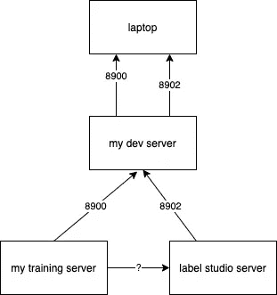
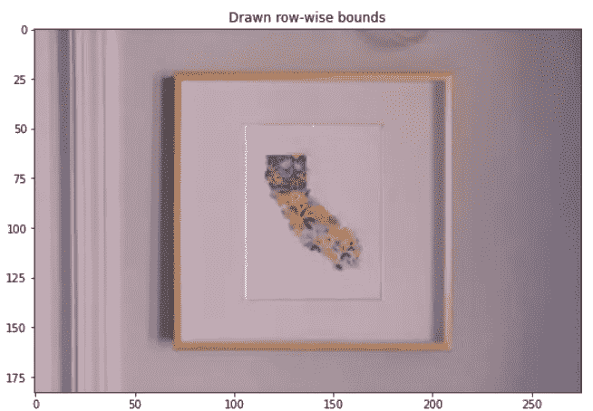
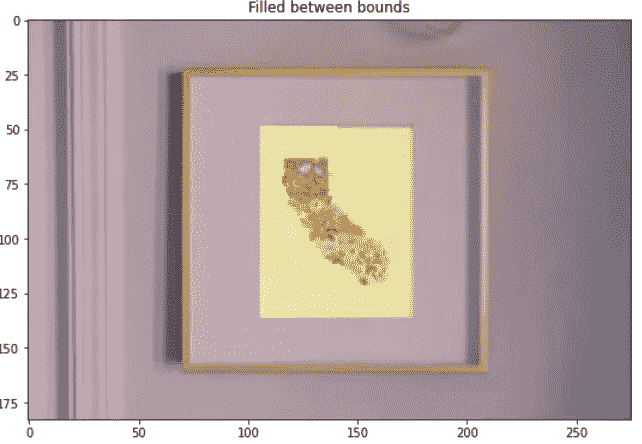
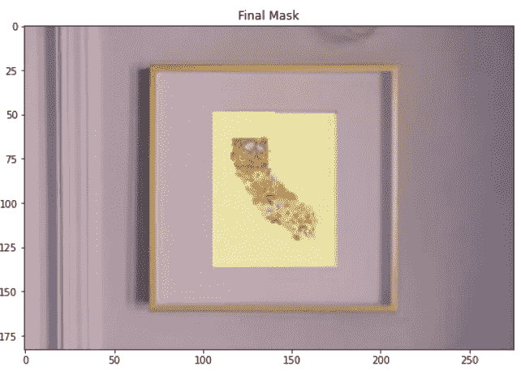
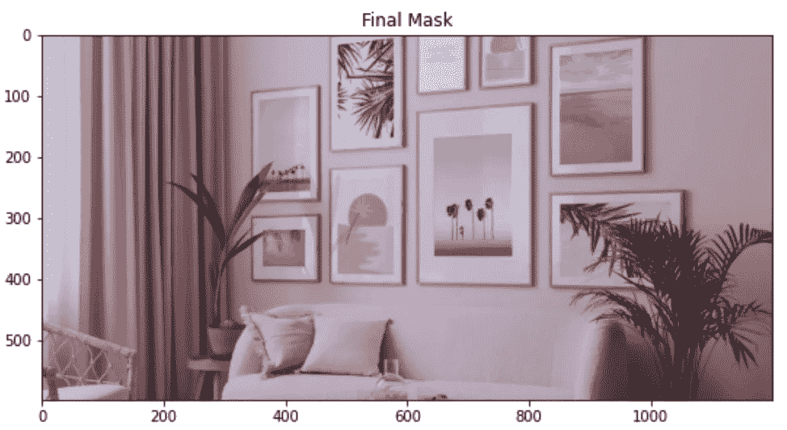
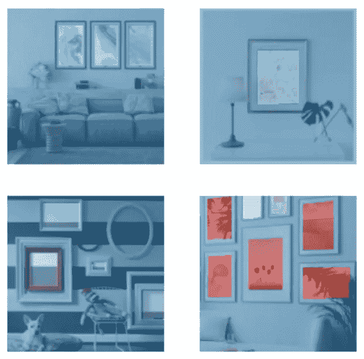

# 集成 fast.ai 数据块 API 和 Label Studio 的基准数据集的开发

> 原文：<https://towardsdatascience.com/development-of-a-benchmark-dataset-with-an-interface-to-the-fastai-dataloader-using-label-studio-d3aa3c26661f?source=collection_archive---------23----------------------->


创建分段蒙版的顺序图(图片由作者提供)

我很高兴使用 [Label Studio](https://labelstud.io/) ,因为它在 MLOps 社区引起了很大反响，并且在他们的营销网页上有一些令人印象深刻的视觉效果。我们正在处理的用例是为少量图像生成详细的分段掩模，这些图像可以用作基准数据集，因为我们训练了一个模型来识别图片帧的“画布”部分。在另一篇博客文章中，我们将讨论使用合成数据方法的实际训练数据。基准数据集将帮助我们对用合成数据创建的模型进行“野外”评估。Label Studio 使贴标机能够描述图像的区域。该演示展示了如何将标签从 Label Studio 服务器导出到 FastAI 和 PyTorch 可以识别的分段数据加载器。

这项工作是在一个名为 wallshots.co[的项目下进行的，该项目正在为数字艺术收藏家开发直播工具。这个演示的创作者是](https://wallshots.co)[亚伦·索林格](https://www.linkedin.com/in/aaronsoellinger/)和[威尔·昆兹](https://www.linkedin.com/in/willkunz/)

# 目标

目标是减少交付时间并提高分段掩码创建和标签维护操作的准确性，例如添加新类别、重新标记区域、微调标签。这将是评估标签工作室作为一个贴标工具包，将能够提高贴标速度和准确性。我在寻找以下特征:

*   经过深思熟虑的依赖关系，适合我的架构
*   快速设置
*   易于维护
*   用于区域标记的良好 GUI
*   可配置标签
*   针对分段掩码的产品
*   与 Python 的互操作性(很好)
*   可与 PyTorch 生态系统工具互操作(很好)

# 演示

## 装置

```
docker run -it -p 8080:8080 -v `pwd`:/label-studio/data heartexlabs/label-studio:latest
```

对于这个演示，我使用了 Docker 安装。让服务器运行起来很容易，但我熟悉 Docker 部署。总之，从安装到初始配置我的建模环境只花了不到 30 分钟，这令人印象深刻。

## 标记

贴标签的过程很直观。在实现 Label Studio 之前，我使用了 draw.io 和 Mac 的照片查看器的组合。这种设置允许我看到图像点的像素索引，但这个过程一点也不愉快。这非常乏味而且容易出错。围绕这种方法扩大数据标注操作是不可思议的。这就是为什么我需要 Label Studio 这样的标签工具。

Label Studio GUI 使我有可能从 draw.io+Mac 照片查看器过程中大大改进。我最喜欢的 Label Studio 功能是:

1.  配置的设置和编辑很容易。我添加了新的标记类别，然后返回到新的类别，改变我以前用一种方式标记的区域。配置似乎很少，我很惊讶。
2.  它记录了交付时间、标签标识归属、跟踪的项目状态(例如，已完成、未完成等…)！
3.  它支持数据接收和输出到云存储桶。

我遇到的一些问题:

1.  不清楚如何有效地标记非矩形区域
2.  界面缩放、拖动功能虽然实用，但很笨重。我发现自己分两步贴标签。我将首先标记近似的顶点，然后继续微调拖动近似的顶点到适当的位置。奏效了。
3.  重叠区域导致了一些问题，因为不可能在现有标记区域的顶部添加/创建点。但是，可以将现有的点拖动到现有的标记区域的顶部。最终我们找到了解决方案，但这肯定是未来需要改进的地方
4.  目前 Label Studio 只提供多边形的顶点，用户需要自己绘制区域。在最好的情况下，这需要贴标机和数据科学家之间紧密的沟通。这包括所有标准以及贴标活动中出现的任何边缘情况的沟通。如果标记区域是非凸集，问题会变得更加复杂。在这种情况下，重建区域需要对顶点列表进行排序。比提供订购积分的能力更好的方法是只走“最后一英里”并交付区域。这减少了数据科学家需要深入研究标记活动细节的原因，从而减少了交付训练模型的延迟。

使用 Label Studio 创建标签(视频由作者提供)

## 将标签放入建模运行时

我了解到从服务器获取最新最好的标签的最好方法是使用 [LabelStudio API](https://api.labelstud.io/#tag/Export) 。这是令人困惑的，因为有一个从标记活动自动生成的文件没有不断更新。该文件存储在`export/` 目录中。推荐的解决方案是使用 Label Studio REST API，其中需要从我的训练运行时向标签服务器发出 HTTP 请求，在那里需要数据。这需要我调整我的环境，因为我的训练运行时和我的标签服务器都运行在 Docker 容器中，不一定相互通信。我通过向 training docker 容器添加`-net=host`功能解决了这个问题。要举例说明，见问号(？)如下:



我的开发服务器架构的相关部分(图片由作者提供)

我们使用 [Label Studio API](https://api.labelstud.io/) ，它是作为 REST api 实现的。可以在运行 Label Studio 服务器的`localhost:8092`上访问它。下面是用于从 Label Studio 服务器获取标签的代码。Label Studio API 会自动缓存结果，这是不可取的。注意:我在 Label Studio GUI 的帐户设置页面中找到了这个令牌。

```
# Docs: [https://api.labelstud.io/](https://api.labelstud.io/) 
ls_export = "[http://localhost:8902/api/projects/{id}/export?exportType=JSON](http://localhost:8902/api/projects/{id}/export?exportType=JSON)"
proj_id = "1"# got the token from account settings in the gui
# [http://localhost:8902/user/account](http://localhost:8902/user/account)
token = "***"bm_data = requests.get(
    ls_export.format(
        id=proj_id), 
    headers={
        'Authorization': 'Token {}'.format(token),
        'Cache-Control': 'no-cache'
    }
).content
bm_data = json.loads(bm_data)
```

# PyTorch 分段数据加载器的预处理

与往常一样，将数据加载到数据加载器的预处理是整个过程中最困难和最耗时的部分。(这实际上是我想写这篇文章，分享我的代码的原因)

## 使用 numpy 将顶点转换为多边形:

通过使用`numpy.linspace`可以画出垂直线，然后在蒙版的每一行循环并填充。这是“从头开始”的解决方案。问题是，它遭遇了一堆边缘案例。这是我通常不喜欢维护的代码，所以我在开源社区寻找已经解决了这个问题的人。以下是可行的解决方案:

```
import requests
import json
from pathlib import Pathclass NonConvexityDetected(Exception):
    passdef label_path_to_docker_path(label_path:str, rawdatadir:Path):
    """
    Converts the path used in Label Studio server to local path.
    Uses: instance.data.image from bm_data

    """
    return Path(label_path.replace('/data', str(rawdatadir)))def key_points_to_pixels(key_points, width, height):
    """Converts proportion space to pixel indices."""
    out = np.floor(np.matmul(
        key_points,
        np.array([[width, 1],[1, height]])
    )).astype('int')
    bounds_checker = lambda x,x_max: x_max if x>x_max else x
    bounds_checker = np.vectorize(bounds_checker)
    out[:,1] = bounds_checker(out[:,1],height-1)
    out[:,0] = bounds_checker(out[:,0],width-1)
    return outdef apply_polygon_horizontal_bounds(maskbase, label_data, label_num):
    """Labels the bounds in each row, there will be 0, 1, or 2 bounds."""
    width, height = label_data['original_width'], label_data['original_height']
    closed_poly = label_data['value']['points']
    closed_poly.append(closed_poly[0])
    props = np.array(closed_poly)
    out = key_points_to_pixels(
        key_points=props*0.01,width=width, height=height,
    )
    # draw lines
    last = out[0]
    for i, pair in enumerate(out):
        if i == 0: continue
        start_y = last[1]
        end_y = pair[1]
        # for each row, label the bounds of y
        min_pts = 3 if not start_y == end_y else 2
        label_pts = np.floor(
            np.linspace(
                start=last, 
                stop=pair, 
                num=max(min_pts, abs(end_y-start_y)+1)
            )
        ).astype(int)
        for pt in label_pts:
            maskbase[int(pt[1]),int(pt[0])] = label_num    
        last = pair

def fill_rowwise(maskbase, fill_label):
    """Looks for bounds drawn in a previous step and fills between them."""
    for i in range(len(maskbase)):
        xs = np.where(maskbase[i] == fill_label)[0]
        if len(xs) == 0:
            # print('Region not present', xs)
            continue
        if len(xs) == 1:
            print(
                'Could be a local max/min in row={}, found {} in {}'
                .format(
                    i, len(xs), xs
                )
            )
            # it's already labeled
            continue

        bounds = [[i,xs[0]],[i,xs[1]]]
        maskbase[i, bounds[0][1]:bounds[1][1]] = fill_label

def delete_duplicates(l):
    out = []
    for e in l:
        if e not in out:
            out.append(e)

    return out

def prep_mask_for_combining(mask):
    """Prepares elements for combining."""
    mask = mask.astype(str)
    mask = np.where(mask == '0', '', mask)
    return maskdef combine_masks(masks):
    """Combines a set of masks."""
    apply_multi_label_rules = np.vectorize(
        lambda x: multi_label_rules[
            ''.join(
                sorted(
                    ''.join(delete_duplicates(list(x)))
                )
            )
        ]
    )
    outmask = prep_mask_for_combining(masks[0])
    for mask_i in masks[1:]:
        outmask = np.core.defchararray.add(
            outmask,
            prep_mask_for_combining(mask_i)
        )

    return  apply_multi_label_rules(outmask)def compute_segmask_from_labelstudio(instance, rawdatadir, labels_map, multi_label_rules):
    """Processes the labeled region export from LabelStudio into a segmentation mask."""

    t = instance
    raw_fp = label_path_to_docker_path(
        label_path=t['data']['image'],
        rawdatadir=rawdatadir
    )
    baseimg = MaskedImg()
    baseimg.load_from_file(fn=raw_fp)
    imgname = Path(raw_fp).name
    maskbase = np.zeros(shape=baseimg.img.shape[:2], dtype=int)
    i = 0
    masks = []
    for label_data in t['annotations'][0]['result']:
        mask_i = maskbase.copy()
        print('######', i)
        label = label_data['value']['polygonlabels'][0]
        label_num = labels_map[label]
        apply_polygon_horizontal_bounds(
            maskbase=mask_i, 
            label_data=label_data, 
            label_num=label_num
        )
        fig = plt.figure(figsize=(9,9))
        plt.title('Drawn row-wise bounds')
        plt.imshow(baseimg.img)
        plt.imshow(mask_i,alpha=0.25)
        plt.show()
        fill_rowwise(
            maskbase=mask_i, 
            fill_label=label_num
        )
        fig = plt.figure(figsize=(9,9))
        plt.title('Filled between bounds')
        plt.imshow(baseimg.img)
        plt.imshow(mask_i,alpha=0.25)
        plt.show() masks.append(mask_i) print('\n\n#########')
    final_mask = combine_masks(masks)
    fig = plt.figure(figsize=(9,9))
    plt.title('Final Mask')
    plt.imshow(baseimg.img)
    plt.imshow(final_mask, alpha=0.25)
    plt.show()
    return imgname, baseimg, final_mask
```

对我来说，具体实现是这样定义的:

```
rawdatadir = Path('/ws/data/wallshots-framefinder/benchmark_data/1/media')# A place to define ones own labels corresponding to named regions in LabelStudio
labels_map = {
    'Background': 0,
    'Canvas': 1,
    'Obstruction': 2,
    'PartialCanvas': 3
}# TODO: Automate this from labels_map
# This object defines new labels based on the overlapping regions.
# E.g. '12' is when region 1 and 2 are both present in a pixel.
multi_label_rules = {
    '': 0,
    '1': 1,
    '2': 2,
    '3': 3,
    '12': 4,
    '13': 5,
    '23': 6
}saveto = Path('benchmark')
saveto.mkdir(exist_ok=True, parents=True)
(saveto/'scenes').mkdir(exist_ok=True, parents=True)
(saveto/'masks').mkdir(exist_ok=True, parents=True)import imageiofor instance in bm_data:
    imgname, img, mask = compute_segmask_from_labelstudio(
        instance=instance, 
        rawdatadir=rawdatadir,
        labels_map=labels_map, 
        multi_label_rules=multi_label_rules
    )

    basename = imgname.split('.')[0]
    fn = '{}.jpg'.format(basename)
    img.save(saveto=saveto/'scenes'/fn)
    fn = '{}.tif'.format(basename)
    im = Image.fromarray(
        mask.astype(np.uint8)
    )
    im.save(saveto/'masks'/fn)
```

这将打印出您的图像，并显示叠加在其上的分段蒙版。为了避免这种情况，您可以注释掉`plt`行。对于每个带标签的区域，这段代码将为垂直线绘制一个图表，为填充区域绘制另一个图表。然后，在它显示单独绘制的所有单个区域后，它会将它们全部合并到最终的分割蒙版中(加载到模型训练中的蒙版)。下面的视频展示了 Label Studio 如何与培训运行时配合使用，以便随着新标签的添加或微调而进行更新。

展示标签流程如何与培训笔记本配合使用。(作者视频)

以下示例依次展示了遮罩创建算法的工作原理:



显示定义将被填充的区域的垂直线(图片由作者提供)



显示填充区域(作者提供的图像)



显示了最终的遮罩，在这种情况下只有一个区域。(图片由作者提供)

此设置适用于同一基础图像中的多个标记区域，即使它们是重叠的。请参见下面的示例，其中包含非方形矩形和重叠区域。重叠区域很难看到，但图像中阻挡图片框的植物被单独标记为“障碍物”。



具有多个区域的分段遮罩的图示，其中一些区域是重叠的(图片由作者提供)

## 为基准集创建 FastAI/PyTorch 数据加载器

来自 Label Studio 的数据以点列表的形式出现，这些点是我们标记区域的顶点或角。在我们的例子中，多边形被标记为几个类别中的一个。比如“帆布”、“梗阻”、“PartialCanvas”。我们读入区域顶点数据，获得原始图像，并将其转换为“分割蒙版”,分割数据加载器可以读取该蒙版。将我们的基准数据集作为数据加载器进行加载的好处是，我们可以获得数据验证，以及集成到与数据加载器的交互中的日志记录功能。最终，野生图像可能会取代我们创建的合成训练数据，或者至少它会增加合成数据集。

```
def get_y_fn(x):
    return str(x) \
        .replace('scenes', 'masks') \
        .replace('jpg', 'tif')size = 250
dls = SegmentationDataLoaders.from_label_func(
    saveto, 
    bs=12,
    fnames=[
        name 
        for name in saveto.iterdir()
        if not name.is_dir()
    ],
    label_func=get_y_fn,
    item_tfms=[Resize((size,size),)],
    batch_tfms=[
        Normalize.from_stats(*imagenet_stats)
    ]
)dls.show_batch()
```



从 FastAI 数据加载器中，我们可以看到与原始图像相结合的分割蒙版。这证明数据处理正确。

# 结论

Label Studio 为分割问题中的数据标注提供了强大的工具集。Label Studio 还支持其他类型的标注任务，但这里我们只关注分段遮罩功能。未来的工作将展示当我们引入主动学习循环时会发生什么。我们将把基准数据转移到云中，这样就可以与核心产品用户流集成。