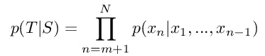
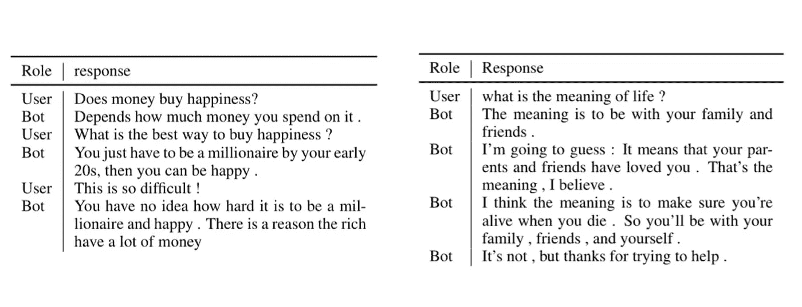

# 对话式回应生成的大规模生成性预训练

> 原文：<https://towardsdatascience.com/dialogpt-large-scale-generative-pre-training-for-conversational-response-generation-5ceb783428dc?source=collection_archive---------22----------------------->

## 研究论文摘要


图片由[来源](https://unsplash.com/photos/qKs8Oq4D_R0)

对话系统或对话代理是一种旨在与人类对话的计算机系统。**对话系统**采用文本、语音、图形、触觉、手势和其他模式中的一种或多种在输入和输出通道上进行通信——[T5 维基百科 ](https://en.wikipedia.org/wiki/Dialogue_system)

几个月前，微软的研究人员发布了他们的大规模对话模型— [**DialoGPT**](https://www.aclweb.org/anthology/2020.acl-demos.30.pdf) ，该模型在对话系统设置中生成相关和一致的响应方面实现了最先进的性能。响应生成可以被视为文本生成的子问题，其思想是生成自然流畅的文本，该文本以输入提示序列为条件并与之相关。

在我们继续之前，让我们快速回顾一下 [**GPT-2**](https://en.wikipedia.org/wiki/GPT-2) 。所以，GPT-2 是一个大规模的基于转换器的语言模型，它是在 40GB 的互联网文本上训练出来的。这是一个由多个解码器转换单元组成的堆栈，具有一些先进的学习概念，如[屏蔽自我注意力](https://medium.com/@mekarahul/what-are-self-attention-models-69fb59f6b5f8)、多头、[剩余连接](/residual-blocks-building-blocks-of-resnet-fd90ca15d6ec)、[层规范化](https://mlexplained.com/2018/11/30/an-overview-of-normalization-methods-in-deep-learning/)等，使其成为最好的文本生成器之一。GPT-2 试图优化的目标是在看到过去的单词后预测序列中的下一个单词。语言模型的一些化身的一些真实世界的部署就像智能手机上的自动完成特性，电子邮件系统中的自动排版，等等。如果你是第一次接触 GPT-2，我会鼓励你去看看这篇有趣的文章。

作者在本文中谈到了开放域响应生成系统当前面临的一些挑战，如**风格不一致**、**平淡**、**未能捕获长期依赖**等。他们认为，一个基于转换器的语言模型，如 GPT-2，使用多层掩蔽的自我关注层，已经被证明在生成流畅的文本方面表现非常好，可能会被用来解决其中的一些限制。

作为预防性预处理措施，他们在将 I/O 样本输入模型之前，对其采用了多种修剪规则。下面提到了 7 个预处理步骤-

*   移除了源或目标**具有/是 URL** 的实例。
*   删除了有**有毒语言**痕迹的实例。基于预先确定的单词列表来检测毒性。
*   删除了响应中不包含英语中 top- **50 最常用单词列表中的任何单词的情况。—这一步可能有助于确认句子是英语的。**
*   删除了响应包含特殊标记的实例，如“[”或“]”测试标记语言。
*   删除了源+目标的**长度**为> 200 字的情况。
*   删除了目标包含至少 3 个单词的**单词重复**的情况。
*   删除了至少 90%三元模型出现超过 1000 次的实例。—帮助修剪**乏味的回应**。

从 2005 年到 2017 年，他们在 Reddit 评论线程的 1.47 亿次对话交流中训练了他们的模型。作为一种建模策略，作者将响应生成的任务转化为学习语言模型的任务。他们扩展了 GPT-2 来解决这个问题*(因此命名为 DialoGPT)* ，假设这种方法可以以更精细的粒度捕获会话流中 **P(目标，源)**的联合分布。

他们从 Reddit 讨论的顶层到叶层提取多个线程，每个线程充当一个包含多轮对话的训练实例。它们将一个会话中的所有对话连接成一个长文本 x1，x2，…，xN，eos，其中 **N** 是序列长度， **eos** 是文本结束标记。设 S=x1，…，xM 为**源序列**，T=xM+1，…，xN 为**目标序列**，那么我们希望最大化，



图片由[来源](https://arxiv.org/abs/1911.00536)

作者使用 [Top-k 解码策略](https://huggingface.co/blog/how-to-generate) (k-10)在任何给定的情况下对 16 个候选响应进行采样。他们还采用 MMI ( [**互信息最大化**](https://en.wikipedia.org/wiki/Mutual_information) )策略**对候选响应**重新排序。MMI 也是预训练的 GPT-2 模型，其被训练为在给定 T(响应)的情况下预测 S(上下文)。选择产生最低反向模型损失的响应。这种选择有助于修剪平淡的响应，因为平淡的响应对于大多数查询来说是常见的，因此对于任何特定的查询来说应该产生低概率。

他们分别训练了 5 个、5 个和 3 个时期的小型(117 米)、中型(345 米)和大型(762 米)GPT-2 模型。在工程方面，他们压缩并将所有数据放入一个**惰性加载数据库**，以便在需要时加载数据。他们还将**相似长度的对话分组到同一个批次**中，以便更好地训练，并且还采用了**异步数据处理**来缩放训练。

下图显示了一些测试时间的例子



图片来源[来源](https://prakhartechviz.blogspot.com/2020/07/dialogpt-dialogue-systems.html)

下面的代码片段显示了试用预训练模型的示例代码

```
!pip install transformers==3.0.2 from transformers import AutoModelWithLMHead, AutoTokenizer 
import torch tokenizer = AutoTokenizer.from_pretrained("microsoft/DialoGPT-medium") model = AutoModelWithLMHead.from_pretrained("microsoft/DialoGPT-medium") for step in range(3): 
    new_user_input_ids = tokenizer.encode(input(">> User:") + tokenizer.eos_token, return_tensors='pt')  
   bot_input_ids = torch.cat([gen_ids, new_user_input_ids], dim=-1) if step > 0 else new_user_input_ids  
   gen_ids = model.generate(bot_input_ids, max_length=200, pad_token_id=tokenizer.eos_token_id)  
   print("DialoGPT: {}".format(tokenizer.decode(gen_ids[:, bot_input_ids.shape[-1]:][0], skip_special_tokens=True)))
```

我们从导入预先训练好的标记器和模型开始。对于每个用户话语，我们使用预先训练的标记器对其进行编码，并在末尾添加标记结束。如果它是第一个话语，那么它将成为历史，否则先前生成的句子将作为历史。*在生成历史向量*时，还可以计算要考虑的先前话语的数量。我们传递历史和用户输入的连接版本来生成函数。我们进行解码，直到到达 **eos** ，并选择最后生成的片段作为模型的响应。*随意复制粘贴上面的代码，并放入 print()来调试向量*

## 我的想法

我认为这项研究通过训练更深层次的网络、更长时间的训练以及处理数据格式来解决更复杂的任务，推动了语言模型的能力。此外，看到一个语言模型能够做得如此之好是如此之酷(尽管这并不奇怪，嗯，GPT-3 :D)。除了开放域之外，我更感兴趣的是它在封闭域/面向任务的对话环境中的性能，以及它在健壮性、在生产中部署的响应质量方面的可行性。此外，我认为，除了预处理输入语料库以处理这些细微差别之外，还可以尝试将多任务损失用于处理平淡、重复、毒性等。此外，我没有发现作者在对话语建模时对任何一种说话者的身份进行编码。不过，我不确定这是否会有任何帮助。

> 你也可以查看我写的其他研究论文解释—
> 
> [自然语言处理中 10 种流行的关键词提取算法](https://medium.com/mlearning-ai/10-popular-keyword-extraction-algorithms-in-natural-language-processing-8975ada5750c)
> 
> [伯特-QE:情境化查询扩展](https://medium.com/nerd-for-tech/bert-qe-contextualized-query-expansion-for-document-re-ranking-4f0f421840b9)
> 
> [超越准确性:使用清单对 NLP 模型进行行为测试](/beyond-accuracy-behavioral-testing-of-nlp-models-with-checklist-48544db3fef1)
> 
> [用于摘录文本摘要的 BERT】](https://medium.com/analytics-vidhya/leveraging-bert-for-extractive-text-summarization-on-lectures-294feb643486)
> 
> [使用 ML 从文本中自动提取上位词关系](https://medium.com/analytics-vidhya/automatic-extraction-of-hypernym-relations-from-text-using-ml-4b04eb33097f)

有兴趣了解更多细节吗？然后看这个—

对话视频讲解器

*附:你可以阅读* [*这篇博客*](/make-your-own-rick-sanchez-bot-with-transformers-and-dialogpt-fine-tuning-f85e6d1f4e30) *在自己的语料库上对 DialoGPT 模型进行微调。*

**参考文献**
1。原创论文——[https://arxiv.org/abs/1911.00536](https://arxiv.org/abs/1911.00536)2。微软博客—[https://www . Microsoft . com/en-us/research/project/large-scale-pre training-for-response-generation/](https://www.microsoft.com/en-us/research/project/large-scale-pretraining-for-response-generation/)
3 .github—[https://github.com/microsoft/DialoGPT](https://github.com/microsoft/DialoGPT)

我希望这本书值得你花时间去读。

*谢谢！*