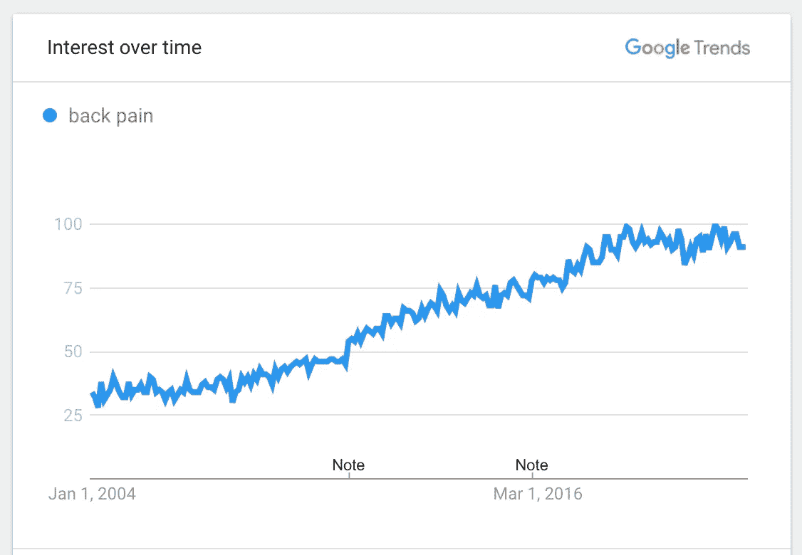
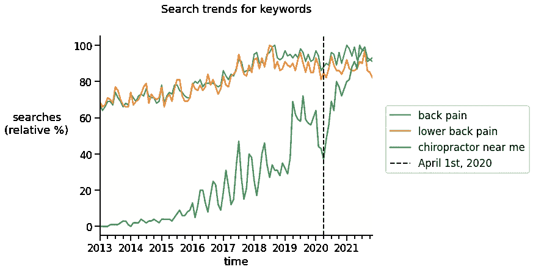
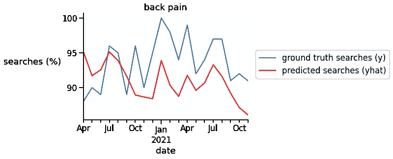
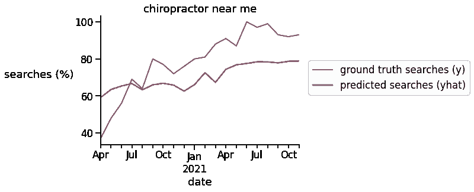

# 在家工作会毁了人们的背吗？

> 原文：<https://towardsdatascience.com/did-working-from-home-ruin-peoples-backs-5f79e78d16b3?source=collection_archive---------30----------------------->

## 用数据回答

## 使用 Prophet 分析谷歌搜索趋势，寻找在家工作导致更多背痛的证据

由 [Unsplash](https://unsplash.com?utm_source=medium&utm_medium=referral) 上的 [CHUTTERSNAP](https://unsplash.com/@chuttersnap?utm_source=medium&utm_medium=referral) 拍摄

对于我们这些能够在家(WFH)工作的幸运儿来说，这种经历可能是喜忧参半。我们中的许多人还没有准备好在家里用简陋的办公桌和不符合人体工程学的工作台工作。很快，[研究](https://www.ncbi.nlm.nih.gov/pmc/articles/PMC7503869/)、[论文](https://www.thecut.com/2020/08/working-from-home-has-given-me-back-pain.html)和[新闻文章](https://www.cnbc.com/2021/03/03/back-and-neck-pain-working-from-home-amid-covid-exercises-for-relief.html)开始报道和抱怨在家工作给我们许多人带来了背痛问题。

然而与此同时，人们开始投入更多的时间和金钱来照顾自己。大多数健身房都关门了，但是人们很快就适应了，他们投资购买了家用健身器材和更符合人体工程学的设备。这导致了哑铃、重量和室内自行车等健身器材的需求激增和短缺([来源](https://www.vox.com/the-goods/21396116/dumbbell-set-shortage-nordictrack-bowflex)，以及包括站立式办公桌和人体工程学办公椅在内的 WFH 设置([来源](https://www.investopedia.com/the-economic-impact-of-a-hybrid-office-5200417))。此外，WFH 让数百万人避免了长时间的开车和通勤，这增加了背部问题的风险。因此，同样有可能的是，WFH 可能通过将人们从长时间的通勤和办公室工作中解救出来，减轻了人们的背痛。

因此，带着这些混杂的信号，我想知道:在疫情期间，是否有更多的人因为在家工作而感到背痛？我使用谷歌趋势数据和 Prophet 分析搜索量时间序列找到了我的答案。

# 背痛的数据

回答这个问题的一个数据来源是医院和保险公司。然而，在 covid 期间，医院提供的服务有限，并不是每个患有背痛的人都会通过医院和保险接受治疗。相反，当人们经历背痛时，他们可能会做的第一件事是在网上搜索与背痛有关的事情，如背痛的症状，如何治疗背痛，或他们家附近的脊医。因此，一种获得是否有更多人经历背痛的信号的方法是看看在疫情期间对背痛或脊椎指压治疗师的搜索是否增加。

谷歌趋势提供了这些数据。从 2013 年开始，我搜索了“[背痛](https://trends.google.com/trends/explore?date=all&geo=US&q=back%20pain)”、“[下背痛](https://trends.google.com/trends/explore?date=all&geo=US&q=lower%20back%20pain)”和“[我附近的脊医](https://trends.google.com/trends/explore?date=all&geo=US&q=chiropractors%20near%20me)”的趋势。

初步看看如何搜索背痛随着时间的推移而增加(截图由作者从[来源](https://trends.google.com/trends/explore?date=all&geo=US&q=back%20pain))。

# 分析搜索趋势数据

分析时间序列数据不是一件容易的事情，但是一个简单的开始方法是使用 [Prophet](https://facebook.github.io/prophet/) 包，它提供了一个非常易于使用的界面来进行预测，同时考虑数据中的趋势、季节性和异常值。在对季节性和趋势进行控制后，我们可以测试在疫情期间是否有统计学意义上的背痛相关关键词的搜索量的增加。

但首先，快速浏览一下数据似乎表明，大多数与背痛相关的搜索在 2020 年 3 月下降，这是庇护所订单开始启动的时候。然而，在 2020 年 4 月之后，搜索量再次飙升。你还可以看到，自 2013 年以来，这些搜索有明显增加的趋势。这对于搜索词“我附近的按摩师”尤为明显。然而有趣的是，对背痛和下背痛的搜索似乎在 2018 年中期达到高峰后就稳定下来了。

图片由作者([来源](https://gist.github.com/jcheong0428/21c8df2f6acae849dd1e10e7352f3143))提供，数据来自[来源](https://trends.google.com/trends/explore?date=all&geo=US&q=back%20pain)。

统计测试背痛搜索是否因疫情而增加的一种方法是将地面实况搜索量与我们基于历史数据的最佳估计进行比较。更具体地说，我们可以比较基于历史趋势的从 2020 年 4 月到现在搜索数量的**预测**与自 2020 年 4 月以来发生的背痛搜索的**地面真实数据**。

这可以通过下面的代码来完成:

背痛的结果如下图所示，红线显示“背痛”的预测搜索结果，而蓝线表示“背痛”的真实搜索量。

寻找背痛。蓝色为基本事实，红色为基于历史数据和趋势的预测搜索。图片由作者([来源](https://gist.github.com/jcheong0428/21c8df2f6acae849dd1e10e7352f3143))提供，数据来自[来源](https://trends.google.com/trends/explore?date=all&geo=US&q=back%20pain)。

有趣的是，在疫情的最初几个月，背痛的搜索量有所下降。然而，搜索量在夏季开始回升，2021 年的搜索量远远超过了基于历史趋势的搜索量。将每月的搜索预测与基本事实进行比较，结果是基本事实搜索的数量明显大于预测(t(19) = 3.02，p = .007)。搜索词“我附近的按摩师”也是这种情况，其真实搜索量明显大于预测搜索量(t(19)=3.21，p=.005)。

搜索我附近的脊医。蓝色为基本事实，红色为基于历史数据和趋势的预测搜索。图片由作者([来源](https://gist.github.com/jcheong0428/21c8df2f6acae849dd1e10e7352f3143))提供，数据来自[来源](https://trends.google.com/trends/explore?date=all&geo=US&q=back%20pain)。

# 调查的结果

总体而言，主要调查结果可总结如下:

*   “背痛”的搜索量在过去十年中稳步增长，但在 2018 年停滞不前，出现了略微下降的趋势。
*   对“背痛”和“我附近的脊椎指压治疗师”的搜索在疫情的最初几个月略有下降，但从 2020 年夏天开始，增长速度明显超过历史趋势。
*   这些结果强烈表明，疫情期间在家工作很可能导致美国工人背部疼痛加剧。

这些发现意味着什么？这组分析表明，来自谷歌趋势的数据可以成为分析公共卫生趋势的有效方法，因为它可能是健康问题的第一个迹象，即使是对那些没有住院的人来说。结果还显示，疫情似乎确实对许多美国人的背部健康造成了损害。希望随着疫情逐渐消失，回到办公室可以帮助人们回到更符合人体工程学的办公桌前。

最后但并非最不重要的一点是，这里有一个到 Colab 笔记本的链接，可以复制这些分析。