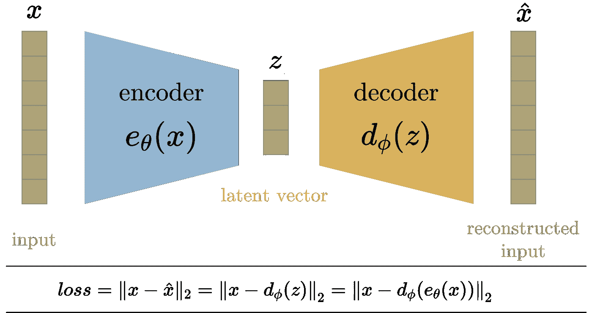
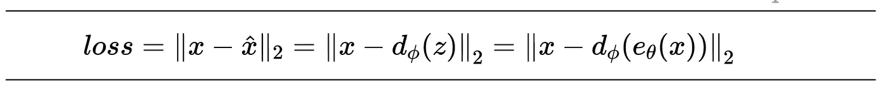
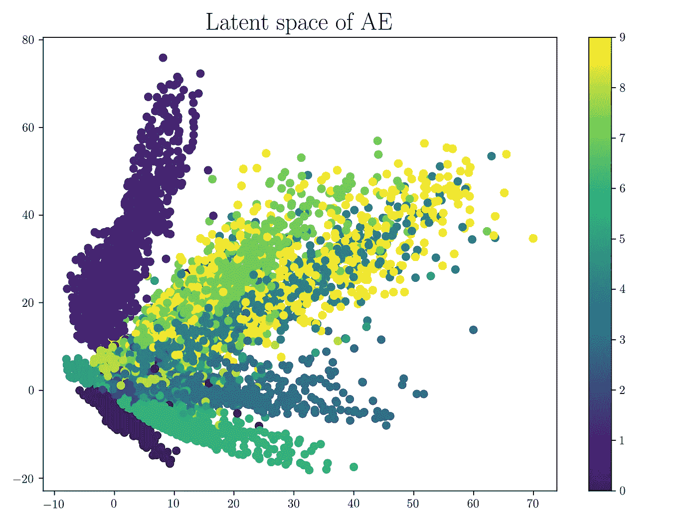
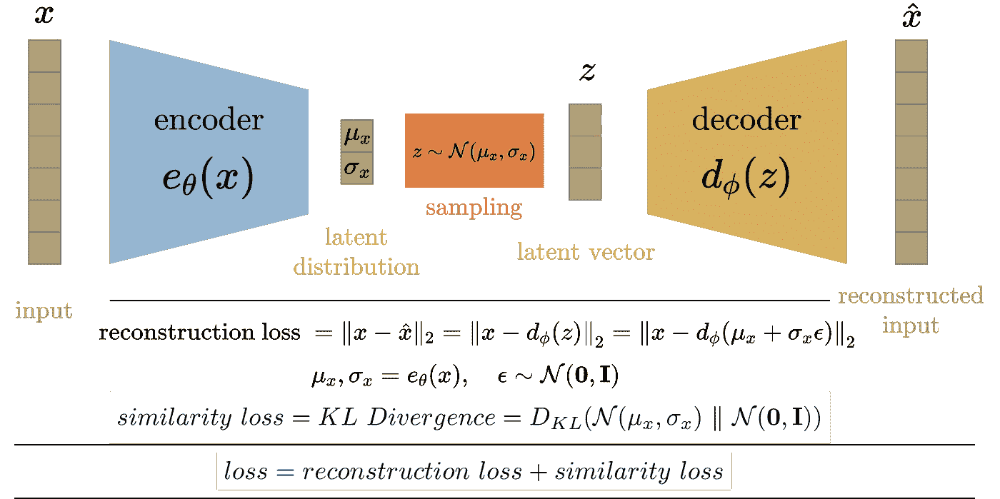
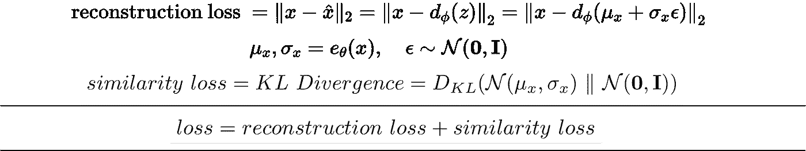
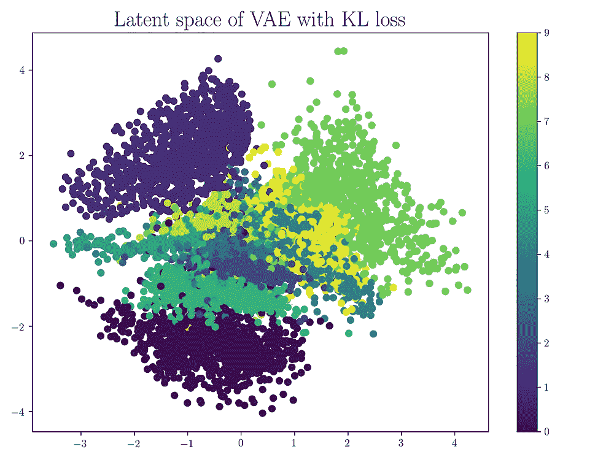
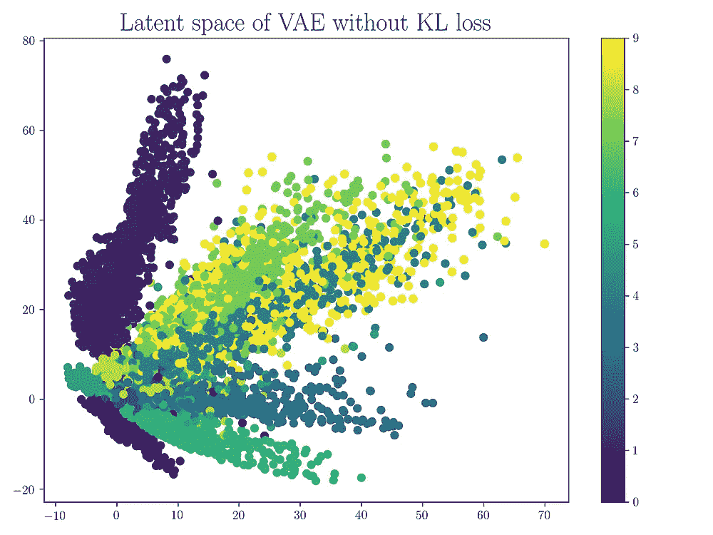
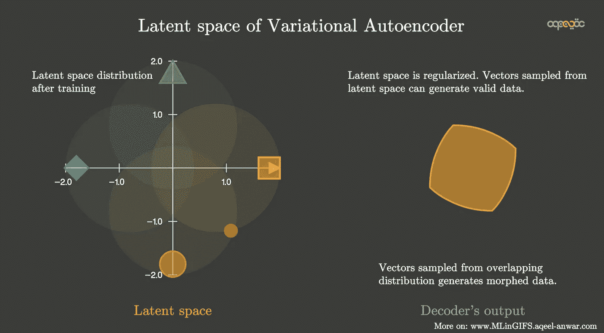

# 自动编码器(AE)和可变自动编码器(VAE)的区别

> 原文：<https://towardsdatascience.com/difference-between-autoencoder-ae-and-variational-autoencoder-vae-ed7be1c038f2?source=collection_archive---------0----------------------->

## 如何压缩数据，甚至从随机值生成数据？这就是自动编码器和变型自动编码器。

> 简化的能力意味着消除不必要的东西，让必要的东西说话——汉斯·霍夫曼

# 上下文—数据压缩

数据压缩是训练网络的重要阶段。这个想法是压缩数据，这样同样数量的信息可以用更少的比特来表示。这也有助于解决维数灾难的问题。具有许多属性的数据集不适合训练，因为它往往会使模型过拟合。因此，在数据集可用于训练之前，需要应用维数减少技术。

这就是自动编码器(AE)和可变自动编码器(VAE)发挥作用的地方。它们是用于压缩输入数据的端到端网络。自动编码器和变分自动编码器都用于将数据从高维空间转换到低维空间，本质上实现压缩。

# 自动编码器— AE

## 这是什么？

Autoencoder 用于学习给定网络配置的未标记数据的有效嵌入。自动编码器由两部分组成，编码器和解码器。编码器将数据从高维空间压缩到低维空间(也称为潜在空间)，而解码器则相反，即将潜在空间转换回高维空间。解码器用于确保潜在空间可以从数据集空间捕获大部分信息，方法是强制它输出作为输入提供给解码器的内容。

## 框图

框图如下所示。

自动编码器—作者图片

在训练期间，输入数据 x 被馈送到编码器功能 ***e_theta(x)*** 。输入通过一系列层(由变量 theta 参数化),减少其维度以获得压缩的潜在向量 ***z*** 。层数、层的类型和尺寸以及潜在空间尺寸是用户控制的参数。如果潜在空间的维数小于输入空间的维数，就实现了压缩，实质上消除了冗余属性。

解码器 ***d_phi(z)*** 通常(但不一定)由编码器中使用的层的近似互补层组成，但顺序相反。层的近似补充层是可用于撤销原始层的操作(在某种程度上)的层，诸如将 conv 层转置到 conv 层、汇集到取消汇集、完全连接到完全连接等。

## 损失函数

整个编码器-解码器架构在损失函数上被集体训练，该损失函数鼓励在输出端重构输入。因此，损失函数是编码器输入和解码器输出之间的均方误差。

自动编码器损失函数—作者图片

这个想法是有一个非常低维的潜在空间，以便实现最大的压缩，但同时，误差足够小。将潜在空间的维度减小超过某个值将导致信息的显著损失。

潜在空间的价值/分布没有限制。它可以是任何东西，只要当解码器功能应用于它时，它可以重构输入。

## 潜在空间可视化

以下是通过在 MNIST 数据集上训练网络而生成的潜在空间的示例。

自动编码器的潜在空间——作者图片

可以看出，相同的数字倾向于在潜在空间中自我聚集。另一个需要注意的重要事情是，潜在空间的某些部分并不对应于任何数据点。使用这些作为编码器的输入将导致输出看起来不像来自 MNIST 数据的任何数字。这就是我们所说的潜在空间没有被正则化的意思。这种潜在空间仅具有几个具有生成能力的区域/聚类，这意味着对潜在空间中属于一个聚类的任何点进行采样都将生成该聚类所属的数据的变化。但整个潜在空间不具备再生能力。不属于任何簇的区域将产生垃圾输出。一旦网络被训练，并且训练数据被移除，我们就无法知道解码器从随机采样的潜在向量生成的输出是否有效。因此 AE 主要用于压缩。

> 对于有效的输入，AE 能够将它们压缩到更少的比特，基本上消除了冗余(编码器)，但是由于非正则化的潜在空间 AE，解码器不能用于从潜在空间采样的向量的潜在中生成有效的输入数据。

## 为什么要用 AE 进行压缩？

线性自动编码器的潜在空间非常类似于在数据的主分量分析期间获得的特征空间。输入空间维度 ***n*** 和潜在空间维度设置为 ***m < n*** 结果的线性自动编码器将跨越与 PCA 的第一个 ***m*** 特征向量所跨越的向量空间相同的向量空间。如果 AE 和 PCA 差不多，为什么要用 AE？声发射的威力来自它的非线性。添加非线性(例如非线性激活函数和更多的隐藏层)使得 AE 能够以少得多的信息损失在较低维度中学习输入数据的相当强大的表示。

# 可变自动编码器

## 这是什么？

变分自动编码器解决了自动编码器中非正则化潜在空间的问题，并为整个空间提供了生成能力。AE 中的编码器输出潜在向量。VAE 编码器不是输出潜在空间中的向量，而是为每个输入输出潜在空间中预定义分布的参数。然后，VAE 对这种潜在分布施加约束，迫使其成为正态分布。这个约束确保了潜在空间的正则化。

## 框图

VAE 的框图如下所示。在训练期间，输入数据 x 被馈送到编码器函数 ***e_theta(x)*** 。就像 AE 一样，输入通过一系列层(由变量 theta 参数化)来减少其维度，以获得压缩的潜在向量 ***z*** 。然而，潜在向量不是编码器的输出。相反，编码器输出每个潜在变量的平均值和标准差。然后，根据该平均值和标准偏差对潜在向量进行采样，然后将其馈送到解码器以重构输入。VAE 中的解码器与 AE 中的解码器工作原理相似。

## 损失函数

损失函数由 VAE 目标定义。VAE 有两个目标

1.  重建输入
2.  潜在空间应该是正态分布的

因此，VAE 的训练损失被定义为这些*和 ***相似性损失*** 的总和。与 AE 一样，重构误差是输入和重构输出的均方损耗。相似性损失是潜在空间分布和标准高斯(零均值和单位方差)之间的 KL 散度。那么损失函数就是这两个损失的总和。*

**

*变分自动编码器损失函数—图片由作者提供*

*如前所述，在将潜在向量馈送到解码器之前，从编码器生成的分布中对其进行采样。这种随机采样使得编码器很难发生反向传播，因为我们无法追溯这种随机采样导致的错误。因此，我们使用重新参数化技巧来模拟采样过程，这使得误差有可能通过网络传播。潜在向量 z 被表示为编码器输出的函数。*

**

*重新参数化技巧用于将潜在向量 z 表示为编码器输出的函数。*

## *潜在空间可视化*

*训练试图在两个损失之间找到平衡，并以看起来像单位范数的潜在空间分布结束，其中聚类将相似的输入数据点分组。单位范数条件确保潜在空间被均匀地展开，并且在聚类之间没有明显的间隙。事实上，相似数据输入的聚类通常在某些区域重叠。下面是通过在相同的 MNIST 数据集上训练网络生成的潜在空间的示例，该数据集用于可视化 AE 的潜在空间。请注意，簇之间没有间隙，空间类似于单位范数的分布。*

****

*变型自动编码器的潜在空间——作者图像*

*需要注意的重要一点是，当潜在向量从具有重叠聚类的区域中采样时，我们得到变形的数据。当我们对从一个聚类移动到另一个聚类的潜在空间进行采样时，我们得到了解码器输出之间的平滑过渡。*

**

*VAE 的潜在空间被规则化——作者的意象*

# *摘要*

*本文介绍了自动编码器(AE)和变分自动编码器(VAE)的概念，它们分别用于数据压缩和数据生成。VAE 解决了 AE 的非正则化潜在空间的问题，这使得它能够从潜在空间的随机采样向量中生成数据。AE 和 VAE 的主要总结点如下*

## *自动编码器*

*用于在潜在空间中生成输入的压缩变换*

*潜在变量没有被正则化*

*选择一个随机的潜在变量会产生垃圾输出*

*潜在变量具有不连续性*

*潜在变量是确定性值*

*潜在空间缺乏生成能力*

## *可变自动编码器(VAE)*

*将潜在变量的条件强制为单位范数*

*压缩形式的潜在变量是均值和方差*

*潜在变量是平滑连续的*

*潜在变量的随机值在解码器处产生有意义的输出*

*解码器的输入是随机的，并且是从具有编码器输出的均值和方差的高斯样本中采样的。*

*正则化潜在空间*

*潜在空间具有生成能力。*

***如果这篇文章对你有帮助，或者你想了解更多关于机器学习和数据科学的知识，请关注**[**Aqeel an war**](https://aqeel-anwar.medium.com/)**，或者在**[***LinkedIn***](https://www.linkedin.com/in/aqeelanwarmalik/)***或***[***Twitter***](https://twitter.com/_aqeelanwar)***上联系我。****

* [## 通过我的推荐链接加入媒体- Aqeel Anwar

### 作为一个媒体会员，你的会员费的一部分会给你阅读的作家，你可以完全接触到每一个故事…

aqeel-anwar.medium.com](https://aqeel-anwar.medium.com/membership)*