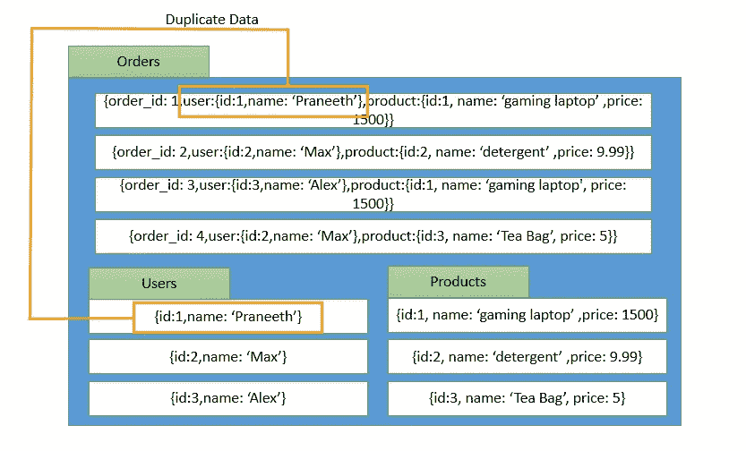

# Sql 和 NoSql 的区别

> 原文：<https://towardsdatascience.com/difference-between-sql-and-nosql-42a194b8c56c?source=collection_archive---------19----------------------->

## 你需要知道的 6 个关键区别！

[活动发起人](https://unsplash.com/@campaign_creators?utm_source=medium&utm_medium=referral)在 [Unsplash](https://unsplash.com?utm_source=medium&utm_medium=referral) 上的照片

## **TL；博士:**

# SQL 与 NoSQL 的主要区别

1.  SQL 数据库有严格的模式，而 NoSQL 数据库没有。
2.  SQL 数据库有关系，而 NoSQL 数据库没有任何关系。
3.  SQL 数据库由表组成，而 NoSQL 数据库有集合和文档。
4.  SQL 数据库有多个表，而在 NoSql 数据库中，数据被压缩到几个集合中。
5.  SQL 数据库是垂直可伸缩的，但是 NoSQL 数据库是垂直和水平可伸缩的。
6.  SQL 数据库可以限制每秒查询的数量，而 NoSQL 数据库则没有。

现在我们已经看到了 SQL 和 NoSQL 数据库之间的主要区别，让我们深入了解它们实际上是什么以及它们是如何工作的。我们还将比较这两种数据库的不同优缺点。

# 让我们开始吧！

照片由[雅各布·欧文斯](https://unsplash.com/@jakobowens1?utm_source=medium&utm_medium=referral)在 [Unsplash](https://unsplash.com?utm_source=medium&utm_medium=referral)

# SQL:结构化查询语言

SQL 代表结构化查询语言，它允许你编写数据库查询。所以说到底，SQL 只是一种语言，而不是数据库本身。但是可以使用 SQL 查询数据库。典型的 SQL 查询可能如下所示:

*从用户中选择 id、名称、电子邮件；*

在此示例查询中，大写的关键字称为 SQL 关键字，查询的其他部分由所需的自定义列和数据库中的表名组成。

当然，SQL 有更多的关键字和命令。SQL 可用于在数据库上执行任何 CRUD 操作(创建、读取、更新和删除)。

当我们通常谈论 SQL 与 NoSQL 时，我们实际上谈论的是它们背后的数据库。

对于 SQL，我们通常使用的数据库是关系数据库。这意味着我们有一个在某些假设下工作的数据库，它支持结构化查询语言。

这样的数据库与表一起工作。可以把表想象成特定类型数据的容器。类似于*用户*表和*产品*表*的东西。*如果我们想要存储关于我们的应用程序用户的信息，我们将它存储在 *users* 表中，并将产品信息存储在 *products* 表中。

关系数据库中的表通过称为键的公共列相互关联。关系数据库中有主键和外键。主键有助于唯一地标识表中的记录，而外键有助于关联其他表中的相关信息。

然而，在使用 SQL 查询的关系数据库中，对于如何存储数据会有一些严格的要求。这是因为数据库必须遵循固定的模式。每列都有指定的数据类型，不能更改。即使向表中添加一个新列也不像您希望的那样灵活。假设您需要存储一条额外的信息，可能是客户对订单的特殊指示。理想情况下，您会希望获得该订单的*特殊说明*信息。但是使用 SQL，这是不可能的。您必须向整个表中添加一个名为*特殊说明*的新列，即使这意味着所有其他记录都将包含空值。虽然这并不是一个坏主意，但也不太灵活。

但是，SQL 是相当强大的。尽管由于每次请求都需要处理多个连接而带来了很多复杂性，SQL 仍然是许多开发人员的首选。如果你打算进入数据科学领域或者已经进入了这个领域，SQL 将会非常有帮助。SQL 是一个很好的数据争论工具，几乎可以做 python 为数据争论所做的一切。点击阅读更多关于 SQL 对数据科学的重要性[。](https://praneethvasarla.com/sql-the-oldest-and-the-most-underrated-data-skill/)

既然我们已经讨论了 SQL，那么让我们来看看什么是 NoSQL 以及它是如何工作的。

[韦斯利·廷吉](https://unsplash.com/@wesleyphotography?utm_source=medium&utm_medium=referral)在 [Unsplash](https://unsplash.com?utm_source=medium&utm_medium=referral) 上拍摄的照片

# NoSQL:不仅是 SQL

NoSQL 代表“不仅是 SQL ”,这是因为 NoSQL 支持非结构化数据的存储，这是其本质决定的。NoSQL 数据库不像 SQL 数据库那样有固定的模式。

事实上，NoSQL 数据库甚至没有像 SQL 数据库那样的表和索引。那么我们如何存储数据呢？在 NoSQL，我们以分层的形式存储数据。信息不是以表格的形式存储，而是以集合和文档的形式存储。可以把 NoSQL 数据库集合想象成 SQL 数据库的表，把 NoSQL 文档想象成 SQL 记录。

但是与具有固定模式的 SQL 表不同，NoSQL 集合没有这样的限制。文档可以有任意多的值。有了这种令人难以置信的灵活性，现在每个文档中可以有不同的信息。回到我们在 SQL 部分讨论的*特殊指令*列的例子，现在可以只为那个特定的顺序添加*特殊指令*列，而不改变整个集合。

此外，在 NoSQL 没有所谓的关系。*“哦，那你到底怎么把不同收集的数据结合起来呢，普拉尼思？”*你可能会问。

嗯，即使从技术上讲，NoSQL 数据库中没有“关系型”这样的东西，但是将所有相关的东西放在一个地方仍然是可能的。那就是将你需要的所有数据放入一个集合中。没错。这听起来可能非常低效，但这大大降低了查询的复杂性，并使我们能够非常快速地显示数据，而不需要像在 SQL 数据库中那样连接多个表。

然而，这样做的缺点是，我们最终会得到大量重复的数据。例如，您将拥有一个*用户*集合和一个*产品*集合。当您需要在另一个集合中存储与订单相关的信息时，您必须在 *orders* 集合中再次包含用户信息和产品信息。

鸣谢:作者

# 缩放比例

对于 SQL 数据库，很难/不可能进行水平扩展。但是 NoSQL 的数据库却不是这样。但是，嘿，水平/垂直缩放到底是什么？

水平扩展是指随着数据的增长向数据库添加额外的服务器。而垂直扩展只是增加了现有服务器的能力。这是 SQL 数据库的一个很大的缺点，因为在某种程度上，它真的很难进一步扩展。但是有了 NoSQL，您可以在扩展时添加额外的服务器，轻松生活！

# 两种类型的利弊

这两种数据库都有各自的优缺点。

1.  虽然固定模式有利于数据库中的预测性布局和可靠字段，但它不够灵活。在这方面，SQL 有一个预测性的布局，但在灵活性上输了，而 NoSQL 有所有的灵活性，但缺乏字段的可靠性。
2.  由于表之间的关系，SQL 数据库可以很容易地处理更新操作。另一方面，由于缺乏固定的模式，NoSQL 擅长处理读取请求，而不擅长更新操作。
3.  当构建一个长期的应用程序时，伸缩性可能是一个问题。由于其水平扩展能力，NoSQL 是非常可行的。

# 最后的想法

实际上，可以用这两个数据库中的任何一个构建任何类型的应用程序。这完全取决于你的特殊需求和业务性质。只有当数据变大时，问题才会出现。

您是否需要数据之间的大量关系，并且需要频繁地更改这些关系？您需要定义一个清晰的模式吗？使用 SQL。

您的应用程序是否发出大量读取请求，而不是大量写入请求？想要快速显示数据而不需要任何复杂的查询吗？结垢是一个问题吗？和 NoSQL 一起去。

这两者之间没有明显的赢家，它只取决于应用程序的特定需求。

*原载于我的博客*【praneethvasarla.com】