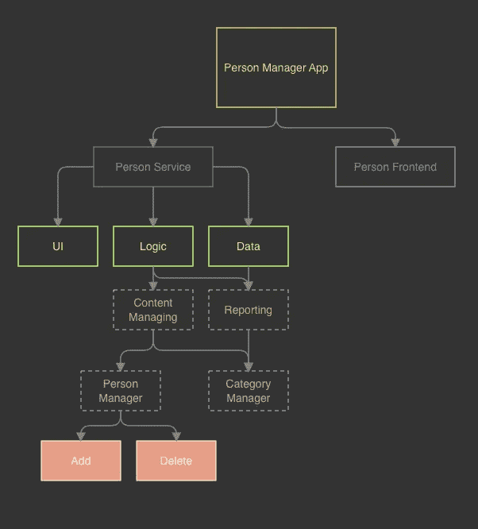
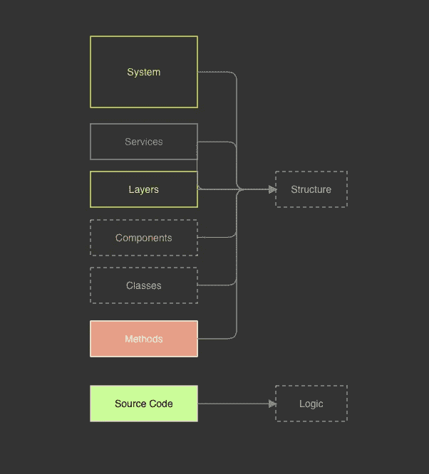

# 获得正确的软件架构

> 原文：<https://towardsdatascience.com/difference-of-system-software-architecture-f800eab80f09?source=collection_archive---------22----------------------->

## 复合组件架构:第一集——软件架构——幽灵的威胁

约瑟夫·巴里恩托斯在 [Unsplash](https://unsplash.com?utm_source=medium&utm_medium=referral) 上拍摄的照片

所以这个问题总是会出现，我会在本文最后给出我的答案。建议你先自己回答问题，再继续看文章。你会发现很难用一种容易理解的方式来定义这个术语。

应用程序的架构是整个软件系统的结构。这将与一组规则一起构成，软件系统必须根据这些规则来实现。这样一套规则保证了与质量方面的一致性将推动项目走向长期的成功。在我看来，该架构包括以下元素:

*   模块化
*   模式的使用
*   规则和准则
*   证明文件

从内容上来说，这个答案是正确的。然而，它不能给出一个直截了当的答案。*软件开发中的架构*要么意味着一切，要么什么都不是。软件项目的结构发生在不同的层次上。首先，我们必须解释有哪些层次，然后是架构的类型。一旦介绍完毕，我们就可以查看各自的任务、目标和角色并给出答案。

# **建筑等级**

模块化是建筑最重要的目的之一。它一步一步地将软件系统划分为服务、层、组件、类、方法等等。

如图 1 所示，这创建了要开发的软件的层次树表示。

图 1 一个人管理应用程序的模块化示例

现在，树结构的每一层都可以分配给一个实现元素。例如，在编程语言中，子系统 *PersonManager* 和 *CategoryManager* (图 1)是类。

然后，每个级别都被赋予其实现元素的名称，结果就是所谓的级别模型，如图 2 所示。

图 2:层模型(从图 1 的模块化结构转移而来)

# **术语定义**

任何在书籍、文章或其他媒体中研究过建筑主题的人都知道可以使用各种类型的术语。这些术语包括系统架构、软件架构、服务架构、微观和宏观架构等等。

让我借此机会解释一下我在这个问题上的术语。我使用的术语是*系统架构*、*软件架构、*和*实现(设计&编码)*。图 2 显示了这些术语位于我的哪个区域。

## **系统架构**

Alexandre Debiève 在 [Unsplash](https://unsplash.com?utm_source=medium&utm_medium=referral) 上拍摄的照片

*系统架构*定义了系统由哪些子系统组成；这些通常涉及服务(web)或外部系统，如打印机、数据库等。图 1 中的 *PersonManagerApp* 由两个服务组成，一个 web API 和一个前端。

在图 2 中,“定义范围”没有延伸到服务级别的中间:一个*系统架构*仅仅识别系统的服务，它们通信的方式，以及在那个级别使用的概念。然而，没有关于服务实现的规范。

因为我们在这里只创建了应用程序的粗略结构，所以其他来源称之为“粗略架构”或“宏架构”。

没有建筑师为每个项目重新发明轮子，但是他们建立在已经在许多其他项目中被证明有价值的被证明的设计之上。我相信你对这些所谓的“模式”很熟悉。

系统架构主要负责可伸缩性、故障安全、互操作性等方面。因此，从长远来看，如果一个系统架构是未计划的和未实现的，或者是计划和实现不当的，那么在这些方面就存在问题的风险。

## **软件架构**

照片由[海拉戈斯蒂奇](https://unsplash.com/@heylagostechie?utm_source=medium&utm_medium=referral)在 [Unsplash](https://unsplash.com?utm_source=medium&utm_medium=referral) 上拍摄

我在图 2 中展示了软件架构的职责，它决定了软件系统的内部结构，就像图 1 中的单个服务一样。这里，指定了服务中的层和组件的结构，但是没有精确地描述组件的内部生命。

就像*系统架构*一样，仍然有模式留给我们现成的解决方案:软件架构模式。例如:

*   庞然大物
*   插件
*   管道和过滤器
*   多层

类似于*系统架构* , *软件架构*也负责具体的定性方面，如可重用性、可互换性和可分析性。

在这个层次上，定性的方面包括可重用性、可互换性、可分析性、可测试性和可修改性。前两点用引号括起来是因为可重用性和可互换性通常发生在组件级别。因此，一个 DLL 文件*，*比一个类有更大的机会被重用。

## 实施(设计和编码)

编程是图 2 中最后一个可见的阶段。在这个阶段，从语句、表达式和控制结构实现应用程序的逻辑。再读一遍前面的句子:这是逻辑编码的地方。

是什么让它如此重要？想象一下使用 Main()方法实现一个大型应用程序，比如 Visual Studio。从纯技术角度来看，这不成问题；从实际的角度来看，很明显，这是不可能的。

但它确实指出了一些非常重要的事情。如图 3 所示，直到实现级别的所有级别都是可选的，并且仅用于构建应用程序和使用定性方面。我们也可以在单元测试中看到这一点:我们编写这些来检查源代码级别——所有其他级别都不相关，因为它们对逻辑来说并不重要。

图 3:应用程序的结构和逻辑

与前面的类型一样，实现模式是解决重复出现的问题的可用模式。例如:

*   环
*   分支
*   分配

鉴于这不再发生在“结构化”层面，所讨论的定性方面也减少了。例如，这将包括可分析性和可修改性。

# 那么什么是建筑呢？

也许我们在研究完这篇文章后，已经接近一个更清晰的答案了。在软件开发中，我编写了不同层的术语架构。因此:

*架构概述了软件系统的层次结构，以实现定性方面，从而实现项目的长期目标。*

在这种情况下，架构包括与结构相关的所有级别:

*   系统
*   服务
*   层
*   成分
*   班级
*   方法

我根据系统架构类型、软件架构和设计来划分这些层。这涉及到系统和软件架构师和开发人员的角色。

# 结论

即使系统和软件架构师代表他们工作:架构是团队的事情。只有系统和软件架构师以及训练有素的开发人员才能实现一个结构合理的软件提案。

本期文章的目的是介绍“复合组件架构”，这是最新的软件架构版本。希望这第一集可以展示我们可以用它解决什么问题。

## 为你选择阅读！

<https://medium.com/nerd-for-tech/understand-typescript-after-a-3-minute-guide-06-ff2634dba57a>  <https://medium.com/next-level-source-code/forever-remember-object-oriented-programming-fae13462bb9f>  <https://medium.com/codex/5-methods-that-drastically-shorten-drastically-your-code-in-c-8-0-e7bc1ca1b480>  

# 参考

[1] [软件架构](https://en.wikipedia.org/wiki/Software_architecture)
【2】[软件架构指南—马丁·福勒](https://martinfowler.com/architecture/)
【3】[软件架构基础—马克·理查兹&尼尔·福特](https://amzn.to/3dVWbYD)