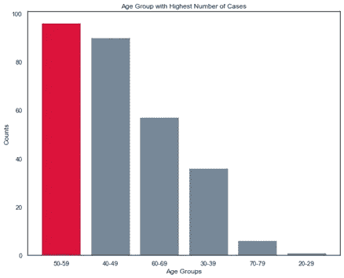

# Python 中不同的条形图

> 原文：<https://towardsdatascience.com/different-bar-charts-in-python-6d984b9c6b17?source=collection_archive---------7----------------------->

## 使用 python 库的条形图

作者图片

条形图用于测量跨类别的项目或监控随时间的变化。这些是最古老的图表之一，通过“条”来表示数据可视化。这些是最常见的表示数据的图表之一，信息丰富且易于理解。在本文中，使用 python 库制作了不同类型的条形图。对于这篇文章，https://archive.ics.uci.edu/ml/datasets/Breast+Cancer 图书馆的数据被用做“T0”。

为了对所有的分类变量有一个基本的了解，下面绘制了柱状图的支线图。为此，使用了 Seaborn 库[1]的 countplot 函数。为了更好地理解这一点，还使用二项式因变量给出了色调。在继续之前，需要导入以下 python 基本库。

导入库

下面的支线剧情是由上述代码绘制的。为此，使用 countplot 函数。这些是最常见的图，由色调给出的两种颜色代表二项式因变量。

作者图片

要创建类似的条形图，但填充是透明的，边缘带有颜色，可将 facecolor 选项设置为(0，0，0，0)并可获得下面的条形图。第一个 3 代表 RGB 颜色，而第四个是控制 alpha。采用 facecolor 选项(0，0，0.9，0.4)绘制的第二个图形。类似地，如果没有给定 alpha 值，那么条形的内部颜色将是黑色。

作者图片

此外，单条/多条的颜色也可以改变。除此之外，酒吧的宽度也可以通过宽度选项进行管理。代码如下。

作者图片

作者图片

可以通过两种条形图选项来比较不同的组或类别，即分组条形图和堆叠条形图。此外，归一化堆栈条形图也可以如下制作。

作者图片

作者图片

作者图片

也可以绘制水平条形图，代码非常简单，但为了绘制不同的图，制作了两个支线图，然后改变标记和它的颜色以获得不同的外观。在第二个图表中，使用了 hlines 选项。

作者图片

现在，人口金字塔或年龄-性别-金字塔非常普遍。这是一个很好的并排比较方法。为了更好地理解该图，制作了新数据。

作者图片

同样，以下情节作了进一步探讨。虽然这不是人口金字塔，但任何两个阶层都可以通过这个图进行比较。在该图中比较了大于 30 和小于 30 的肿瘤大小计数。

作者图片

**结论**

这里探讨了不同类型的条形图，即子图、分组条形图、堆积和标准化堆积条形图、水平条形图、人口金字塔图。根据客观要求，选择正确有效地表示数据的图形是非常必要的。此外，根据目标，这些图表还需要数据准备。下面的参考文献可以做进一步的探索。

所有的代码都是[这里](https://github.com/salonimishr/Different-Bar-Graphs/blob/main/Bar%20Charts.ipynb)。

感谢阅读！

参考资料:

1.  https://seaborn.pydata.org/generated/seaborn.barplot.html
2.  [https://matplotlib . org/stable/API/_ as _ gen/matplotlib . py plot . bar . html](https://matplotlib.org/stable/api/_as_gen/matplotlib.pyplot.bar.html)