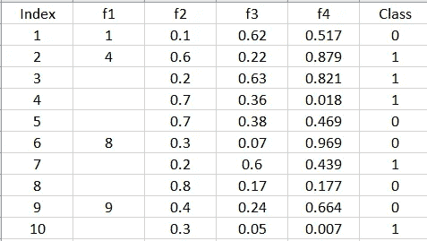
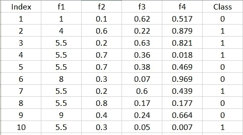
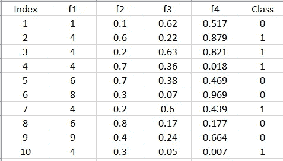
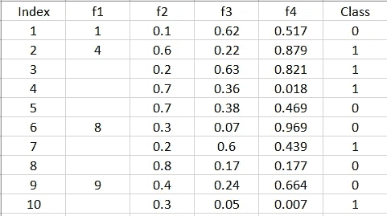
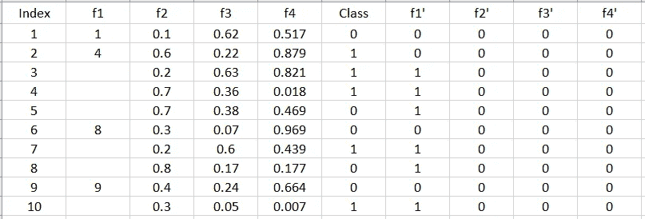

# 处理缺失数据的不同插补方法

> 原文：<https://towardsdatascience.com/different-imputation-methods-to-handle-missing-data-8dd5bce97583?source=collection_archive---------14----------------------->

## 处理数据集中缺失值的插补方法。

图片来自我的手机

# 目录:

1.  [简介](#7d84)
2.  [什么是归罪](#213e)？
3.  [正常插补](#a4cb)
4.  [基于类别标签的插补](#d85f)
5.  [基于模型的插补](#edf0)
6.  [创建缺失值特征](#d2a5)
7.  [结论](#618b)
8.  [参考文献](#8d74)

1.  **简介**

当我们试图分析和理解我们的数据时，我们经常会遇到缺失值。这在现实世界的数据中很常见。由于数据可能损坏或某些收集错误，将会有丢失的值。缺少值会导致偏差，并会影响模型执行的效率。怎么才能解决这个问题？

有许多方法可以处理丢失的数据。在这篇文章中，我将讨论其中的一些。

让我们以下面的数据为例，以供进一步参考。

*f1* 有缺失值

**2。什么是归罪？**

插补是用替代数据替换缺失值的过程。这是作为预处理步骤完成的。

**3。正常插补**

在我们的示例数据中，我们有一个带有缺失值的 *f1* 特征。根据特征 *f1 的数据类型，我们可以用以下方法替换缺失值。*

*   平均
*   中位数
*   方式

如果数据是数值型的，我们可以用均值和中值来代替，否则如果数据是分类型的，我们可以用众数，这是一个经常出现的值。

在我们的例子中，数据是数字，所以我们可以使用平均值。请注意，只有 4 个非空单元格，因此我们将只取 4 的平均值。

平均替换

**4。基于类别标签的插补**

这里，我们不采用特征中所有值的平均值、中值或众数，而是采用基于类的值。

取特征 *f1* 中属于类别 0 或 1 的所有值的平均值，并替换缺失值。中位数和众数也一样。

基于类别的插补

**5。基于模型的插补**

这是一种处理缺失数据的有趣方式。我们将 feature *f1* 作为类，将所有剩余的列作为特性。然后，我们用任何模型训练我们的数据，并预测缺失值。

训练数据

测试数据

这里，我们有特征 *f1* 中缺失值的训练数据和测试数据。让我们使用 K-最近邻算法，并且取 k=2 来训练我们的模型，因为它简单并且使用邻域概念。

缺失值将表示为 NaN，而不是数字。

**6。创建缺失值特征**

除了对特征进行插补，我们还可以创建新的相应特征，这些特征具有二进制值，表示特征中的数据是否缺失，0 表示不缺失，1 表示缺失。我们这样做是为了记录，缺失值也是有用信息的来源。

**7。结论**

在这篇文章中，我们讨论了不同的插补方法，我们可以使用这些方法来处理缺失数据。处理的方法有时可能是一般的/直观的，也可能取决于我们必须咨询领域专家才能继续进行的领域。

**8。参考文献**

[1]缺失值:[https://en.wikipedia.org/wiki/Missing_data](https://en.wikipedia.org/wiki/Missing_data)

[2]插补:[https://en . Wikipedia . org/wiki/attumption _(statistics)](https://en.wikipedia.org/wiki/Imputation_(statistics))