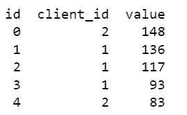
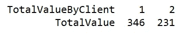
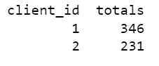

# SQL 中数据透视表的不同方法

> 原文：<https://towardsdatascience.com/different-methods-for-pivot-tables-in-sql-5b4e94214823?source=collection_archive---------3----------------------->

## 汇总数据的数据透视表和案例指南


[JESHOOTS.COM](https://unsplash.com/@jeshoots?utm_source=medium&utm_medium=referral)在 [Unsplash](https://unsplash.com?utm_source=medium&utm_medium=referral) 上拍照

数据专业人员经常查看事务性数据，并需要一个数据透视表来进行进一步分析。例如，银行专家可能需要审查每笔交易以确定某些账户如何结算，或者销售分析师可能需要审查单笔交易以确定某些产品的销售情况。

数据透视表是数据操作的一项基本技能，通常是更广泛分析的第一步。因为它非常基础，主要的工作表应用程序提供了[函数](https://support.microsoft.com/en-us/office/create-a-pivottable-to-analyze-worksheet-data-a9a84538-bfe9-40a9-a8e9-f99134456576)来创建[数据透视表](https://support.google.com/docs/answer/1272900?hl=en&co=GENIE.Platform%3DDesktop)，但是它们依赖于完整的数据集。

在许多大数据应用程序中，分析工作表中的数百万行是不可行的。虽然试图通过您最喜欢的[编程语言和它的库](https://pandas.pydata.org/pandas-docs/stable/reference/api/pandas.pivot_table.html)来处理这些数据可能会奏效，但是从一开始就不查询这么多数据会更有效。相反，可以在 SQL 的查询级别上创建数据透视表。

# 数据

为了演示如何创建数据透视表，将生成一个显示事务数据的简单数据集。

```
CREATE TABLE transactions(
    id INTEGER PRIMARY KEY,
    client_id INTEGER,
    value INTEGER
);
```

在这种情况下，事务表包含三个字段:每个事务的唯一 ID、与事务相关联的客户端的客户端 ID 以及事务的值。



示例数据

为了简洁起见，只生成了五行随机数据，但是实际的生产数据库可以轻松地容纳数十万行(如果不是数百万行的话)事务记录。

查询应该能够返回每个客户端 ID 的交易总值，而不是提取整个数据集。

# 枢纽功能

[PIVOT 函数](https://docs.microsoft.com/en-us/sql/t-sql/queries/from-using-pivot-and-unpivot?view=sql-server-ver15)是迄今为止创建数据透视表最直接的方法。从字面上看，它是为数据透视表设计的一个实用程序，语法应该易于理解。

```
SELECT *column* AS *column_alias*,
    *pivot_value1, pivot_value2,...pivot_value_n*
FROM 
*source* AS *source_alias*
PIVOT (
    SUM(*aggregate_column*)
    FOR *pivot_column*
    IN (*pivot_value1, pivot_value2, ... pivot_value_n*)
) AS *pivot_alias*;
```

查询从 SELECT 语句开始，其中的列*是数据透视表中第一个出现的列。下面的 *pivot_values* 是将要进行透视的值。FROM 指定查询的来源。*

然后，PIVOT 函数关闭查询。在其中，聚合函数(在本例中为 SUM)接受要聚合的列。FOR 子句指定它所透视的列，最后 IN 接受一个 *pivot_values* 的列表。

虽然上面的代码是抽象的，但下面提供了一个实际的例子:

```
SELECT 'TotalValue' AS TotalValueByClient,
    [1], [2]
FROM (
SELECT client_id, value FROM transactions
) AS Source
PIVOT (
    SUM(value)
    FOR client_id
    IN ([1], [2])
);
```

SELECT 子句指定第一列将被指定为“TotalValue ”,其标题为“TotalValueByClient ”,第一列将作为标签而不是实际的数据列。方括号中的下列数字表示要聚合的客户端 id。

FROM 子句不会源自表，而是源自子查询。在这种情况下，子查询非常简单地从 transactions 表中提取客户机 ID 和值。

PIVOT 函数开始采用接受值字段的 SUM 函数，因为将计算每个客户端的每个值的总和。接下来，FOR 子句指定将透视客户端 ID，IN 子句指定将计算哪些客户端 ID。



根据上述查询创建的数据透视表

虽然 PIVOT 操作符提供了一个很好的资源来快速、轻松地创建数据透视表，但它并没有被广泛实现。大多数在微软产品中使用，那些使用其他数据库解决方案的人需要依靠其他方法来达到类似的结果。

# CASE 函数

虽然其他数据库不使用 PIVOT 函数，但是可以在 SQL 查询中使用[条件来轻松地重构它，尤其是使用](/creating-conditional-statements-in-sql-queries-a25339c4f44d) [CASE 函数](https://www.w3schools.com/sql/sql_case.asp)。

```
SELECT *pivot*_*column*,
SUM(
    CASE 
        WHEN *pivot*_*column* = *pivot*_*value* THEN *aggregate_column*
        WHEN *pivot*_*column* = *pivot*_*value* THEN *aggregate_column*
        ELSE 0
    END
) AS *alias*
FROM *table*
GROUP BY *pivot*_*column;*
```

在 SELECT 子句中，聚合函数(在本例中为 SUM)封装了一个 case 条件。基本的 *pivot_column* 将在每个 WHEN 子句中保持不变，但是每个 *pivot_value* 必须与生成摘要的每个值相关联。最后， *aggregate_column* 表示具有将被求和的实际数值的列。

为了可读性，SUM 函数中添加了一个别名，而 FROM cause 指定了数据源，它可以是表或子查询。最后的 GROUP BY 子句通过将 *pivot_column* 值组合在一起来最终确定数据透视表。

```
SELECT client_id,
SUM(
    CASE 
        WHEN client_id = 1 THEN value
        WHEN client_id = 2 THEN value 
        ELSE 0
    END
) AS totals
FROM transactions
GROUP BY client_id
```

在这个特定的示例中，SELECT 子句接受客户机 ID 和 SUM 函数。CASE 语句列出了每个客户机 ID，实际上是告诉查询对于每个客户机 ID，取它们的总和。末尾的别名将这个新列命名为“totals”。最后，GROUP BY 子句将所有客户机 id 组合在一起。

当正确执行时，最终结果将返回一个数据透视表。



从上面的代码片段返回的数据透视表

在不牺牲太多可读性的情况下，使用 CASE 将创建一个有效的数据透视表，它将适用于几乎所有的 SQL 实现。值得注意的是，在这种情况下，与 PIVOT 函数相比，它会切换行和列。

# 结论

数据透视表是几乎每个数据专业人员的基本工具。虽然工作表和像 Pandas 这样的外部库可以创建它们，但是查询一个数据透视表需要更少的内存。Microsoft 产品提供 PIVOT 函数的目的是创建数据透视表，但是对于那些使用其他解决方案的人来说，巧妙使用条件和聚合函数可以产生相同的结果。