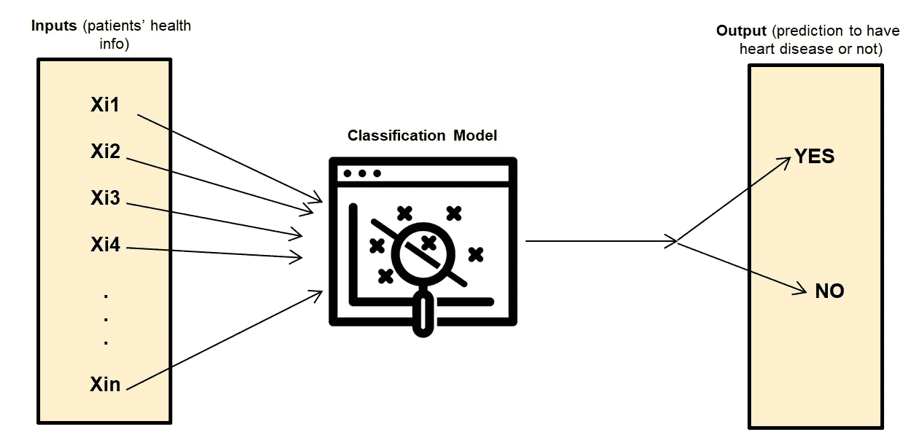
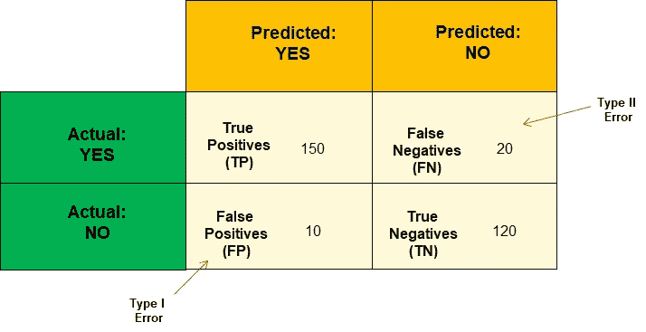
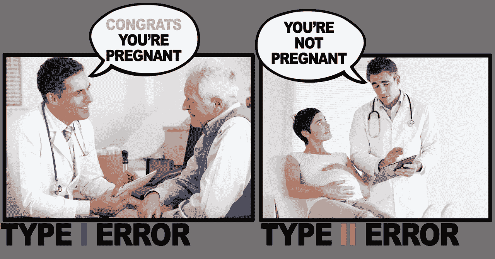
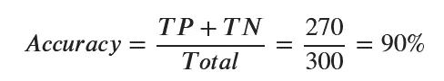
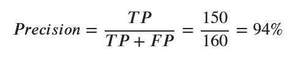
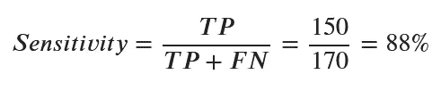
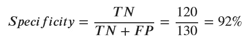
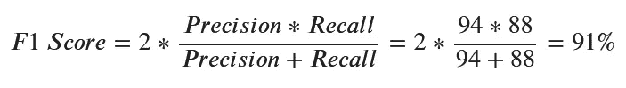
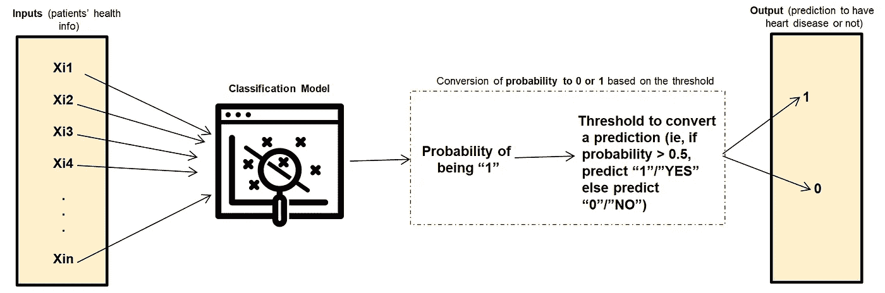
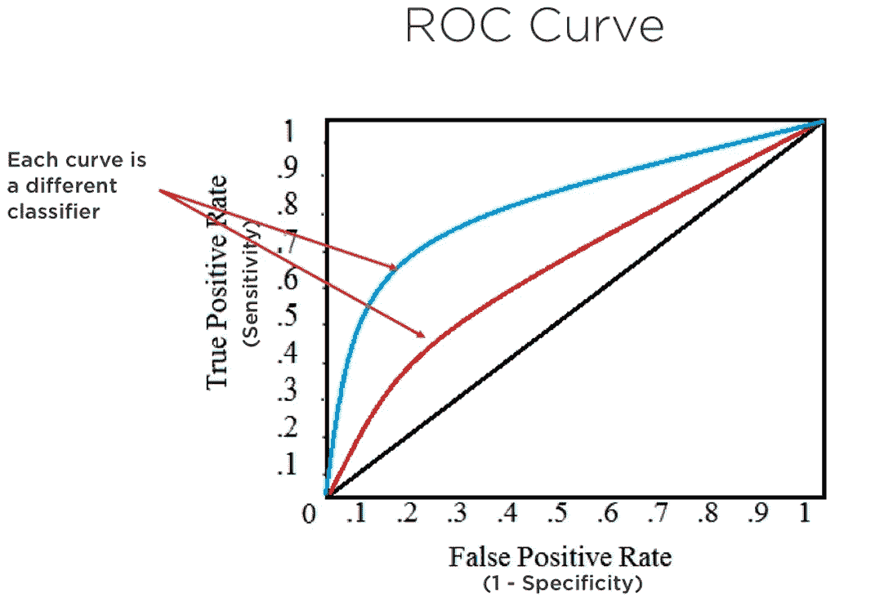

# 评估二元分类模型的不同度量和选择正确模型的一些策略

> 原文：<https://towardsdatascience.com/different-metrics-to-evaluate-binary-classification-models-and-some-strategies-to-choose-the-right-911ef72a107b?source=collection_archive---------25----------------------->

本文是一篇 ***综合概述*** 用于评估二进制分类模型的不同指标，以及为您的用例选择正确指标的一些策略。

照片由[弗勒](https://unsplash.com/@yer_a_wizard)在 [Unsplash](https://unsplash.com/s/photos/measure) 上拍摄

# 介绍

作为一名数据科学家，关键是不要在真空中建立机器学习模型，你必须始终提出正确的问题并验证假设，以便为你的模型选择正确的评估指标。但是，如何选择正确的指标呢？在本文中，我们将在讨论了二进制分类模型的不同评估指标之后，尝试回答这个问题。

**了解一些重要术语**

**讨论不同的评估技术**

**为您的模型选择正确指标的策略**

# **了解一些重要术语**

## 问题陈述

在开始概述指标之前，让我们先设置一个简单的例子来说明问题。让我们想象一下，你是一家旨在诊断病人的初创公司。你想看一看每个病人的健康信息，并确定相应的病人是否有心脏病。将有两种选择:

*   患者患有心脏病的情况，在这种情况下，他/她被标记为 1、是或真
*   患者没有心脏病的情况，在这种情况下，他/她被标记为 0、否、假

这种特殊的问题被称为二进制分类，您可以构建一个二进制分类器来执行它(如下所示)。

作者图片

让我们假设您已经在一些历史患者的数据集上训练了您的模型。现在，您希望对剩余的 300 名患者的数据进行模型评估，包括所有必需的输入及其相应的基础真值/标签。

让我们假设你要建立一个预测是或否的分类器；真或假，1 或 0。

该分类器可以在所有 300 名患者的数据上运行，计算每个人的预测，并最终将它们与实际情况进行比较。让我们假设模型预测:

*   150 的患者患有心脏病(是)，而实际上患有心脏病(是)，这被认为是真阳性
*   120 名患者没有心脏病(否)，并且实际上没有心脏病(否)，这被认为是真正的阴性
*   20 名患者没有心脏病(否)，但实际上患有心脏病(是)，这被认为是假阴性
*   10 的患者有心脏病(是)，但实际上没有心脏病(否)，这被认为是假阳性

## 混淆矩阵

所有这些预测结果都可以放入一个 2x2 的表格中，称为混淆矩阵。这个矩阵很好地总结了模型的正确和错误预测的数量。它还有助于计算模型的其他性能指标。

作者图片

在混淆矩阵中，数据集中的观察总数对应于 TP、FP、TN 和 FN 值的总和。

总观察值= TP + FP + TN + FN = 150 + 10 + 120 + 20 = 300

**I 型和 II 型错误** 混淆矩阵有时会有点混乱，尤其是在记忆 I 型和 II 型错误时，这两种错误在现实世界中可能会互换使用，分别指误报和漏报。我发现下面的图片是记忆它们的简单方法。

图片来自[美国医师执照考试](https://usmle-notes.tumblr.com/post/169937531088/type-1-vs-type-2-error) (USMLE)

# **讨论不同的评估技术**

从混淆矩阵中，我们可以生成不同的度量来评估模型的性能

## 准确(性)

该指标旨在回答以下问题:**“在模型做出的所有预测中，它的正确率是多少？”**。正确的预测对应真正的积极和真正的消极

## 精确

这是用来回答下面的问题:**“所有的是预测中，有多少是正确的？”**

重要的是，不要对模型的精度大于其准确性这一事实得出任何结论，因为这些指标完全不同，不具有可比性。

在这种情况下，模型做出了 160 个肯定的预测，其中 150 个是正确的。

## 回忆—敏感性

为了能够获得模型的敏感性，我们必须回答下面的问题:**“模型在预测实际的肯定事件方面有多好？”，**这可以看做是精度的翻转。

数据集包含 170 个“是”的观察值，模型正确预测了其中的 150 个。

## 回忆—特异性

这个指标非常类似于敏感度，可以通过这个问题的答案来计算:**“这个模型在预测实际 NO 事件方面有多好？”**。

在这种情况下，我们有 130 个 NO 观测值，模型正确预测了其中的 120 个。

## F1 分数

当数据集中存在类别不平衡时，有时会使用此指标，这意味着数据集中一个类别/标签的数量远远多于另一个类别/标签的数量(例如，250 个实际是，50 个实际否)。它对应于精确度和召回率的调和平均值。

## 中华民国的 AUC

更早的时候，模型的输出直接要么是零(假)，要么是一(真)。但是，许多分类模型(如逻辑回归)输出概率值，而不是 0 或 1。对于那些模型，基于一些阈值进行到 1 或 0 的最终转换。

例如，最终预测将是:

*   1 如果概率值高于阈值=0.5
*   否则为 0

作者图片

每个阈值的选择导致一个分类，从中我们可以导出相应的混淆矩阵。由于单个分类器可能有数千个阈值，这是否意味着我们必须为每个阈值建立一个混淆矩阵？既然如此，如何比较不同的量词呢？第一个问题的答案是否定的，这就是 ROC AUC 曲线的用处。

图片由[统计如何由作者](https://www.statisticshowto.com/c-statistic/)调整

我们可以把这条曲线的每一个点想象成有自己的混淆矩阵，它有自己的真阳性率和假阳性率值。因此，我们在遍历每个分类器的所有可能阈值后得到每条曲线。

因为真阳性率和假阳性率都在 0 和 1 之间，所以 AUC 也在 0 和 1 之间。然后，对于 AUC:

> 低于 0.5 的值表示模型非常差。
> 
> 值为 0.5 意味着该模型并不比随机机会更好地预测结果。
> 
> 值超过 0.7 表示模型良好。
> 
> 超过 0.8 的值表示强模型。
> 
> 值为 1 意味着模型完美地预测了那些将经历某种结果的群体成员和那些不会经历某种结果的群体成员。

从上面展示的这两个分类器，我们可以看到蓝色分类器下面的面积大于红色分类器的面积，因此，我们可以得出结论，蓝色分类器比红色分类器好。

# **为您的模型选择正确指标的策略**

您知道如何使用不同的度量来评估您的分类模型，但是您应该为您的用例选择哪一个呢？这个问题的答案并不明显，因为它取决于分类器运行的上下文。一旦在生产环境中使用这些模型，就会产生假阴性和假阳性的成本，因此在与对这些成本有一定专业知识的业务合作伙伴讨论后，权衡这些假阳性和假阴性的成本是很重要的。

## 选择准确性

这是在以下情况下使用的指标:

*   假阳性和假阴性的成本大致相当
*   真正的积极和真正的消极的好处大致相等

**例子** 一个被训练来**将一张图片分类为****大象与否的模型可能会用准确度来评估(假设没有类别不平衡)，因为在这种情况下，假阳性和假阴性的代价似乎差不多，假设我们只想知道我的 Instagram 个人资料中的哪些图片是大象。**

## **选择精度**

**这是在以下情况下使用的指标:**

*   **假阳性的代价比假阴性高得多**
*   **真正积极的好处比真正消极的好处多得多**

****示例** 一个经过训练的模型**将电子邮件分类为垃圾邮件或非垃圾邮件**。在这种情况下，误报会将相应的电子邮件移动到垃圾文件夹中，用户可能不会再看到，或者可能很晚才看到。另一方面，假阴性会将垃圾邮件留在收件箱中，这可能会使收件箱有点拥挤，需要一些手动任务来删除垃圾邮件，但**至少任何重要的消息都会被错过**。**

## **选择召回**

**使用灵敏度和特异性的目的是使假阴性和假阳性的数量尽可能低，因为我们可能希望增加模型的灵敏度。召回是在以下情况下使用的指标:**

*   **假阴性的代价比假阳性高得多**
*   **真正的负面影响的成本比真正的正面影响要高得多**

****例** 在一个被训练用来识别患者是否患有心脏病的模型的情况下，假阴性可能代价非常高，因为它可能会延误患者的治疗，甚至可能导致死亡，因为快速识别疾病可能有助于更好的治疗。另一方面，假阳性可能只会导致额外的测试，这可能在经济上是昂贵的，但不像一个人的生命那样昂贵。**

# **结论**

**我希望您喜欢这篇文章。如果您有任何问题或意见，我将很高兴欢迎他们进行进一步的讨论。**

**如果你喜欢阅读我的故事，并希望支持我的写作，可以考虑成为一名灵媒。每月支付 5 美元，你就可以无限制地阅读媒体上的故事。**

**请随时关注我的社交网络。讨论人工智能、人工智能、数据科学、自然语言处理和人工智能是一种乐趣！**