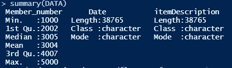

# 计算 R 中唯一值的不同方法

> 原文：<https://towardsdatascience.com/different-ways-to-count-unique-values-in-r-ec9fe521f4d5?source=collection_archive---------7----------------------->

## r 通过各种方法使困难的问题变得更容易，尽管有时它也会使简单的问题变得复杂。这里有一个简单的例子来说明


由[马尔辛·西蒙尼德斯](https://unsplash.com/@cinusek?utm_source=medium&utm_medium=referral)在 [Unsplash](https://unsplash.com?utm_source=medium&utm_medium=referral) 上拍摄的照片

# 介绍

我最初是 Python 用户。我在日常工作中使用 Python 来探索、可视化和分析数据。然而，目前，由于我正在攻读统计学硕士学位，所以需要学习 R。由于 R 是一个开源程序，由不同的开发人员和统计人员提供了大约 10，000 个库和软件包，因此它缺乏针对特定问题开发算法的一致性。因此，起初，我发现很难熟悉 R 语法及其解决各种问题的方法。在本文中，我将向您展示一个简单的例子，说明 R 中不同的库是如何聚合值的

# 安装软件包

我们将需要几个包，其中包括 ***dplyr*** 和 ***data.table.***

```
#Installing Packagesinstall.packages("dplyr")
install.packages("data.table")#Loading Packages
library('dplyr')
library("data.table")
```

# 资料组

我将使用从 Kaggle 下载的杂货店数据集。作为参考，您可以从以下链接下载数据:

<https://www.kaggle.com/heeraldedhia/groceries-dataset>  

让我展示一些数据信息。


图 1:数据表概述



图 2:数据描述

我将把数据表的日期转换成新的格式 YYYY-MM，并将日期格式的新列存储为 ***month_year***

```
DF1 <- DATA 
DF1$month_year <- format(as.Date(DF1$Date, format = "%d-%m-%Y"), "%Y-%m")
```

# 按组计算单个变量

## 计算每个月-年中唯一客户的数量

这个计算有几种解决方案，我将向大家展示一些。

1.  **使用基数 R 的 aggregate()函数计算唯一值**

```
group_by_month <-
aggregate(x = DF1$Member_number,          # Specify data column
          by = list(DF1$month_year),      # Specify group indicator
          FUN = function(x) length(unique(x))) #Desired function
```

**或**

```
group_by_month1 <- 
aggregate(Member_number ~ month_year, #Data column group by period
          data = DF1, 
          FUN = function(x) length(unique(x)))
```

**2** 。**使用 group_by()计算唯一值&总结 dplyr 包的函数**

```
group_by_month_2 <- 
DF1 %>%                             #Applying group_by &summarise
group_by(month_year) %>%
summarise(unique_customer = n_distinct(Member_number))
```

**3。使用 length() & unique()函数& data.table 包**计算唯一值

```
group_by_month_3 <- 
data.table(DF1)[ , .(unique_cus = length(unique(Member_number))), 
by = month_year]
```

3 种不同方式的结果与下图中前 5 行的结果相同:


图 3:不同时期的不同客户

# 按组计算多个变量

## 计算每个月-年商店的条目数、独特顾客数和购买的独特产品数

1.  **使用 group_by() &总结 dplyr 包的功能**

```
group_by_month_2a <- 
DF1%>%
group_by(month_year) %>%
summarise(unique_customer = n_distinct(Member_number),
          number_of_entries = n(),
          unique_product = n_distinct(itemDescription))
```

**2。使用 length() & unique()函数&包 data . table**

```
group_by_month_3a <-
data.table(DF1)[,  list(unique_customer = n_distinct(Member_number),
number_of_entries = .N,unique_product = n_distinct(itemDescription)), by=month_year]
```

最终，两者都会产生相同的结果:


图 4:生成结果的前 5 行

# 结论

由于支持许多不同的包，R 为用户开发不同的算法和模块来解决问题提供了优势。r 通过各种方法使困难的问题变得更容易，尽管有时它也会使简单的问题变得复杂。作为一个 R 初学者，我发现这些不同的包和语法很难掌握。

尽管有这种困惑，我仍将努力学习 R，因为它是一种有效的统计工具，当然它将有利于我在:D 研究生院的成绩