# 不同方式过滤熊猫数据帧

> 原文：<https://towardsdatascience.com/different-ways-to-filter-pandas-dataframe-1899eb6d4be8?source=collection_archive---------16----------------------->


吉姆·卡利加斯在 [Unsplash](https://unsplash.com?utm_source=medium&utm_medium=referral) 上的照片

# 介绍

子集选择是数据操作中最常执行的步骤之一。到目前为止，Pandas 提供了许多不同的方法来过滤您的数据帧，以获得您选择的数据子集。在本文中，我将向您展示一些我在操作数据时遇到最多的案例。

在讨论细节之前，我将首先创建一个示例数据框架。

```
#Create a simple dataframedf = pd.DataFrame({
    'name' :     [ 'Chi', 'Alex', 'Sam', 'Hoang', 'Linh', 'Dung', 'Anh'],
    'function' : [ 'Marketing', 'Tech', 'Tech', 'Finance', 'Finance', 'Marketing', 'HR'],
    'address' :  [ 'Hanoi', 'Saigon', 'Hanoi', 'Saigon', 'Hanoi', 'Hanoi', 'Saigon'],
    'gender' :   ['F', 'M', 'F', 'M', 'M', 'M', 'F'],
    'favourite_fruit' : [ 'apple', 'banana', 'orange', 'watermelon', 'grape', np.NAN, 'kumquat'],
    'age' : [20,25,21,26,30,31,23]
})
```

下面是我的 ***df*** 数据帧的概述:

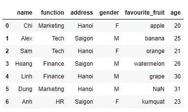

图 1:我的示例数据框架

# 基于多个条件选择行

有几种方法可以根据某些特定条件选择行的范围。

```
#Using dataframe method
df[(df.age >=25) & (df.address == 'Hanoi')] #Using query function
df.query('age >= 25 & address == "Hanoi"') #Using loc function
df.loc[(df.age >= 25) & (df.address == 'Hanoi')] 
```

所有这些方法产生相同的结果如下:

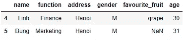

图 2:结果

# **使用 loc，iloc** 选择一系列行

在本节中，我们将了解使用 loc 和 iloc 过滤数据帧的几种方法。

## 使用 loc 选择一系列行

```
df.loc[0:3] 
```

**输出:**

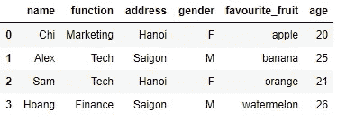

图 3:使用 loc 选择行的范围

## 使用 iloc 选择一系列行

```
df.iloc[0:3]
```

**输出:**

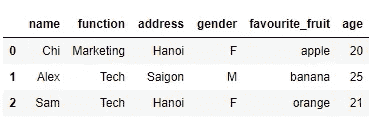

图 4:使用 iloc 选择行的范围

## 为什么 df.loc[0:3]返回 4 行，而 df.iloc[0:3]只返回 3 行？

如您所见，使用 loc 和 iloc 的结果是不同的。这种差异的原因是由于:

*   loc 不基于索引位置返回输出，而是基于索引的标签。
*   iloc 根据索引中的位置选择行。这也意味着 iloc 只能处理整数。

更多参考可以参考下面的例子。在本例中，我将对列**‘name’**设置索引，这样您可以更清楚地理解用法和我的解释。

```
df4 = df.copy()
df4.set_index('name', inplace = True) 
```

**输出:**

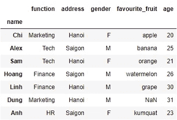

图 5:将索引设置为“name”列

现在，让我们再次尝试上面的例子，看看 loc 是如何处理索引标签的。

```
index = ['Chi', 'Sam', 'Hoang']
df4.loc[index] 
```

**输出:**

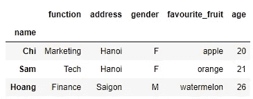

图 6:输出

# 选择带条件的必需列

如果有数百列，而您只想选择其中的几列，您可以在 loc 语句中的条件后添加一个列列表。

在下面的例子中，我将尝试获取年龄≥ 25 岁的人的 ***【姓名】******【性别】*** 和 ***【地址】*** 【地址】。

```
df.loc[(df.age >=25), ['name','gender','address']] 
```

**输出:**

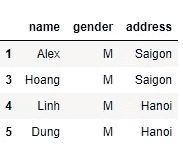

图 7:输出

# 同时选择行和列

## 使用 loc，iloc 选择所有行和一些特定列

```
#Using iloc
df4.iloc[:,[1,2,3]]#Using loc and column names
df4.loc[:, ['address','gender','favourite_fruit']]
```

**输出**:

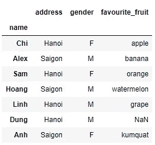

图 df4 的所有行和第 2、第 3、第 4 列

## 使用 loc，iloc 选择一系列特定的行和列

```
#Using iloc
df4.iloc[2:6,3:4]#Using loc
df4.loc['Sam':'Dung',['favourite_fruit']]
```

**输出:**

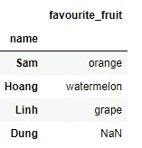

图 9:输出

## **使用 loc，iloc** 选择不连续的行和列

```
#Using iloc
df4.iloc[[1,3],[2,4]]#Using loc
df4.loc[['Alex','Hoang'],['gender','age']]
```

**输出:**

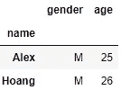

图 10:输出

## 使用 get.loc 和 index 方法选择行和列

```
column_start = df4.columns.get_loc('address')
column_end = df4.columns.get_loc('favourite_fruit')
df4.iloc[1:4,column_start:column_end] 
```

您也可以使用执行类似的任务。锁定方法。这两个操作产生相同的结果。

```
row_start = df4.index[1]
row_end = df4.index[3]
df4.loc[row_start:row_end, 'address':'gender']
```

**输出:**

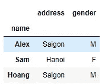

图 11:使用 get.loc 和索引方法

# 选择数据框架中的单个元素

选择数据集中的单个元素有几种方法，包括 ***loc*** ， ***iloc*** ， ***iat*** 和 ***at*** 方法。

看看 ***df4*** 的数据，找出 Hoang 最喜欢的水果是什么？

```
row_position = df4.index.get_loc('Hoang')column_position = df4.columns.get_loc('favourite_fruit')#Using iloc
df4.iloc[row_position,column_position]#Using iat
df4.iat[row_position,column_position]#Using loc
df4.loc['Hoang','favourite_fruit'] #Using at
df4.at['Hoang','favourite_fruit'] 
```

基本上，以上 4 种方式检索到的是同一个输出，即**‘西瓜’**。但是，这些方法的运行速度略有不同。因此，****IAT***方法比 ***loc*** 和 ***iloc*** 方法要快一点。您可以看看下面的图 12 以获得更多参考。*

*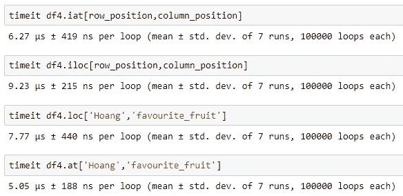*

*图 12:不同方法的速度*

# *结论*

*以上是我在做数据过滤时的一些小技巧。虽然它很简单，但我希望它能成为您未来工作的有用参考来源。*