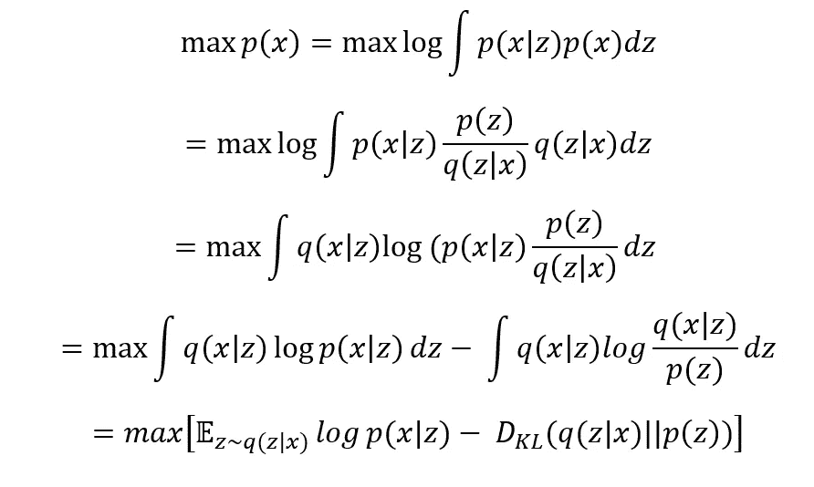

# 可微发电机网络:导论

> 原文：<https://towardsdatascience.com/differentiable-generator-networks-an-introduction-5a9650a24823?source=collection_archive---------21----------------------->

## 深度学习基础

## VAEs、gan 及其挑战介绍

图片来自[https://thispersondoesnotexist.com/](https://thispersondoesnotexist.com/)(开源)

# 介绍

训练生成模型比训练分类器或回归器要困难得多。当在监督学习问题中训练分类器时，我们知道训练示例的输入和输出之间的最佳映射。然而，训练生成模型涉及优化标准，这是棘手的。

在本文中，我将介绍生成模型的基础知识，以及两个核心可微分生成网络的功能。这些是变分自动编码器(VAEs)和生成敌对网络(GANs)。

# 生成模型

在进入可微分的发电机网络之前，我们可以回顾一下生成模型。

生成模型的最终目标是生成与训练数据尽可能相似的合成数据。总之，**这都是关于在我们的训练数据 p(x)** 上建模一个概率密度函数。给定一组训练数据，生成模型试图构建一个函数，该函数允许我们确定任何数据点属于训练集的可能性有多大。这种密度允许生成模型做有趣的事情，比如评估新生成的数据点 p(x|y=y)的概率，或者从密度中采样以生成新数据。

# 生成模型:GMM

高斯混合模型是一种非常简单的生成方法。GMM 通过期望最大化来学习，通过迭代地评估对数似然来最大化模型的性能。在以后的文章中，我将更详细地介绍他们的学习。

GMM 假设数据的分布由一组高斯分布组成。他们通过在训练数据上拟合 K 个高斯 pdf 来近似训练数据空间，有点像 k-mean 聚类，但是在每个聚类上拟合高斯分布，而不是识别类成员。通过一组高斯分布来近似训练数据空间，我们获得了以下优点:

*   您可以将新样本的概率表示为 K 个高斯分布的加权和
*   您可以对分布进行采样，以生成属于每个分类的数据

生成模型的全部要点是在我们的训练数据空间 *p(x)* 上构建我们的密度函数。GMM 是通过一组高斯密度来近似这个潜在空间的。通过一组高斯近似潜在空间是有利的，因为它允许我们评估该空间中的任何新样本，我们可以用它来了解新数据样本是否很好地符合我们现有的数据。此外，通过具有完全定义的潜在空间，可以对每个聚类进行采样，生成新的合成数据。

# 可微分发电机网络

当生成发电机网络时，我们想要可微分的模型，**学习潜在变量 Z** (来自随机分布)**到我们的数据分布 X.** 之间的映射

可微分生成器网络假设每个样本携带的信息可以在比数据空间更简单的空间中表示。即使数据生活在高维空间(比如高分辨率图像)，图像中的信息也可以用更简单的流形来表达。假设我们有手写数字的图片，即使训练数据存在于高维空间中(图像可能是 32×32 像素),每个图像背后的潜在信息也要小得多。所有可能的手写数字的空间比所有可能的 32×32 像素图像小得多。

生成模型在潜在变量 Z 上构建低维潜在空间，然后使用它来近似训练数据空间。有两种主要的方法**来利用这个潜在空间产生新的数据:**

*   将潜在变量 Z 转换成新样本 X(来自 p(x)的近似样本)
*   将 Z 转换为 X 上的分布(生成一个函数来逼近 p(x ),然后从中采样)

因此，生成模型要么生成新样本(从 Z 生成 X)，要么生成分布，其中该子空间中的所有样本都代表训练数据(从 Z 生成 X 上的分布)。

根据您使用的创成式模型，模型将以上述两种方式之一生成数据。在本文接下来的部分中，我将讨论具体的模型架构，以及如何使用这些架构来生成合成数据。

# 可变自动编码器

## 优化阀门

GMM 和 VAEs 都试图在训练数据 X 上建立一个分布，然后可以对其进行采样以生成新数据(从 Z 生成 X 上的分布)。然而，vae 并不在我们的训练数据 X 上构建直接的 PDF，相反，它们利用前面陈述的假设，并且学习我们的潜在变量 Z 和我们的训练数据 X(其中 Z 中的潜在空间比我们的数据 X 的空间简单得多)上的分布之间的映射。

在 VAEs 中，我们选择一个非常简单的潜在变量 Z 的分布(通常是正态分布),形式为 N(0，I)。通过这样做，VAEs 假设数据的变化是高斯型的。以前面的手写数字为例，如果您想到所有可能的手写“3”，所有可能的手写“3”之间的变化将大致为高斯型。实际上，这通常是一个很好的假设，因为传感器数据中的噪声通常是高斯噪声。

我们希望找到数据的分布 *p(x)* 来最大化训练数据的概率。根据概率乘积和求和规则，我们可以将 *p(x)* 表示如下:

其中 *p(x|z，θ)* 是后验概率(给定我们的潜在样本 Z 和我们的模型参数θ的情况下，我们的训练数据 X 的概率)，而 *p(z)* 是先验分布，我们假设该先验分布是具有零均值和恒等协方差矩阵的高斯分布。

目标是找到最大化该概率的一组权重θ，最大化 *p(x)* 给出:

由此产生的表达式称为 ELBO(证据下限),理解其术语非常重要。

第一项是给定我们的潜在变量(我们希望最大化这个变量)时，我们的数据的概率的期望值。这告诉我们，在给定 z 的情况下，模型是否正在产生 X 的良好样本。当假设后验概率为高斯时，最大化此项实际上相当于最小化自动编码器的均方误差。

第二项是后验概率和先验概率之间的 Kullback-Leibler 散度。最小化这一项本质上是试图使我们的后验概率尽可能接近均值为零且 sigma 为 1 的高斯分布。同样，我们假设数据中的变化是高斯型的，因此我们试图迫使后验概率朝着这个形状，同时仍然试图产生代表我们训练数据的良好样本。

## VAEs 架构

作者图片

VAEs 的结构分为两部分，编码器和解码器。编码器将输入数据的维度降低到二维。这些维度用于参数化我们的潜在空间 p(z)的正态分布。然后，可以对该分布进行采样，这些样本被用作解码器的输入。解码器试图重建训练数据空间中对应于潜在空间中的样本的数据点。

因此，VAEs 将输入数据映射到 z 上的一个潜在空间。然后，解码器将该潜在空间映射回 x 上的图像空间。对潜在分布 *p(z)* 进行采样，并将输入通过解码器基本上允许我们从 *p(x)进行采样。这是我们的目标！*

当训练 VAEs 时，由于这些自始至终都是可微分的函数，通过使用上面定义的 ELBO 损失函数，可以像任何其他神经网络结构一样，通过反向传播和您喜欢的优化器来更新网络的权重。

# 生成对抗网络

## 甘斯理论

到目前为止，我们已经看到 VAEs 能够从潜在分布 *p(z)* 生成训练数据 *p(x)* 的分布。gan 生成数据的方式不同。他们不是生成分布，而是生成可能属于该分布的样本。

作者图片

GANs 由一个发生器和一个鉴别器组成。这是两个可微分的函数，一起作为一个大模型工作。这两种模式是对立的，每一种模式都想实现与另一种模式相反的目标，它们本质上是竞争的。生成器获取随机变量 Z，并将其映射到我们的数据空间 x 中的生成样本。鉴别器从训练数据和生成器生成的图像中获取图像，并尝试分类哪些图像属于训练集，哪些图像是假的。**生成器的目标是骗过鉴别器，鉴别器的目标是正确识别生成的图像。**

如您所见，这种生成图像的方式与 VAEs 生成图像的方式有着根本的不同。我们并没有产生一个密度函数 *p(x)* ，而是产生了类似于 *p(x)* 的样本。

这两个函数都是可微的，因此可以一起优化。它们像任何其他神经网络一样通过反向传播进行训练。我不会在这篇文章中讨论它们的损失函数，但也许在以后的文章中会讨论。

## 然而，gan 有一些问题:

图片来自[https://thispersondoesnotexist.com/](https://thispersondoesnotexist.com/)(开源)

众所周知，GANs 倾向于不稳定的训练，导致输出没有意义。看上面的图片，这些人是不存在的，是从 GANs 生成的样本。正如你所看到的，虽然这个模型很接近真实的人脸，但我相信你可以找出每张图片的一些问题。

GANs 很难训练，因为有四个主要障碍

*   你的 GAN 可能永远不会收敛到最优解。这是因为鉴别器和发生器之间的梯度可能具有相反的符号，因此您的参数可能会卡在鞍点。
*   没有什么可以阻止生成网络学习单一类型的数据。例如，如果生成动物的图片，模型可以学习只生成狗的图片而不生成其他的。
*   因为 GANs 生成样本，而不是生成分布，然后从中采样，我们失去了 Z 和 x 之间的平滑映射。这可能使 GANs 在某些情况下不如 VAEs 有用。
*   没有什么可以阻止生成器学习复制训练数据。

深度卷积 gan(dcgan)通过提出以下建议解决了其中一些问题:

*   人们不应该使用池层，发现这些层的性能比在生成器中使用步进卷积层更差。
*   卷积图层后使用批量归一化。
*   避免使用过多的密集层，而是使用更多的卷积层，使模型更深入。
*   发生器中应使用 ReLu 激活功能，鉴别器中应使用 LeakyReLu。

DCGANs 的论文是在一系列实验后得出这些结论的。自 1980 年以来，DCGANs 一直被广泛用于在各种领域生成数据。

# 结论

生成模型极难训练，因为训练中涉及的映射是难以处理的。生成模型要么学习生成新的数据样本，要么学习生成训练数据的分布。在本文中，我将介绍 VAEs(生成发行版)和 gan(生成数据样本)。我概述了这些是如何工作的，以及这些是如何产生数据的根本不同的方法。理解这一点将使您在选择应用哪个模型时做出更好的决定。

## 支持我

希望这对你有所帮助，如果你喜欢，你可以 [**关注我！**](https://medium.com/@diegounzuetaruedas)

你也可以通过我的推荐链接成为**的媒体会员**，访问我所有的文章以及更多:[https://diegounzuetaruedas.medium.com/membership](https://diegounzuetaruedas.medium.com/membership)

## 你可能喜欢的其他文章

[VAEs:从潜像分布中间接取样](/these-are-not-real-clothes-af58154a98c2)

[内核方法:简单介绍](/kernel-methods-a-simple-introduction-4a26dcbe4ebd)

[卡尔曼滤波:简单介绍](/kalman-filtering-a-simple-introduction-df9a84307add)