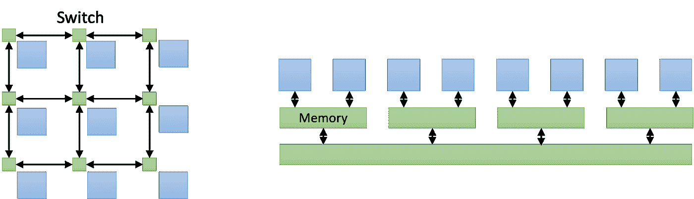
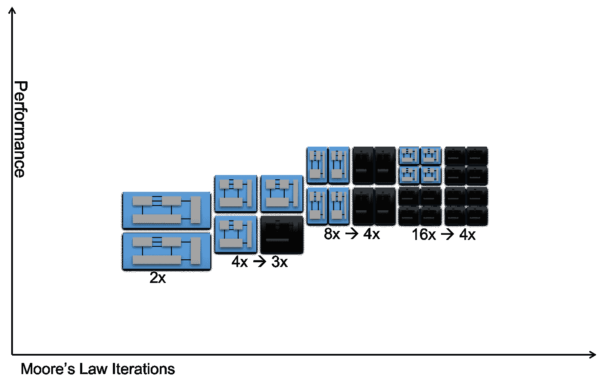
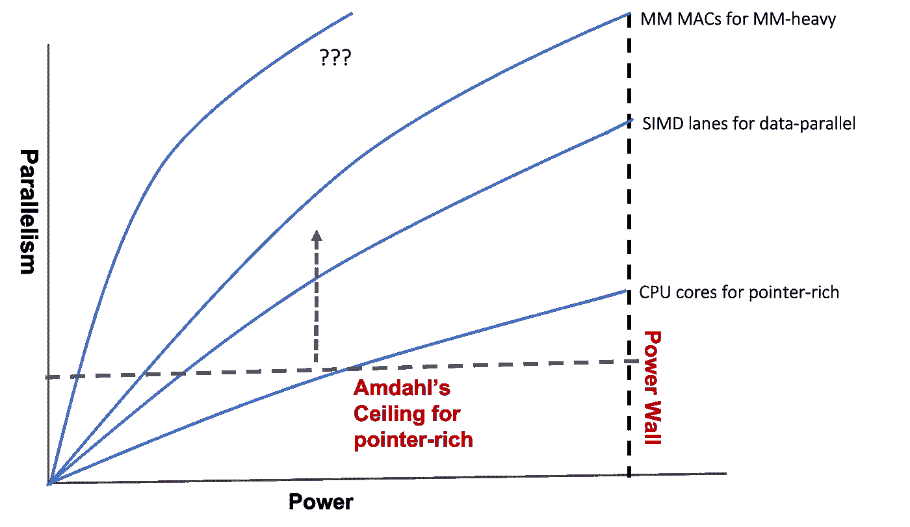
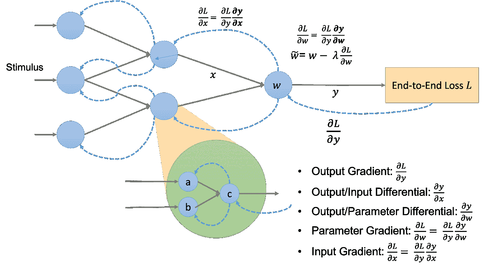
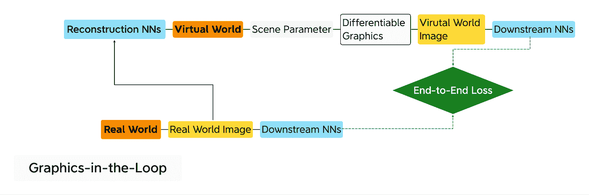
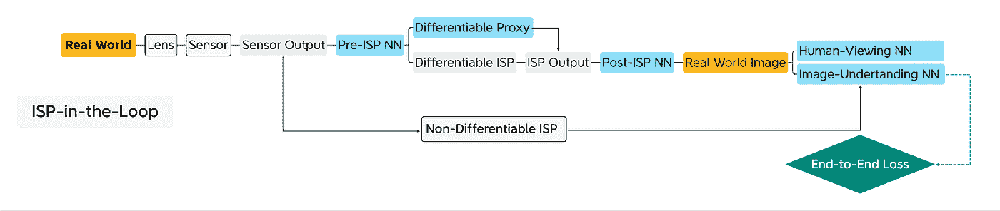

# 可区分硬件

> 原文：<https://towardsdatascience.com/differentiable-hardware-9bb03aad4563?source=collection_archive---------17----------------------->

保罗·范·科特姆在 [Unsplash](https://unsplash.com/?utm_source=unsplash&utm_medium=referral&utm_content=creditCopyText) 上的照片

## [业内笔记](https://towardsdatascience.com/tagged/notes-from-industry)

## 人工智能如何帮助恢复摩尔定律的良性循环

在[全球芯片短缺](https://www.techrepublic.com/article/the-global-chip-shortage-what-caused-it-how-long-will-it-last/)之后，据报道 TSMC[提高了芯片价格](https://www.wsj.com/articles/worlds-largest-chip-maker-to-raise-prices-threatening-costlier-electronics-11629978308?mod=djemalertNEWS)和[推迟了 3 纳米工艺](https://www.digitimes.com/news/a20201231VL200.html)。不管它是否准确或预示着一种长期趋势，这种消息应该提醒我们注意摩尔定律衰落的日益恶化的影响，并迫使我们重新思考人工智能硬件。人工智能硬件会受到这种衰退的影响，或者帮助扭转这种局面吗？

假设我们想恢复摩尔定律的良性循环，即软件和硬件相互推动，让现代智能手机比过去十年占据仓库的超级计算机更强大。普遍接受的后摩尔良性循环是不可持续的，即更大的数据导致更大的模型需要更强大的机器。除非我们重新定义并行性，否则我们不能再指望缩小晶体管来构建越来越宽的并行处理器。我们也不能依赖特定领域架构(DSA ),除非它促进并适应软件的进步。

我们不是要弄清楚哪个硬件是为 AI 这个前进的移动目标准备的，而是从 AI 的核心是可区分编程的角度来看待 AI 硬件。在这里，人工智能软件程序是一个计算图，由一起训练的计算节点组成，以实现端到端的目标。只要是可微分的，深度流水线 DSA 硬件可以作为计算节点。软件程序员可以自由地将可区分的硬件插入到计算图中，以获得高性能和创造性的问题解决方案，就像一个预先构建的可定制软件组件一样。人工智能硬件不再有“纯度”检查，现在可以包括可区分的硬件。

> 人工智能硬件不再有“纯度”检查，现在可以包括可区分的硬件。

希望软件和硬件将再次通过良性循环并行前进，就像摩尔定律如火如荼时一样。

# 人工智能硬件架构师的苦恼

在人工智能市场的众多 GPU 竞争者中，特斯拉推出了 Dojo 超级计算机。Dojo 似乎是联网、集成和可伸缩性方面的杰作。另一方面，D1 芯片，Dojo 的构建块，很难说是架构上的突破。我们可以将 GPU 竞争者分为两个阵营，众核和众 MAC。作为众核阵营的代表，D1 是由许多 CPU 内核组成的“网格”。另一方面，Tesla FSD 或 Google TPU 是多 MAC 阵营的缩影，拥有少量大型 MM 加速器，每个加速器都在“网格”中打包了许多乘法累加(MAC)单元正如我们所见，人工智能架构的争论是在网格和 GPU 之间进行的。

在制造芯片所需的巨大努力的压力下，人工智能硬件架构师必须紧张地跟踪媒体关于基准测试和会议的报道。旨在取代 GPU 的人工智能硬件经常难以运行基准测试和最新的神经网络模型，讽刺的是，在“老式”GPU 上运行得很好。如下图所示，众核和 GPU 在交换数据上有本质区别。前者通过互连网格传递数据，而后者通过内存层次结构共享数据。这个区别和 AI 关系不大。众核处理器，如 D1 芯片，最终是否会超过 GPU 还有待观察。我稍后将介绍许多 MAC。

比较众核(左)和 GPU(右)中的数据交换。(图片由作者提供)

现在，让我们快速回顾一下高性能计算(HPC)中网格和 GPU 的共同根源。

# HPC 的遗产

HPC 用于解决计算密集型军事研究问题、科学发现、石油和天然气勘探等。超级计算机，简称为 Super，已经成为 HPC 的关键硬件解决方案。与处理指针丰富的数据结构(如树和链表)的通用程序相比，HPC 程序主要花时间在“循环”中重复数据并行计算。

## 向量超级的兴衰

从 20 世纪 70 年代到 90 年代，旨在通过展开向量中的数据并行循环来加速 HPC 程序的 Vector Super 主导了 HPC 市场。在那段时间里，一台超级计算机被默认为矢量超级计算机。

在 20 世纪 90 年代，当摩尔定律完全生效时，通过将许多现成的 CPU 排列成网状或某种类似的拓扑结构来构建超级计算机变得可行。这种趋势催生了分布式超级，HPC 社区怀疑地称之为[黑仔微处理器](https://www.nytimes.com/1991/05/06/business/the-attack-of-the-killer-micros.html)的攻击，这里的“微”指的是微处理器。这种观点源于微处理器是片上 CPU，而“CPU”通常是由分立元件组成的系统。最终，分布式超级计算机取代了矢量超级计算机，成为今天超级计算机的同义词。

## GPGPU 中向量超的回归

在 21 世纪初，摩尔定律显示出老化的迹象，这停止了对 CPU 时钟速度的争夺，CPU 时钟速度是单芯片计算性能的主要来源。业界的反应是在一个芯片上放置多个 CPU 内核，期望并行性成为新的主要性能来源。这一趋势导致了双核、四核，并最终导致了众核，实际上是分布式超级单芯片，通常将 CPU 内核排列成网状。众核的例子包括英特尔两次试图应对 GPU 的失败，Larrabee 用于 3D 市场，Larrabee 的后代 [Xeon Phi](https://en.wikipedia.org/wiki/Xeon_Phi) 系列用于 HPC。

传统上，GPU 会在顶点、三角形和像素等图形实体上展开“循环”。GPU 架构师将这种能力扩展到了 HPC 应用中的循环，使 GPU 成为有效的矢量超级芯片。然后他们将 GPU 在 HPC 中的用法命名为通用 GPU (GPGPU)。致命的是，当 Vector Super 在 HPC 市场上让位于分布式 Super 时，它化身为 GPU 来报复它的对手。我们可以看到 GPU 在顶级超级计算机中的商业成功，如橡树岭国家实验室的[泰坦超级计算机](https://www.olcf.ornl.gov/olcf-resources/compute-systems/titan/)和瑞士国家超级计算中心的[Piz Daint](https://www.cscs.ch/computers/piz-daint/)。

## 简单地

*   分布式超级计算将 Vector 踢出了 HPC 市场。
*   众核是分布式超级芯片，GPU 是面向高性能计算的矢量超级芯片。

# 矩阵乘法和人工智能

网格，计算机架构中的旧锤子，如何被重新命名和改造为人工智能的新钉子？

## MM 和 HPC

计算机体系结构中一个永恒的规则是，移动数据比计算数据更昂贵，这使得计算机体系结构必须对更少的数据进行更多的计算。幸运的是，HPC 社区从几十年的实践中了解到，他们可以用 MM 来表达大多数 HPC 问题，MM 具有很高的计算与通信比率，粗略地说， *N* MAC 对 2 *N* 数据进行运算。如果实现得当，使用 MM 解决问题可以通过隐藏数据传输来实现高性能。所以一个 HPC 程序员只需要有一个超级计算机厂商提供的健全的 MM 库就可以了。当计算一个毫米时，今天的分布式超级可以充分利用分布在几十万平方英尺上的几十万个节点，有效地保持每个节点忙于计算。

## MM 在 AI 的崛起

使用神经网络的机器学习(ML)是现代人工智能的特征。一个神经网络模型由多层最大似然核组成。在卷积神经网络(CNN)之前，最流行的神经网络(NN)是多层感知器(MLP)。MLP 的基本 ML 内核是矩阵向量乘法(MVM ),它对 *N* 个数据进行大约 *N* 个 MAC 运算，几乎不重用数据。另一方面，当前 CNN 的主要原语是张量卷积(TC)。正如我在文章《[所有张量都暗暗希望自己是](/all-tensors-secretly-wish-to-be-themselves-1ccc836df41c?source=friends_link&sk=1cd76e37df5602892a5f25268a37a15f)中解释的那样，“MM 和 TC 在数据移动和共享方面是结构等价的，所以我们经常互换使用张量和矩阵。

使用 MM 作为原语带来了 HPC 和 AI 的突破。CNN，主要使用 MM，引发了人工智能在计算机视觉上的突破。同样广泛使用 MM 的[变形金刚](https://en.wikipedia.org/wiki/Transformer_(machine_learning_model))，点燃了自然语言理解(NLP)的 AI 突破。

由于人工智能及其对 MM 的大量使用，计算机架构社区有了百年一遇的机会来专注于优化 MM 的锐利目标，同时对总体计算产生广泛影响——更物有所值。

众核可以运行为分布式超级计算开发的相同的 MM 算法。从某种意义上说，人工智能的众核可以追溯到它的 HPC 根源。

## 多 MAC 的潮流

[脉动阵列](https://course.ece.cmu.edu/~ece740/f13/lib/exe/fetch.php?media=kung_-_1982_-_why_systolic_architectures.pdf)于 1982 年推出，用于加速 MM 和其他应用。如果在人工智能背景下加速 MM 像今天这样酷，脉动阵列研究人员甚至不会为除了 MM 之外的应用而烦恼。脉动阵列是一种比 CPU 内核更密集地封装 MAC 单元的机制。然而，缺点是我们不能在其他地方使用 MM MAC 单元。由于缺乏通用性，脉动阵列没有得到市场的认可，直到人工智能成为 MM 的杀手级应用，促使谷歌在 TPU 采用它作为 MM 加速器。从那时起，市场已经衍生出各种变体来改进原来的版本。在这里，我将原始脉动阵列及其变体都称为多 MAC。为了处理非 MM 操作，Many-MAC 增加了配套处理器。

另一方面，众核中的 CPU 核心，如 D1 芯片或 GPU 着色器核心，可以使用小得多的多 MAC，有效地成为多 MAC 容器。

## 简单地

*   AI 和 HPC 有交集，因为它们都由 MM 主导。
*   众核和众 MAC 并不比 GPU 更特定于人工智能。

# 域转移和特定域并行

## 暗硅和电源墙

2010 年后不久，业界意识到，将并行度(计算性能的主要来源)翻倍，CPU 内核翻倍，无法保持良性循环。每个 CPU 内核无法将其功耗降低一半，或者每瓦特并行度降低两倍。经过几次内核加倍的迭代，我们会看到在相同的功耗预算下，大多数内核仍然没有供电，从而导致暗硅，或者更准确地说，暗内核。如下面的概念图所示，当我们从 2 个内核到 4 个内核时，4 个内核中只有 3 个可以供电，当我们从 4 个内核到 8 个内核时，只有 4 个可以供电。最后，16 个内核中只有 4 个可以供电，从 8 个内核升级到 16 个内核没有任何好处。我们把这种现象称为碰壁。

由于这个原因，相当一部分计算机体系结构社区回避并行。此外，悲观主义者倾向于将并行性——贫瘠的指针丰富的计算作为主流，而将并行性——丰富的 HPC 作为利基。他们认为良性循环会过早地停止在阿姆达尔的天花板上，限制了并行性所能达到的程度。

深色硅或深色核心。(图片由作者提供)

## 人工智能拯救世界

巧合的是，艾正是在这种悲观情绪中出现的。根据斯坦福 AI 指数报告，AI 一直在前进，就好像力量墙不存在一样！

关键是主流软件中可能存在域转移，从而导致不同类型的并行性。如下面的概念图所示，当主流软件经历从指针丰富到数据并行计算的领域转变时，它将一个并行度重新定义为单指令多数据(SIMD)通道，而不是 CPU 核心。我们看到一条比 CPU-核心曲线更高的曲线(标记为数据并行的 SIMD 通道)。接下来，当主流软件进入 MM-heavy AI 空间时，添加了一条更高的曲线(标记为 MM-heavy 的 MM MAC)，一个 MM MAC 代表一个并行度。正如我们所看到的，通过探索更高效的特定于域的并行性和提高 Amdahl 的上限，计算性能在电源墙后继续增长。

对了，MM-heavy AI 有自己的 Amadhl 的天花板。一个人工智能应用程序需要循环前端，以将 MM 操作分配给并行计算资源，并需要循环后端来收集串行操作(如规范化或 softmax)的结果。当有足够多的 MM MACs 来加速 MM 时，Amdahl 定律就会发挥作用，从而使循环前端和后端都成为瓶颈。

此外，随着摩尔定律的衰落越来越严重，制造更宽的机器来加速 MM 是否能维持人工智能的良性循环也成了问题。为了解决这个问题并进一步提高 Amdahl 的上限，我们需要执行新的域转移并探索新的特定于域的并行性。换句话说，我们需要添加一条新的曲线(？？？)到下面的概念图。

不同域转换的并行性扩展概念图。(图片由作者提供)

## 简单地

*   通过从指针丰富、数据并行到毫米级繁重计算的领域转换，我们一直呆在电源墙后面。

# 下一次域转移

## 差分编程

英特尔的 Raja Koduri 说:“神经网络是新的应用。我们看到的是，每一个插座，[无论是 CPU，GPU，[或] IPU，都会有矩阵加速。”

特斯拉的 Ganesh Venkataramanan 将他们的 D1 芯片描述为一台“纯粹的”ML 机器，运行“ML 内核”,没有遗留硬件。或许，他暗示 GPU 不像 D1 那样纯粹，因为它在人工智能处理期间有图形专用硬件闲置。

以上两种意见提出了两个问题。AI 定义域转移是否应该止步于加速矩阵乘法？AI 硬件是否排除遗留的特定领域设计？

现在，我们从人工智能的角度探索人工智能硬件的不同观点，人工智能的核心是[可微分编程](https://en.wikipedia.org/wiki/Differentiable_programming) (DP)。AI 软件程序是一个计算图，如下图所示，由参数化的计算节点组成，每个节点将输入作为上游节点的输出，并将计算输出提供给下游节点。我们通过“训练”确定所有计算节点的参数，首先使用最终输出计算端到端损耗，然后计算该损耗的输出梯度。它进一步使用标准的微积分链规则重复计算中间梯度，遵循输出的相反方向。

DP 只要求一个计算节点是可微分的，允许与所有其他节点的联合优化，以通过梯度下降来最小化端到端损失。计算节点的可微性使其能够维持从其下游到其上游邻居的反馈路径，从而完成端到端的反馈回路。在 DP 下，计算节点不一定是传统的“ML 内核”计算图可以是异构的，以包括非 ML 软件和硬件节点，只要它们满足可区分性要求。

## 计算图表

我们在下面展示了一个计算图的概念图。

概念计算图(图片由作者提供)

使用参数 *w* 计算输出 *y* 给定输入 *x* 的计算节点评估并记忆用于计算输入梯度的输出/输入微分。蓝色曲线虚线表示反馈路径将输入梯度传播到上游节点。如果需要，它计算并记忆输出/参数微分，用于计算参数梯度以调整参数。让我们看一些例子。

## 可区分的图形在环

越来越多的神经网络模型具有异构计算节点，符合可微规划的定义。很好的例子就是那些解决逆图形问题的例子。与从 3D 场景参数生成 2D 图像的正向图形相反，反向图形从 2D 图像恢复场景参数。新兴的基于人工智能的反向图形解决方案通常包括可区分的图形渲染器，这不同于传统的渲染器。它将梯度反向传播到上游节点，参与梯度下降以最小化端到端损耗。具有可区分图形在环的反向图形管道的强大之处在于使反向图形“自我监督”，如下图所示。

作者图片

重建神经网络从真实世界图像获得场景参数，而可微分图形从场景参数渲染虚拟世界图像。相同的两个下游神经网络准备真实世界和虚拟世界图像，以计算它们之间的端到端损耗。如果循环中没有可微分的图形，我们必须为场景参数准备 3D 地面事实。相反，真实世界的图像有效地充当了虚拟世界图像的基础事实，使得该过程自我监督。

当前的可区分渲染器，如[软光栅化器](https://arxiv.org/abs/1904.01786)、 [DIB-R](https://arxiv.org/abs/1908.01210v2) ，以及那些在 AI 框架中使用的渲染器，如 [PyTorch3D](https://pytorch3d.org/docs/renderer) 、 [TensorFlow Graphics](https://www.tensorflow.org/graphics/) ，都是不使用图形专用硬件的软件渲染器。这种软件实现不像典型的 ML 内核那样是 MM-heavy，因此不能利用 MM 加速。

另一方面，GPU 架构师设计并提供具有足够深度的流水线的图形专用硬件，以便它们速度很快，很少成为瓶颈。现在，想象我们制造这样一个管道“可区分的硬件”软件程序员可以有效地使用计算图中的可区分硬件，类似于使用预构建的软件组件。由于图形专用硬件的深度流水线并行性，这种硬件图形在环应该比软件快得多。

## 可区分的 ISP 在回路中

除了使用差分硬件作为预构建的软件组件，我们还可以通过梯度下降调整其参数来对其进行“编程”，就像我们如何“训练”一个 ML 内核一样。例如，图像信号处理器(ISP)通过镜头捕捉图像，并在管道中处理它们，以产生供人类消费或下游图像理解(IU)任务(如对象检测或语义分割)的图片。传统的 ISP 具有充足的参数空间，需要专家调整以满足人们的需求。这个参数空间主要未被训练下游 IU NN 模型的专家开发。相反，专家使用 ISP 使用特定参数设置预先捕获和预处理的图像来训练 NN 模型。此外，捕获图像的透镜系统在制造和操作期间可能会有缺陷。如果没有 ISP 的联合优化和设备上的调整，IU NN 模型的性能将不会令人满意。

已经出现了用 NN 模型代替某些 ISP 处理阶段的蓬勃发展的建议，这些建议在具有特定功率和实时约束的情况下不一定实用或更好。另一方面，已经出现了努力开发 ISP 的未开发参数空间的研究。以下是一些例子:

1.  [非微分 ISP 硬件在环](https://www.cs.princeton.edu/~fheide/HardwareInTheLoop-ImageOptimization/)用于非 ML 优化的参数自动调整。
2.  [一个经过训练的神经网络模型，模仿一个 ISP 作为一个可区分的代理](https://www.cs.princeton.edu/~fheide/proxyopt)，使用 ML 进行参数自动调整。

上面的研究表明，通过为特定的 IU 任务设置端到端的目标，自动调优的 ISP 比没有自动调优的 ISP 表现更好。

第一种方法不能与其他神经网络模型联合优化不可微 ISP。另一方面，虽然使用可区分代理的第二种方法有助于训练，但它的缺点是我们需要在仔细控制的设置中单独训练这个代理。

现在，想象一下让一个 ISP 与众不同。我们可以利用 ISP 在回路中构建一个自适应传感管道，如下图所示。它可以在设备上与 ISP 前和 ISP 后的神经网络模型联合调整自身，以适应操作环境和 UI 任务。请注意，我们不会像 GPU 架构师不会指定图形着色器那样固定 ISP 前和 ISP 后的 NN 模型(参见我的文章[GPU 会在计算机架构的黄金时代开始吗](/will-the-gpu-star-in-a-new-golden-age-of-computer-architecture-3fa3e044e313?source=friends_link&sk=207ca541fd32dfe5c838e52622d31de4))。

作者图片

# 结论

我们已经通过环路中的图形和环路中的 ISP 的例子介绍了可区分硬件的概念。想象一下，我们已经有了一个可区分的 ISP 和一个可区分的 GPU。我们还希望自我监督的反向图形和自我调整的传感。如下图所示，我们可以通过连接环路中的图形和环路中的 ISP 管道来构建新的管道。

作者图片

正如我们所看到的，可区分的硬件单元在以下三个方面是可编程的:

1.  人工智能程序员可以在计算图中使用它，因为他们在软件开发中使用预构建和可定制的软件组件。
2.  人工智能程序员可以使用用于训练神经网络模型的相同 ML 框架来自动调整这些可区分的硬件单元参数。
3.  AI 程序员可以自由选择各种 NN 模型来使用这种可区分的硬件单元，就像图形程序员可以自由编程不同类型的着色器一样。

人工智能在主流软件中引入了一个领域转移到毫米级计算。软件程序员可以将各种各样的应用程序简化为 ML 内核。为了恢复摩尔定律的良性循环，我们将需要另一次领域转移。我们应该遵循人工智能的核心——差异化编程——来改变我们设计和使用计算硬件的方式，而不是找出哪个硬件适合人工智能这个前进的移动目标。人工智能硬件不再有“纯度”检查，现在可以包括可区分的硬件。

希望硬件可以在创新软件中延长其生命周期，软件可以利用硬件作为预构建和可定制的组件。两者可以在新的良性循环中互相推动，就像摩尔定律全面实施时一样。

> 希望硬件可以在创新软件中延长其生命周期，软件可以利用硬件作为预构建和可定制的组件。两者可以在新的良性循环中互相推动，就像摩尔定律全面实施时一样。