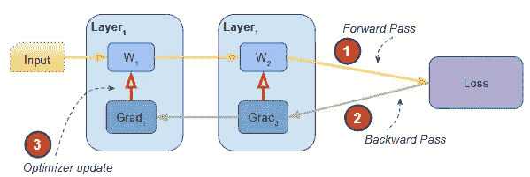
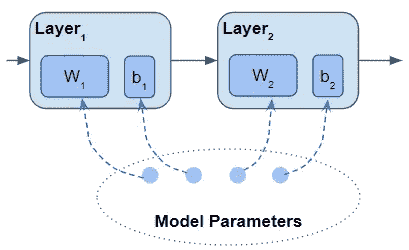
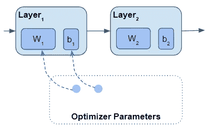
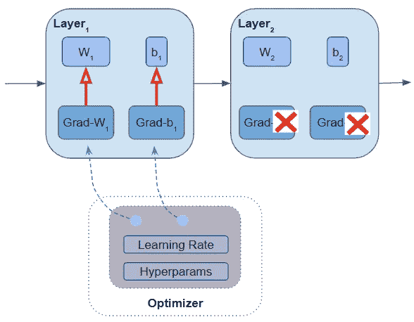
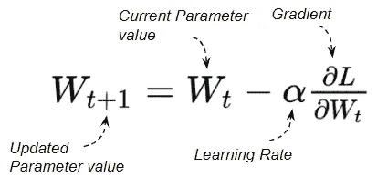
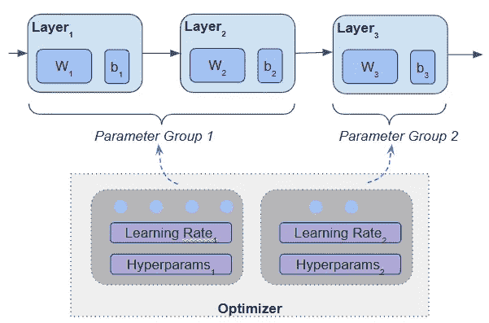
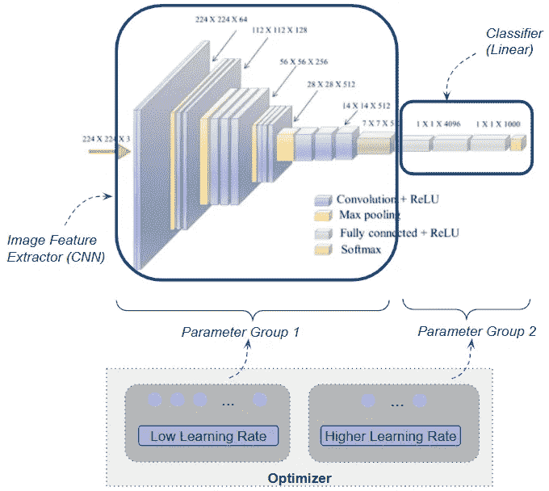
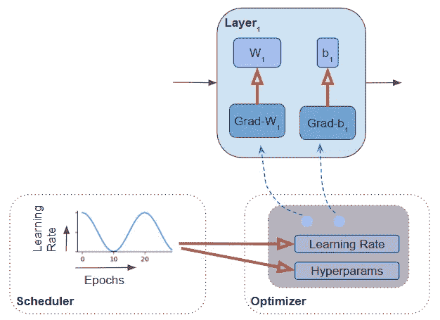
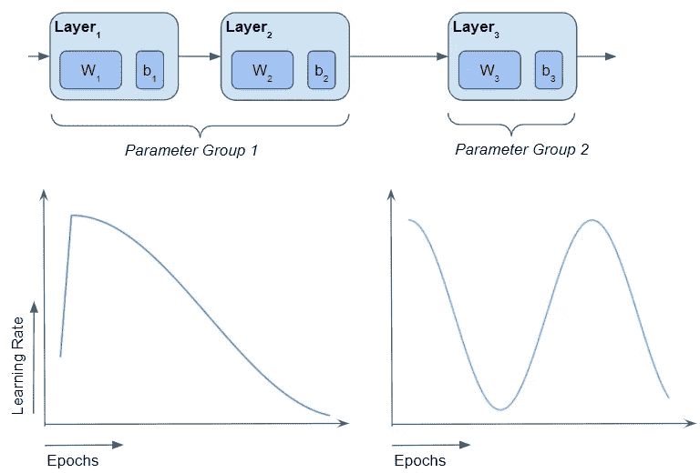

# 差分和自适应学习率——神经网络优化器和调度器揭秘

> 原文：<https://towardsdatascience.com/differential-and-adaptive-learning-rates-neural-network-optimizers-and-schedulers-demystified-2edc589fa2c9?source=collection_archive---------17----------------------->

## [动手教程](https://towardsdatascience.com/tagged/hands-on-tutorials)，直观深度学习系列

## 用简单的英语，用优化器和调度器来提高模型训练和超参数调整的温和指南

由[蒂姆·莫斯霍尔德](https://unsplash.com/@timmossholder?utm_source=medium&utm_medium=referral)在 [Unsplash](https://unsplash.com?utm_source=medium&utm_medium=referral) 上拍摄的照片

优化器是神经网络架构的关键组件。而调度器是你深度学习工具包中至关重要的一部分。在训练过程中，它们在帮助网络学会做出更好的预测方面起着关键作用。

但是他们有什么“旋钮”来控制他们的行为呢？如何充分利用它们来优化超参数，从而提高模型的性能？

定义模型时，需要做出几个重要的选择——如何准备数据、模型架构和损失函数。然后当你训练它的时候，你必须选择优化器和可选的调度器。

很多时候，我们可能最终只是为我们的大多数项目选择我们“最喜欢的”优化器——可能是 SGD 或 Adam。我们添加它，然后忘记它，因为它只有一行代码。对于许多简单的应用程序来说，这就很好了。

但是我们能做些什么来更有效地训练我们的模型吗？

优化器由三个参数定义:

1.  优化算法，如 SGD，RMSProp，Adam，…
2.  优化超参数，如学习率、动量等
3.  优化训练参数

我还有一篇文章详细讨论了第一点。它涵盖了最常用的优化算法的核心原则，您可能会喜欢阅读。

 [## 神经网络优化器变得简单:核心算法和为什么需要它们

### 梯度下降优化器使用的基本技术的温和指南，如 SGD，Momentum，RMSProp，Adam 和…

towardsdatascience.com](/neural-network-optimizers-made-simple-core-algorithms-and-why-they-are-needed-7fd072cd2788) 

在今天的文章中，我们将探讨如何利用#2 和#3。

为了解释这些主题，我们将从快速回顾优化器在深度学习架构中扮演的角色开始。

这可能是你已经知道的东西，但是请耐心，我们需要这些，这样当我们到达更有趣的部分时，我们可以在它们的基础上进行构建😄。

# 神经网络中的优化

在非常高的水平上，神经网络在训练期间通过多次迭代执行以下步骤:

*   基于当前参数生成输出的正向传递(即权重)和输入数据
*   损失函数，用于计算当前输出和期望目标输出之间的差距的“成本”
*   计算损失相对于参数的梯度的反向过程
*   优化步骤，使用梯度来更新参数，以便减少下一次迭代的损失

*网络的组成部分和训练过程中的步骤(图片由作者提供)*

既然这些参数起着如此重要的作用，那么它们到底是什么呢？

# 模型参数

一个网络的架构是由多层构成的，每一层都有一些参数。例如，线性或卷积层具有权重和偏差参数。您也可以创建自己的自定义层并定义其参数。

*一个模型的参数是所有层的所有参数(图片由作者提供)*

像 Pytorch 和 Keras 这样的深度学习框架有特定的数据类型来表示模型参数，即参数和可训练变量数据类型。

模型参数是一个张量。像所有的张量一样，它们包含一个数字矩阵，但是它们有特殊的行为。它们具有关联的梯度，每当在正向传递中对参数执行操作时，该梯度由框架自动计算。

每当定义一个新类型的层时，无论是内置的还是自定义的，您都可以使用这个数据类型来明确地告诉框架哪些张量应该被视为参数。

# 优化器培训参数

因此，当您构建网络架构时，模型的参数包括该架构中所有层的参数。

当您创建优化器时，您告诉它负责在训练期间更新的参数集。在大多数情况下，这包括模型的所有参数。但是，在许多情况下，您只想为训练提供参数的子集。

*一个优化器，包含了它所有参数的列表，是模型参数的子集(图片由作者提供)*

例如，在生成敌对网络(GAN)中，该模型具有两个而不是一个优化器。每个优化器只管理模型的一半参数。

训练开始时，用随机值初始化这些参数。然后，在向前和向后传递之后，优化器检查它所管理的所有参数，并根据以下各项用更新值更新每个参数:

*   参数的当前值
*   参数的渐变
*   学习率和其他超参数值

优化器更新它所管理的所有参数(图片由作者提供)

例如，随机梯度下降优化器的更新公式为:

对于优化器不管理的其他模型参数，不计算梯度。

# 优化超参数

所有优化器都需要一个学习率超参数。此外，其他超参数取决于您使用的特定优化算法。例如，基于动量的算法需要一个“动量”参数。其他超参数可能包括“β”或“重量衰减”。

创建优化器时，您为优化算法所需的所有超参数提供值(或使用默认值)。

您选择的超参数值对训练的速度以及基于评估指标的模型性能有很大影响。因此，选择好这些值并调整它们以获得最佳结果是非常重要的。

由于超参数如此重要，神经网络为您提供了许多设置其值的细粒度控制。

概括地说，有两个轴可以控制。第一个涉及参数组，我们将在接下来探讨。

# 模型参数组

之前我们谈到超参数时，好像整个网络只有一组值。但是如果你想为网络的不同层选择不同的超参数呢？

参数组让您可以做到这一点。可以为网络定义多个参数组，每个参数组包含模型层的一个子集。

*模型的不同层可以放在不同的参数组中(图片由作者提供)*

现在，使用这些，您可以为每个参数组选择不同的超参数值。这就是所谓的差异学习，因为实际上，不同的层次“以不同的速度学习”。

# 迁移学习的差异学习率

应用差异学习的一个常见用例是迁移学习。迁移学习是计算机视觉和自然语言处理应用中非常流行的技术。这里，您采用了一个大型模型，该模型已经过预训练，例如使用 ImageNet 数据集进行图像分类，然后将它重新用于来自您的应用程序域的一组不同的、小得多的图像。

执行此操作时，您希望重复使用所有预先学习的模型参数，并且仅对数据集进行微调。你不想从头开始重新学习参数，因为那是非常昂贵的。

在这种情况下，通常将网络分成两个参数组。第一组由提取图像特征的所有早期 CNN 层组成。第二组由最后几个线性图层组成，用作这些要素的分类器。

*用图像分类器进行迁移学习。CNN 层和线性分类器层具有不同的学习速率。(图片由作者提供)*

CNN 层学到的关于一般图像特性的许多知识也将应用于您的应用程序的图像。所以你可以用一个很低的学习率来训练第一个参数组，这样权重变化很小。

但是您可以对第二个参数组使用更高的学习率，以便分类器学习区分新域图像而不是原始集合的类。

## Pytorch 和 Keras 的差异学习

Pytorch 的优化器在定义参数组和为每个组定制的超参数方面给了我们很大的灵活性。这使得做差分学习非常方便。

Keras 没有对参数组的内置支持。您必须在自定义训练循环中编写自定义逻辑，以这种方式用不同的超参数划分模型的参数。

我们刚刚看到了如何使用参数组调整超参数。对超参数调优进行细粒度控制的第二个方面涉及到调度器的使用。

# 自适应学习率的调度器

到目前为止，我们已经讨论了超参数，好像它们是在训练之前预先确定的固定值。如果您想随着训练的进行改变超参数值呢？

这就是调度程序的用武之地。它们让您根据训练时期决定超参数值。这有时被称为适应性学习率。

有标准的调度算法，使用各种数学曲线来计算超参数。Pytorch 和 Keras 有几个流行的内置调度程序，比如指数、余弦和循环调度程序。

选择想要使用的调度程序算法，并指定超参数值范围的最小值和最大值。在每个训练时期开始时，算法使用公式、最小/最大范围和时期数来计算超参数值。

调度器修改每个训练时期的学习率和超参数值(图片由作者提供)

调度程序被认为是一个独立的组件，是模型的可选部分。如果不使用调度器，默认行为是超参数值在整个训练过程中保持不变。调度程序与优化程序一起工作，而不是优化程序本身的一部分。

我们现在已经看到了在训练过程中控制超参数值的所有不同方法。最简单的技术是对模型使用单一的固定学习率超参数。最灵活的是沿两个轴改变学习率和其他超参数——不同层的不同超参数值，并在训练周期的过程中随时间同时改变它们。

为不同的层以及基于训练时期改变训练超参数(图片由作者提供)

## 不要与调整学习率的优化算法相混淆

快速澄清一下——你可能会读到一些优化算法(如 RMSProp)根据参数的梯度为不同的参数选择不同的学习速率。

这是优化算法内部的问题，由算法自动处理。作为模型设计师，你是看不见的。学习率基于梯度变化，而不像调度器那样基于训练时期。

这与我们在本文中讨论的机制无关，所以不要混淆这两者。

# 结论

我们刚刚看到了优化器和调度器做了什么，以及它们提供的允许我们增强模型的功能。这些都是可以在一系列深度学习应用中使用的便捷技术。

Pytorch 和 Keras 包含内置特性，使得采用这些技术相当容易。

在以后的文章中，我计划更深入地探索特定类型的优化器和调度器，以及它们是如何工作的。

最后，如果你喜欢这篇文章，你可能也会喜欢我关于变形金刚、音频深度学习和地理定位机器学习的其他系列。

 [## 直观解释的变压器(第 1 部分):功能概述

### NLP 变形金刚的简明指南，以及为什么它们比 rnn 更好，用简单的英语。注意力如何帮助…

towardsdatascience.com](/transformers-explained-visually-part-1-overview-of-functionality-95a6dd460452)  [## 音频深度学习变得简单(第一部分):最新技术

### 颠覆性深度学习音频应用和架构世界的温和指南。以及为什么我们都需要…

towardsdatascience.com](/audio-deep-learning-made-simple-part-1-state-of-the-art-techniques-da1d3dff2504)  [## 利用地理位置数据进行机器学习:基本技术

### 简明的地理空间数据特征工程和可视化指南

towardsdatascience.com](/leveraging-geolocation-data-for-machine-learning-essential-techniques-192ce3a969bc) 

让我们继续学习吧！