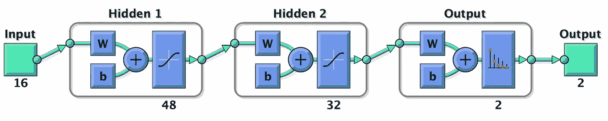
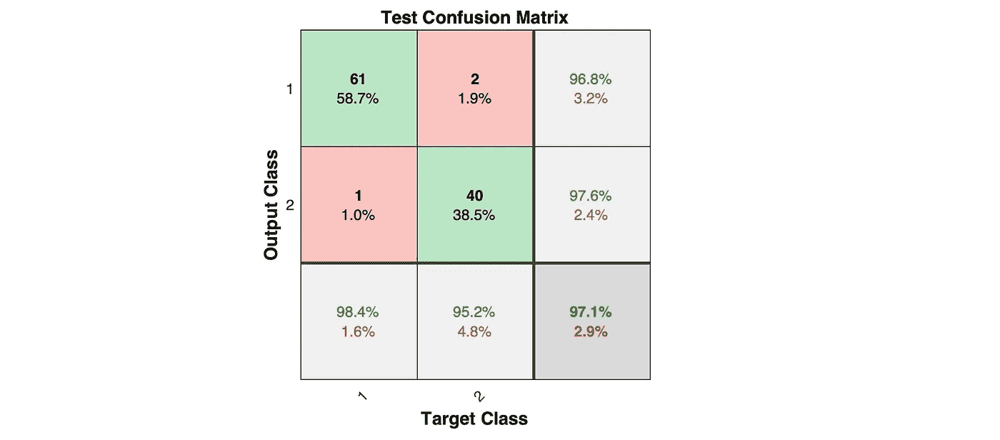
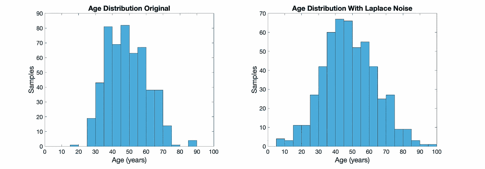
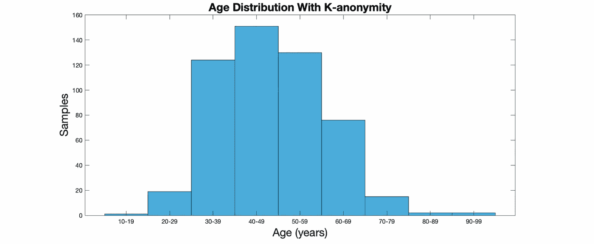
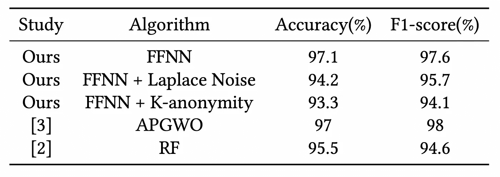

# 机器学习中的差分隐私和 k-匿名

> 原文：<https://towardsdatascience.com/differential-privacy-and-k-anonymity-for-machine-learning-fbb416f32b6?source=collection_archive---------22----------------------->

作者图片—加拿大多伦多

在当今数据驱动的世界中，用户隐私日益受到关注。我们将调查使用匿名技术对公共医疗相关数据集的影响，其中存在一些患者的私人信息，这可能导致重新识别攻击。

我们将在 MATLAB 的帮助下评估一个前馈神经网络，该网络使用具有拉普拉斯噪声的局部差分隐私和 k-匿名来匿名化我们的数据集。

# 概观

近年来，数据隐私受到了广泛关注。由于用户信息泄露是我们当今面临的一个经常性问题，公司使用不同的策略来保护他们的用户信息。许多公司收集用户数据供内部使用，他们有时会通过数据集公开这些数据。为了保护用户的身份，数据工程师使用差分隐私技术和其他策略来保护用户的隐私信息。

我们将研究使用两种最常见的数据匿名算法来掩盖糖尿病研究参与者的私人信息。我们提出了一个前馈神经网络模型，该模型即使在使用拉普拉斯噪声和 k-匿名对数据进行匿名化时也能获得高精度。

本演示使用的所有代码如下:

 [## GitHub-jaimedantas/数据匿名化-糖尿病:数据匿名化对模型预测的影响…

### 数据匿名化对糖尿病模型预测的影响。在此基础上训练了一个前馈神经网络

github.com](https://github.com/jaimedantas/data-anonymization-diabetes) 

# 差异隐私

数据隐私是公司和客户经常关心的问题。差异隐私允许数据提供商以安全的方式公开共享私人信息。这意味着数据集用于描述群体的模式和统计数据，而不是特定的单个个体。

为了保护个人隐私，差分隐私在数据中添加噪声以掩盖真实值，从而使其成为隐私。通过这样做，我们隐藏了个人的身份，对数据的效用几乎没有影响。这意味着数据集的统计结果不应受到个人贡献的影响，因为数据代表了整个人口的特征。设 D 和 D’表示仅在一个数据集上不同的两个不同的相邻数据集。差分隐私声明通过添加噪声𝜖来保护给定数据集中的私有属性，我们无法预测特定条目是否存在于数据库中[1]。

假设𝑃𝑟是𝑃算法的随机性，𝑆𝑠是𝑃𝑟的子集，它代表了𝑅.所有可能的结果如果等式 1 为真，我们将算法表示为 d '和 d 上的𝜖-differentially 私有算法[1]。

差分隐私最常见的噪声类型是拉普拉斯、指数和高斯机制。它们通过向原始数据条目添加噪声来工作，并且可以应用于真实特征和分类特征。拉普拉斯策略是指数分布的对称版本，它根据等式 2 [1]将来自对称连续分布的噪声添加到真实答案中

另一方面，指数机制以与等式 3 成比例的概率选择并输出元素𝑟 ∈ 𝑅。

其中，𝑥是一个输入，𝑢是一个具有广义灵敏度δ𝑢.的效用函数

# k-匿名

k-匿名最早是在[4]中提出的，并指出为了实现 k-匿名，包含在发布的数据集中的每个人的信息不能与至少𝑘1 个人的信息相区分，该个人的信息也出现在发布的数据集中。

实现 k-匿名有两种方法:抑制和推广。前一种方法用星号' * '替换一些条目，而后一种方法将条目分组。

# 资料组

我们将使用的数据集是[早期糖尿病](https://archive.ics.uci.edu/ml/datasets/Early+stage+diabetes+risk+prediction+dataset.) [2]，它可以在 UCI 机器学习知识库上公开获得。该数据集包括 520 个记录，这些记录是使用直接问卷从 2020 年孟加拉国 Sylhet 的 Sylhet 糖尿病医院的患者中收集的。它包含与 Sylhet 糖尿病医院收治的患者的医疗条件和特征相关的二元和实数特征。

这是一个平衡的数据集，共有 16 个特征，包括参与者的年龄和性别。虽然我们在分析中认为是私有属性的数据只是年龄

# 前馈神经网络

我们将使用前馈神经网络(FFNN)来训练我们的模型。选择这个模型是因为它的简单性和分类的有效性。我们需要洗牌数据以消除任何偏差。数据集分为三组:80%用于训练，20%用于测试。我们将使用 20%的训练集对模型进行验证。让我们使用 MATLAB 上的代码创建一个具有两个隐藏层的神经网络，分别具有 48 和 32 个神经元。

当我们运行上面的代码时，我们可以虚拟化我们的网络。

神经网络训练

对于传递函数，我们将对称 sigmoid 传递函数与交叉熵损耗(逻辑损耗)结合使用。让我们将损失函数的正则化参数𝜆设置为 0.01 来表示过拟合。这里用于训练的算法是比例共轭梯度反向传播。

# 实验评估

FFNN 的准确率和 f1 值分别达到 97.1%和 97.6%。

模糊神经网络的混淆矩阵

这一性能略好于对该数据集[2]的原始研究报告，其中评估了 Naïve 贝叶斯、逻辑回归和随机森林(RF)模型。在[3]中评估了其他几种算法，包括支持向量机、决策树、K-最近邻、Naïve 贝叶斯分类器、随机森林(RF)分类器和逻辑回归，但没有一种算法达到我们模型的准确性。将数据集分为训练和测试的相同配置应用于[2，3]。与我们的方法性能相似的唯一方法是在[3]中使用的自适应粒子灰狼优化(APGWO)模型，准确率为 97%。

# 数据匿名化

我们的第一个实验包括将拉普拉斯噪声添加到私有属性中，使它们匿名。通过这样做，我们在数据集上执行本地**差分隐私**。对于年龄类别的每个条目，我们添加了一个敏感度(δ𝑢)等于 1、𝜖 = 0.1 的噪声。然后，我们生成平均值为 0 且δ𝑢标度为的拉普拉斯噪声，并将其添加到𝜖原始值，如等式 4 所示。

我们首先需要在 MATLAB 中实现拉普拉斯噪声。有几种方法可以做到这一点，这里有一种:

现在，让我们将噪声添加到数据集中。

新数据集的年龄分布与原始数据相似。新的年龄分布直方图如下图所示。

左边是原始数据集的年龄分布，右边是添加了拉普拉斯噪声的数据集。

第二种方法包括对数据集应用**k-匿名**策略，对参与者的年龄进行数据匿名化。我们将使用概化技术，因为年龄要素可以在不同的范围内进行分组。因此，我们创建了 9 个不同的组，并根据下图对该属性进行了分类。

9 个年龄组的年龄分布。

## 比较

我用这两种匿名算法运行我们的模型，并记录了结果。下表汇总了我们的模型在使用和不使用数据匿名化的情况下的性能。

数据匿名化的 FFNN 性能。

可以看出，我们的 FFNN 在与匿名化数据集一起使用时具有出色的性能。当使用拉普拉斯噪声对数据集进行匿名化时，达到了最佳性能。这种配置仅降低了 2.9%的精确度。然而，k-anonymity 上使用的泛化算法在数据集的效用方面也表现出了良好的性能，仅降低了 3.8%的数据效用。因此，具有拉普拉斯噪声和 k-匿名的前馈神经网络在该数据集上表现良好。

# 结论

在发布新数据集时，数据效用和隐私对于预先提供敏感信息至关重要。差分隐私和 k-匿名是用于数据匿名化的一些策略，围绕这些主题已经开发了几种解决方案。当使用匿名化数据集时，我们看到了用于模型预测的前馈神经网络(FFNN)模型。

我们还评估了两种匿名化方法的性能，拉普拉斯噪声和 k-匿名，用于匿名化早期糖尿病数据集中的私有属性。

那都是乡亲们！我希望你喜欢这个关于数据匿名化的小演示。

# 关于我

我是约克大学的一名硕士研究生，骨子里是一名软件工程师。在过去的十年里，我一直在软件开发、云计算和系统工程等领域的几个行业工作。目前，我正在 [PACS 实验室](https://pacs.eecs.yorku.ca/)进行云计算和分布式系统的研究。

# 参考

[1]辛西娅·德沃克、亚伦·罗斯等，2014 年。差分隐私的算法基础。找到了。趋势理论。计算机。Sci。9, 3–4 (2014), 211–407.https://www.cis.upenn.edu/~aaroth/Papers/privacybook.pdf

[2] M. M. Faniqul Islam、Rahatara Ferdousi、Sadikur Rahman 和 Hu- mayra Yasmin Bushra。2020.利用数据挖掘技术早期预测糖尿病的可能性。医学图像分析中的计算机视觉和机器智能。).新加坡斯普林格，新加坡，113–125

[2]使用数据挖掘技术的阶段。医学图像分析中的计算机视觉和机器智能。).新加坡斯普林格，新加坡，113-125。

[3] Tuan Minh Le、Thanh Minh Vo、Tan Nhat Pham 和 Son Vu Truong Dao。2021.一种新的基于包装器的特征选择，用于早期糖尿病预测，用元启发式算法增强。IEEE 访问 9 (2021)，7869–7884。【https://doi.org/10.1109/ACCESS.2020.3047942 

[4]皮耶安吉拉·萨马拉蒂和拉坦娅·斯威尼。1998.披露信息时保护隐私:k-匿名及其通过推广和抑制的实施。(1998).[https://epic.org/privacy/](https://epic.org/privacy/)再鉴定/萨马拉蒂 _ 斯威尼 _paper.pdf