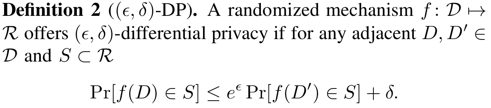

# 基于花和不透明的差分私有联合学习

> 原文：<https://towardsdatascience.com/differentially-private-federated-learning-with-flower-and-opacus-e14fb0d2d229?source=collection_archive---------15----------------------->

## 了解如何使用 Flower 和 Opacus 框架通过 DP-SGD 训练联邦模型


由[米切尔·林辛克](https://unsplash.com/@lensinkmitchel?utm_source=medium&utm_medium=referral)在 [Unsplash](https://unsplash.com/@lensinkmitchel?utm_source=medium&utm_medium=referral) 上拍摄的原始照片。由作者编辑。

在之前的[帖子](/scaling-flower-with-multiprocessing-a0bc7b7aace0#a341-919044032aa0)中，我已经描述了什么是联合学习，并给出了一个如何在 Flower 框架中使用它的例子。我还展示了如何使用多处理来扩展您的实验，以避免 GPU 内存混乱。这个教程是基于上一个的，所以我建议如果你是第一次接触 [Flower](https://flower.dev/) 的话，先快速回顾一下，获取更多的背景知识。

# 差分隐私的(真正的)简短介绍:

通过将实体之间交换的信息流从数据本身转移到仅模型参数，联合学习(FL)比机器学习中的普通方法实现了更高程度的隐私。事实证明，这对于以移动应用为目标的用例非常有用[ [1](http://arxiv.org/abs/1811.03604) ]，因为大量参与者可能有时间接受培训，并提供了在其他情况下无法获得的数据上进行培训的可能性。然而，FL 本身不足以实现完全隐私，因为它表明模型可以记住给出的例子，而不仅仅是学习如何使用呈现的特征来完成任务。这带来了问题，因为成员推理攻击可以被执行并恢复用于训练模型的原始样本。

解决这个问题的常见方法是在将模型的权重发送给另一个实体(可能是服务器或另一个对等体)之前对其进行加密。然而，这些技术会给工作流带来更高的计算和通信成本。一种替代方法是使用差分隐私(DP)，它分析由给定机制引起的潜在隐私泄露。DP 最初是由 Dwork [ [2](https://doi.org/10.1007/11787006_1) ]在 2006 年提出的，它基于相邻数据库的概念，即数据库最多只有一个元素不同，定义如下:



与 D 和 D '相邻的数据库。图片取自[ [3](https://doi.org/10.1109/CSF.2017.11) ]。

DP 保证当在数据库中添加或删除一个给定的元素时，来自我们机制的答案不会改变一定的量:exp(ε) + δ。通过添加独立的高斯噪声来实现机制的差分私有的普通方式，其中方差与机制的灵敏度成比例。为了评估随机机制的隐私预算，必须进行分析，以便我们可以跟踪隐私损失。这种分析包括雷尼差分隐私(RDP) [ [3](https://doi.org/10.1109/CSF.2017.11) ，并具有到(ε，δ)-DP 的转换。DP 最有利的特性之一是它对后处理是健壮的，这意味着无论对获得的结果做什么，隐私保证都将保持不变。

DP 是一个很大的主题，许多其他人已经写了关于它的文章，所以我在这里将保持简短，但是，如果你想更好地了解它的细节，你可以看看媒体上的这个[其他帖子](/understanding-differential-privacy-85ce191e198a)。

现在，人们可以决定直接对原始数据应用 DP 来保护它。然而，噪声的增加是以精度为代价的，在我们的工作流程中应用 DP 越晚越好。这就是为什么 ML 模型的常见方法是使用由 Abaddi 等人[ [4](https://doi.org/10.1145/2976749.2978318) ]介绍的 SGD 优化器的 DP 版本。该算法不将噪声应用于数据或模型参数，而是在梯度下降的每一步直接应用于梯度。它还使用裁剪来限制单个元素对训练过程的影响。这是我们今天要使用的算法，在 PyTorch 的团队 [Opacus](https://opacus.ai/) 库中实现，并使用 RDP 作为隐私分析。

## 设置环境

该代码可从 GitHub 上获得，并详细说明了如何安装这些库。我推荐用一个用[诗](https://python-poetry.org/)搭建的虚拟环境，Flower 的团队也在用。

# 助手文件

和第一篇文章一样，我们将从编写一个名为`flower_helpers.py`的助手文件开始，我们的大多数函数都将位于这个文件中。从进口开始:

所有需要的库都在这里:Flower (flwr)、Torch + Torchivision、Numpy 和 Opacus。还有一些是打字问题。您可以注意到我们从 Flower 导入了 FedAvg，这是库用来定义如何在联邦过程中更新权重的策略。我们需要制定策略来适应 DP 案例。从 Opacus 只导入了两件东西:PrivacyEngine 和 sampler。该引擎将允许我们将其附加到任何 torch 优化器，以在其上执行 DP-SGD 步骤。至于采样器，我们将在一段时间内看到它。下一步是为模型定义我们的设备:

之前，我们也使用了 CIFAR10 作为数据集，但为了简单起见，我们保持了它的完整性。然而，为了更好地理解 DP 对我们工作流的贡献，我们将创建自己的联邦数据集。大多数情况下，集中式数据集受益于完全相同且独立分布(IID)，这意味着每个类都是平衡的，并且其中的样本共享相同的要素分布。然而，在联邦环境中，由于数据来自不同的实体，找到完美的分布式本地数据集的机会几乎为零。以 MNIST 为例，如果我们根据参与创作的每个人来划分，我们会注意到，每个人抽取的数字可能不同，但他们的写作风格也不同。这是一个非 IID 的例子，但是数据集可以有很多非 IID 的方式，这是联邦应用程序的主要关注点，因为我们无法看到我们正在使用的数据。在我们的教程中，我们将保持简单，仅在 N 个客户端中分离 CIFAR10 数据集，它们可以保存的样本数量有所不同。从分割功能开始:

每个分割最初包含相同数量的样本，然后我们通过交替地从一个分割中移除样本并将它们添加到另一个分割中来调整它。我们用一个比率来确定一次分割可以拥有的最小样本数。75%的比率意味着我们最小的可能分割包含平均值的 25%。接下来，我们加载数据:

要加载客户端数据，我们首先加载 CIFAR10 并对其进行规范化，然后根据我们想要使用的客户端数量创建拆分。然后，在将子集提供给 DataLoader 类之前，创建一个子集。这不是最佳方式，但由于 CIFAR10 是一个非常小的数据集，我们负担得起。你在这里注意到了 uniformwithrecreplacementsampler 的使用，它也出现在所有 Opacus 的教程中，但是他们从来没有解释过为什么要使用它。这是非常小的一步，但却是非常重要的一步，因为这个采样器允许我们修改批处理的创建方式。就训练表现而言，我们甚至看不到区别，但是没有区别，DP 保证就不成立。如果什么都不做，将按顺序选择批，直到 dataloader 中没有元素。问题是 DP 的保证是基于这样一个事实，即对于每一批，每个样本都有相同的概率 *p* 被抽样。在一个时期内，一个样本可以被多次看到，并且批次甚至大小不一。uniformwithrecreplacementsampler 正是这样做的，它以概率 *p* (由`sample_rate`参数定义)获取一个样本，并将其放回下一批的数据集中。如果不使用，Opacus 给出的最终隐私预算不会改变，但不会是真实的。

接下来是定义我们的模型:

该模型基于“[py torch:60 分钟闪电战](https://pytorch.org/tutorials/beginner/deep_learning_60min_blitz.html)”教程。当使用 DP-SGD 时，我们必须在建立模型时考虑它，因为算法引起的噪声和削波会极大地影响模型的行为。例如，建议通过 Tanh [ [5](https://openreview.net/forum?id=rJg851rYwH) ]等有界函数切换 ReLU 激活函数，这些函数是无界的。这使得模型支持更好的渐变裁剪并提高了性能。我们这里没有，但是放弃辍学也是一个不错的选择，因为 DP 已经是一个强大的规范器。如果在您的网络中使用任何 BatchNormalization 层，您应该用其他层替换它们(如 GroupNormalization 或 LayerNormalization)，因为批处理方式的计算操作不是 DP 友好的，并且不受 Opacus 支持。最后一个好的选择，也是尚未被证明的[ [5](https://openreview.net/forum?id=rJg851rYwH) ]，可以尝试减少你的模型的容量(它的参数数量)。DP 的过度拟合会妨碍你的模型，所以尽量避免比平时多一倍。同样，超参数应针对差压设置进行微调。

接下来是一些与 Flower 相关的函数，用于设置和获取模型的权重:

为每个客户端计算目标δ的函数:

δ表示ε给出的隐私保证不成立的概率，因此理想情况下，它应该低于数据集大小的倒数。它通常被设置得低一个数量级。

接下来是我们的培训功能:

我们将在这里回顾一些重要的步骤。首先，您可以注意到有两个批量大小:`vbatch_size` (v 代表虚拟)和`batch_size`。`vbatch_size`是我们的目标批量，而`batch_size`将是数据加载器使用的实际批量。使用这些方法可以将 PrivacyEngine 的优化步骤分解为两个部分:计算梯度，然后应用噪声和梯度下降。这给了我们两个好处，首先，我们之前创建的采样器给出的实际批量大小并不完全是我们给出的。因此，累积多个批次的梯度可以让我们趋向于我们的初始目标值。其次，使用 DP-SGD 增加了训练过程的计算开销，随着批量的增长需要更多的内存。正如 Opacus 在他们的教程中所说:

*"Opacus 计算并存储每样本渐变，因此对于每个法线渐变，Opacus 将在每一步上存储* `*n=batch_size*` *每样本渐变，从而至少增加* `*O(batch_size)*` *的内存占用。然而，实际上，与非私有模型相比，峰值内存需求是* `*O(batch_size^2)*` *。这是因为每样本梯度计算中的一些中间步骤涉及对两个矩阵的操作，每个矩阵都将 batch_size 作为其中一个维度。”*

这意味着通过保持虚拟步骤的小批量，我们可以有效地管理任何批量的内存需求。在代码中，它转化为确定所需的累积步骤数(`*n_acc_steps*`)，稍后当我们计算优化器步骤时，我们执行虚拟步骤或正常步骤，并刷新梯度:

```
if ((i + 1) % n_acc_steps == 0) or ((i + 1) == len(train_loader)): optimizer.step()  # real step optimizer.zero_grad()else: optimizer.virtual_step()  # take a virtual step
```

然后你会注意到我们正在训练函数中加载数据和模型。这是因为我们将使用多重处理来允许每次选择新客户端时释放 GPU 内存。如果我们在真实的环境中，客户端会在连接到服务器之前加载它们。您还可以注意到优化器从 SGD with momentum 更改为 Adam。Opacus 可以与任何优化器一起工作，但我个人发现 Adam 更容易使用 DP 设置。

alpha 列表包含由 Opacus 执行的 RDP 分析的订单。这个列表取自 Opacus 的教程，一般来说，你不需要修改它，但是如果你看到在你的例子中选择的 alpha 一直是一个极值，你可能想要调整它。

接下来是 PrivacyEngine，它是来自 Opacus 的自定义对象，允许执行 DP-SGD。使用它的方法是将它附加到任何优化器上。它以模型、采样速率、阶数α、噪声乘数(添加的噪声量)、最大梯度范数(削波)和目标δ值为参数。通过给它们这些参数，它将执行 RDP 分析，并为训练过程的当前状态提供ε值。该值是在给定数据集上执行的总步骤数的情况下计算的，这些步骤存储在引擎的`state_dict`中，可以通过调用相关方法获得。这就是我们通过联合培训跟踪客户隐私预算的方式。每次选择一个客户时，他们将存储产生的状态字典，以便在下次参与时恢复它。

我想指出的最后一点是，我们只是在为一个单一的本地时代进行训练。原因是因为 FedAvg 被证明在非 IID 数据集上不收敛[ [6](http://arxiv.org/abs/1907.02189) ]。

培训后，我们定义不包括任何 DP 步骤的测试:

最后，我们需要为服务器定义一个行为来管理客户端。我们可以只使用标准的联合平均策略，但如果我们的目标是尊重所需的隐私预算，我们需要处理客户的意见:

我们只添加一个名为`max_epsilon`的参数来跟踪全球隐私预算。由于合成定理，独立机制的组合所产生的隐私预算将等于最大值。

每个客户端将在其度量字典中返回他们的隐私预算是否超过目标值。如果是这样的话，服务器会断开他们的连接，这样他们就不必再参加培训了。

最后，最初的`FedAvg`类中的`configure_evaluate`在每一轮都被调用，如果最初没有评估函数被传递给策略，它将选择一些客户端来执行评估。同样，在最后一轮，它将对每个可用的客户端进行评估。当我们在服务器端执行评估时，我们希望避免这两种行为，但是如果没有足够的客户端可用于训练，我们会打印一条消息，因为我们断开了其中一些客户端。

# 客户端文件

我们所有有用的函数都被定义了，然后我们可以编写我们的客户端文件。从进口开始:

在 main 函数中，我们从脚本的参数开始:

然后，我们通过从 NumpyClient 类继承来定义我们的客户端

遵循 fit 方法，首先是训练过程:

获得结果:

最后是评估函数(我们在这个例子中没有用到):

最后要做的是启动客户端并运行 main:

# 服务器文件

只剩下服务器文件。导入和全局变量:

服务器端的评估函数:

主要功能和启动服务器:

# Bash 文件

我们所有的核心元素都已经编写好了，现在我们可以使用 bash 脚本组合并启动它们:

在将脚本转换为可执行文件后，在您的终端中运行`./run.sh`将默认运行 2 个客户端 3 轮。您可以根据需要修改参数。

由于只有两个客户端和一个稍微非 IID 的数据集，该模型应该执行 close(如果不使用 FL 的话)。经过一段时间的训练后，你可能会发现网络卡在 40%以下，很难再提高。这是因为如果没有 DP(55%左右)，我们正在使用的模型本身就不能表现得那么好。您可以通过使用更好的模型(增加每个卷积层的滤波器数量)甚至使用迁移学习来缓解这一问题。随意实验！

# 结论和展望

通过这篇文章，您了解了如何使用 Flower 和 Opacus 在联邦模型上执行 DP-SGD。然而，有些部分我们没有涉及到。例如，没有解决为联合 DP-SGD 寻找超参数的问题。人们可以选择在对每个客户端进行训练之前直接计算它们，这导致了额外的隐私成本，或者他们可以选择预先对类似的本地数据集进行微调，并使用为所有客户端找到的超参数。我们也可能想知道 DP-SGD 对我们的模型的真正影响，以及(ε，δ)-DP 预算在保护方面的真正含义，[ [7](http://arxiv.org/abs/2006.07709) 对此提供了一些答案，但这仍然是一个开放的话题。寻找对增加的噪声更具弹性的架构，从而减少应用 DP 引起的性能下降也很重要。

如果你想了解更多关于如何将 Opacus 应用于不同情况的知识，你可以查看他们的[教程](https://opacus.ai/tutorials/)部分，这里有两个额外的 NLP 示例。同样的道理也适用于[花](https://github.com/adap/flower/tree/main/examples)，虽然我们在这里用 PyTorch 使用它，但它并不限于此，你可以用任何你喜欢的框架进行实验，甚至是 [Scikit-learn](https://flower.dev/blog/2021-07-21-federated-scikit-learn-using-flower) 。同样，我们只涵盖了我们案例的一个基本数据集，但是我们可以使用一些专门为联邦案例设计的数据集，比如 [LEAF](https://leaf.cmu.edu/) 基准。

本教程到此结束。代码可在[这里](https://github.com/matturche/flower_opacus_example)获得。我希望这将是有用的，并帮助你们中的一些人更好地理解如何花和 Opacus 可以一起工作。不要犹豫留下反馈和/或问题！

# 参考

```
[1] A. Hard *et al.*, “[Federated Learning for Mobile Keyboard Prediction](http://arxiv.org/abs/1811.03604),” *arXiv:1811.03604 [cs]*[2] C. Dwork, “[Differential Privacy](https://doi.org/10.1007/11787006_1),” in *Automata, Languages and Programming*, Berlin, Heidelberg, 2006, pp. 1–12\. doi: 10.1007/11787006_1.[3] I. Mironov, “[Renyi Differential Privacy](https://doi.org/10.1109/CSF.2017.11),” *2017 IEEE 30th Computer Security Foundations Symposium (CSF)*, pp. 263–275, Aug. 2017, doi: 10.1109/CSF.2017.11.[4] M. Abadi *et al.*, “[Deep Learning with Differential Privacy](https://doi.org/10.1145/2976749.2978318),” *Proceedings of the 2016 ACM SIGSAC Conference on Computer and Communications Security*, pp. 308–318, Oct. 2016, doi: 10.1145/2976749.2978318.[5] N. Papernot, S. Chien, S. Song, A. Thakurta, and U. Erlingsson, “[Making the Shoe Fit: Architectures, Initializations, and Tuning for Learning with Privacy](https://openreview.net/forum?id=rJg851rYwH),” OpenReview[6] X. Li, K. Huang, W. Yang, S. Wang, and Z. Zhang, “[On the Convergence of FedAvg on Non-IID Data](http://arxiv.org/abs/1907.02189),” *arXiv:1907.02189 [cs, math, stat]*[7] M. Jagielski, J. Ullman, and A. Oprea, “[Auditing Differentially Private Machine Learning: How Private is Private SGD?](http://arxiv.org/abs/2006.07709),” *arXiv:2006.07709 [cs]*
```