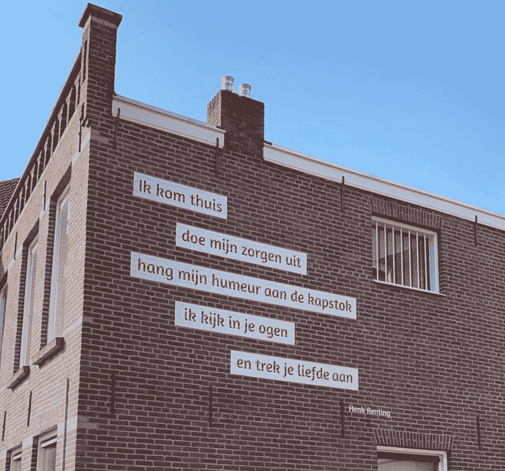
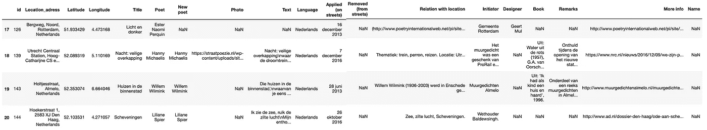
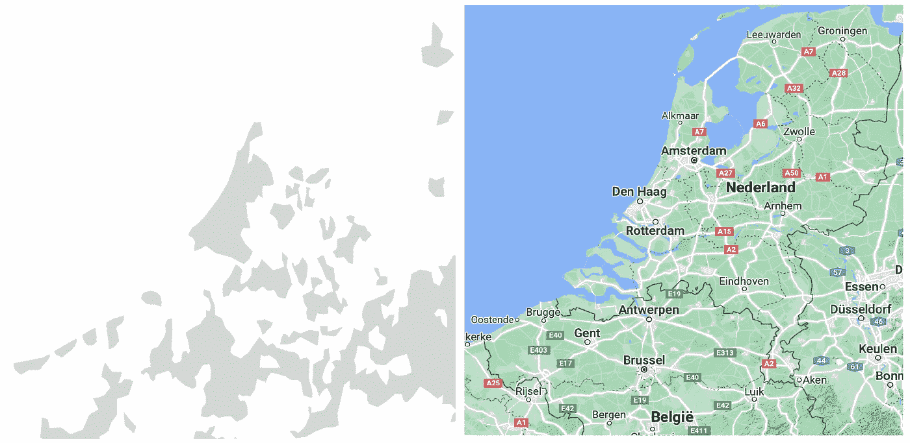
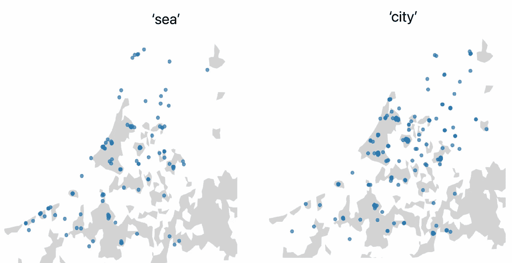

# 数字文本分析:荷兰语区的街头诗歌

> 原文：<https://towardsdatascience.com/digital-text-analysis-street-poetry-in-the-dutch-language-area-9362577b7ce7?source=collection_archive---------19----------------------->

## 街景诗的数字视角。

埃因霍温的街头诗歌。照片由西贝·希姆斯特拉拍摄。

街头诗。一旦你对它的存在开放，你就不能视而不见。有时很大，非常现实，其他时候更离散和适度。2016 年，网站 [www.straatpoezie.nl](http://www.straatpoezie.nl) 由 Kila van der Starre 博士作为论文的一部分推出，期间调查了公共空间中不同形式的诗歌。该网站是一个众包数据库，拥有超过 3000 首诗歌，可以在荷兰和比利时的街道上找到。

在荷兰人口稀少的 Meijel 地区的一个小镇的市场广场上，坐落着一个小型的文学艺术作品。就在这个村庄的核心之外是国家公园 De Peel，“一个拥有无与伦比的动植物的无限空间。许多小说、诗歌、歌曲等的灵感来源”，比如这个:

*En d'n hemel waas veurroej* (天空火红) *薄雾兴 op 't land* (薄雾挂在大地上) *的 Oaves laat da stong de Peel in brand*(深夜果皮着火)

这一小段文字来自林堡乐队 Rowwen Hèze 的歌曲“品牌中的皮尔”(The Peel on fire)。它描述了一个小男孩如何发现 De Peel 自然保护区的雾与红色的夕阳结合在一起就像一场火。

尽管选择这个关于 De Peel 的片段并不是没有争议的(乐队不是来自 Meijel…)，但选择这个位于 Meijel 的文学艺术作品是有意义的。这个城镇把自己描绘成国家公园的大门。当你在地图上查看它时，你会发现它确实与德·皮尔密切相关。不管某首诗甚至歌曲背后的动机是什么，研究街景中选择的诗歌是否以某种方式反映或代表了周围环境的一部分是很有趣的。最直接的方法之一(目前)是检查特定单词在特定条件下是否出现以及出现的频率。在这篇文章中，我们将放大两个特定单词的存在，“stad”(城市)和“zee”(海)，给出这首诗是否位于城市地区的条件。其中一个假设是,“海”出现在海的附近，出现在赞美海的力量和吸引力的诗歌中。而带有‘市’的诗词，大多会出现在市区。毕竟——当你身处一个不像城市的环境中时，你为什么要赞美(甚至命名)这个城市呢？

**路线图**

数据集的编译者 Kila van der Starre 博士在我联系她的时候让我将数据集用于我自己的研究目的。首先，我们要看一下数据(一个新的数据集可以在很多方面给你带来惊喜)。之后，一个多边形被上传到世界上所有的城市区域，我们用纬度/经度来划分，所以只有荷兰和比利时是可见的。最后，我们用单词“sea”和“city”创建两个独立的数据帧。

众包的巨大优势在于，科学家可以收集大量的数据，而如果单独完成这项工作，则需要数年时间。然而，缺点是信息并不总是准确、完整和整洁的。众包数据集很有趣，迫使数据科学家发挥创造力。你必须尝试多种解决方案，然后才能找到一种可行的方案。

当使用熊猫打开数据集时，我们会看到以下内容:

作者图片

当浏览条目时，可以立即注意到条目的填充字段之间的差异有多大。有些条目只有两个必填字段，而其他条目在“与位置的关系”、“备注”和“更多信息”下有完整的内容。一位 NLP 科学家享用了像这样的不同文本专栏！；-)反正此时此地，最有趣的栏目是纬度、经度和文字。

**系统描述**

下一步是导入荷兰和比利时所有城市区域的多边形:

左边的是我们刚刚导入的多边形，右边的地图供参考:

右图:谷歌地图(2021)荷兰/比利时。地形图，检索到[https://www . Google . com/maps/@ 51.8509528，4.1818916，7.5z/data=！5m1！1e4](https://www.google.com/maps/@51.8509528,4.1818916,7.5z/data=!5m1!1e4)

我们快到了。为了进一步处理这些数据，我们需要合并每个条目的纬度和经度。此外，为了确保城市/非城市的分布不会过于倾斜，我们做了一个快速检查:

当计算“Is_urban”列中的值时，我们获得了 1886(城市)与 1014(非城市)的比率，因此大约 2/3 的条目位于城市区域。

最后，我们可以用任何我们想要的单词创建一个数据帧，以查看它们在荷兰或比利时地图上的使用位置。让我们把“海”和“城”像我们在引言中讨论的那样。

就是这样！

作者图片

**解读**

当我们选择带有“海”这个词的诗歌时，我们会惊奇地发现，只有极小一部分含有“海”这个词的诗歌实际上位于海的附近。一个临时的结论是，诗歌不仅仅反映或表现他们周围的环境；他们也可以声明缺席。一个可以遵循的线索是，这些诗歌是否位于其他类型的自然水域，如湖泊和河流。

当选择带有“stad”(城市)一词的诗歌时，我们看到大多数诗歌确实是在城市地区。有趣的是，在瓦登群岛上(在左图中，四个集体的点在“海”的下面)，有“海”，没有一首诗提到这座城市。

**未来工作**

在下一篇文章中，我们将深入探讨街头诗歌片段背后的诗人。关于这些作家的年龄、性别、民族、活跃年限有什么可以调查的？请关注我的频道。

**参考文献**

Karsdorp，m . Kestemont 和 a . Riddell(2021 年)。*人文数据分析*。阿姆斯特丹大学出版社。

范德斯塔尔，基拉。(2021).*pozie buiten het boek。流通在他的街道上。乌特勒支大学。*