# Python 的“数字孪生”:实践示例

> 原文：<https://towardsdatascience.com/digital-twin-with-python-a-hands-on-example-2a3036124b61?source=collection_archive---------1----------------------->

## 使用 Python 构建电子开关(晶体管)数字孪生示例的分步指南

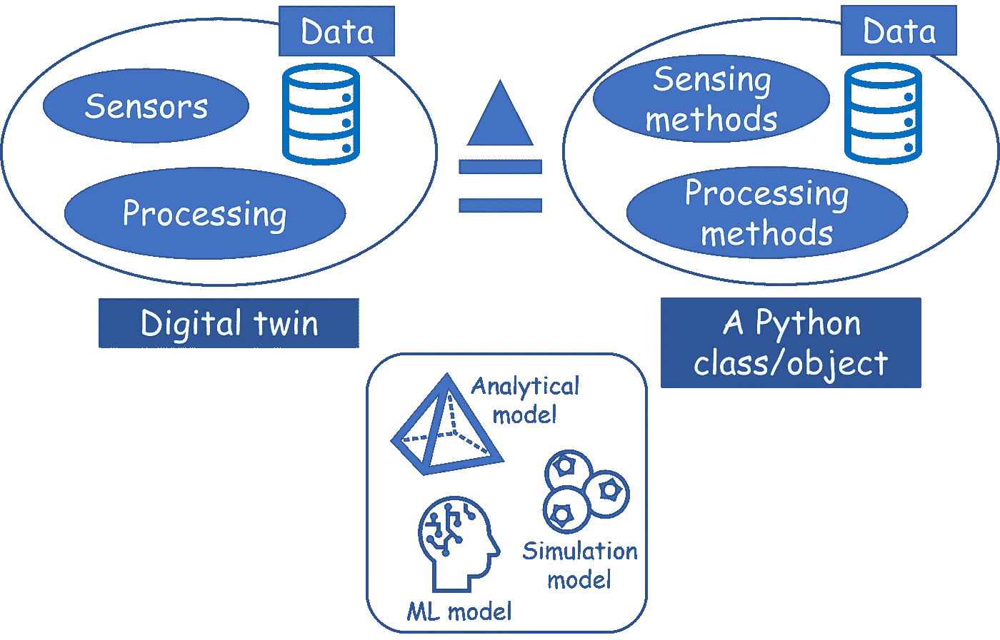

图片来源:作者创作

# 什么是数字孪生？

[IBM 将](https://www.ibm.com/topics/what-is-a-digital-twin)数字双胞胎定义如下“*数字双胞胎是一种虚拟模型，旨在准确反映物理对象*。

他们继续描述创建数字双胞胎的主要促成因素是如何收集数据的**传感器**和将数据以某种特定格式/ **模型**插入对象的数字副本的**处理系统**。

更进一步，IBM 说“一旦*获知了这样的数据，虚拟模型就可以用来* ***运行模拟*******研究性能*** *问题和* ***产生可能的改进*** ”。*

*所以，我们可以画出这个心智模型，不是吗？*

*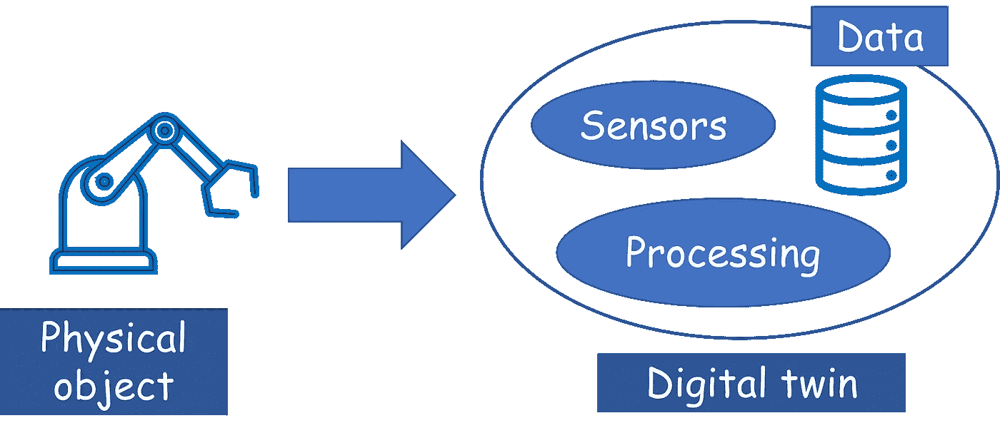*

*图片来源:作者创作*

# *使用 Python 创建数字孪生*

*那么，我们如何使用我们最喜欢的语言 Python 来创建数字双胞胎呢？为什么我们认为它会起作用？*

*答案看似简单。只需看看上面的图，然后看看下面的图，就可以看到数字孪生模型和经典 Python 对象之间的等价性。我们可以*用合适的方法/函数模拟*传感器和数据处理器，将收集到的数据存储在数据库或内部变量中，并且*将所有东西都封装到一个 Python 类中。**

*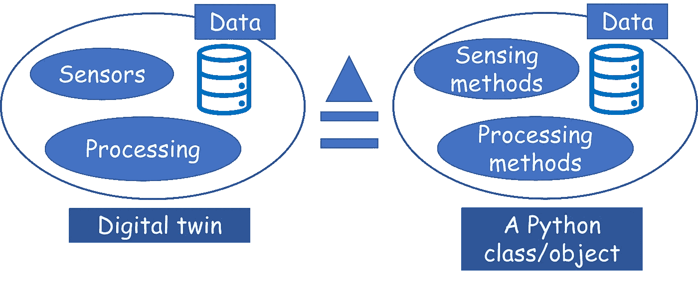*

*图片来源:作者创作*

*一旦我们做到了这一点，我们还可以希望 Python 对象*

*   *可以用在合适的模拟程序中，*
*   *可以探测数据，并且*
*   *甚至可以进行优化程序以增强合适的内部参数。*

*当然，我们可以在这个方案中增加无限复杂的层次，让这个物体成为一个真正复杂的数字结构。但是，遵循[奥卡姆剃刀原则](https://en.wikipedia.org/wiki/Occam%27s_razor)，我们应该从简单开始，随着我们的发展，增加复杂性。*

> *…创建数字双胞胎的主要促成因素是收集数据的**传感器**和**处理系统……***

*在本文中，我们将采取一种简单的循序渐进的方法，用单个半导体器件(*物理对象*)创建一个数字孪生对象**。为简单起见，我们甚至不会对传感器进行建模，而是将其模拟为半导体器件上的简单端电压。***

# *物理对象——MOSFET 器件*

*我们周围有一些精选的实物，它们相当壮观地定义和体现了现代文明的发展。不完整的列表可能如下所示，*

*   *内燃机——体现了所有的机动性*
*   *印刷机——包含所有的知识*
*   *电机——体现所有工业运动*
*   *基于半导体的晶体管——体现了所有电子产品/互联网*

*在加入数据科学领域之前，我已经在半导体行业工作了十多年。很自然，我会被这个数字孪生演示的相关例子所吸引，不是吗？*

*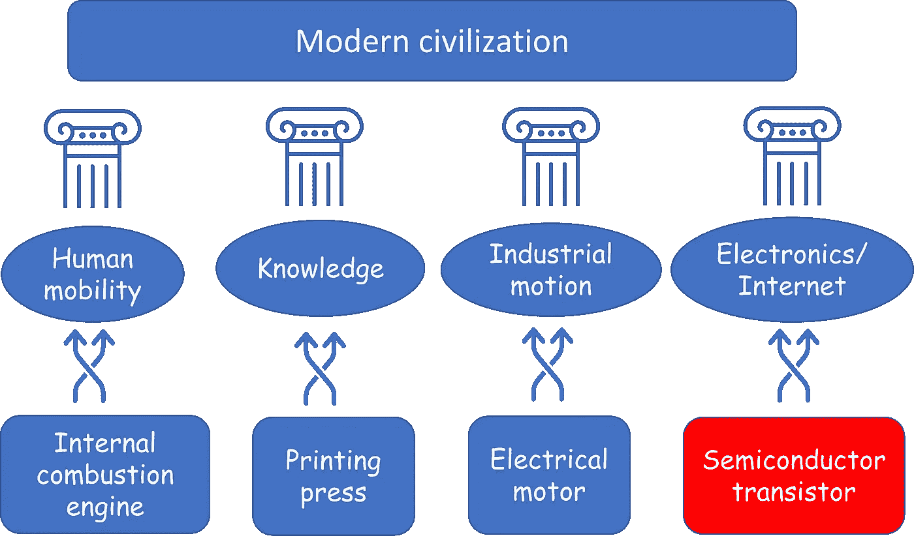*

*图片来源:作者创作*

## *那么，什么是 MOSFET？*

*虽然第一批半导体晶体管是所谓的“双极结型器件”，但几乎所有现代晶体管都是 MOSFET。它是一个首字母缩写词，代表“**M**et al-**O**xide-**S**半导体**F**field-**E**effect-**T**晶体管”。*

*基本上，它是由金属和半导体(例如硅或锗)层制成的器件，在它们之间夹有薄的氧化物(或另一种电绝缘体)材料层。*

*这是最早的 MOSFET 专利之一的历史图像，*

*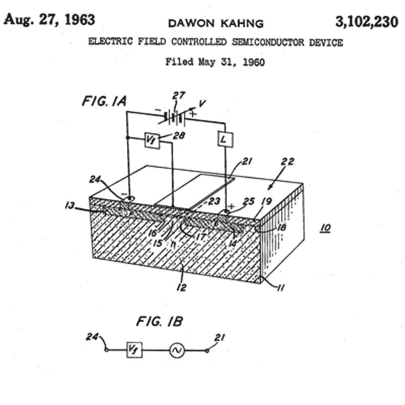*

*图片来源:[https://www . computer history . org/silicone gine/metal-oxide-semiconductor-mos-transistor-demented/](https://www.computerhistory.org/siliconengine/metal-oxide-semiconductor-mos-transistor-demonstrated/)*

*我们可以采用**三端** — *漏极*、*源极*、*栅极*的器件模型(也称电路模型)来简化内部结构。*

**

*图片来源:作者创作*

## *我们想要建模的特征*

*这是构建数字双胞胎时首先要考虑的问题之一——我们希望在我们的数字对象中建模什么特征。这决定了 twin 的复杂性和数据结构选择。*

*例如，虽然我们可以用 MOSFET 结构模拟各种复杂的物理现象，但我们可以选择限制自己只模拟最基本的特性，即。最简单形式的漏源电流和电压关系。*

*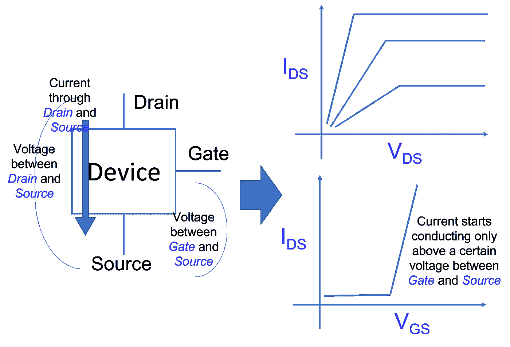*

*图片来源:作者创作*

*现在，我们没有足够的篇幅在本文中详细解释所有这些特征(以及它们背后的物理原理)。有兴趣的读者可以参考优秀的网上资料，*

*   *[https://www.electronics-tutorials.ws/transistor/tran_6.html](https://www.electronics-tutorials.ws/transistor/tran_6.html)*

## *MOSFET 是一种数字开关*

*记住 MOSFET 行为的最简洁的方法是**把它想象成一个数字开关**。这是它的工作原理，*

*   *如果*栅极*和*源极*之间的电压低于某个阈值，则开关断开，并且没有电流(或信息)在*漏极*和*源极*之间流动。这在上图的右下角显示。*
*   *当栅极-源极电压高于该阈值时，开关接通。漏极到源极的电流也由它们之间的电压决定。这在上图的右上角显示。*

*因此，MOSFET 的基本用途是作为一个**压控开关**，即我们可以通过控制第三个端子上的电压来控制其两个端子之间的电流(或信息)量。*

> *我们希望在我们的数字对象中模拟什么特征？这决定了数字孪生的复杂性和数据结构选择*

## *要记住的参数*

*考虑到这一点，创建数字孪生的唯一需要记住的是通用 MOSFET 的三个重要参数，*

*   ***Vth** :为阈值电压(在*栅极*和*源极*之间)，高于该值时开关接通。*
*   ***GM**:MOSFET 一旦导通，就可以在*漏极*和*源极*之间携带电流。这个数字越高，电流越大。它可以被认为是电阻(表示给定电压下电流流动的阻力)的倒数。*
*   ***BV** :这叫做“*击穿电压*”。这在理想开关描述中没有讨论，在数字孪生中也不会模拟。这表示当 MOSFET 处于关闭状态时，其漏极*和源极*之间可以保持多少电压的限制。高于此限值，MOSFET 再次开始导通，但不是以受控方式，即我们无法控制电流，它基本上是无用的。然而，该参数对于设计和建模非常重要，因为它限制了特定应用中特定器件的选择。*

> *MOSFET 的基本用途是作为**电压控制开关……***

# *我们的 Python 数字双胞胎*

*这个演示的样板代码在我的 Github repo 中的[。为简洁起见，本文中我将只展示部分代码片段。](https://github.com/tirthajyoti/Digital-Twin/blob/main/MOSFET-1.ipynb)*

## *主 MOSFET 类别*

*我们定义了主 MOSFET 类别，用户还可以选择定义一些参数和端电压。下面显示了部分代码，*

```
*class MOSFET:
    def __init__(self,params=None,terminals=None):

        # **Params**
        if params is None:
            self._params_ = {'BV':20,
                             'Vth':1.0,
                             'gm':1e-2}
        else:
            self._params_ = params

        # **Terminals**
        if terminals is None:
            self._terminals_ = {'source':0.0,
                        'drain':0.0,
                        'gate':0.0}
        else:
            self._terminals_ = terminals*
```

*在这段代码中，我们可以看到我们之前详细讨论过的常见终端和参数。还有一些**默认参数**。*

*我们也可以用一个`__repr__`方法来描述一行中的对象，*

```
*def __repr__(self):
        return "Digital Twin of a MOSFET"*
```

## *一种用于确定开关状态的方法*

*通过在类中定义一个方法，我们可以很容易地将数字开关(开/关)的 MOSFET 特性转换成编程逻辑。*

```
*def determine_state(self,vgs=None):
        """
        """
        if vgs is None:
            vgs = self._terminals_['gate'] - self._terminals_['source']
        else:
            vgs = vgs if vgs > self._params_['Vth']:
            return 'ON'
        else:
            return 'OFF'*
```

*在`__init__`方法中，我们可以从对象的实例化中确定状态。*

```
*# Determine state
  self._state_ = self.determine_state()*
```

*你已经掌握了用数字双胞胎的特征和行为来定义它的窍门，是吗？*

## *让我们看一个简单的例子*

*在深入研究其他特征之前，让我们先来看看这个数字双胞胎的行为。*

```
*mosfet = MOSFET()*
```

*在 [Jupyter 笔记本](https://github.com/tirthajyoti/Digital-Twin/blob/main/MOSFET-1.ipynb)中，我们键入这个来测试单行描述，*

```
*mosfet>> Digital Twin of a MOSFET*
```

*我们测试`mosfet`对象的状态。*

```
*mosfet._state_>> 'OFF'*
```

*我们以这种方式获取默认参数的字典，*

```
*mosfet._params_>> {'BV': 20, 'Vth': 1.0, 'gm': 0.01}*
```

*现在，如果我们用一些终端和参数值显式定义一个对象，*

```
*mosfet = MOSFET(terminals={'source':0.0,
            'drain':0.0,
            'gate':2.0}, 
           params={'BV':20,
                   'Vth':1.0,
                   'gm':1e-2})*
```

*你认为这个物体是什么状态？让我们检查一下，*

```
*mosfet._state_>> 'ON'*
```

*MOSFET(或其数字孪生)开启，因为*栅极*和*源极*之间的电压大于实例中定义的参数 *Vth* 。我再次重复代码片段，突出显示感兴趣的部分，*

```
*terminals={**'source':0.0**,
            'drain':0.0,
            **'gate':2.0**}*
```

*和*

```
*params={'BV':20,
        **'Vth':1.0**,
        'gm':1e-2})*
```

## *具有分析模型的方法*

*接下来，我们定义一种方法，利用一个简单的一阶分析模型计算开态 MOSFET 的漏极至源极电流。代码和等式都在[笔记本](https://github.com/tirthajyoti/Digital-Twin/blob/main/MOSFET-1.ipynb)里，这里我只展示了部分代码片段，*

```
*def id_vd(self,vgs=None,vds=None,rounding=True):
        """
        Calculates drain-source current from 
        terminal voltages and gm
        """
        <code>
        if state=='ON':
            if vds <= vgs - vth:
                ids = self._params_['gm']*(vgs - vth - (vds/2))*vds
            else:
                ids = (self._params_['gm']/2)*(vgs-vth)**2

        <more code...>*
```

*更有趣的是，检查数字孪生是否可以产生类似于物理设备的电流-电压特性。对于*漏极* - *源极*电压范围，我们可以计算出一系列*漏极* - *源极*电流。*

```
*ids = []
mosfet = MOSFET()
vds_vals = [0.01*i for i in range(1,501)]
for v in vds_vals:
    ids.append(mosfet.id_vd(vgs=3.0,vds=v,rounding=False))*
```

*结果看起来非常符合一般的理想 MOSFET 特性。这里 Vds(*x*-轴)代表*漏极* - *源极*电压，Ids(*y*-轴)代表*漏极* - *源极*电流。*

*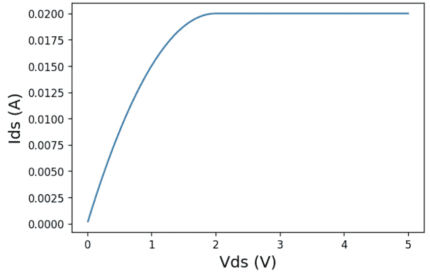*

*图片来源:作者创作*

*分析模型还涉及*栅极* - *源极*电压(Vgs)，因此，我们可以计算一系列 Vgs 的 Ids 与 Vds 曲线。结果看起来像是，*

*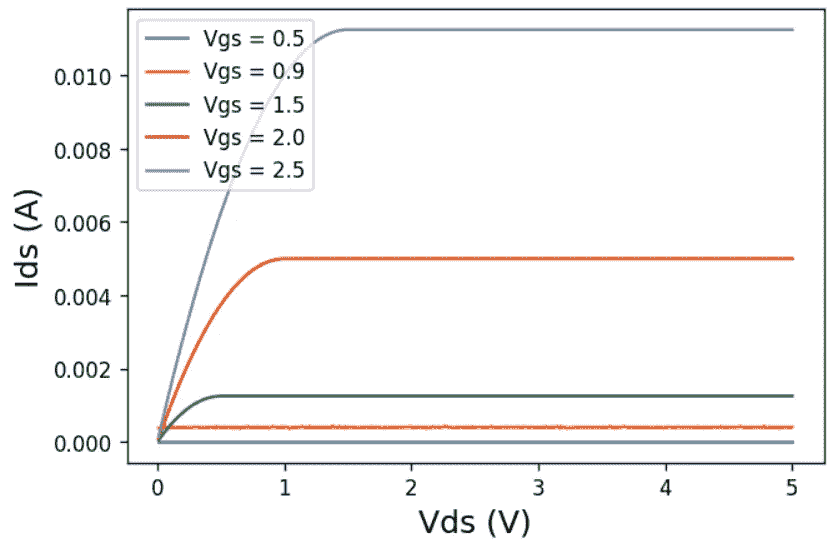*

*图片来源:作者创作*

# *现代数字双胞胎的力量——包括深度学习*

*数字孪生建模不一定需要来自数据科学或机器学习的工具。然而，在数据驱动模型占主导地位的现代世界中，在任何适用和合适的地方使用这种建模技术都是谨慎的。*

***这并不意味着你应该从你的数字双胞胎**中消除所有的分析模型，并开始在每个特征上投入深度学习模型。作为一名领域专家(或者如果你不是领域专家，在专家的帮助下)，你必须确定一个分析和机器学习模型(或者甚至是离散模拟模型)的**平衡组合**，以嵌入数字孪生对象中，用于表示物理资产的真实世界特征。*

*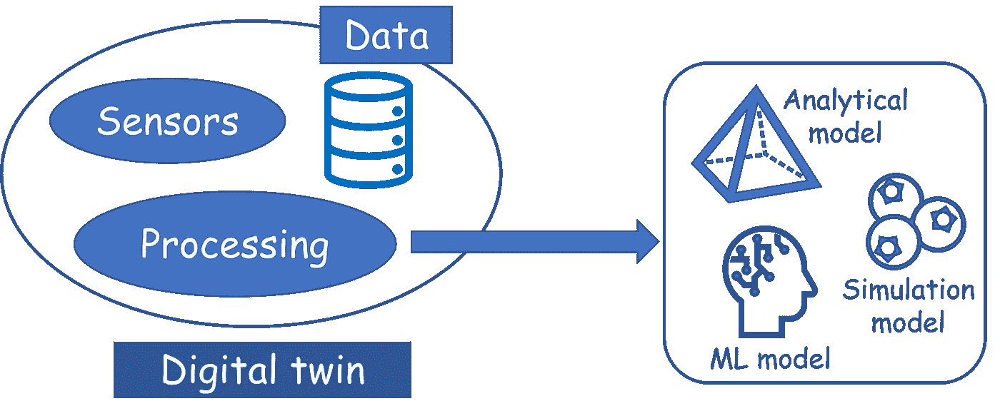*

*图片来源:作者创作*

> *数字孪生建模不一定需要来自数据科学或机器学习的工具*

## *用神经网络模拟亚阈值泄漏*

*那么，在我们的数字孪生对象中，我们应该在哪里应用合适的 ML 技术呢？事实证明，计算(或用 ML 估计器预测)所谓的“*亚阈值泄漏*”将是一个很好的选择。*

*这个“*亚阈值泄漏*”是什么？*

*如前所述，当 Vgs 低于 Vth 时，MOSFET 处于关断状态。因此，它的理想行为是在*漏极*和*源极*之间承载零电流。然而，由于**量子力学奇妙的异想天开的本质(细节我们不需要知道)，一个真正的 MOSFET 即使在关闭状态下也会携带少量的“泄漏”电流**。我们可以尝试使用 ML 模型来计算这一点，特别是深度神经网络(DNN)。*

## *ML 模型——为什么以及如何选择？*

*那么，为什么我们选择一个解析方程来模拟导通状态下的 Ids-Vds，并选择一个 DNN 来模拟漏电流呢？*

*这个问题没有对错之分。这取决于几个因素，*

*   *您拥有的数据的类型和性质*
*   *你试图模拟的物理过程的性质和复杂性*
*   *数字孪生模型的性能和精度之间的权衡*

*在这种情况下，漏电流的测量通常是有噪声的。实际值在某种程度上也是随机的，是制造物理 MOSFET 的材料属性和制造工艺的自然可变性的强函数。物理学还表明，它是端电压和一些其他内部参数的非线性函数。所有这些使得 ML 方法适合于建模这种特性。*

*对于你创造的每一个数字双胞胎，你必须深入调查，并根据你的判断做出选择。然而，数字孪生的美妙之处在于，它允许你随时用 ML 模型替换分析模型(反之亦然)。*

> *你必须确定一个分析和机器学习模型(甚至是离散模拟模型)的**平衡组合**，以嵌入数字孪生对象中*

## *模型训练法*

*模型训练和预测界面的选择是完全灵活的。在此示例中，我们有单独的训练和预测方法。培训方法的代码片段如下所示。*

```
*def train_leakage(self,data=None,
                      batch_size=5,
                      epochs=20,
                      learning_rate=2e-5,
                      verbose=1):
        """
        Trains the digital twin for leakage current model with experimental data
        Args:
            data: The training data, expected as a Pandas DataFrame
            batch_size (int): Training batch size
            epochs (int): Number of epochs for training
            learning_rate (float): Learning rate for training
            verbose (0 or 1): Verbosity of display while training
        """*
```

*请注意其中包含的参数，如`batch_size`、`epochs`和`learning_rate`——熟悉构建深度学习模型的任何人都很熟悉。作为主要输入，您所要提供的就是`data`，它应该是一个熊猫数据帧。*

*在内部，代码构建一个 Tensorflow Keras 模型，对其进行编译和训练，并将训练好的模型保存为数字孪生的内部属性(`self.leakage_model`)。*

```
*# Deep-learning model
model = build_model(num_layers=3,
                    architecture=[32,32,32],
                    input_dim=3)
# Compile and train
model_trained = compile_train_model(model,
                                    X_train_scaled,
                                    y_train_scaled,
                                    batch_size=batch_size,
                                    epochs=epochs,
                                    learning_rate=learning_rate,
                                    verbose=verbose)self.leakage_model = model_trained*
```

*在这种实现中，隐藏层数和激活函数等超参数是预先固定的，但它们可以很容易地暴露给在现实应用中使用数字孪生的开发人员。*

> *数字孪生的美妙之处在于，它允许你随时用 ML 模型替换分析模型(反之亦然)*

## *ML 的数据源*

*对于这个演示，**我们使用一个特殊的助手函数(包含在[笔记本](https://github.com/tirthajyoti/Digital-Twin/blob/main/MOSFET-1.ipynb)中)创建了一些合成数据**来训练 DNN。这个助手包括随机变量来模拟前面提到的制造和测量中的可变性和噪声。*

*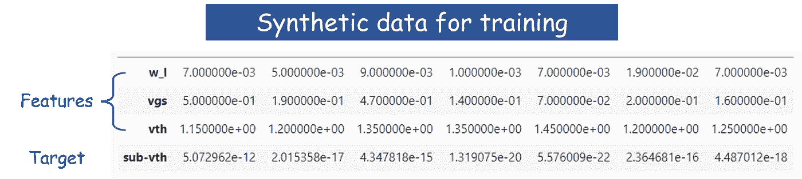*

*图片来源:作者创作*

*然而，**在现实生活中，半导体工厂/晶圆厂将对数百万个 MOSFETs 运行物理测试套件**(使用其他机器)，并记录它们在各种 Vgs 偏置电压下的漏电流。它还会记录测试中这些 MOSFETs 的 Vth。所有这些数据将流入数字双胞胎，模型将不断训练和更新。*

*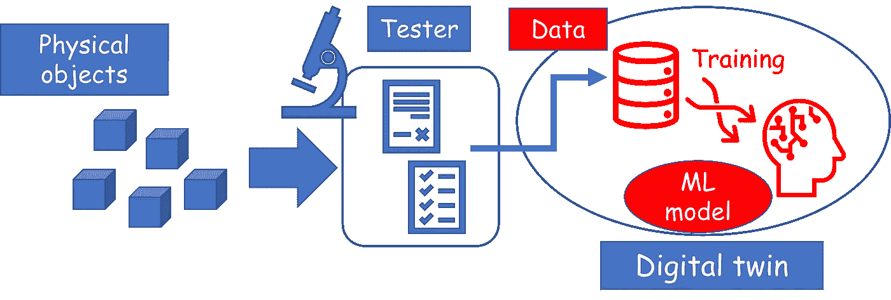*

*图片来源:作者创作*

*通过这种安排，我们只需编写一行代码，用作为`df` DataFrame 提供的训练数据来训练模型，*

```
*mosfet.train_leakage(df)*
```

*熟悉的训练开始了，*

*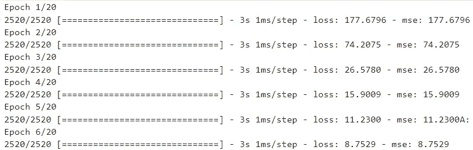*

## *该预测方法*

*我们编写了一个单独的泄漏方法来预测跨导、Vgs 和 Vth 作为输入的任何组合的亚 Vth 泄漏。*

```
*def leakage(self,
                w_l=1e-2,
                vgs=None,
                vth=None):
        """
        Calculates leakage current using the deep learning model
        """
        if not self._leakage_:
            return "Leakage model is not trained yet"
        # Vgs
        if vgs is None:
            vgs = self._terminals_['gate'] - self._terminals_['source']
        else:
            vgs = vgs
        # Vth
        if vth is None:
            vth = self._params_['Vth']
        else:
            vth = vth

        # Predict
        x = np.array([w_l,vgs,vth])
        ip = x.reshape(-1,3)
        result = float(10**(-**self.leakage_model.predict**(ip)))

        return result*
```

*代码中的幂运算(10 的幂)是由于我们提供了实际泄漏值的负 10 对数作为 DNN 模型的训练目标。这样做是为了实现更快的收敛和更高的精度。*

# *数字孪生的扩展*

*数字双胞胎张开双臂欢迎朋友。过道两边也是。*

*基本上，它们特别适合连接到工业系统——上游和下游——并利用这种连接实现整个工厂/工业系统的最佳行为。在用编程语言设计 Digital Twin 或任何其他现代面向数据的工具时，记住这一点很重要。*

***连接。交流。合作。这些是打造成功且受欢迎的数字双胞胎**的关键。因此，设计师必须仔细评估数据结构、编程平台和 AI/ML 方法的选择，以确保它们符合设计理念。*

**

*图片来源:作者创作。 [Pixabay 图像](https://pixabay.com/vectors/buildings-factory-business-34906/)已使用(免费使用)*

*在本文中，我们通过展示 Python 编程框架的一些简单步骤，剥离了数字孪生设计的上层。这取决于你——读者——将这些概念向前推进，并向你选择的系统/资产添加更复杂的编程层、逻辑层和数据科学层，并设计强大的数字双胞胎。*

*工业 4.0/智能工厂已经在这里，并准备好利用数字化转型、人工智能和机器学习的所有进展。数字双胞胎是这一旅程的重要组成部分。*

> ***连接。交流。合作。这些是打造成功且受欢迎的数字双胞胎的关键***

**喜欢这篇文章吗？成为* [***中等会员***](https://medium.com/@tirthajyoti/membership) *继续* ***无限制学习*** *。如果你使用下面的链接，* ***，我会收到你的一部分会员费，而不会给你带来额外的费用*** *。**

*[](https://medium.com/@tirthajyoti/membership) [## 通过我的推荐链接加入媒体

### 作为一个媒体会员，你的会员费的一部分会给你阅读的作家，你可以完全接触到每一个故事…

medium.com](https://medium.com/@tirthajyoti/membership)*