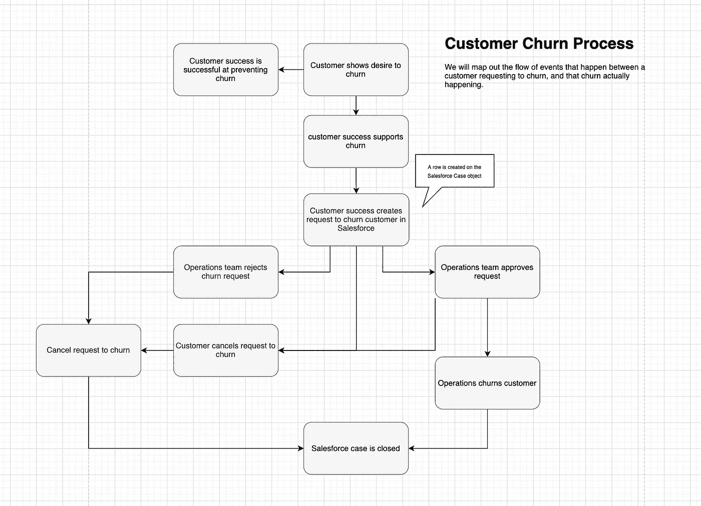
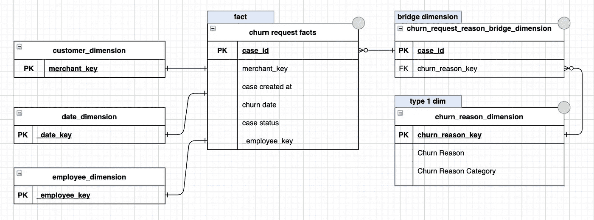
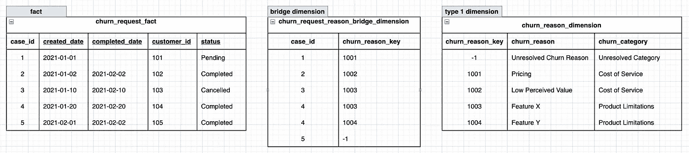

# 客户流失的维度建模

> 原文：<https://towardsdatascience.com/dimensional-modelling-for-customer-churn-9d0148548f04?source=collection_archive---------10----------------------->

## 从原始 Salesforce 案例数据到数据仓库的有组织维度和事实表。

在[爆发](https://burst.shopify.com/photos/female-designer-reviewing-web-wireframes?q=wireframe)时由[莎拉·普弗卢格](https://burst.shopify.com/@sarahpflugphoto)拍摄的照片。

好的，大约 3 个月前，一个利益相关者想了解为什么客户会从 XYZ 产品中流失。客户流失是指客户取消订购我们提供的服务或产品的情况。这个利益相关者对这个直截了当的问题和业务的组成部分感到好奇是很公平的。当然，像 Shopify 这样规模和重要性的公司已经有了这方面的漂亮的模型数据。这些数据肯定会在一份现成的自助式报告中，这样我们就可以专注于更重要的事情，比如解决世界饥饿问题的机器学习算法，对吗？

没有。至少对 XYZ 产品来说不是。

所以今天，我写的是我为产品流失建立一个维度模型的经历，而不是我为世界饥饿建立的机器学习算法，这需要等待。

学完本课程后，您将会很好地理解我们是如何以及为什么以这种方式做事的，并有望了解如何将它应用到您的业务中！

**广场一号。**

像现在的许多企业一样，Shopify 在 Salesforce 中管理大量的客户资料、关系和互动。Shopify 使用 Salesforce 中的“案例”来记录、审查和批准产品 XYZ 的流失请求。

鉴于上述情况，我们理解客户流失的起点是一个原始的不干净的 salesforce 案例数据集，看起来像这样；

乍一看，这似乎不是一个太糟糕的数据集，我们有许多重要的关键字，如 customer_id 和 date，我们可以使用它们来获得有关这些客户流失案例的更多信息。然而，当我们试图想象这一点时，我们会遇到一些问题:

*   有不同的案例风格(特征 X！=特征 X)
*   我们在不同的标签下有相似的理由(定价，低感知价值)。我们或许应该创建一张地图，将类似的流失原因归入总体类别。
*   我们应该把我新的热门播放列表发给 105 号顾客🔥

鉴于上述情况，并且因为客户流失是我们希望长期了解的业务的一个组成部分，所以我们进行前期投资并为客户流失创建一个清晰的维度模型是有意义的。

你可能会问，什么是维度模型？[谷歌会告诉你](https://www.guru99.com/dimensional-model-data-warehouse.html)；

> **维度建模(DM)** 是一种针对数据仓库中的数据存储而优化的数据结构技术。维度建模的目的是优化数据库，以便更快地检索数据。维度建模的概念是由 Ralph Kimball 提出的，由“事实”表和“维度”表组成。

快速便捷地检索数据对于快速做出重大决策至关重要，这也是 Shopify 的一项重要文化价值观。因此，我们需要易于被产品 XYZ 或客户流失主题的新分析师理解的数据，并创建一个几乎无摩擦的路径来回答以下问题:

*   客户流失趋势如何？
*   哪些客户因定价问题而受到影响？
*   最突出的流失原因是什么？
*   客户流失需要多长时间？

那么我们如何做到这一点呢？让我带你看看我的过程。

**了解业务流程。**

对我来说，起点是很好地理解业务流程以及它与我们的数据集的关系。在我们的例子中，业务流程是由账户管理团队提交客户流失请求。他们用于提交案例的字段将出现在我们的案例数据集中。我在下面为我们描绘了这个业务流程。

给定我们的输入数据集和上面的流程，我们知道以下内容:

*   流失请求可以被取消
*   流失请求在完成之前需要审批
*   单个流失请求可以与多个原因相关联
*   流失原因需要被格式化和分组

所以现在我们认为我们理解了业务流程，我总是去检查拥有流程的团队和我的高级数据科学家，这样他们就可以告诉我哪里错了。在对他们的反馈进行几个周期的迭代并使每个人都一致后，我们可以进入下一步。

**设计你的维度模型。**

此时，我们知道了我们想要回答的问题，我们知道了业务流程，现在是时候开始策划我们的数据仓库设计了。

为了能够回答我们上面概述的问题，我们知道在我们的模型中可能需要下面的列。

时间戳:

*   请求打开于
*   请求结束于

描述性数据:

*   流失原因(功能 X、功能 Y、定价、讨厌的 Mike 播放列表)
*   流失原因类别(产品局限性、低感知价值、支持体验)
*   客户详细信息

当前状态数据:

*   请求是成功完成、取消还是待定？

除此之外，我们将利用现有的客户、员工、日期和地区维度来获得有助于理解客户流失的其他见解，如客户年龄或地区。

知道我们有事务性数据(客户流失请求可以被认为是一个事务)和伴随这些事务的描述性数据(客户流失原因、客户流失原因类别)的混合，这很好地表明我们将需要事实和维度。

简而言之，我们可以将事实表视为一个存储度量的地方，以及一个存储与事实度量相关联的描述性属性的维度。在本练习中，我们将有一个客户流失原因维度，这是客户流失事实的一个属性，但与大多数事实一样，我们也能够连接客户维度、日期维度和国家维度。

我们的数据集(总是有一个)的警告是，不幸的是，在业务流程(客户流失请求)和我们想要测量的属性之间存在一对多的关系；流失原因。幸运的是，拉尔夫·金博尔想到了这一点，并给了我们桥梁尺寸的礼物。我们可以使用桥接维度将多值行解析成单独的行，这样我们就可以将一个关键字上的案例流失原因干净地连接到流失原因维度。我们的最终关系将是这样的:

下面是我们的示例数据将如何流经我们的数据模型。

在这个关系中，我们可以通过桥维度和 case_id / churn_reason_key 将客户流失请求事实连接到客户流失原因维度。

然而，在我们构建之前，我们的模型在实践中看起来如何？

构建 SQL 原型。

现在我们知道了模型应该回答的问题，并且我们理解了模型将提供给我们的列和表。让我们检查一下，以确保我们想回答的问题得到了回答！

*   随着时间的推移搅动？

*   已完成的客户流失及相关原因列表？

将有许多方法来剪切和拼接这些数据，但我们的核心问题通过这种设计得到了解决——这是我们需要确定的。

**检查一下&发货吧！**

很好，概括一下。

*   我们了解业务流程
*   我们理解我们想要回答的问题
*   我们有一个设计可以回答这些问题

作为最后的健全性检查，我召集了利益相关者来获得以下反馈

*   有没有这个模型没有包括的需要解决的核心问题？
*   这个模型灵活吗，能够回答小到必要的粒度的问题吗？
*   这些数据的未来用途是什么？例如，如果它最终可能会被卷到客户维度中，那么这种设计是否容易/可能做到这一点？

一旦所有人都一致了，就该开始构建了！去拿吧。

评论，让我知道你是否有兴趣在后续的帖子中看到这个项目的构建是什么样子！