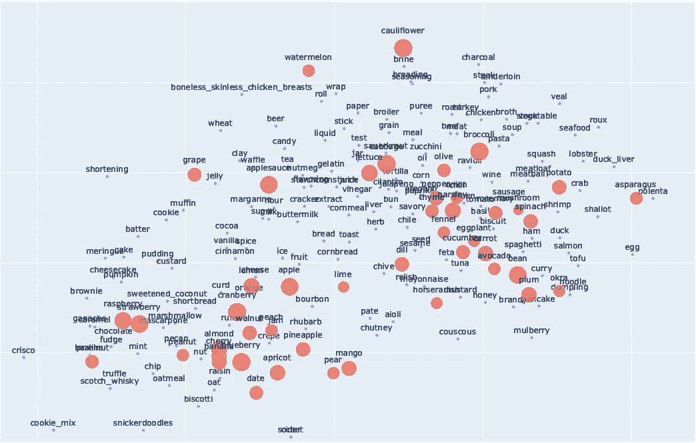
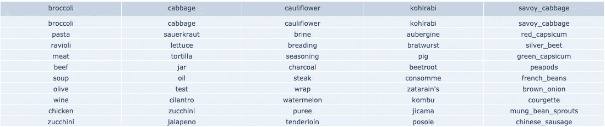

# 降维

> 原文：<https://towardsdatascience.com/dimensionality-reduction-c4083c6ebab4?source=collection_archive---------30----------------------->

## PCA & T-SNE

# 介绍

降维的目的是从高维向量中保留尽可能多的信息。主成分分析(PCA) [1]和 T-分布随机相邻实体(T-SNE) [2]是两种最常用的方法。第一种被认为是用数学方法解决问题，而第二种则是用统计学方法。

PCA 的主要目的在于保留数据中具有较高可变性的矢量分量，同时丢弃增加较少信息的分量。这种分解可以通过两种不同的方式实现。一种是通过分解数据协方差矩阵的特征值。第二种方法是在通常将初始数据标准化后，对数据矩阵进行单值分解[1]。

另一方面，T-SNE 将点之间的相似性转换成联合概率。并且最小化低维嵌入和高维数据上的这些概率之间的 Kullback-Leibler 散度。这种方法具有非凸的成本函数，因此，不同的初始化可能产生不同的降维向量[2]。

能够可视化高维数据是至关重要的，尤其是在对执行聚类感兴趣的情况下。根据应用，社区发现算法可以输入不同的阈值参数，这些阈值参数影响集群的大小和连通性。能够可视化数据如何分布允许在选择这些值时使用人类推理。

# 个案研究

Recipe1M+是一个包含大约 100 万个食谱的数据集。在多个参数中，每个参数都包含各自的成分列表。[3]

<https://luisrita.medium.com/recipe1m-dataset-2ecb62a43804>  

基于这些成分的共现，可以使用单词嵌入(Word2Vec)或图形嵌入(Metapath2Vec)将它们和各自的配方表示为向量。

使用 T-SNE，Recipe1M+中 1480 种成分中的 1000 种被绘制在下面视频的矢量空间中。橙色节点是指具有预测数量的新冠肺炎跳动分子的成分[4]。各自的半径与具有这种性质的不同分子的数量成正比。蓝色节点对应所有其他成分。

**视频 1**1000 种食材的 3D 嵌入。一些具有预测的新冠肺炎跳动特性

同样的方法使我们能够进一步降低 2D 空间向量的维数，并更好地了解食谱中不同成分是如何配对的。允许在选择最佳配对时同时考虑新冠肺炎跳动分子的预测数量。

**图 1** 2D 包埋与视频 1 中相同的成分。为了清楚起见，只显示了一些成分

这些嵌入允许我们在尝试根据类别(如水果、蔬菜或肉类)对配料进行聚类时选择最佳的模型超参数。并进一步将其用于食谱分类。或者，根据它们在 2D 空间中的距离直接识别最佳配料对(图 2)。

**图 2**recipe 1m+中具有最多预测新冠肺炎打浆性能的分子的前 5 种成分的最佳配对

# 参考

[1] I. T. Jolliffe 和 J. Cadima，“主成分分析:回顾与近期发展”，*英国皇家学会哲学汇刊 A 数学物理与工程科学，*2016 年第 374 卷第 2065 期。

[2] L. v. d. Maaten 和 G. Hinton，“使用 t-SNE 可视化数据”，*《机器学习研究杂志》，*第 9 卷，第 2579-2605 页，2008 年。

[3] J. Marin，A. Biswas，F. Ofli，N. Hynes，A. Salvador，Y. Aytar，I. Weber 和 A. Torralba，“Recipe1M+:用于学习烹饪食谱和食物图像的跨模态嵌入的数据集”， *IEEE 模式分析和机器智能汇刊，* 2019。

[4] Laponogov，I .，Gonzalez，g .，Shepherd，M. *等*网络机器学习绘制富含植物化学成分的“Hyperfoods”来对抗新冠肺炎。 *Hum Genomics* **15、** 1 (2021)。[https://doi.org/10.1186/s40246-020-00297-x](https://doi.org/10.1186/s40246-020-00297-x)