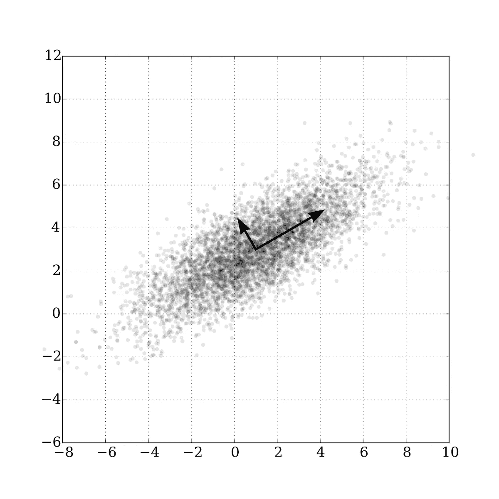

# 降维备忘单

> 原文：<https://towardsdatascience.com/dimensionality-reduction-cheatsheet-15060fee3aa?source=collection_archive---------16----------------------->

## 5 分钟内你应该知道的降维知识

降维。作者图片

在这篇文章中，你会发现一个完整的降维备忘单。在五分钟内，你将能够知道它是什么，并刷新主要算法的记忆。

降维算法代表了一种技术，即*减少数据集中特征*(非样本)的数量。

在下面的示例中，任务是减少输入要素的数量(将 swissroll 从 3D 展开到 2D ),同时保存最大比例的信息。这就是降维任务和这些算法的本质。

降维例子。[公共领域](https://commons.wikimedia.org/wiki/File:Lle_hlle_swissroll.png)

降维算法的两个主要应用是:

*   **数据可视化** & **数据分析** —将输入要素的数量减少到三个或两个，并使用数据可视化技术深入了解数据
*   **其他机器学习算法的预备工具**。更多的输入特征通常会使预测任务更加难以建模，这就是所谓的**维数灾难**。由于许多算法(来自监督和非监督学习(例如回归/分类、聚类))不能很好地处理稀疏或高维数据，因此降维算法可以大大提高质量。通常，这也提供了更快和更简单的计算。

方法通常分为:

*   **特征选择** —找到输入特征的子集
*   **特征投影**(或*特征提取* ) —寻找原始数据到某个低维空间的最佳投影

接下来，我们将讨论第二组方法。查看*特征工程*以获得更多*特征选择*工具，例如套索回归、相关性分析等。事实上，以下算法也可用作*特征选择*工具，区别在于这些不再是原始特征，而是它们的一些修改(例如在 *PCA* 情况下的线性组合)。

# 主成分分析

为了降低维数，主成分分析( *PCA* )使用原始数据到*主成分*的投影。主分量是描述*残差变化*的最大量的正交向量(使用*奇异值分解*找到它们)。

具有两个主成分的高斯分布的主成分分析。[公共领域](https://en.wikipedia.org/wiki/Principal_component_analysis#/media/File:GaussianScatterPCA.svg)

因此，通过选择第一个`N`主成分(其中`N < M, M is the number of features`，我们从 M 维空间移动到 N 维空间，其中新特征是现有特征的线性组合。

为了选择组件的数量，使用了所谓的*弯头方法*。绘制解释方差的累积和图，然后选择解释所需信息比率的分量数(通常为 80%或 95%)。

PCA 需要数据缩放和居中(`sklearn.decomposition.PCA`类自动完成)。

这些算法有很多流行的修改，但最流行的是:

*   *增量 PCA* —用于*在线学习*或数据不适合存储时
*   *随机化的 PCA* —一种允许快速估计前 N 个分量的随机算法
*   *内核 PCA* — *内核技巧*允许执行复杂的非线性投影

# 流形学习

流形学习算法基于某种距离度量守恒。这些算法在减少维度的同时节省了物体之间的距离。

Scikit Learn 的流形学习方法比较。[图像来源](https://scikit-learn.org/stable/auto_examples/manifold/plot_compare_methods.html)

*   **LLE**

LLE ( *局部线性嵌入*)研究原始空间中数据点之间的线性连接，然后试图移动到更小的维度空间，同时保持在局部邻域内。这个算法有很多修改，像*修改的局部线性嵌入(MLLE)* 、*基于 Hessian 的 LLE (HLLE)* 等等。

*   **Isomap**

Isomap(是*等距映射*的缩写)с通过将每个实例连接到其最近的邻居来创建一个图，然后在试图保留实例之间的*测地线距离*(图中两个顶点之间的距离)的同时减少维度。

*   **t-SNE**

t-SNE 代表 *t 分布随机邻居嵌入*。通过保存空间中各点之间的相对距离来减少维数，这样可以使相似的实例彼此靠近，而不相似的实例彼此分开。最常用于数据可视化。

# 自动编码器

我们也可以使用神经网络进行降维。Autoencoder 是一个网络，当网络结构暗示*一个瓶颈*——一个神经元数量比输入层少得多的层时，它会尝试输出与输入尽可能相似的值。

自动编码器结构。[公共领域](https://en.wikipedia.org/wiki/Autoencoder#/media/File:Autoencoder_schema.png)

如果我们使用线性激活函数，我们将得到线性降维规则，像 *PCA* 。但是如果我们使用非线性激活函数，我们可以得到更复杂的潜在表示。不幸的是，我们必须有大量的数据。幸运的是，这些数据是未标记的，所以通常很容易收集。

至于其他算法，有很多不同的变体，比如:

*   *降噪自动编码器*可以帮助清理图像或声音
*   *处理分布而不是特定值的变型自动编码器*
*   *图像卷积自动编码器*
*   *用于时间序列或文本的循环自动编码器*

# 如何选择一种降维算法？

首先，确保你对数据进行了缩放。几乎所有的降维算法都要求这样。

如果你为*数据可视化*减少维度，你应该首先尝试 **t-SNE** 。

如果你有很多数据，**自动编码器**可以帮助你找到非常复杂的潜在表示。

如果没有大量数据，可以尝试 **PCA 进行线性**降维，**流形学习算法** ( *LLE* ， *Isomap，*等)**进行非线性降维**。

降维算法选择。作者图片

请注意，几乎每个算法都有许多变体，还有许多其他不太流行的算法，如:

*   *非负矩阵分解(NMF)*
*   *随机预测*
*   *线性判别分析*
*   *多维标度(MDS)*
*   以及其他等等

本文是以下内容的一部分:

</unsupervised-learning-algorithms-cheat-sheet-d391a39de44a>  

您可能还对以下内容感兴趣:

</supervised-learning-algorithms-cheat-sheet-40009e7f29f5>  

# 感谢您的阅读！

*   我希望这些材料对你有用。在 Medium 上关注我可以获得更多类似的文章。
*   如果您有任何问题或意见，我将很高兴得到任何反馈。在评论中问我，或者通过 [LinkedIn](https://www.linkedin.com/in/andimid/) 或 [Twitter](https://twitter.com/dimid_ml) 联系我。
*   为了支持我作为一名作家，并获得数以千计的其他媒体文章，使用[我的推荐链接](https://medium.com/@andimid/membership)获得媒体会员资格(不收取额外费用)。