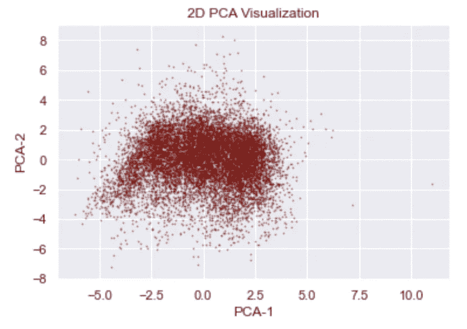

# 解释了降维(PCA)

> 原文：<https://towardsdatascience.com/dimensionality-reduction-explained-5ae45ae3058e?source=collection_archive---------22----------------------->

## 用 Python 解释和实现 PCA


图片来自 [Unsplash](https://unsplash.com/photos/1FxMET2U5dU)

**目录**

*   介绍
*   什么是降维？
*   线性组合
*   特征工程和特征选择
*   数据
*   PCA
    -直觉
    -数学分解
    -优点
    -缺点
    -实现
*   摘要
*   资源

**简介**

降维是数据科学家常用的机器学习中的一种流行方法。本文将重点介绍一种非常流行的无监督学习降维方法，即主成分分析(PCA)。这是一篇介绍性文章，旨在直观地理解什么是降维、PCA 如何工作以及如何用 Python 实现它。

# 什么是降维

在跳到降维之前，我们先来定义一下什么是维度。给定矩阵 A，矩阵的维数是行数乘以列数。如果 A 有 3 行 5 列，那么 A 就是一个 3x5 的矩阵。

```
A = [1, 2, 3]   --> 1 row, 3 columns
The dimension of A is 1x3
```

现在用最简单的术语来说，降维就是它听起来的样子，你把矩阵的维度降低到比现在更小。给定一个正方形(n 乘 n)矩阵 A，目标是将这个矩阵的维数减少到小于 n×n。

```
Current Dimension of A : n
Reduced Dimension of A : n - x, where x is some positive integer
```

你可能会问为什么有人想这样做，最常见的应用程序是为了数据可视化的目的。在大于 3 维的空间中，很难形象化地描述事物。通过降维，您将能够将 1000 行和列的数据集转换成一个足够小的数据集，以便在 3 / 2 / 1 维中可视化。

# 线性组合

无需深入研究线性代数背后的数学知识，降低矩阵 A 维数的最简单方法是将其乘以向量/矩阵 X，使乘积等于 B。公式为`Ax=B`，当且仅当 B 是 A 的列的线性组合时，该公式才有解。

**示例**

```
The goal is to reduce the matrix 4x4 dimension matrix A to a matrix of 4x2 dimensions. The values below are from a random example.A = [[1,2,3,4],      x = [[1,2],
     [3,4,5,6],           [3,4],
     [4,5,6,7],           [0,1],
     [5,6,7,8]]           [4,0]]Ax = [[23,13],
      [39,27],
      [47,34],
      [55,41]]
The output B now has a dimension of 4x2.
```

# 特征工程和特征选择

给定包含各种要素的数据集，您可以通过要素工程和要素选择来减少要素的数量。这本身就直观地减少了您正在处理的原始数据集的维度。假设您有一个包含以下各列的数据框架:

您发现，通过做一些算术，您可以组合一组特征，而不会丢失关于这些特征的信息。然后，新特征将替换产生它的特征对。通过某种预处理手段创建新特征的过程称为特征工程，而为训练模型而选择特定特征的过程称为特征选择。

```
**Example**
Feature 1 + Feature 2 = Feature 6Now your new features are : 
Feature 3 | Feature 4 | Feature 5 | Feature 6
```

# 数据

我将展示如何使用 NBA 数据通过 sklearn 实现 PCA。你可以直接从我的 GitHub 库[这里](https://github.com/vatsal220/medium_articles/blob/main/dimensionality_reduction/data/all_seasons.csv)下载数据，或者从它的原始来源 Kaggle [这里](https://www.kaggle.com/justinas/nba-players-data)下载

# 主成分分析

PCA 是一种高度使用的无监督学习技术，用于降低大型数据集的维度。它将大量的变量转换成包含大部分信息的更小的部分。减少数据集的大小自然会导致信息的丢失，并会影响模型的准确性，但这种负面影响会因便于探索、可视化和分析而抵消。

## 直觉

假设我们正在查看一个数据集，该数据集与一组运动员及其所有相关统计数据相关联。每一项数据都衡量了运动员的各种特征，比如身高、体重、臂展、效率、得分、篮板、盖帽、失误等等。这将基本上为我们提供一个与我们每个球员相关的各种特征的大型数据集，然而，许多特征可能彼此相关，从而产生冗余信息。

PCA 的目的是创造新的特征，总结我们最初的特征。通过寻找旧特征的线性组合，PCA 可以构建新特征，同时尽量减少信息损失。例如，一个新的特征可以计算为一个球员的平均得分减去每场比赛的平均失误数。它通过识别玩家之间强烈不同的特征来做到这一点。

**数学分解**

数学上，PCA 可以分解为 4 个简单的步骤。

1.  确定数据的中心，将数据和中心重新定位到原点
    -这可以通过取每列的平均值并减去原始数据的平均值来完成
2.  计算中心矩阵的协方差矩阵
3.  计算协方差矩阵的特征向量
4.  通过点积将特征向量投影到协方差矩阵上

在数学上，它是一个高维对象在一个低维向量空间中的投影。

## 优势

*   移除相关要素
*   允许更容易的可视化
*   有助于减少过度拟合

## 不足之处

*   变量变得更难解释
*   信息损失
*   数据标准化

## 履行

**注意:**您可能需要更改第 11 行上与您保存数据的位置相关的路径。



NBA 数值特征的二维 PCA 可视化(图片由作者提供)

# 摘要

降维是机器学习中常用的方法，有许多方法可以降低数据的维度，从特征工程和特征选择到无监督学习算法(如 PCA)的实现。PCA 旨在通过识别线性组合来创建概括数据集初始特征的新特征。

# 资源

*   [https://builtin . com/data-science/step-step-explanation-principal-component-analysis](https://builtin.com/data-science/step-step-explanation-principal-component-analysis)
*   [https://machinelingmastery . com/calculate-principal-component-analysis-scratch-python/](https://machinelearningmastery.com/calculate-principal-component-analysis-scratch-python/)
*   [https://data science . stack exchange . com/questions/60351/intuition-behind-the-PCA-algorithm](https://datascience.stackexchange.com/questions/60351/intuition-behind-the-pca-algorithm)
*   [https://stats . stack exchange . com/questions/2691/making-sense-of-principal-component-analysis-features vectors-environments](https://stats.stackexchange.com/questions/2691/making-sense-of-principal-component-analysis-eigenvectors-eigenvalues)
*   [https://www . I2 tutorials . com/what-is-the-pros-and-cons-of-the-PCA/](https://www.i2tutorials.com/what-are-the-pros-and-cons-of-the-pca/)

感谢你通读我的文章，如果你喜欢这篇文章，这里有一些你可能感兴趣的我写的其他文章。

</word2vec-explained-49c52b4ccb71>  </recommendation-systems-explained-a42fc60591ed>  </bayesian-a-b-testing-explained-344a6df88c1a> [## 贝叶斯 A/B 测试解释

towardsdatascience.com](/bayesian-a-b-testing-explained-344a6df88c1a)