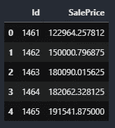

# 机器学习的降维

> 原文：<https://towardsdatascience.com/dimensionality-reduction-for-machine-learning-ef20d8a108d?source=collection_archive---------23----------------------->


照片由 [Siora 摄影](https://unsplash.com/@siora18?utm_source=medium&utm_medium=referral)在 [Unsplash](https://unsplash.com?utm_source=medium&utm_medium=referral) 上拍摄

## [理解大数据](https://towardsdatascience.com/tagged/making-sense-of-big-data)

## Python 中特征约简和选择的初学者指南

什么是高维数据？它如何影响你的机器学习模型？你有没有想过为什么你的模型不符合你的期望，你已经尝试超调参数，直到地球的尽头，没有改善？理解您的数据和模型可能是关键。在这样一个巨大而复杂的罩下，您可能会担心很少有甚至没有方法来获得对您的数据以及您的模型的更多洞察。虽然这看起来令人生畏，但最重要的是，您使用成功的、经过验证的方法来理解正在发生的事情，以使您的模型按照它的方式运行。这将焦点放在降维、预处理和特征工程上。

在我开始调试一个模型或者对它进行超调优化之前，我总是处理我的数据。我发现理解我的数据并以一种使我的模型具有最佳性能的方式处理它将最终决定我的模型参数，甚至在某些情况下决定我的整个模型。虽然预处理和特征工程是它们自己的主题，但我将在本文中讨论降维和选择。

在整篇文章中，我将使用 sklearn 库，因此拥有 sklearn 经验将是一个优势，但不是必需的。此外，对 Python 编程语言以及基本的数据科学/机器学习知识有相当好的理解是理解本文的先决条件。如果你还不知道这两个网站，你可以在我下面的主页上了解它们。我还将提到我为本文创建的 Kaggle 笔记本，它可以在下面列出的链接中找到。

<https://scikit-learn.org/>  <https://medium.com/@third_eye_cyborg>    

**数据集引用:**

Dean De Cock (2011)爱荷华州埃姆斯:波士顿住房数据作为期末回归项目的替代方案，统计教育杂志，19:3，DOI:[10.1080/10691898 . 11](https://doi.org/10.1080/10691898.2011.11889627)

## 那么，什么是高维数据呢？


由[乔尔·菲利普](https://unsplash.com/@joelfilip?utm_source=medium&utm_medium=referral)在 [Unsplash](https://unsplash.com?utm_source=medium&utm_medium=referral) 上拍摄的照片

简而言之，高维数据是带有许多特征的数据。如果数据有十个以上的特征，通常被认为是高维的。这些数据集有时会降低您的模型性能，并耗费您宝贵的计算/内存资源。对整个模型没有任何价值的特征也会增加噪音，使模型更难以最佳方式运行。为了解决这个问题，人们开发了许多工具来帮助解决这个问题。其中一些工具我将简单介绍一下。我们将使用 RFE(递归特征消除)模型删除特征行，并在 Kaggle 数据集上使用 PCA(主成分分析)模型选择关键特征，以提供一些常用工具的清晰度，帮助降低数据维数，同时保持模型的性能和准确性。我将在 XGBoost 回归模型上进行这项工作，但是也可以随意使用这些工作流来减少其他模型类型上的数据维数。之后，我会将我们的模型提交给 [***Kaggle 竞争房价——高级回归技术。***](https://www.kaggle.com/c/house-prices-advanced-regression-techniques)

  

理解特征约简(RFE)和特征选择(PCA)不同于特征提取是非常重要的。特征提取试图从现有特征中创建新的有意义的特征，而特征缩减试图通过丢弃对整体模型精度或性能不重要的特征数据的列或行来减少特征的数量。而特征选择试图找到属于数据的最关键特征，当涉及目标变量预测时，该数据解释了模型的大部分准确性或性能。找到这些较少的关键特征听起来可能很容易，但可能相当复杂。第一种可进行的要素缩减是通过任意丢弃您认为对模型整体精度不重要的要素来缩减要素。当某个要素的值很明显时，这种要素约简方法会很有用，但在更复杂的数据集上就没那么有用了。

我将利用这个笔记本的[副本，首先添加 RFE，然后添加 PCA 来观察和分析结果，然后将它们与不运行的结果进行比较。在本教程中，我将主要关注 RFE & PCA 模型的架构、差异和结果。如果你想更好地理解数据集和数据的格式化/处理，请浏览我附带的 Kaggle 笔记本。](https://www.kaggle.com/billyfeng/house-price-test)

## 原始模型

`xgb = XGBRegressor(objective=’reg:squarederror’)`

**原模型输出:**

```
output:
17662.736729452055
```

# 递归特征消除

<https://scikit-learn.org/stable/modules/generated/sklearn.feature_selection.RFE.html>  

顾名思义，RFE 模型本质上是递归的。他们试图通过用所有原始特征训练一个估计器，然后用较少的特征重新训练来减少特征。它重复这个过程，直到找到最佳数量的特征。这种类型的特征约简很受欢迎，因为它实现起来非常简单和有效。RFE 模型的应用可以远远超出本教程所涵盖的内容，因为这只是一个初学者的基本例子。

RFE 模型采用估计量(又名。模型)作为第一个参数自变量。然后将特征的数量减少到。在示例代码中，我选择将特性从 36 个减少到 30 个。可以通过`.ranking_`属性得到排名。您也可以通过`.support_`获得选择的列。由于 RFE 模型的递归性质，它们通常有运行较慢的趋势。

作者的 RFE 模型

```
output: 
{'MSSubClass': 100, 'LotFrontage': 42, 'LotArea': 4, 'OverallQual': 1, 'OverallCond': 1, 'YearBuilt': 2, 'YearRemodAdd': 1, 'MasVnrArea': 6, 'BsmtFinSF1': 1, 'BsmtFinSF2': 12, 'BsmtUnfSF': 18, 'TotalBsmtSF': 1, '1stFlrSF': 11, '2ndFlrSF': 1, 'LowQualFinSF': 60, 'GrLivArea': 1, 'BsmtFullBath': 24, 'BsmtHalfBath': 79, 'FullBath': 54, 'HalfBath': 51, 'BedroomAbvGr': 23, 'KitchenAbvGr': 1, 'TotRmsAbvGrd': 47, 'Fireplaces': 1, 'GarageYrBlt': 5, 'GarageCars': 1, 'GarageArea': 1, 'WoodDeckSF': 43, 'OpenPorchSF': 52, 'EnclosedPorch': 21, '3SsnPorch': 57, 'ScreenPorch': 8, 'PoolArea': 1, 'MiscVal': 90, 'MoSold': 39, 'YrSold': 78, 'MSZoning_C (all)': 1, 'MSZoning_FV': 3, 'MSZoning_RH': 96, 'MSZoning_RL': 110, 'MSZoning_RM': 1, 'Street_Grvl': 146, 'Street_Pave': 147, 'Alley_Grvl': 9, 'Alley_Pave': 89, 'LotShape_IR1': 74, 'LotShape_IR2': 82, 'LotShape_IR3': 91, 'LotShape_Reg': 1, 'LandContour_Bnk': 1, 'LandContour_HLS': 62, 'LandContour_Low': 121, 'LandContour_Lvl': 64, 'Utilities_AllPub': 158, 'Utilities_NoSeWa': 164, 'LotConfig_Corner': 33, 'LotConfig_CulDSac': 50, 'LotConfig_FR2': 27, 'LotConfig_FR3': 190, 'LotConfig_Inside': 86, 'LandSlope_Gtl': 45, 'LandSlope_Mod': 56, 'LandSlope_Sev': 166, 'Condition1_Artery': 1, 'Condition1_Feedr': 113, 'Condition1_Norm': 13, 'Condition1_PosA': 126, 'Condition1_PosN': 1, 'Condition1_RRAe': 30, 'Condition1_RRAn': 16, 'Condition1_RRNe': 118, 'Condition1_RRNn': 191, 'Condition2_Artery': 193, 'Condition2_Feedr': 196, 'Condition2_Norm': 195, 'Condition2_PosA': 182, 'Condition2_PosN': 162, 'Condition2_RRAe': 172, 'BldgType_1Fam': 177, 'BldgType_2fmCon': 178, 'BldgType_Duplex': 116, 'BldgType_Twnhs': 114, 'BldgType_TwnhsE': 88, 'HouseStyle_1.5Fin': 97, 'HouseStyle_1.5Unf': 122, 'HouseStyle_1Story': 66, 'HouseStyle_2.5Fin': 155, 'HouseStyle_2.5Unf': 168, 'HouseStyle_2Story': 125, 'HouseStyle_SFoyer': 123, 'HouseStyle_SLvl': 46, 'RoofStyle_Flat': 37, 'RoofStyle_Gable': 36, 'RoofStyle_Gambrel': 159, 'RoofStyle_Hip': 140, 'RoofStyle_Mansard': 134, 'RoofStyle_Shed': 169, 'RoofMatl_CompShg': 138, 'RoofMatl_Membran': 141, 'RoofMatl_Metal': 173, 'RoofMatl_Roll': 136, 'RoofMatl_Tar&Grv': 115, 'RoofMatl_WdShake': 143, 'RoofMatl_WdShngl': 14, 'MasVnrType_BrkCmn': 148, 'MasVnrType_BrkFace': 80, 'MasVnrType_None': 152, 'MasVnrType_Stone': 68, 'ExterQual_Ex': 93, 'ExterQual_Fa': 179, 'ExterQual_Gd': 104, 'ExterQual_TA': 71, 'ExterCond_Ex': 197, 'ExterCond_Fa': 7, 'ExterCond_Gd': 32, 'ExterCond_Po': 176, 'ExterCond_TA': 26, 'Foundation_BrkTil': 69, 'Foundation_CBlock': 94, 'Foundation_PConc': 98, 'Foundation_Slab': 153, 'Foundation_Stone': 132, 'Foundation_Wood': 192, 'BsmtQual_Ex': 1, 'BsmtQual_Fa': 73, 'BsmtQual_Gd': 15, 'BsmtQual_TA': 150, 'BsmtCond_Fa': 76, 'BsmtCond_Gd': 112, 'BsmtCond_Po': 175, 'BsmtCond_TA': 106, 'BsmtExposure_Av': 84, 'BsmtExposure_Gd': 1, 'BsmtExposure_Mn': 61, 'BsmtExposure_No': 1, 'BsmtFinType1_ALQ': 63, 'BsmtFinType1_BLQ': 101, 'BsmtFinType1_GLQ': 1, 'BsmtFinType1_LwQ': 95, 'BsmtFinType1_Rec': 83, 'BsmtFinType1_Unf': 174, 'BsmtFinType2_ALQ': 77, 'BsmtFinType2_BLQ': 99, 'BsmtFinType2_GLQ': 185, 'BsmtFinType2_LwQ': 120, 'BsmtFinType2_Rec': 187, 'BsmtFinType2_Unf': 171, 'Heating_Floor': 183, 'Heating_GasA': 181, 'Heating_GasW': 188, 'Heating_Grav': 194, 'Heating_OthW': 17, 'Heating_Wall': 189, 'HeatingQC_Ex': 34, 'HeatingQC_Fa': 102, 'HeatingQC_Gd': 72, 'HeatingQC_Po': 180, 'HeatingQC_TA': 105, 'CentralAir_N': 1, 'CentralAir_Y': 161, 'Electrical_FuseA': 87, 'Electrical_FuseF': 20, 'Electrical_FuseP': 157, 'Electrical_Mix': 170, 'Electrical_SBrkr': 108, 'KitchenQual_Ex': 1, 'KitchenQual_Fa': 1, 'KitchenQual_Gd': 38, 'KitchenQual_TA': 10, 'Functional_Maj1': 186, 'Functional_Maj2': 184, 'Functional_Min1': 1, 'Functional_Min2': 25, 'Functional_Mod': 107, 'Functional_Typ': 19, 'FireplaceQu_Ex': 167, 'FireplaceQu_Fa': 35, 'FireplaceQu_Gd': 44, 'FireplaceQu_Po': 165, 'FireplaceQu_TA': 92, 'GarageType_2Types': 124, 'GarageType_Attchd': 1, 'GarageType_Basment': 156, 'GarageType_BuiltIn': 85, 'GarageType_CarPort': 154, 'GarageType_Detchd': 48, 'GarageFinish_Fin': 55, 'GarageFinish_RFn': 53, 'GarageFinish_Unf': 75, 'GarageQual_Ex': 135, 'GarageQual_Fa': 70, 'GarageQual_Gd': 40, 'GarageQual_Po': 133, 'GarageQual_TA': 1, 'GarageCond_Ex': 163, 'GarageCond_Fa': 28, 'GarageCond_Gd': 160, 'GarageCond_Po': 151, 'GarageCond_TA': 109, 'PavedDrive_N': 22, 'PavedDrive_P': 149, 'PavedDrive_Y': 41, 'PoolQC_Ex': 145, 'PoolQC_Fa': 139, 'PoolQC_Gd': 119, 'Fence_GdPrv': 29, 'Fence_GdWo': 59, 'Fence_MnPrv': 67, 'Fence_MnWw': 65, 'MiscFeature_Gar2': 144, 'MiscFeature_Othr': 131, 'MiscFeature_Shed': 130, 'SaleType_COD': 49, 'SaleType_CWD': 142, 'SaleType_Con': 127, 'SaleType_ConLD': 128, 'SaleType_ConLI': 103, 'SaleType_ConLw': 58, 'SaleType_New': 1, 'SaleType_Oth': 129, 'SaleType_WD': 111, 'SaleCondition_Abnorml': 1, 'SaleCondition_AdjLand': 117, 'SaleCondition_Alloca': 137, 'SaleCondition_Family': 81, 'SaleCondition_Normal': 31, 'SaleCondition_Partial': 198}output:
16787.60477311644
```

产量大，比原来的型号好，功能少！

# 主成分分析

<https://scikit-learn.org/stable/modules/generated/sklearn.decomposition.PCA.html>  

PCA 模型试图选择最佳的关键特征。首先创建一个模型，然后用它进行拟合和预测。请注意申请是多么简单。此外，PCA 模型被认为速度更快。同样，存在更复杂的 PCA 架构，应予以考虑。我总是建议好好阅读这些文件。

作者的五氯苯甲醚模型

```
output:
18985.349823416094
```

不是很好的输出，但很接近，我们的数据噪音较小。让我们看看现在是否可以用减少的数据获得更好的 MAE 评分。

**让我们加快速度**

作者提出的更好的 PCA 模型

```
output:
17447.526995933218
```

很好！该模型比具有较少特征的原始数据集获得了更好的结果！

## 臣服于 Kaggle

虽然这不一定会是一个好成绩，但它将演示如何在 Kaggle 竞争数据集上进行降维。我将提交 RFE 模型的结果，因为它产生最低的平均绝对误差。

作者提交的 Kaggle 文件



按作者输出

**得分**

总的竞争分数只有`0.15381`，这并不是什么了不起的事情，但是很高兴知道，如果你正在处理高定义的数据，你总是可以将它减少到重要的特征，并剔除其余的。

# 结论

降维的应用远远超出了本文所包含的内容。我推荐阅读关于 RFE 模型和 PCA 模型的文档。模型选择、结构、体系结构、参数调整以及对输出进行详细分析，这些都是能够产生比示例中更好结果的方法。此外，如果你看到我犯的任何错误，请随时给我发信息、回复或给我发电子邮件*info@thirdeyecyborg.com*，我会尽快改正。感谢您的阅读和快乐编码！