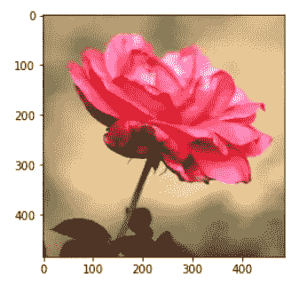

# python 中使用 PCA 进行彩色图像压缩的快速指南

> 原文：<https://towardsdatascience.com/dimensionality-reduction-of-a-color-photo-splitting-into-rgb-channels-using-pca-algorithm-in-python-ba01580a1118?source=collection_archive---------6----------------------->

## *使用 python 逐步解释如何使用 PCA 对彩色图像进行降维*


由[乔舒亚·沃罗尼耶基](https://unsplash.com/@joshua_j_woroniecki?utm_source=medium&utm_medium=referral)在 [Unsplash](https://unsplash.com?utm_source=medium&utm_medium=referral) 上拍摄的照片

如果你是数据科学或机器学习的爱好者，你一定遇到过 PCA(主成分分析)，这是一种流行的无监督机器学习算法，主要用于大型数据集的降维。我们也可以使用 PCA 对图像进行降维。

# **一个简单的用例**

让我们考虑一个案例，你正在做一个处理图像的 AI-ML 项目。通常情况下，图像有许多像素来保持其清晰度，但当系统必须处理多幅图像时，这会显著增加其大小并降低系统的性能。为了克服这种情况，我们可以使用无监督机器学习下的降维技术。为什么我们不检查一下 PCA 在这种情况下是否有用？我们将在本文中使用一张图片，并减少其尺寸，或者换句话说，使用 python 中的 PCA 压缩图像。

在文章的最后，我们将比较结果图片与原始图片，以验证我们的努力。

我在之前的文章中解释了主成分分析背后的数学原理。如果您尚未浏览，您可以[点击此处](https://medium.com/codex/principal-component-analysis-pca-how-it-works-mathematically-d5de4c7138e6)浏览。

# 现在让我们开始吧！

我们首先将图像分成三个通道(蓝色、绿色和红色)，然后对代表每个通道的每个数据集分别执行 PCA，然后将它们合并以重建压缩图像。因此，如果我们的彩色图像的形状是(m，n，3)，其中(m X n)是图像在三个通道(b，g，r)上的像素总数。

我们也可以执行相同的事情，而不分裂成蓝色、绿色和红色通道，并且将数据整形为(m，n×3)像素，但是我们已经发现，如果我们使用前面段落中提到的分裂方法，由相同数量的 PCA 分量给出的所解释的方差比会更好。

我将使用下面的照片进行演示。


作者照片

# **加载并预处理图像**

让我们先导入库:

```
import numpy as np
import pandas as pd
import matplotlib.pyplot as plt
from sklearn.decomposition import PCA
import cv2
from scipy.stats import stats
import matplotlib.image as mpimg
```

现在让我们阅读图像 rose.jpg 并显示它。

```
img = cv2.cvtColor(cv2.imread('rose.jpg'), cv2.COLOR_BGR2RGB)
plt.imshow(img)
plt.show()
```

输出:



使用以下代码检查形状:

```
img.shape
```

输出:

```
(485, 485, 3)
```

现在，我将图像分成 3 个通道，并显示每个图像:

```
#Splitting into channels
blue,green,red = cv2.split(img)# Plotting the images
fig = plt.figure(figsize = (15, 7.2)) 
fig.add_subplot(131)
plt.title("Blue Channel")
plt.imshow(blue)fig.add_subplot(132)
plt.title("Green Channel")
plt.imshow(green)fig.add_subplot(133)
plt.title("Red Channel")
plt.imshow(red)plt.show()
```

输出:


我们来验证一下蓝色通道的数据:

```
blue_temp_df = pd.DataFrame(data = blue)
blue_temp_df
```

输出:


我将所有通道的所有数据除以 255，以便数据在 0 和 1 之间缩放。

```
df_blue = blue/255
df_green = green/255
df_red = red/255
```

# 拟合和转换 PCA 中的数据

我们已经看到，每个通道有 485 个维度，现在我们将只考虑 PCA 的 50 个维度，并拟合和转换数据，检查在将数据减少到 50 个维度后解释了多少差异。

```
pca_b = PCA(n_components=50)
pca_b.fit(df_blue)
trans_pca_b = pca_b.transform(df_blue)pca_g = PCA(n_components=50)
pca_g.fit(df_green)
trans_pca_g = pca_g.transform(df_green)pca_r = PCA(n_components=50)
pca_r.fit(df_red)
trans_pca_r = pca_r.transform(df_red)
```

我们已经拟合了 PCA 中的数据，让我们检查每个通道的变换图像的形状:

```
print(trans_pca_b.shape)
print(trans_pca_r.shape)
print(trans_pca_g.shape)
```

输出:

```
(485, 50)
(485, 50)
(485, 50)
```

这是意料之中的。让我们检查每个通道的 50 个 PCA 分量(即最主要的 50 个特征值)的解释方差比率的总和。

```
print(f"Blue Channel : {sum(pca_b.explained_variance_ratio_)}")
print(f"Green Channel: {sum(pca_g.explained_variance_ratio_)}")
print(f"Red Channel  : {sum(pca_r.explained_variance_ratio_)}")
```

输出:

```
Blue Channel : 0.9946260772755372
Green Channel: 0.9918219615668648
Red Channel  : 0.987736292777275
```

哇，太棒了！因为只使用 50 个组件，我们可以保留数据中大约 99%的方差。

让我们绘制条形图，分别检查 3 个通道的每个特征值的解释方差比:

```
fig = plt.figure(figsize = (15, 7.2)) 
fig.add_subplot(131)
plt.title("Blue Channel")
plt.ylabel('Variation explained')
plt.xlabel('Eigen Value')
plt.bar(list(range(1,51)),pca_b.explained_variance_ratio_)fig.add_subplot(132)
plt.title("Green Channel")
plt.ylabel('Variation explained')
plt.xlabel('Eigen Value')
plt.bar(list(range(1,51)),pca_g.explained_variance_ratio_)fig.add_subplot(133)
plt.title("Red Channel")
plt.ylabel('Variation explained')
plt.xlabel('Eigen Value')
plt.bar(list(range(1,51)),pca_r.explained_variance_ratio_)plt.show()
```

输出:


# **重建图像并可视化**

我们已经完成了 PCA 降维。现在，我们将再次可视化图像，为此，我们必须首先反向转换数据，然后将所有 3 个通道的数据合并为一个。我们继续吧。

```
b_arr = pca_b.inverse_transform(trans_pca_b)
g_arr = pca_g.inverse_transform(trans_pca_g)
r_arr = pca_r.inverse_transform(trans_pca_r)print(b_arr.shape, g_arr.shape, r_arr.shape)
```

输出:

```
(485, 485) (485, 485) (485, 485)
```

我们可以将数据逆变换为原始形状(尽管每个通道仍然是分离的)，但正如我们所知，所有图像都已经被压缩。

我们将把所有的通道合并成一个，并打印出最终的形状:

```
img_reduced= (cv2.merge((b_arr, g_arr, r_arr)))
print(img_reduced.shape)
```

输出:

```
(485, 485, 3)
```

看到我们一开始导入的原始图像的精确形状真是太好了。现在我们将并排显示两幅图像(原始图像和缩小图像)。

```
fig = plt.figure(figsize = (10, 7.2)) 
fig.add_subplot(121)
plt.title("Original Image")
plt.imshow(img)fig.add_subplot(122)
plt.title("Reduced Image")
plt.imshow(img_reduced)plt.show()
```

输出:


令人惊讶的是，压缩后的图像与原始图像非常相似(至少我们仍然可以识别出它是一朵玫瑰),尽管我们已经将每个通道的维度从 485 减少到了 50。但是，我们已经实现了我们的目标。毫无疑问，现在计算机处理缩小的图像会快得多。

# **结论**

我已经解释了我们如何使用 PCA 通过将彩色图像分成 3 个通道来降低其维度，然后将其重建回来用于可视化。

我希望你喜欢阅读这篇文章并从中学习。

你可以从下面提到的 github 链接下载完整的代码和我在这里展示的图片，它们在同一个目录下:

[](https://github.com/iqbal-01/Machine-Learning/blob/main/Unsupervised%20Learning/PCA/PCA-image-reduction.ipynb) [## Iqbal-01/机器学习

### 通过在 GitHub 上创建帐户，为 Iqbal-01/机器学习开发做出贡献。

github.com](https://github.com/iqbal-01/Machine-Learning/blob/main/Unsupervised%20Learning/PCA/PCA-image-reduction.ipynb)