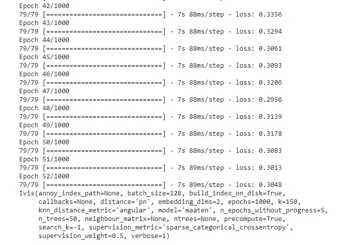
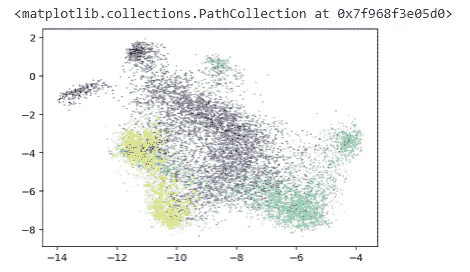

# 图像数据集的降维

> 原文：<https://towardsdatascience.com/dimensionality-reduction-of-image-dataset-60d65d510efb?source=collection_archive---------31----------------------->

## 使用 Ivis 降低超大型数据集的维度


在 [Unsplash](https://unsplash.com?utm_source=medium&utm_medium=referral) 上由 [Hitesh Choudhary](https://unsplash.com/@hiteshchoudhary?utm_source=medium&utm_medium=referral) 拍摄的照片

使用高维数据创建机器学习模型会导致模型具有非常高的方差和过度拟合，这意味着该模型不够一般化以用于看不见的数据。在数据科学领域，它也被称为维数灾难。

为了摆脱这种维数灾难，我们可以对数据进行降维处理，这样不仅可以使模型具有足够的泛化能力，而且对未知数据具有更好的性能和更高的精度。有不同的 Python 库有助于降维。Ivis 就是这样一个库。

Ivis 是一个开源 Python 库，用于降低非常大的数据集的维度。它是可扩展的，这意味着它是快速和准确的，也是通用的，这意味着它可以用于解决多个问题。

在本文中，我们将探讨 Ivis 及其功能。

让我们开始吧…

# 安装所需的库

我们将从使用 pip 安装来安装 Ivis 开始。下面给出的命令将使用 pip 安装 Ivis。

```
!pip install git+https://github.com/beringresearch/ivis
```

# 导入所需的库

在这一步中，我们将导入加载数据、降低数据维度以及可视化数据所需的所有库。

```
import random
import numpy as np
import tensorflow as tf
from ivis import Ivis
from sklearn.datasets import fetch_rcv1
from sklearn.utils import resample
from sklearn.decomposition import TruncatedSVD
import matplotlib.pyplot as plt
```

# 正在加载数据集

我们将在本文中使用的数据集将从 Sklearn 加载。该数据集的名称为 RCV1，由于它是一个巨大的数据集，因此需要一些时间来加载。

```
rcv1 = fetch_rcv1()
rcv1.data.shape
```


数据集(来源:作者)

# 创建模型

现在，我们将创建模型，并使用 IVIS 对其进行训练，以降低维度。

```
N_SAMPLES = 10000 
X, y = resample(rcv1.data, rcv1.target, replace=False,
                n_samples=N_SAMPLES, random_state=1234)
X = TruncatedSVD(n_components=150).fit_transform(X)
ivis = Ivis(model='maaten', n_epochs_without_progress=5)
ivis.fit(X)
```



经过训练的模型(来源:作者)

# 可视化维度

现在我们将把减少的维度形象化。

```
from IPython.display import set_matplotlib_formats
set_matplotlib_formats('retina')
embeddings = ivis.transform(X)
plt.scatter(embeddings[:, 0], embeddings[:, 1], s=0.1, c=np.argmax(y.toarray(), axis=1))
```



尺寸(来源:作者)

在这里，你可以清楚地看到使用 IVIS 嵌入减少的维度。尝试使用不同的数据集，并在回复部分告诉我您的意见。

本文是与[皮尤什·英格尔](https://medium.com/u/40808d551f5a?source=post_page-----60d65d510efb--------------------------------)合作完成的。

# 在你走之前

***感谢*** *的阅读！如果你想与我取得联系，请随时通过 hmix13@gmail.com 联系我或我的* [***LinkedIn 个人资料***](http://www.linkedin.com/in/himanshusharmads) *。可以查看我的*[***Github***](https://github.com/hmix13)**简介针对不同的数据科学项目和包教程。还有，随意探索* [***我的简介***](https://medium.com/@hmix13) *，阅读我写过的与数据科学相关的不同文章。**