# 自动编码器与 PCA 的降维比较

> 原文：<https://towardsdatascience.com/dimensionality-reduction-with-autoencoders-versus-pca-f47666f80743?source=collection_archive---------5----------------------->

## 神经网络可以像经典的主成分分析一样进行降维吗？

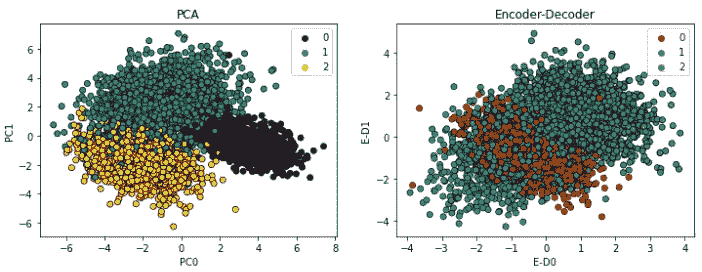

PCA(左)和 Autoencoder(右)降维示例。

# 介绍

**主成分分析**是最流行的降维算法之一。主成分分析的工作原理是找出在相互正交的数据中占最大方差的轴。 **i** ᵗʰ轴称为 **i** ᵗʰ主分量(PC)。执行 PCA 的步骤是:

*   将数据标准化。
*   从协方差矩阵或相关矩阵中获取特征向量和特征值，或者进行奇异值分解。

我们将使用 sklearn 的实现来执行 PCA:它使用来自 scipy ( `[scipy.linalg](https://docs.scipy.org/doc/scipy/reference/linalg.html#module-scipy.linalg)`)的奇异值分解(SVD)。SVD 是 2D 矩阵 a 的因式分解，它可以写成:

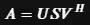

s 是一个 1D 数组，包含了 **A** 的奇异值； **U** 和 **V^H** 为一元(**u**ᵗ**u**=**uu**ᵗ= I)。大多数 PCA 实现执行 SVD 以提高计算效率。

**另一方面，自动编码器** ( **AE** )是一种特殊的神经网络，它被训练成将其输入复制到其输出。首先，它将输入映射到一个降维的潜在空间，然后将潜在表示编码回输出。AE 通过减少重建误差来学习压缩数据。

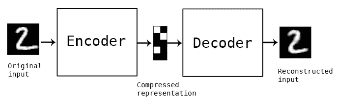

具有编译码器结构的自动编码器的简单结构。

我们马上会看到如何实现和比较 PCA 和 Autoencoder 的结果。

我们将使用来自 sklearn 的 *make_classification* 生成我们的数据，这也将为我们提供一些标签。我们将使用这些标签来比较我们的方法之间的聚类效率。将会有三个部分。

首先，我们将实现一个简单的欠完整线性自动编码器:也就是说，一个具有比输入维数低的单层的自动编码器。第二部分将介绍堆叠式线性自动编码器。在第三部分，我们将尝试修改激活函数，以解决更多的复杂性。

结果将与 PCA 进行图形比较，最后我们将尝试使用简单的随机森林分类算法和交叉验证来预测类别。

**数据准备**

下面是设置数据的所有代码:首先，我们导入必要的库，然后用 scikit-learn 的“make classification”方法生成数据。在 50 个特征中，我们将指定只有 15 个是信息性的，并且我们将约束我们的归约算法只挑选 5 个潜在变量。

一旦我们有了数据，我们就把它分成训练-验证-测试。我们将使用神经网络(NN)的验证数据，而测试集将用于检查最终的一些分类性能。

最后，我们标准化我们的数据:注意，我们仅在训练数据集上拟合缩放器，然后转换验证和测试集。

生成—拆分—数据标准化。

左侧的数据关联热图显示了一些相关的要素，但大多数并不相关。在右侧，我们绘制了特征的方差，从中我们可以推断出只有 10–15 个变量可以为我们的数据集提供信息。

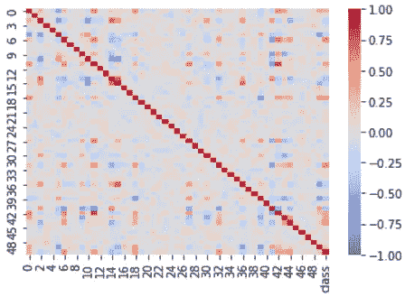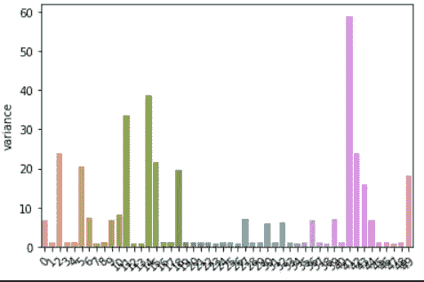

数据集的关联热图(左)。每个变量的方差(右)。

# 欠完整线性自动编码器

在本节中，我们将看到如果我们执行这些操作，数据会发生什么变化:

1.  将数据压缩到 5 个潜在维度
2.  使用线性激活函数
3.  使用“MSE”作为损耗度量

让我们来设置这个 **AE** :

自动编码器

首先，我们定义编码器模型:注意，输入形状被硬编码到数据集维度，并且潜在空间被固定为 5 维。解码器模型是对称的:在这种情况下，我们指定 5(潜在维度)的输入形状，其输出将是原始空间维度。最终的模型“autoencoder”将耦合这两者。

然后，我们使用随机梯度下降 SGD 优化器编译具有均方误差度量的自动编码器，固定学习率为 0.1

在拟合步骤中，我们简单地指定验证数据，并且如果验证损失没有改善，则使用早期停止回调来停止训练。
最后，我们可以只使用模型的第一部分“**encoder . predict(X _ tr _ STD)**来计算编码。这个模型非常简单:

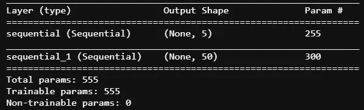

自动编码器的型号摘要。

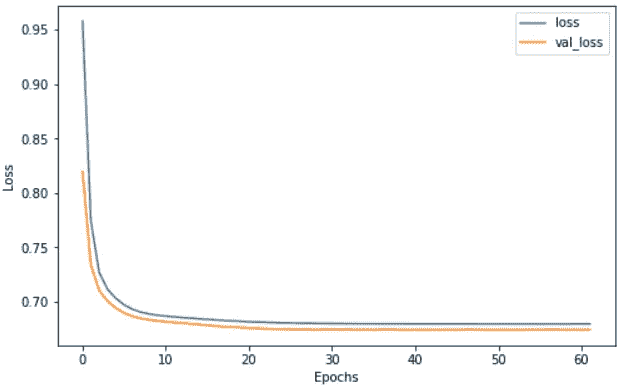

AE 的学习曲线。

从学习曲线中，我们看到拟合在 60 个时期后停止，损失约为 0.7。产生的前两个编码如下所示:

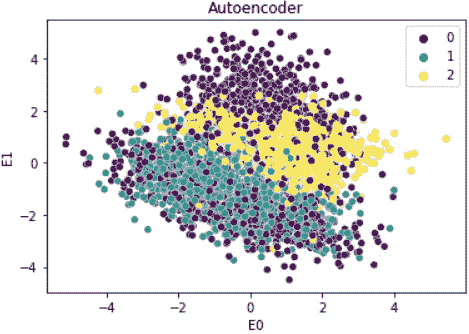

编码器原始数据的前 2 个潜在维度。

**PCA** 实现:使用 sklearn 很简单。

下面我们绘制了前 3 个组件的 PCA(左图)和编码器(右图)的聚类训练数据。

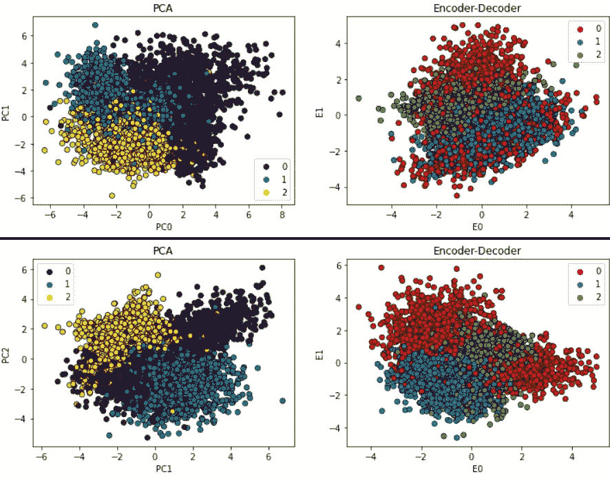

PCA 的组件 0–1–2(左)和编码器(右)之间的聚类比较。

从上面的图来看，似乎两种算法都以相似的方式进行了降维。很难推断哪个表现更好。让我们来看看这些编码的一些性质。

下面我们绘制了 PCA(左)和 Autoencoder(右)组件的标准偏差。

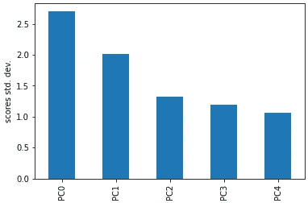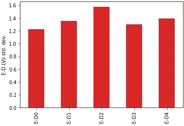

成分的标准偏差。

从这些柱状图中，我们可以看出，对于与 PCA 相关的数据，主成分的标准偏差随着每一个主成分的减少而减少，这是意料之中的。另一方面，所有编码的标准偏差几乎相等。

下面我们绘制了 PCA(左)和编码器(右)组件的相关图。

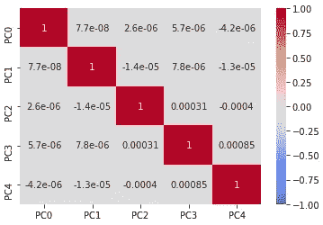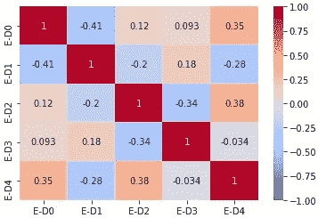

PCA 成分(左)和编码(右)的皮尔逊相关热图。

从该图中我们还可以看到，虽然 PC 彼此正交:它们不相关，但对于编码来说却不是这样。它们之间显示出某种相关性。事实上，我们的神经网络模型对这种行为没有任何限制。网络找到了在潜在空间中映射原始输入的最佳方式。

从原始空间到两个不同潜在空间的分类性能如何？有区别吗？我们可以使用交叉验证来试验 RandomForestClassifier，看看结果。代码如下:

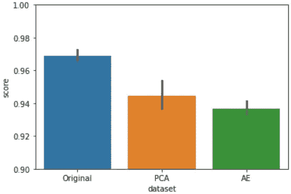

三个数据集的分类分数。

从上面的柱状图中我们可以看到，除了 5 个以外，其他的都被移除了，这降低了预测的准确性。PCA 和 AE 数据减少的性能是可比较的，然而 AE 的性能比 PCA 稍差。

现在，我们将尝试了解更复杂的 AE 叠加是否会导致更好的结果。

# 线性堆栈编码器-解码器

这里，我们实现了一个编码器-解码器网络结构，但在这种情况下，我们将堆栈更多的隐藏层。这应该允许网络更灵活地学习不同的、最具信息性的特征。

编码器层数为:50(输入)—20–15–5。损失与之前的不良事件相当。解码器正好对称。组件如下所示。

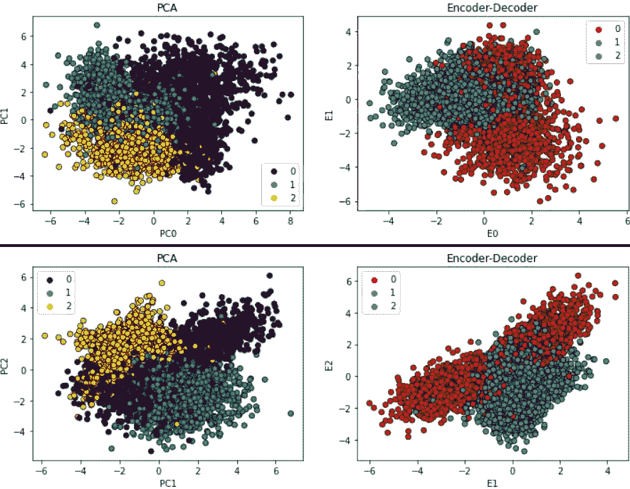

PCA(左)和 AE(右)的前 3 个成分散点图。

分类性能方面的结果是:

不同数据集之间的分类性能。

显然，叠加隐藏层比简单的声发射效果更好。然而，这些层的确切配置可以针对具体问题进行微调。

# 非线性堆叠编码器-解码器

非线性堆叠 AE 将容易实现为具有激活功能的堆叠 AE。我们还在 SGD 优化器上引入了一个衰减常数，这样学习率就会随着时间的推移而降低。我们选择“卢瑟”作为所有层的激活层。请注意，这里我们已经增加了更多的复杂性:我们可以尝试找到最佳数量的隐藏层，最佳的激活函数和形状的每一层的具体问题。

以下是前三个组成部分:

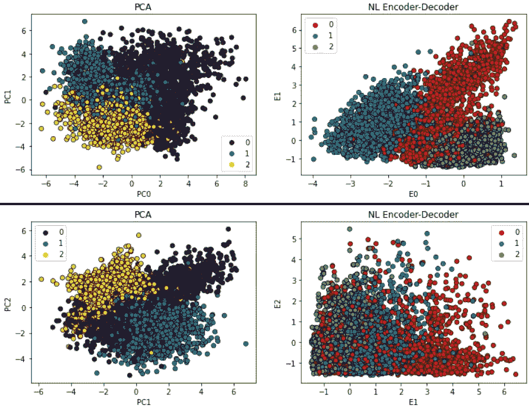

非线性激活的 PCA(左)和 AE(右)的前三个组件。

至于分类性能，允许网络学习非线性特征有助于提高整体性能，这似乎比 PCA 平均好，但在误差范围内。

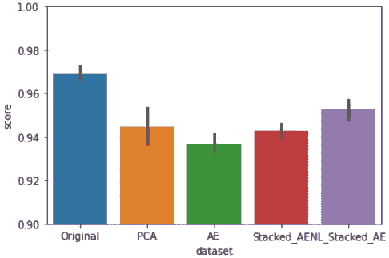

所有数据简化算法的分类性能。

# 结论

我们使用来自 sklearn 的 make_classification 构建了一个玩具数据集，用于分类练习，包含 50 个特征。我们的目的是比较 PCA 和自动编码器神经网络，看看维数减少是否具有可比性。

我们查看了分数/编码的属性，我们看到来自 AE 的编码具有一些相关性(协变矩阵不像 PCA 中那样是对角的)，并且它们的标准偏差是相似的。

从只有 1 层的简单线性欠完整 AE 开始，我们看到增加的复杂性有助于模型达到更好的性能，根据分类准确性进行评估。

最后，我们看到，非线性模型仍然可以比其他两个模型(单层 AE 和堆叠 AE)执行得更好，但性能仍然可以与该数据集中的 PCA 相媲美。

我们现在可以回答最初的问题:神经网络可以像经典的主成分分析一样进行降维吗？

答案是肯定的，它可以像 PCA 一样执行维数减少，因为网络将找到在潜在空间中编码原始向量的最佳方式。但不，潜在向量的属性是不同的，网络本身可能需要针对特定的任务进行调整，以便更好地执行，就像我们对更多隐藏层所做的那样。