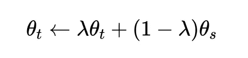
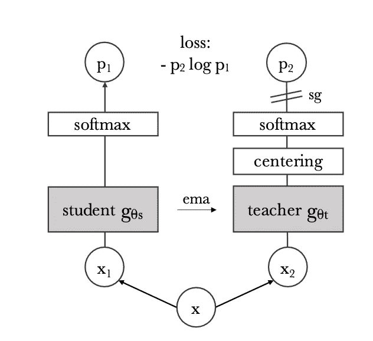
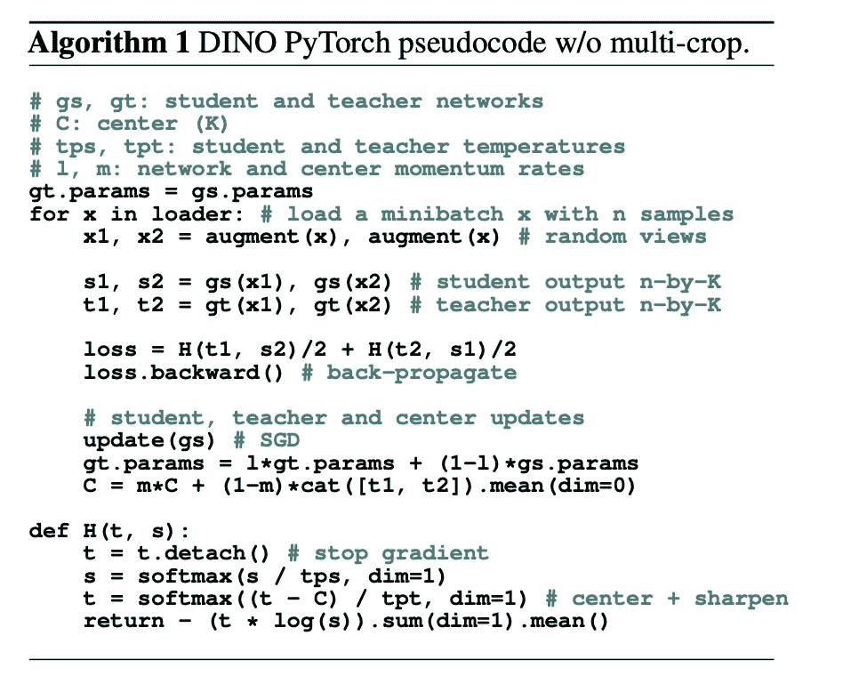
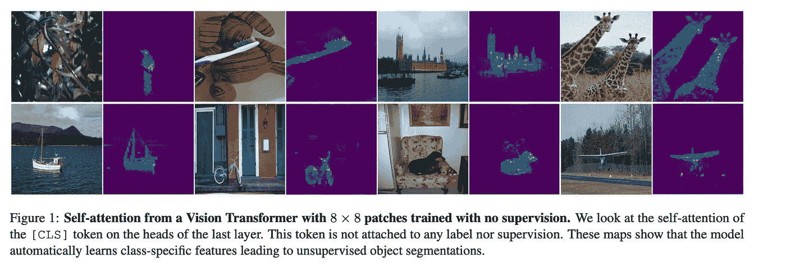

# DINO:自监督视觉变压器中的新兴特性摘要

> 原文：<https://towardsdatascience.com/dino-emerging-properties-in-self-supervised-vision-transformers-summary-ab91df82cc3c?source=collection_archive---------7----------------------->

## 对脸书惊人的视觉变形金刚迪诺的深入总结

DINO 是脸书人工智能公司开发的一个新的自我监督系统，能够从未标记的数据中学习令人难以置信的表示。下面是一个视频，显示了它的注意力地图，我们看到该模型能够自动学习特定于类的特征，从而实现精确的无监督对象分割。这是在他们的论文*“自我监督视觉变形金刚的新兴特性”*中介绍的

这里有一个它如何工作的总结👇

***TLDR；***

# **网络:**

这个网络通过一个叫做“自我升华”的过程来学习。有一个教师和学生网络都具有相同的架构，一个**视觉转换器(ViT)** 。

老师是一个**动量老师**这意味着它的权重是学生权重的指数加权平均值。在论文“*无监督视觉表征学习的动量对比”*中引入了动量老师，以便在老师和学生是相同的并且不管输入如何都输出相同的嵌入时防止模式崩溃。

教师权重的更新规则是:

等式 1:更新规则，其中θt 和θs 是教师和学生的权重([来源](https://arxiv.org/abs/2104.14294))

在本文的训练期间，λ遵循从 0.996 到 1 的**余弦规律。**

# 数据:

正如在自我监督学习中常见的那样，对一幅图像进行不同的裁剪。小作物称为局部视图(<50% of the image) and large crops( >图像的 50%)称为全局视图。

所有作物都通过学生传递，而只有全局视图通过教师传递。 ***这鼓励“地方到全球”的对应，训练学生从少量作物中插入上下文。*** 见图 1。

颜色抖动、高斯模糊和曝晒的随机增强也应用在视图上，以使网络更加健壮。

# 失败

教师和学生各自预测一维嵌入。应用 softmax 和交叉熵损失来使学生的分布与教师的分布相匹配

Softmax 就像一个归一化，它转换原始激活来表示每个特征相对于整体的存在程度。例如)[-2.3，4.2，0.9，2.6，6]-->[0.00，0.14，0.01，0.03，0.83]因此，我们可以说最后一个功能的强度为 83%，我们希望学生的也是如此。因此，我们要求我们的学生网络拥有与教师相同的功能比例。 ***具有较大上下文的教师预测学生也必须匹配的更多高级特征。***

交叉熵损失试图使两个分布相同，就像在知识提取中一样。

这也可以看作是一个虚构的分类问题。我们要求我们的网络提出一个分类问题，这样网络就可以从局部视图中学习有意义的全局表示。

图 2:迪诺流量([来源](https://arxiv.org/abs/2104.14294))

# 居中和锐化

模式折叠有两种形式:不管输入是什么，模型输出在所有维度上都是相同的(即任何输入的输出都是相同的)，或者由一个维度支配。居中和锐化旨在防止这两种情况。

**居中**:从教师的原始激活中减去其指数移动平均值。简单来说就是:

*Logits = Logits-Logits _ mean*

***这意味着当激活高于平均值时，激活有时必须为正，当低于平均值时，激活有时必须为负。*** 这防止了任何一个特征占主导地位，因为平均值将处于范围的中间。我们知道 softmax 给负数很低的值，给正数很高的值。

**锐化*:锐化等同于对 softmax 应用一个温度，人为地使分布更加尖峰*** ，即放大微小的差异，从而有一个或一些高值和一些低值。这防止了所有的激活都是相同的值，因为小的差异被夸大了。这与不断改变高激活的中心协同作用。锐化也有助于学生获得更强的信号，它应该增加哪些功能。

DINO Psedudocode:

图 3: DINO Psedudocode( [来源](https://arxiv.org/abs/2104.14294))

# 可视化:

这里有一些注意力地图显示，迪诺能够专注于图像中感兴趣的物体。这意味着 DINO 很好地理解了对象语义，它的注意力图看起来就像分段掩码。

图 4:注意力地图([来源](https://arxiv.org/abs/2104.14294)

我们还发现，恐龙的潜在空间甚至在动物群体中也有很好的分类，这意味着它的特征足够丰富，可以区分物体的微小差异。这使得它非常适合下游任务和迁移学习。

它在识别重复图像方面也做得很好，如下所示。

# 总结:

学生 ViT 学习在动量老师 ViT 的嵌入的交叉熵损失的监督下，从局部面片预测图像的全局特征，同时进行居中和锐化以防止模式崩溃…哇，这是一大堆术语！

— — — — — — — — — — — — — — — — — — — — — — — — — —

自监督视觉变压器中新兴特性的相关链接:

博客:[https://ai . Facebook . com/blog/dino-paws-computer-vision-with-self-supervised-transformers-and-10x-more-efficient-training/](https://ai.facebook.com/blog/dino-paws-computer-vision-with-self-supervised-transformers-and-10x-more-efficient-training/)

GitHub:【https://github.com/facebookresearch/dino 

论文:[https://arxiv.org/abs/2104.14294](https://arxiv.org/abs/2104.14294)

[https://twitter.com/schrep/status/1388189398496202752](https://twitter.com/schrep)的推文:

扬尼克:[https://www.youtube.com/watch?v=h3ij3F3cPIk&t = 2106s](https://www.youtube.com/watch?v=h3ij3F3cPIk&t=2106s)