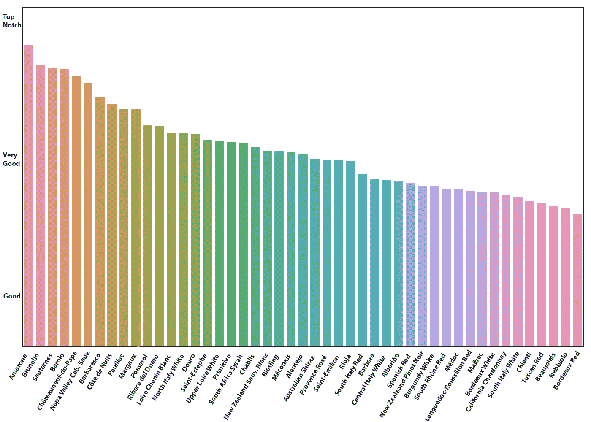

# Dionysos 2.0🍇:葡萄酒推荐系统和互动品尝空间

> 原文：<https://towardsdatascience.com/dionysos-2-0-wine-recommeder-system-interactive-tastespace-d631f3c35d5e?source=collection_archive---------29----------------------->

## 如何将一个人的口味与他们可能喜欢的葡萄酒相匹配(另外:根据他们的口味对葡萄酒进行最先进的可视化)

狄俄尼索斯，或巴克斯，是希腊罗马的酒神。他可能会批准这项工作。图片由我的好友马西莫·德安东尼斯制作

H ello 那里。今天我将继续我之前在**葡萄酒世界的冒险，以及如何利用它的数据**。事实上，在我上一篇文章的结束语中，我想知道为每一瓶酒制作一个单独的**口味配置文件会有多有趣，这样就可以与一个人**的**口味偏好相匹配。事实证明，没有必要在葡萄酒销售网站上工作来做到这一点。对了，这叫“推荐系统”。**

今天的轶事风格将有所不同。它**不会是一个编码教程**，因为有很多这样的教程，由比我更有资格的老师制作。虽然告诉你下面的一切都可以通过 Python 来完成可能有些有趣，而且网上有很多免费资源可以学习如何做。

无论如何，我想谈两件事:第一，如何将一个人的口味与他们潜在喜欢的葡萄酒相匹配，这是一个简单得令人麻木的过程。第二个是**创新的、互动的、数据驱动的葡萄酒地图，根据成千上万的用户**的判断。据我所知，这是第一次制作这样的地图，所以我很兴奋能展示它。

首先，我们需要关于葡萄酒的数据，特别是关于人们给每瓶葡萄酒赋予某种口味的数据。在野外没有这样的数据集，所以必须从头开始构建。一种方法是编写一个“ **webscraper** ”来从一个葡萄酒销售网站上收集这样的数据。现在这在技术上是不允许的，但是有很多博客帖子公开说他们已经做到了，所以把我也算进去。此外，从浪漫的角度来看，这可以被视为对罗宾汉传奇的现代扭曲，每天从我们这里提取数据的网站本身就是他们计划的受害者。不谦虚的文学比较放在一边，我没有从中赚到任何东西，所以它应该是好的。

因此，我们神奇地拥有了一个葡萄酒的数据集，并对它们的味道特征进行了估计，这是非常简洁的。显然，为了减少数据中的噪音，我们将选择一些阈值，只包括具有一定数量用户投票的葡萄酒。然后，我们需要用户的**口味档案，包括他或她对葡萄酒瓶的所有评价，这些葡萄酒有自己的口味特征。对我们来说幸运的是，这也很容易免费获得。我随机挑选了一个用户作为案例研究，因为他碰巧喜欢我最喜欢的一瓶酒，因此显然品味不错。我们就叫他“Em”。**

Em 喜欢许多不同的葡萄酒，它们的口味特征会有很大的不同，所以我们将缩小他最喜欢的类型的模型:波尔多红酒。下一步将包括对他的**用户数据**运行**线性回归**(即 *"* 一种机器学习算法 *"* )，然后将我们的模型推广到**葡萄酒数据**中的其余瓶子。

# 让我们来看一下这个过程:

首先，分配给葡萄酒的味道特征太多了，所以我们需要在不丢失信号的情况下压缩它们。这些特征也**高度共线**，这实质上意味着它们是相关的，这对模型是不利的。举个简单的例子，如果我们考虑“咖啡”、“摩卡”和“浓缩咖啡”等口味，那么来自不同用户的投票就有道理了，这些投票分散在所有这三个实际上来自同一源头的特征上:一种类似咖啡的味道。手动处理这个问题的想法令人望而生畏。幸运的是，有更好的选择；其中之一就是**主成分分析** (PCA)。

用一个*非常*非技术性的解释来说，PCA 所做的是**“挤压”数据集中的特征，**同时**保持它们的描述性**。正是我们需要的！多亏了主成分分析，我们可以从 200 多种味觉特征减少到 20 种，所以它实际上是在不断发现新的*原型*味觉。缺点是这些压缩的特性不能像原始的那样被解释，但是这不是问题，你马上就会明白为什么。

我们将主成分分析应用于所有的数据，即用户，或"**训练**，数据集和葡萄酒，或"**测试**，数据集。否则，数据集之间的压缩要素将不匹配。然后，我们可以对用户数据运行线性回归，或“**假设**”，将评分作为因变量。这样做的目的是在用户的评分和压缩的口味特征之间建立一条线。通过这样做，它"**学习**"将什么数字分配给**系数**，这些系数乘以味觉特征值以确定评级。如果这不是 100%清楚的，我有一种感觉可能不是，我会尝试用好的线性回归公式来做到这一点:

希望这澄清了上述内容。这些系数也被称为贝塔系数(这里使用的符号)或西塔系数，这并没有什么帮助，这取决于你问的是谁。数学是关于精确性和一致性的，对吗？作者图片

答然而，正如你所看到的，我们获得的这些β/θ/系数可以乘以任何葡萄酒的相应味道特征的值，给出 Em 对该瓶酒的**预测评级**。

换句话说，它们代表了 Em 对波尔多红酒独特口味偏好的组合。我说过这很容易，不是吗？

显然，这个模型应该应用于与训练集一致的葡萄酒。我对 307 瓶波尔多梅多克葡萄酒(这是 Em 评级最高的葡萄酒)进行了测试。**在下面，您可以滚动查看 Em 潜在喜欢和不喜欢的葡萄酒的所有口味特征的值**(即它们的预测评级高于或低于某些阈值)。葡萄酒的名称和价格被故意省略了。

我们正在查看 PCA 压缩前的原始数据，因此**味道特征仍然有意义**。事实上，研究结果似乎表明，新兴市场更喜欢带有黑醋栗和红色水果味道以及小维多葡萄味道的朴实和烟熏葡萄酒，而不喜欢带有强烈巧克力和皮革味道以及番茄味道的葡萄酒。

当然，检验这一点的唯一方法是让他们品尝这些葡萄酒，然后告诉我们他的想法。由于我个人并不了解他，我一直在记录自己喜欢和不喜欢的葡萄酒，以便最终在自己身上进行实验。如果你有这种类型的数据，并想尝试让我知道！

最近，最大的葡萄酒销售网站之一为他们的用户推出了这样一个品酒匹配服务。我敢打赌，它和我在这里展示的不会有太大的不同。

**P.S** 机器学习爱好者会注意到，我跳过了“**交叉验证**”这一步，在这一步中，我会避免使用用户数据中的部分葡萄酒来训练算法，而是通过比较预测评级与实际评级，使用这个子集来评估学习的贝塔系数的有效性。然而，考虑到这篇文章的范围，这一步被忽略了。**从更严格的角度来看，这可能是最基本的**。

# 既然我们已经解决了这个问题，

让我们进入帖子的第二部分。它与前一部分有联系，因为我们将对数据集中的所有葡萄酒应用 PCA 的进化版本。可以把这想象成类固醇上的主成分分析，它可以用来压缩数据，同时把实体之间的各种关系表示为二维(或三维)地图上的距离。在这种情况下，我使用的是 [**UMAP**](https://umap-learn.readthedocs.io/en/latest/) ，如果你被这种算法吸引，我建议你看看 [**亚历克斯·泰利亚**](https://webspace.science.uu.nl/~telea001/Main/HomePage) 的作品，他在这个主题上做了一些相当有趣的事情。

不管怎样，通过这个算法，我制作了一个有意义的、可探索的葡萄酒地图，根据成千上万的用户对葡萄酒的口味(T21)进行排列。或者更具体的说，一张 **3834 款酒**的地图，来自 **110** 不同**特产**，按照他们在 **169** 不同**口味**中的分数排列，由大约 **492** 投票产生。 **516** 独特的**人**。

我不是要和任何侍酒师以及他们对这一主题的严格研究唱反调，但这 50 万人的集体思维可能是一个比酒瓶上的简要描述更可靠的葡萄酒味道评估者。

让我向你展示交互式的地图，你可以在那里探索这个地图。据我所知，你将是第一批有机会这样做的人。这和探索一个新的大陆是不一样的，但它仍然很迷人，不是吗？

在一位精通 JavaScript 的朋友的指导下，我添加了**按钮，突出显示与相应口味相关的葡萄酒。**这些口味可以按瓶分类，也可以按整个品种分类。我选择了后者，因为它给出了更多关于为什么算法选择在二维空间中排列葡萄酒的见解，尽管它使用的唯一信息是单个瓶子的味道分数。

不幸的是，我不能在这里直接嵌入互动情节，所以你必须去这个链接:【https://dionysus-stempio.netlify.app/[。与此同时，这里有一个 GIF 预览:](https://dionysus-stempio.netlify.app/)

您可以放大和缩小、单击和拖动来浏览地图。每个点对应一瓶葡萄酒，并根据其地理来源(底部的图例)进行着色。当您点击一个品尝按钮时，具有所选口味的葡萄酒专业名称将出现在右上角，其对应的点将保持彩色，而不具有所选口味的点将变为透明。将鼠标悬停在单款葡萄酒上，会显示出它们的葡萄和特色。作者 Gif

又一次，葡萄酒的名称和价格被故意省略了。虽然我短暂地修补了将情节转变为一种工具的想法，在这里人们可以看到**高级奢侈葡萄酒**的廉价替代品，应该在味道方面得到类似的评判。然而，最后我还是决定不要。众所周知，人类不善于将葡萄酒的价格与其客观口味区分开来。况且其他奢侈品也是如此(有人说苹果吗？).

我认为在像波尔多的葡萄酒城这样的博物馆里给游客们一个视觉上更加修饰的地图版本可能是个不错的主意，甚至可能是三维的。我向他们提出了这个想法，但从未收到\_(ツ)_/的回复

除非我有新的灵感，否则这个关于葡萄酒及其数据的系列到此结束！尽管很少有东西像好酒一样令人兴奋，但我会在这个数据时代寻找新的惊喜。

> 感谢阅读！

> 如果你想知道哪种葡萄酒是最受赞赏的特色酒，请参考以下图片:

仅包括额定至少 40 瓶的专业产品。作者图片