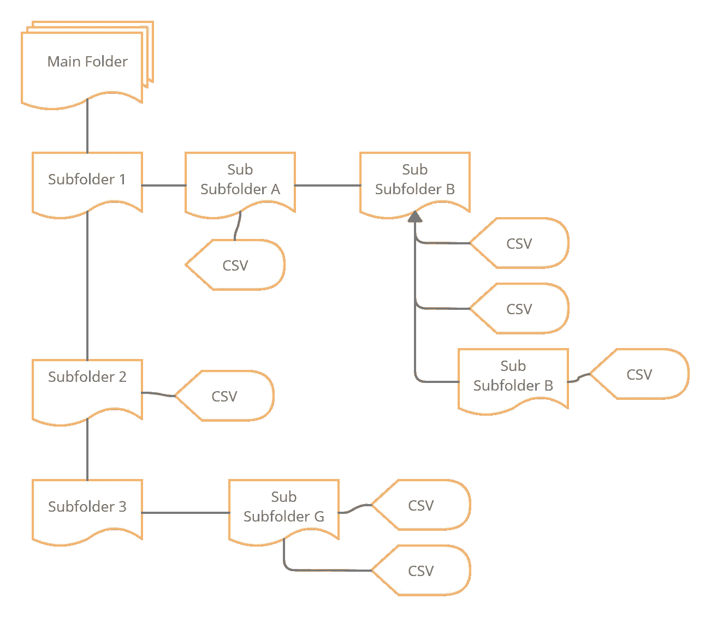

# CSV 到 MATLAB 结构的目录

> 原文：<https://towardsdatascience.com/directory-of-csvs-to-matlab-structure-ff761462ff2f?source=collection_archive---------33----------------------->

## 一个很好的小递归函数，用于将表格读入 MATLAB


汤姆·波德莫尔在 [Unsplash](https://unsplash.com?utm_source=medium&utm_medium=referral) 上的照片

我在工作中经常处理的一件事是将 CSV 文件读入 MATLAB。通常情况下，我有一个嵌套的目录集，其中包含。csv 文件，需要解析成我的代码。主要的烦恼是不能保证有多深和多少。csv 文件将位于子目录中。那么我们如何解决这个问题呢？递归！

## 示例目录结构

假设我们有以下需要解析的结构:



具有 CSV 的多级目录结构(由作者使用 Creately 创建的图像)

目的是加载所有这些。csv 文件转换为具有与上述相同命名约定的结构，并且每个端点节点都是读入 MATLAB 的实际表格。一旦我们有了这个，生活就会变得容易处理得多。

## 递归

这是完成所有工作的函数:

```
**function configurationObject = structifyCSV(entry_path)** configurationObject = struct;d_struct = dir(entry_path); for i=1:length(d_struct) if d_struct(i).isdir==0 && contains(d_struct(i).name,’.csv’) d = readtable([d_struct(i).folder ‘/’ d_struct(i).name]); configurationObject.(strrep(d_struct(i).name,’.csv’,’’))=d; else if d_struct(i).isdir==1 && ~ismember(d_struct(i).name
            {‘.’,’..’}) % Go deeper ** co = structifyCSV([d_struct(i).folder ‘/’
            d_struct(i).name]);  % RECUR (1)** configurationObject.(d_struct(i).name)=co; end end endend
```

## 伪码

这里棘手的部分是确保您正确选择了有效的。用于 **readtable** 加载的 csv 文件或可能包含其他文件的新子目录。csv 文件和子文件夹。作为一个额外的技巧，当执行 **dir** 命令时，它将传回一个也包含**' . '的结构**和**‘..’**用作当前目录替代的目录('.')并向上移动一个目录(“..”).

在对 **dir** output 命令的循环中，我首先使用 **~isdir** 检查传回的内容是否是一个文件，以及名称字符串是否包含**。csv** 子串。如果这两个条件都满足，那么我们可以使用 **readtable** 加载它。

在另一种情况下，如果我们看到它是一个目录，我还要确保它不是两种特殊情况的成员。,..).(NB: **ismember** 是目前为止我最喜欢的功能！).如果这都是真的，那么这个函数调用它自己，然后再做一遍！

在上面的代码中，你可以看到，在注释(1)中，我们只是再次调用了函数。随着深度的不断增加，它会越来越频繁地重现，然后爆炸！你得到了你想要的。

你可以这样称呼它:

```
configurationObject = structifyCSV([my_path]);
```

## 摘要

MATLAB 很棒，但是有些任务有时有点烦人。这是我面临的一个常见问题，所以将逻辑放在一个可重用的函数中会让事情变得容易得多。未来的凯尔感谢我。