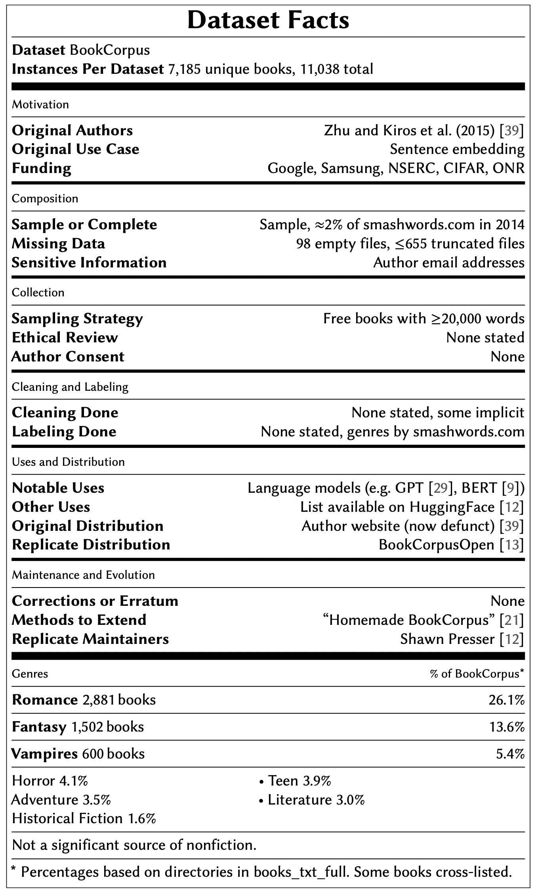

# 机器学习中的关键数据集 BookCorpus 的肮脏秘密

> 原文：<https://towardsdatascience.com/dirty-secrets-of-bookcorpus-a-key-dataset-in-machine-learning-6ee2927e8650?source=collection_archive---------23----------------------->

## [公平和偏见](https://towardsdatascience.com/tagged/fairness-and-bias)

## 仔细看看 BookCorpus，这是一个帮助 Google、OpenAI、Amazon 和其他公司训练大型语言模型的文本数据集

照片由[贾维尔·基罗加](https://unsplash.com/@javiertenenbaum?utm_source=unsplash&utm_medium=referral&utm_content=creditCopyText)在 [Unsplash](https://unsplash.com/s/photos/dirty-books?utm_source=unsplash&utm_medium=referral&utm_content=creditCopyText) 上拍摄

据 [HuggingFace](https://huggingface.co/datasets/bookcorpus) 报道，BookCorpus 已经帮助训练了至少三十个有影响力的语言模型(包括谷歌的 [BERT](https://ai.googleblog.com/2018/11/open-sourcing-bert-state-of-art-pre.html) ，OpenAI 的 [GPT](https://openai.com/blog/language-unsupervised/) ，以及亚马逊的 [Bort](https://huggingface.co/amazon/bort) )。

*但是 BookCorpus 里面到底是什么呢？*

这是我和 Nicholas Vincent 在一篇新的工作论文中提出的研究问题，这篇论文试图解决机器学习研究中的一些“文档债务”——这是由 Emily M. Bender 博士和 Timnit Gebru 博士等人在他们的随机鹦鹉论文中讨论的概念。

虽然自从 BookCorpus 首次推出以来，许多研究人员已经使用了它，但文档仍然很少。介绍该数据集的[原始论文](https://yknzhu.wixsite.com/mbweb)将其描述为“来自网络的 11，038 本书的语料库”，并提供了 6 项汇总统计数据(7400 万个句子，9.84 亿个单词等。).

我们决定仔细看看——这是我们的发现。

# 一般注意事项

首先要注意的是，BookCorpus 包含了来自 Smashwords.com 的书籍样本，该网站自称是“世界上最大的独立电子书分销商”

截至 2014 年，Smashwords 托管了[33.64 万本图书](https://blog.smashwords.com/2014/12/smashwords-year-in-review-2014-and.html)。相比之下，在同一年，国会图书馆总共收藏了 [23，592，066 本编目图书](https://www.loc.gov/item/prn-14-009/library-by-the-numbers-2013/2014-01-23/)(大约是它的 70 倍)。

收集 BookCorpus 的研究人员下载了每本超过 20000 字的免费书籍，结果是 11038 本——占所有 Smashwords.com 书籍的 3%。但是正如下面所讨论的，我们发现这些书中有数千本是重复的，只有 7185 本是独特的，所以 BookCorpus 只是所有关于词汇书籍的 2%的样本。

在[完整数据表](https://arxiv.org/abs/2105.05241)中，我们提供了关于资金的信息(谷歌和三星是资金来源之一)、BookCorpus 的原始用例(句子嵌入)，以及[数据表标准](https://arxiv.org/abs/1803.09010)中概述的其他细节。在这篇博文中，我将重点介绍一些更令人关注的发现。

# 🚨主要关切

## 🙅🏻侵犯版权

2016 年， [Richard Lea 在 *The Guardian*](https://www.theguardian.com/books/2016/sep/28/google-swallows-11000-novels-to-improve-ais-conversation) 中解释说，谷歌没有征得 BookCorpus 作者的同意，这些作者的书有助于推动谷歌的技术。

更进一步，我们发现有证据表明 BookCorpus 直接违反了数百本不应该通过免费数据集重新分发的书籍的版权限制。例如，BookCorpus 中有超过 200 本书明确声明“不得出于商业或非商业目的复制、拷贝和分发”

我们还发现，包括在免费图书语料库数据集中的至少 406 本书现在需要在数据集的来源 Smashwords 上付费。截至 2021 年 4 月，购买这 406 本书将花费 1182.21 美元。

## 📕📕复制书籍

BookCorpus 通常被描述为包含 11，038 本书，这是原作者报告的内容。然而，我们发现数千本书是重复的，事实上数据集中只有 7185 本书是唯一的。具体细分如下:

*   4，255 本书出现一次(即没有重复)
*   2101 本书出现两次📕📕
*   741 本书出现了三次📗📗📗
*   82 本书出现了四次📘📘📘📘
*   6 本书出现了 5 次📙📙📙📙📙

## 📊倾斜的流派表现

与一个名为 BookCorpusOpen 的新版本和另一个关于 Smashwords 的所有书籍的数据集(Smashwords21)相比，原始的 BookCorpus 有一些重大的体裁偏差。下表列出了所有详细信息:

值得注意的是，BookCorpus 过度代表了言情小说类型，考虑到自助出版的更广泛模式，这并不奇怪([作者一直发现](https://www.theatlantic.com/technology/archive/2018/07/amazon-kindle-unlimited-self-publishing/565664/)[言情小说的需求量很大](https://www.theverge.com/2018/7/16/17566276/cockygate-amazon-kindle-unlimited-algorithm-self-published-romance-novel-cabal))。它还包含了相当多的吸血鬼类型的书籍，这些书籍可能已经被淘汰，因为 Smashwords21 中没有出现吸血鬼书籍。

就其本身而言，在训练大型语言模型时，偏斜的表示可能会导致问题。但是当我们看一些“浪漫”小说时，很明显一些书引起了更多的关注。

# 需要进一步关注的⚠️潜在问题

## 🔞有问题的内容

虽然在确定 BookCorpus 中有问题内容的程度方面还有更多工作要做，但我们的分析表明它确实存在。举个例子，想想《图书文集》中的一本名为 [*的小说《警察和咖啡店里的女孩》*](https://www.smashwords.com/books/view/308710) 。

<https://www.smashwords.com/books/view/308710>  

这本书的序言明确指出“这本书的内容面向 18 岁以上的人。”这本书的标签包括“强势男性”和“顺从女性”

虽然有见识的成年人阅读这样的书可能没有什么害处，但将它作为训练材料喂给语言模型会导致这些技术中有据可查的性别歧视。

## 🛐教潜在地扭曲了宗教代表性

当谈到歧视时，最近推出的大胆框架还建议关注世界上最常见的七种宗教:锡克教、犹太教、伊斯兰教、印度教、基督教、佛教和无神论。

虽然我们还没有适当的元数据来全面分析 BookCorpus 中的宗教表现，但我们确实发现 BookCorpusOpen 和 Smashwords21 表现出偏斜，这表明这也可能是原始 BookCorpus 数据集中的一个问题。下面是细目分类:

需要做更多的工作来澄清 BookCorpus 原始版本中的宗教表述，然而，BookCorpus 确实使用了与 BookCorpusOpen 和 Smashwords21 相同的来源，所以类似的偏差是可能的。

## ⚖️不平衡的作者贡献

另一个潜在的问题是不平衡的作者贡献。同样，我们还没有完整分析 BookCorpus 所需的所有元数据，但我们可以根据 Smashwords21 数据集进行估计。

在 Smashwords21 中，我们发现作者的贡献相当不平衡，前 10%的作者贡献了数据集中所有单词的 59%。单词贡献大致遵循[帕累托原则](https://en.wikipedia.org/wiki/Pareto_principle)(即 80/20 法则)，排名前 20%的作者贡献了所有单词的 75%。

同样，在图书贡献方面，前 10%的作者贡献了所有图书的 43%。我们甚至发现了一些“超级作者”，比如已经出版了 800 多本书的[肯尼斯·基](https://www.smashwords.com/profile/view/kenkee481/newest/50)。

如果 BookCorpus 从整体上看与 Smashwords.com 相似，那么数据集中的大部分书籍可能是由少数作者写的。在许多情况下，研究人员可能希望在使用数据集时考虑这些不平衡的贡献。

# 下一步是什么？

有了数据集文档的新 NeurIPS [标准](https://neuripsconf.medium.com/introducing-the-neurips-2021-paper-checklist-3220d6df500b)，甚至有了专门用于数据集的全新[轨道](https://neuripsconf.medium.com/announcing-the-neurips-2021-datasets-and-benchmarks-track-644e27c1e66c)，追溯文档工作的需求(就像这里展示的)有望下降。

与此同时，像这样的努力可以帮助我们理解和改善支持机器学习的数据集。

*如果你想了解更多，你可以在这里查看我们的* [*代码和数据*](https://github.com/jackbandy/bookcorpus-datasheet) *，以及* [*全文在这里*](https://arxiv.org/abs/2105.05241) *，其中包括以下总结我们发现的“数据卡:*

*如果你有问题/评论，请到* [*Github 讨论*](https://github.com/jackbandy/bookcorpus-datasheet/discussions/1) *！也可以直接伸手* [*尼克*](https://twitter.com/nickmvincent) *或者* [*本人*](https://twitter.com/jackbandy) *。感谢阅读到最后🙂*