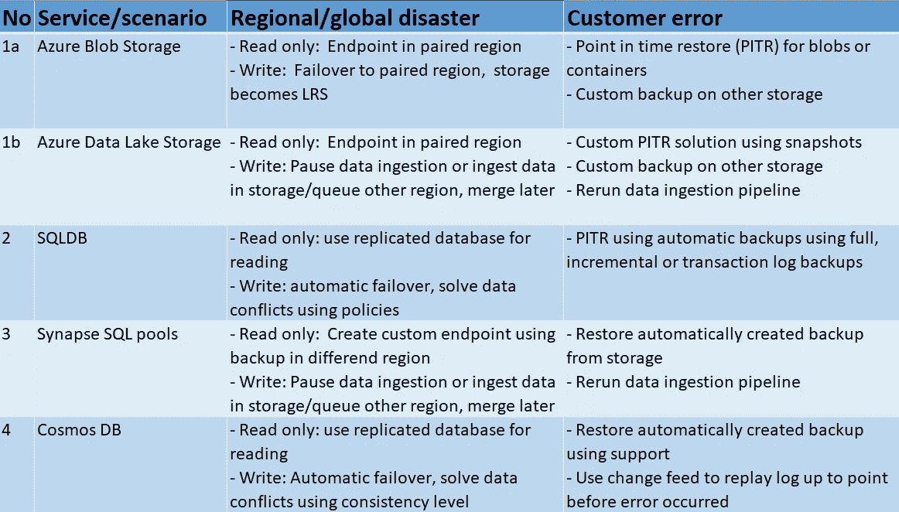

# Azure 存储、SQL、Synapse 和 Cosmos DB 的灾难恢复场景

> 原文：<https://towardsdatascience.com/disaster-recovery-scenarios-for-azure-storage-sql-cosmos-db-synapse-9bf5b561f858?source=collection_archive---------22----------------------->

数据中心的服务器，图像由 [Kvistholt 摄影](https://unsplash.com/@freeche)在 [Unsplash](https://unsplash.com/) 上拍摄

## 了解如何为 Azure 中的数据服务规划灾难恢复

# 0.介绍

灾难恢复的目的是在发生破坏性事件后保持 IT 系统的连续性。数据服务是每个 IT 系统的重要组成部分，应针对这些事件进行保护。大多数 Azure PaaS 数据服务都有支持区域冗余的服务层。这意味着当灾难局限于单个[区域](https://docs.microsoft.com/en-us/azure/availability-zones/az-overview)时，数据服务[不会](https://docs.microsoft.com/en-us/azure/azure-sql/database/high-availability-sla#general-purpose-service-tier-zone-redundant-availability-preview)受到影响，或者影响[被最小化](https://docs.microsoft.com/en-us/azure/storage/common/storage-redundancy#zone-redundant-storage)。但是，一些破坏性事件需要更多的规划，而不仅仅是选择正确的层。这些事件分为以下三种主要情况:

*   区域性灾难:由自然灾害(如断电、地震)导致的区域内多个数据中心的中断。
*   全局灾难:升级错误或计划内基础架构维护期间发生的意外问题。
*   客户错误:由应用程序错误或人为错误导致的数据损坏或删除。

这些场景用于规划以下服务的灾难恢复:Azure 数据湖存储、SQLDB、Synapse SQL 池和 Cosmos DB。作为参考，下面已经提供了一个概述。

Azure PaaS 数据服务灾难恢复场景概述—作者图片

在本概述中，可以看到区域和全球灾难恢复是一起讨论的。基本原理是[成对的区域](https://docs.microsoft.com/en-us/azure/best-practices-availability-paired-regions)应该用于规划在发生区域性灾难时的灾难恢复。成对区域的一个好处是[顺序更新](https://docs.microsoft.com/en-us/azure/best-practices-availability-paired-regions#benefits-of-paired-regions)用于防止两个区域都受到升级错误或计划外维护错误的影响。此外，使用[区域恢复命令](https://docs.microsoft.com/en-us/azure/best-practices-availability-paired-regions#benefits-of-paired-regions) ，以便在断电的情况下优先恢复两个区域中的一个。

最后，应该为整个 IT 系统规划灾难恢复，而不仅仅是孤立的数据服务。将本文的范围限制在数据服务的基本原理如下:

*   数据服务是每个 IT 系统的重要组成部分。人们可以从数据服务的灾难恢复计划开始，并从那里推断出所坚持的应用程序需要什么。
*   企业经常怀疑什么数据服务用于什么用例。本文可能有助于确定哪种数据服务最能满足灾难恢复需求。

在本文的剩余部分，将讨论 Azure Blob 存储、Azure 数据湖存储、SQLDB、Synapse SQL 池和 Cosmos DB 的灾难恢复。

# 1a。灾难恢复— Azure Blob 存储

Azure Storage 针对存储大量非结构化数据进行了优化。地理冗余存储在主区域中被复制至少三次，然后被复制到辅助区域。万一发生区域性/全球性灾难，存储帐户上的数据不会丢失。关于可用性(读/写数据)和客户错误，请参见以下段落。

**1a.1 .区域性/全球性灾难**

可以进行以下测量:

*   如果应用程序只需要读取数据(并且写入数据可以被推迟或暂存到另一个存储帐户)，应用程序可以使用存储帐户的配对区域中的[次端点](https://docs.microsoft.com/en-us/azure/storage/common/storage-disaster-recovery-guidance#choose-the-right-redundancy-option)。请看这个 [git 项目](https://docs.microsoft.com/en-us/azure/storage/blobs/storage-create-geo-redundant-storage?tabs=python#download-the-sample)应用程序如何检测到一个区域关闭并开始使用辅助端点
*   对于写入，可以向辅助帐户发起[故障转移](https://docs.microsoft.com/en-us/azure/storage/common/storage-initiate-account-failover?tabs=azure-portal)。请注意，在故障切换后，辅助帐户变成了 LRS。此外，故障切换不会自动启动，需要一些时间。或者，应创建自定义解决方案，其中应用程序将数据写入不同区域的存储帐户/队列。

**1a.2 .客户错误**

可以进行以下测量:

*   blob 存储支持时间点还原恢复(PITR ),可以在文件级和容器级完成，请参见此处的[和](https://docs.microsoft.com/en-us/azure/storage/blobs/point-in-time-restore-overview)。然而，PiTR 使用相同的存储帐户来保护客户免受错误，但不能防止使用恶意软件加密数据的恶意实体。在这种情况下，需要备份，见下一条。完整的 datalake 恢复解决方案请看我的后续博客:[https://towards data science . com/how-to-recover-your-azure-data-lake-5b 5e 53 f 3736 f](/how-to-recover-your-azure-data-lake-5b5e53f3736f)
*   为了保护存储帐户免受恶意实体的攻击，可以创建到另一个存储帐户的自定义增量备份。创建备份可以使用数据工厂基于时间，也可以使用 blob 触发器基于事件。请看这里的例子 [git 项目](https://github.com/rebremer/blog-snapshotbackup-azuredatalake)。

# 1b。灾难恢复— Azure 数据湖存储

Azure 数据湖存储是一个使用[分层文件结构](https://docs.microsoft.com/en-us/azure/storage/blobs/data-lake-storage-namespace)而不是基于对象的存储的存储帐户。使用真正的文件夹结构，管理任务(如[重命名文件夹](https://github.com/rebremer/Rename_folder_script_in_Azure_ADLS_and_AWS_S3))可以轻松完成。它具有与常规 Azure Storge 相同的耐用性，但是尚不支持 PiTR 和故障转移。请参阅关于灾难恢复的后续段落。

**1b.1 .区域性/全球性灾难**

可以进行以下测量:

*   与常规 Azure Blob 存储类似，可以使用一个辅助端点进行读取。
*   对于写入，Azure 数据湖存储不支持故障转移。应创建自定义解决方案，其中应用程序将数据写入不同区域的存储帐户/队列。如果主区域再次启动，以后将与主区域的存储账户合并。或者，一旦 Azure 数据湖存储启动并再次运行，可以在重新运行中暂停数据接收。

**1b.2 .客户错误**

可以进行以下测量:

*   Azure 数据湖存储尚不支持 PiTR，但是，[文件快照](https://docs.microsoft.com/en-us/azure/storage/blobs/snapshots-overview)可用于创建自定义 PiTR 解决方案
*   为了保护存储帐户免受恶意实体的攻击，可以创建一个定制的备份解决方案，如前一段和本示例 [git 项目](https://github.com/rebremer/blog-snapshotbackup-azuredatalake)中讨论的常规存储。
*   由于 Azure Data Lake Store 经常从原始/管理/瓶装区域中的 Azure Data Factory 管道接收和存储数据，因此也可以决定重新运行管道。条件是源系统将数据保存一段时间，并且管道可以等幂运行。

# 2.灾难恢复— Azure SQL

Azure SQL 数据库是为云构建的智能、可扩展的关系数据库服务，并针对在线事务处理(OLTP)进行了优化。请参阅关于灾难恢复的后续段落。

**2.1。区域性/全球性灾难**

可以进行以下测量:

*   如果一个应用程序只需要从一个数据库中读取数据，并且主区域关闭，应用程序可以访问一个辅助数据库进行只读操作，参见[这里的](https://docs.microsoft.com/en-us/azure/azure-sql/database/active-geo-replication-overview)
*   对于写入，Azure SQL 中支持[自动故障转移](https://docs.microsoft.com/en-us/azure/azure-sql/database/active-geo-replication-overview#preparing-secondary-database-for-failover)。这样，当主区域中发生灾难时，可以使用不同区域中的辅助数据库进行写入。一旦主区域重新启动并运行，数据将从主区域复制回辅助区域。数据冲突可能会发生，并根据配置的[策略](https://docs.microsoft.com/en-us/azure/azure-sql/database/auto-failover-group-overview?tabs=azure-powershell#terminology-and-capabilities)来解决。

**2.2。客户错误**

可以进行以下测量:

*   PITR 可以通过利用[自动化数据库备份](https://docs.microsoft.com/en-us/azure/azure-sql/database/automated-backups-overview?tabs=single-database)功能来实现。自动数据库备份每周创建一次完整备份，每 12–24 小时创建一次差异备份，每 5 到 10 分钟创建一次事务日志备份。还原数据库时，该服务确定需要还原哪些完整备份、差异备份和事务日志备份。

# 3.灾难恢复—Synapse SQL 池

Azure Synapse Analytics 是一项无限的分析服务，它将数据集成、企业数据仓库和大数据分析结合在一起。在 Synapse Analytics 中，SQL 池用于存储关系数据。它还可以与外部表一起使用，以查询 Azure 数据湖存储上的数据。有关灾难恢复计划，请参见接下来的段落。

**3.1。区域性/全球性灾难**

可以进行以下测量:

*   为了便于阅读，可以创建一个定制解决方案，每天在不同的区域[恢复备份](https://docs.microsoft.com/en-us/azure/synapse-analytics/sql-data-warehouse/backup-and-restore)，暂停 SQL 池，并且仅在主区域停机时在不同的区域运行 SQL 池。
*   在数据湖存储上仅使用外部表的情况下，也可以在不同的区域中创建 SQL 池，并将 SQL 池指向不同区域中 Azure 数据湖存储帐户的辅助端点。
*   Synapse SQL 池不支持自动故障转移。对于写入，应创建自定义解决方案，其中应用程序将数据写入不同区域的存储帐户/队列。也可以决定暂停数据接收管道，直到主区域再次启动，请参见下一段。

**3.2。客户错误**

可以进行以下测量:

*   快照可以追溯到 [7 天](https://docs.microsoft.com/en-us/azure/synapse-analytics/sql-data-warehouse/backup-and-restore#restore-point-retention)，并且可以在数据损坏后恢复。为防止数据丢失，应再次运行数据管道，见下一条。
*   Synapse SQL 池通常用于数据湖环境，其中 Azure 数据工厂或 Synapse 管道用于接收数据。数据或者被直接摄取到 SQL 池，或者被摄取到属于 Azure Synapse 工作区的 Azure 数据湖存储帐户，并在 Synapse SQL 池中用作外部表。一旦主要区域再次启动，也可以决定重新运行管道。条件是源系统将数据保存一段时间，并且管道可以等幂运行。

# 4.灾难恢复— Cosmos DB

Azure Cosmos DB 是一个完全托管的多数据库服务。它使您能够在全球范围内构建高度响应的应用程序。作为 Cosmos DB 的一部分，支持 Gremlin、Mongo DB、Cassandra 和 SQL APIs。有关灾难恢复计划，请参见接下来的段落。

**4.1。区域性/全球性灾难**

可以进行以下测量:

*   为了读取，应用程序可以使用配对区域中的[次端点](https://docs.microsoft.com/en-us/azure/cosmos-db/high-availability#multi-region-accounts-with-a-single-write-region-read-region-outage)。
*   Azure Cosmos DB 支持自动故障转移。如果主区域关闭，辅助区域中的数据库将成为主区域，并可用于写入数据。根据 Cosmos DB 的一致性级别，可能会出现数据冲突，并得到解决。

**4.2。客户错误**

可以进行以下测量:

*   Azure Cosmos DB 创建自动备份。如果数据库被破坏或删除，需要恢复，可以请求恢复，请参见[中的](https://docs.microsoft.com/en-us/azure/cosmos-db/online-backup-and-restore)流程
*   Azure Cosmos DB[change feed](https://docs.microsoft.com/en-us/azure/cosmos-db/change-feed)在 Azure Cosmos DB 容器中提供了一个持久的记录日志。更改提要中的项目可以在第二个容器中重放，直到数据损坏发生之前，然后保存回原始容器。

# 5.摘要

在本文中，我们讨论了在灾难发生时规划 Azure data PaaS 服务。尽管 PaaS 服务和配对区域的生产就绪层已经解决了很多问题，但客户仍然需要采取措施来应对灾难。在本文中，将讨论 Azure storage、SQL、Cosmos DB 和 Synapse 的度量，请参见下面的概述。

Azure PaaS 数据服务灾难恢复场景概述—作者图片