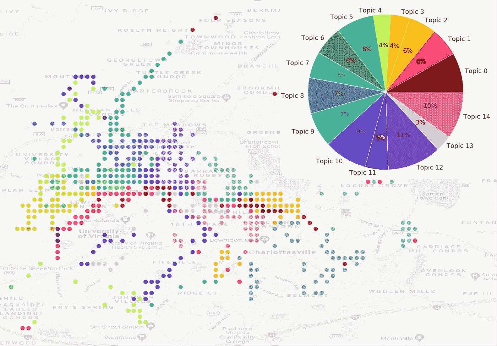
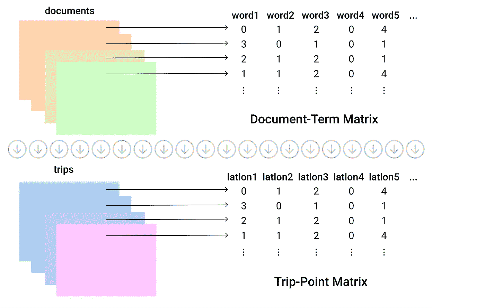
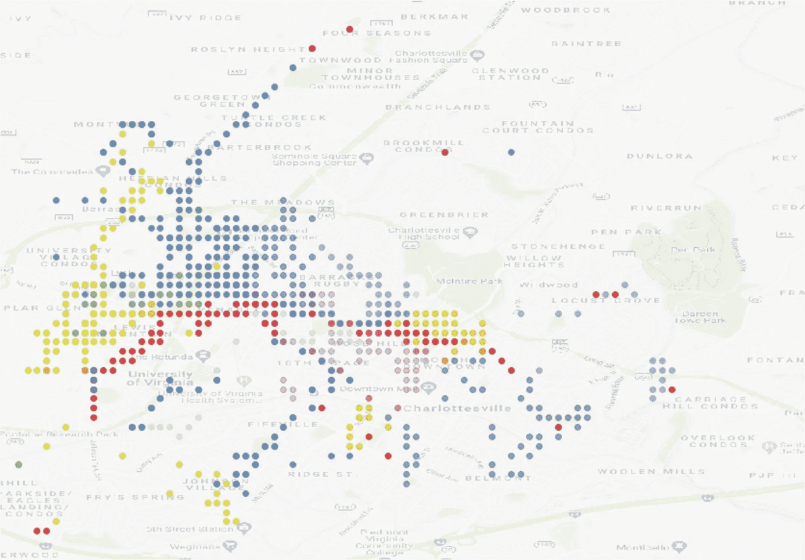
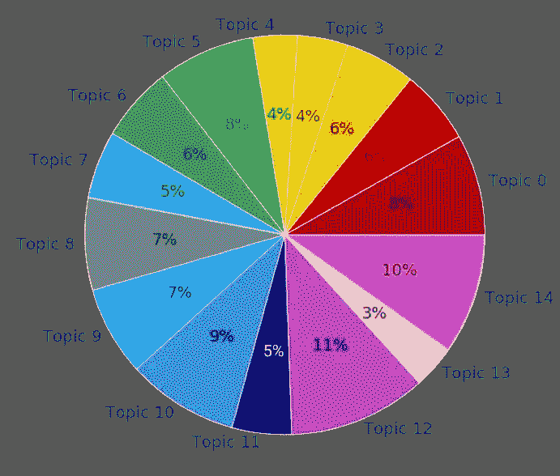

# 使用主题建模从 GPS 数据中发现隐藏的旅行主题

> 原文：<https://towardsdatascience.com/discover-hidden-trip-themes-from-gps-data-with-topic-modeling-f70cf04294c4?source=collection_archive---------13----------------------->

## 利用潜在狄利克雷分配从 GPS 跟踪数据中提取潜在的出行主题



可视化 LDA 提取的旅行主题，按作者排序

每一个文本都是由一个作者产生的，他的话语，带着意图表达的话语单位，都被保存在文字中。因此，大量的文本可以用来研究文化。像主题建模这样的无监督机器学习方法允许我们从大量文本数据中提取潜在的文化主题。随着大数据在交通领域的增长，一个新的分析机会出现了，研究人员可以寻求从移动性的痕迹中提取意义和文化。

在评估城市中的新交通模式时，地方政府领导和城市规划者可能会想知道用户使用新服务时通常会采取什么类型的出行方式。例如，在过去几年里，电动滑板车如此迅速地流行起来，以至于城市管理者仍在寻找监控和优化城市运营的最佳方式。疫情极大地扰乱了当前的微移动操作，但那是另一天的主题。在这篇文章中，我将详细介绍如何使用主题建模从非结构化的估计旅行集合中提取潜在的旅行主题。由于主题建模通常用于文本分析，因此我将首先讨论一些关于潜在狄利克雷分配的背景信息，以及为什么它是揭示潜在出行模式的合适方法，这些出行模式是大量 GPS 追踪数据的特征。

## 出行分析中的潜在狄利克雷分配

潜在狄利克雷分配(LDA)是由 [David M. Blei、Andrew Y. Ng 和 Michael I. Jordan](https://ai.stanford.edu/~ang/papers/nips01-lda.pdf) 开发的离散数据集合的生成混合模型。由于该模型是在文本分析的上下文中创建的，所以它假设非结构化文档集合中的每个文档都由混合的主题组成。使用隐藏的狄利克雷随机变量对文档建模，并且模型的输出是潜在的低维主题空间上的概率分布。换句话说，从非结构化的文档集合中，模型提取相关的主题。LDA 是一种主题建模，因为它是一种发现文档集合中隐藏主题的方法。[除了文本数据，主题建模还被用于在图像数据、社交网络数据甚至基因数据中寻找模式](https://citeseerx.ist.psu.edu/viewdoc/download?doi=10.1.1.443.2325&rep=rep1&type=pdf)。

在行程环境中，提取的电动踏板车行程包含一组离散的 GPS 点。虽然不是很明显，但在标记化时，一组有序的 GPS 坐标对看起来就像标记化的文档。我们可以将每个 GPS 坐标对视为词汇表中的一个独特的单词。然后，行程可以被视为包含许多 GPS 点字的文档类型。从这个角度来看，当我们有大量非结构化的旅行时，主题建模是一种非常合适的分析技术。使用主题建模，我们可以提取旅行集合中隐藏的路线模式。这将是有效的，因为受欢迎的 GPS 点将在数据集中的几个不同的行程中同时出现。类似的行程将包含与相同 GPS 点的显著重叠。

## 为 LDA 准备 GPS 行程数据

为了执行主题建模，必须以与准备作为 LDA 输入的文本数据相同的方式准备电动滑板车行程数据。回想一下，我们将把每个唯一的 GPS 经度-纬度对视为一个单词。我们的词汇表是数据集中唯一的 GPS 点的完整集合。在文本分析中，数据科学家通常会执行一些预处理步骤，有效地缩小词汇表，包括删除停用词和[词干](https://kenbenoit.net/assets/courses/tcd2014qta/readings/Jivani_ijcta2011020632.pdf)。在这种情况下，词干是相关的，我们将执行完成类似壮举的步骤。在词干提取中，单词被减少到它们的词根，使得像“work”、“worked”和“working”这样的单词被分组在单词“work”下，以确保词频被更好地考虑。对于我的 GPS 数据，原始跟踪点精确到小数点后第四位。在没有对接近点进行分组的任何预处理的情况下，我从 42，301 次旅行的集合中获得了 52，879 个唯一 GPS 点的起始词汇表。在文本分析中，通常通过各种过程将词汇表缩减到前 5000 个单词，这些过程包括移除停用词、词干和移除罕见词等。为了高效的模型性能。在这种情况下，我将 GPS 点四舍五入到小数点后 3 位，有效地将描述相同路线点的点组合在一起。四舍五入后，词汇量减少到可管理的 3，312 个 GPS 点。



根据全球定位系统数据的文献术语矩阵:作者提供的出行点矩阵图

为了在电动滑板车行程数据上实现主题建模，我们利用了一个流行的机器学习库 [scikit-learn](https://scikit-learn.org/stable/modules/generated/sklearn.decomposition.LatentDirichletAllocation.html) 。所需的输入是上图所示的文档术语矩阵。回想一下，我们将把每一次旅行都视为一份文件。对于 42，301 个提取的行程，我们构建了一个大小为 42，301 行乘 3，312 列的行程点矩阵(根据 GPS 词汇表大小的行程数)，其中的值指示词汇表中的 GPS 点在每次行程中出现了多少次。接下来，我们将 trip-point 矩阵作为输入提供给 LDA 模型，将其设置为提取 15 个主题。然后，LDA 模型的输出是 15 个主题，这些主题最好地描述了构成每个主题的 GPS 点的概率分布的行程集合。此外，我们可以检索每次旅行主题的概率分布。对于这个数据集，模型运行时间只有大约 3 分钟。

```
from sklearn.decomposition import LatentDirichletAllocationlda_model = LatentDirichletAllocation(n_components=15)
lda_output = lda_model.fit_transform(doc_term_matrix)
```

## 可视化主题

最后，我们可视化我们的主题和主题分布。在文本的主题建模中，主题通常通过显示每个主题的前 *k* 个最频繁出现的单词来可视化。然后，具有领域知识的分析师可以通过检查这些顶级单词组来确定语料库中的潜在主题。虽然顶部的单词容易阅读和解释，但仅仅通过查看顶部的 *k* GPS 坐标对并没有什么价值。相反，我们需要将顶部的 k 个 GPS 对处理回纬度和经度字段，然后在地图上绘制顶部的 k 个点。在这项研究中，每个主题的前 50 个 GPS 点绘制在夏洛茨维尔的地图上，以可视化提取的旅行主题。为了绘制 GPS 点，在连接之前，将顶部的单词连接回四舍五入的 GPS 坐标。



15 个提取的旅行主题—空间可视化，按作者分类

查看上图，我们可以看到 LDA 模型揭示了一组多样化的潜在出行类型，这些类型表征了一大组电动滑板车 GPS 跟踪数据，将数据分成离散的分组。这些主题，在上面的图中按颜色分类，可以由城市规划者、城市管理者或具有夏洛茨维尔景观领域知识的当地研究人员来解释。最后，下图显示了十五个提取的旅行主题是如何分布的。



按作者列出的旅行主题分布图

我是潜在狄利克雷分配的粉丝，因为它提供了一种发现隐藏在大量数据中的文化意义的方法。虽然主题建模通常用于发现集体文本中的趋势，但在这里，我将探索它帮助我们理解集体运动趋势的潜力。由于数据集不包含任何用户信息，这项研究不会造成任何直接的用户隐私问题。探索 LDA 在文本数据上下文之外的适用性是很有趣的。感谢阅读。