# 借助脸书图形 API 和 Python，从您的 Instagram 商业账户中发现真知灼见

> 原文：<https://towardsdatascience.com/discover-insights-from-your-instagram-business-account-with-facebook-graph-api-and-python-81d20ee2e751?source=collection_archive---------2----------------------->

## 如何使用 Python 从 Instagram 业务中获得洞察力的分步指南


在 Instagram 上发布产品照片是社交媒体驱动的商业世界不可或缺的一部分

I nstagram。多功能社交媒体，在这里你可以发布你最喜欢的食物，捕捉你最喜欢的消遣，在这里你可以看到你的朋友或家人在做什么，在这里你可以获得你的每日新闻摘要，在这里你可以获得你有趣的宠物视频，在这里你可以获得你每日的迷因，在这里你可以研究一些产品，服务，甚至“研究”你喜欢的人。基本上是社交媒体的瑞士军刀。

2021 年，每月超过 10 亿人使用 insta gram[【1】](https://sproutsocial.com/insights/instagram-stats/)。我每天打开我的 Instagram。我的朋友也是，我的家人也是，我想，你也是。

Instagram 拥有大量的活跃用户，加上他们中的一些人拥有高水平的可支配收入，当然，insta gram 仍然是你的企业销售或推广你的产品或服务的最热门的地方之一。

毫无疑问，在 Instagram 上在线展示很重要。有些人甚至认为这比线下的存在更重要。世界上的疫情状况只会强化这种情绪。

现在，你想创业。或者，可能已经有了生意，然后你想从 Instagram 那里分一杯羹。

你如何在 Instagram 上为你的企业树立形象？首先，你可以注册你的 Instagram 商业账户，然后，定期在 Instagram 上发布内容/帖子，以建立你的社区，增加你的粉丝数量，或创造知名度。

假设你发表了一系列不同的帖子或内容，但你很好奇你的内容被人们接受的程度。你想知道哪些人对你的产品感兴趣，你的帖子到达了哪些城市，等等。你可以从你的 Instagram 个人资料中看到这些见解。但老实说，这个观点本身是非常有限的。

你想从你的 Instagram 上看到更全面的洞察数据吗？或者从这些见解中构建自己的数据表或仪表板？下面跟我一起深入挖掘 *Instagram Graph API* ！

# Instagram 商业账户

在深入探讨代码或者 Instagram Graph API 之前，对于不熟悉 Instagram 商业账号的人，我们先退一步。

Instagram 上大多数人用的是 Instagram 个人账号。默认情况下，每次新用户在 Instagram 上创建账户，都是个人账户。但是如果你打算将 Instagram 用于商业目的，你应该将你的个人账户转换成商业账户。

通过转换为企业帐户，您可以获得更多功能来帮助您的业务增长，例如获得洞察力来帮助您了解谁在使用您的内容，通过广告触及未知的潜在市场，以及在您的个人资料中添加更多联系信息。

通过阅读这份[脸书蓝图](https://www.facebook.com/business/learn/lessons/personal-instagram-vs-business-instagram)，你可以了解更多关于如何建立你的商业账户的信息。这是一个很短的过程，你可以在 10 分钟内完成。

# 脸书开发者帐户

一旦你创建了一个 Instagram 商业账户，让我们前往[脸书开发者页面](https://developers.facebook.com/)为你创建一个开发者账户。

之后，你需要先做一个应用程序来访问脸书的 insight 数据。您的应用程序类型将决定哪些 API 可供您使用。

## 制作您的第一个脸书应用程序

1.  进入*我的应用*，然后点击*创建应用。*
2.  为您的应用程序类型选择**业务**，因为您稍后将使用 *Instagram Graph API* 。
3.  写下你的显示名和联系邮箱。

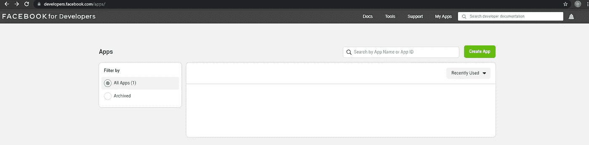

我在脸书的开发者应用页面|作者图片

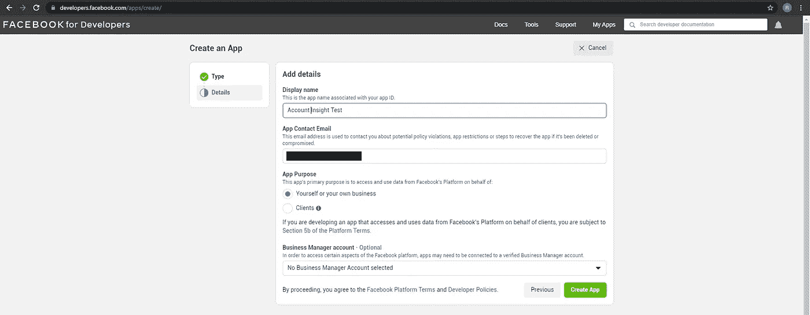

创建应用程序前的最后一步|作者图片

一旦你的应用成功创建，你可以进入基本设置来检查你的**应用 ID** 和**应用密码**。**应用 ID** 是你的应用的唯一标识符，因此脸书可以识别是谁从应用发出数据请求。而 **App Secret** 将用于解码来自脸书的加密信息。这两个是你 app 特有的，以后会用到。

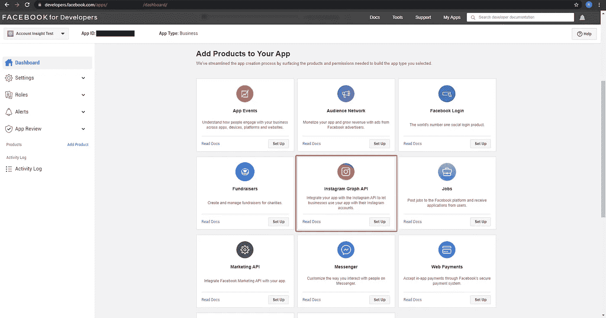

基本设置包含应用 ID 和应用机密|作者图片

## 其他关键信息

在继续探索 *Instagram Graph API* 之前，让我们稍微离开一点，收集我们将用于挖掘洞察力的另一个关键信息:**脸书页面 ID。**

您可以通过查看您的*脸书业务*页面并查看*“关于”*选项卡的底部，轻松获得您的**脸书页面 ID** 。

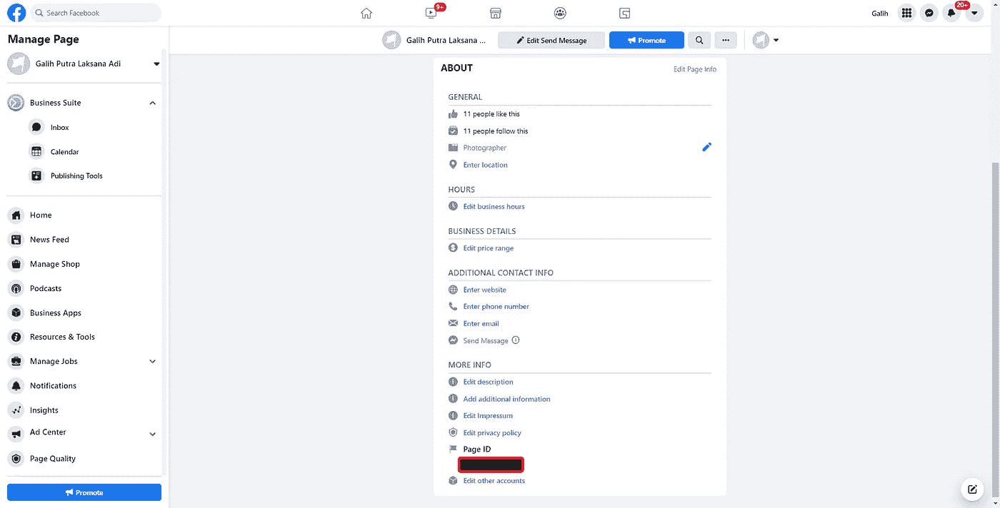

脸书商业页面—页面 ID |作者图片

# Instagram 图形 API

现在，让我们将 *Instagram Graph API* 添加到您的应用程序中。您可以轻松选择 *Instagram Graph API* ，然后点击*设置*。你可以在这里阅读更多关于 *Instagram Graph API* [。](https://developers.facebook.com/docs/instagram-api/)


脸书应用提供的产品选择|作者图片

## 图形 API 浏览器

一旦您添加了 *Instagram Graph API* ，您就可以转到*“工具”*选项卡，使用 *Graph API* Explorer 来定义您需要或想要的权限类型，并生成访问令牌。

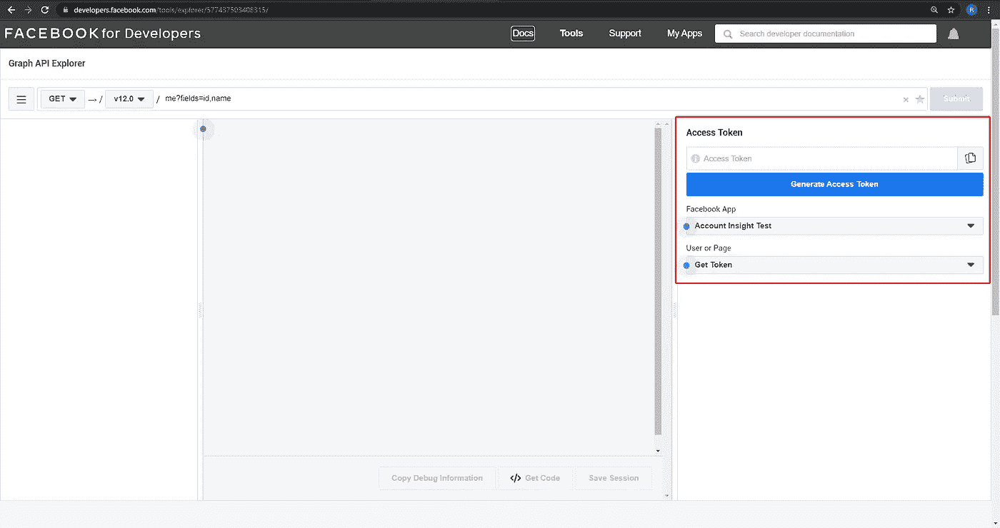

图形 API 浏览器主页|作者图片

有一个很大的权限列表可供我们选择，您可以在这里查阅它们[。显然，当构建一个应用程序或从脸书请求数据时，我们只需要少量数据，而不是全部。](https://developers.facebook.com/docs/permissions/reference)

存在仅访问基本信息、访问见解、发布评论、发布内容等的权限。你可以在上面的链接中深入阅读。

由于我们的目标是利用 Instagram Insights 的力量，我们将要求提供一个具体的权限列表。我们现在要做的是向脸书/Instagram 询问这些见解:

1.  来自每个 Instagram 帖子的基本见解(赞和评论)
2.  来自每个 Instagram 帖子的更深入的见解(印象、触及范围等。)
3.  来自 Instagram 账户的受众和人口统计洞察

如果你看过上面的权限链接，你就会知道，要获取那些数据，我们必须要有这些权限: **instagram_basic** ，**insta gram _ manage _ insights**， **pages_show_list** ， **pages_read_engagement** ，以及 **pages_read_user_content。**

一旦你选择了所有的权限，点击*生成访问令牌*，会弹出一个小窗口。在确认后续流程之前，脸书还会通知我们的 **Instagram 商业账号 ID** 。把这个复制到你的记事本上，以后会很方便。

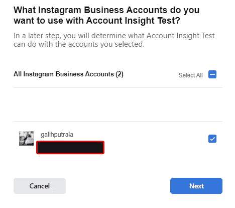

Instagram 商业账户 ID |作者图片

确认随后的窗口，将您的应用链接到脸书，然后您将最终获得一个**访问令牌**。请记住，该令牌只是一个**短期访问令牌**，仅在**一小时**内有效。我们将生成一个**长期访问令牌**，其有效期为 **60 天**。系好安全带，因为我们现在要使用 Python 了！

# 从脸书图形 API 中获得洞察力

## 准备

打开你的 *Jupyter 笔记本*、 *Google Colab* 或任何其他 Python IDE，然后我们将首先从导入所需的库开始。

因为我们将使用 *GET 请求*到脸书，我们必须根据我们需要请求的数据遵守特定的语法。为了让我们更容易使用各种 *GET* 语法，让我们在一个名为*‘params’*的*字典*中编译我们需要的细节。

您可能会对代码中显示了多少**屏蔽的**细节感到惊讶，但实际上，我们已经在之前的过程中收集了这些细节！让我解释一下:

1.  *access_token* : **我们在开始编写代码之前直接获得的短期访问令牌**
2.  *client _ ID*:**App ID**来自*设置*
3.  *client _ Secret*:**App Secret**来自*设置*
4.  *page_id* : **脸书页面 ID** 来自您的业务页面的“*关于”*选项卡
5.  *instagram_account_id* :确认生成令牌过程中显示

对于*‘graph _ version’*，我使用的是 **v12.0** ，因为那是我目前可用的版本。如果您使用 API 的另一个版本，只需相应地更新它。

## 检查访问令牌

在继续请求洞察之前，让我们先检查一下我们的访问令牌和应用范围。我们可以通过编写这段代码来做到这一点。

运行这些代码将导致以下结果:

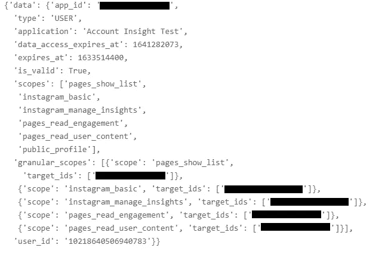

访问令牌检查结果|按作者排序的图像

我们可以确认我们的应用范围，更重要的是，知道我们的**令牌将于何时到期**。为了将那个*‘expires _ at’*数字转换成适当的时间戳格式，让我们做一个简单的重新格式化。

现在我们确切地知道了我们的令牌实际上有多短暂:)

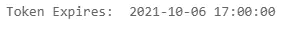

短期访问令牌过期时间|作者图片

## 将短期访问令牌更改为长期访问令牌

由于 1 小时的到期时间可能会干扰我们学习从 Instagram 请求 insights 数据的过程，因此让我们将这个短期令牌转换为一个长期访问令牌。

```
API Endpoint:https://graph.facebook.com/{graph-api-version}/oauth/access_token?grant_type=fb_exchange_token&client_id={app-id}&client_secret={app-secret}&fb_exchange_token={your-access-token}
```

基于来自脸书的 API 端点，让我们编写一些代码来获得**长期访问令牌**。

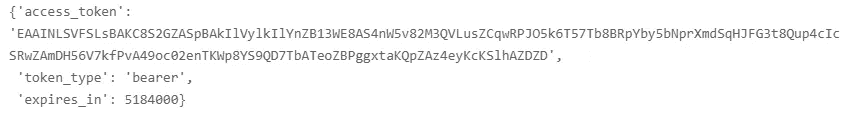

长期访问令牌|作者图片

现在我们得到了一个**长期访问令牌**，让我们通过将它放回我们的参数字典( *params['access_token']* )来检查我们的最新令牌到期时间，然后重新运行**检查访问令牌**代码。

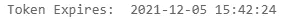

长期访问令牌过期时间|作者图片

我们已经成功地将访问令牌的到期时间从 2021 年 10 月转换为 2021 年 12 月！现在我们能够更灵活地执行数据请求，因为我们有了更多的时间。

## Instagram 帖子——基本观点

让我们先从基本的见解开始，比如来自你的 Instagram 商业帖子的基本元数据，以及它们的*喜欢数*和*评论数*。

```
API Endpoint:https://graph.facebook.com/{graph-api-version}/{ig-user-id}/media?fields={fields}
```

通过运行这些代码，我们可以获得从你**注册商业账户**开始的任何帖子的元数据和基本信息。请记住，如果您的帐户最初是个人帐户，那么您将只能从您更改为企业帐户后发布的**帖子中获得见解。**

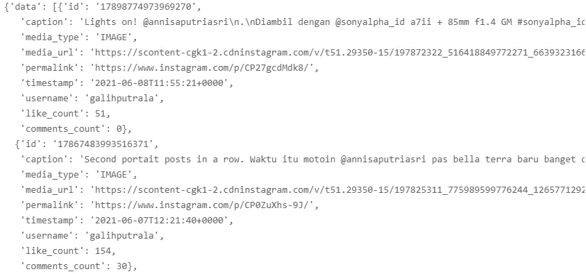

基本见解结果|作者图片

如您所见，您将收到 JSON 字典形式的数据。所有这些数据都非常重要，所以让我们简单地将它们转换成熊猫数据帧。

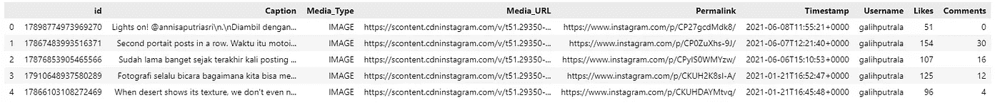

基本见解—数据框架结果|作者图片

## Instagram 帖子——更多见解

我们可以通过使用上面不同的 API 端点来更深入地研究每篇文章。

```
API Endpoint:https://graph.facebook.com/{graph-api-version}/{ig-media-id}/insights?metric={metric}
```

这一次，我们将遍历从以前的代码中获得的*‘媒体 id’*，以请求更深入的洞察指标。

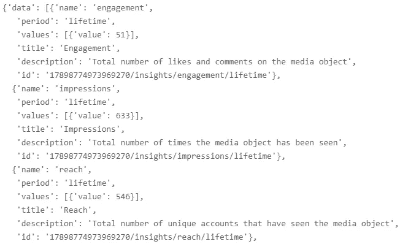

更多见解—结果

并非上述所有数据都重要，我们只想获得*‘name’*和*‘value’*，因此我们必须正确解析它，然后将其转换为 *Pandas DataFrame* 。

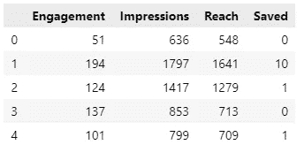

更多见解—数据框架结果| |作者图片

我们已经成功地为我们的帖子收集了更深入的见解。不仅是*订婚* ( *喜欢* + *评论*)，我们还可以看到*印象*、*达成*、*保存*，这些都是 Instagram 的算法中越来越重要的指标。我们甚至可以通过将这种更深入洞察的*数据框架*与基本洞察的*数据框架*结合起来，进一步整理我们的数据。

## Instagram 账户——受众洞察

我们可能从我们的个人帖子中获得了见解，但我们也可以从我们的 Instagram 商业帐户中请求见解，例如，*观众见解*。

```
API Endpoint:https://graph.facebook.com/{graph-api-version}/{ig-media-id}/insights?metric={metric}
```

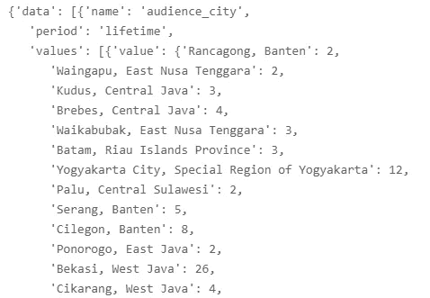

受众观察结果|作者图片

我们现在有不同层次的观众人口统计洞察:按国家的*、*、按城市的*、*和按性别-年龄的*。有了这些数据，我们可以看到我们的帖子到达了哪些城市，哪个城市最喜欢我们的内容，我们的内容吸引了哪些人群。*

我们可以通过简单的编码来制作*熊猫数据框*，例如，我们按城市创建*观众的*数据框*，按性别-年龄*创建*观众的*数据框。**

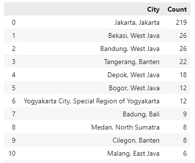

城市受众—数据框架结果|作者图片

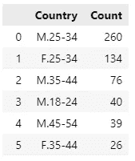

按性别-年龄划分的受众—数据框架结果|按作者划分的图片

利用上述信息，我们可以制定更好的内容创作或营销策略。我们对用户了解得越多，我们就能更好地为他们量身定制活动或广告。

# 结论

现在，您可以从您的 Instagram 商业帐户中提取几个 insights 数据，如*喜欢数、评论数、印象数、已保存数、*和*观众见解*，您可以更好地分析您的 Instagram 帐户的表现。

这只是一个开始，因为你可以为上面的数据制作你的仪表板或数据可视化，或者你可以通过寻找更多的见解进行更深入的研究。

# 感谢阅读

我希望你喜欢这篇文章！我希望你能从中学到一些新的有用的东西。如果你有，请在下面鼓掌，如果你有任何反馈，请在下面留下你的想法！

## 保持联系

*   在[媒体](https://medium.com/@rizqiekamaulana)上关注我的下一篇文章
*   想讨论还是想合作？我们上 [LinkedIn](https://www.linkedin.com/in/rizqiekamaulana/) 连线吧

## 参考

[1]sproutsocial.com，巴恩哈特，b .[2021 年你需要知道的最重要的 Instagram 统计数据](https://sproutsocial.com/insights/instagram-stats/)

[2] Gotter，a .，[2021 年你需要知道的 29 个 Instagram 统计数据](https://adespresso.com/blog/instagram-statistics/) (2021)，adespresso.com