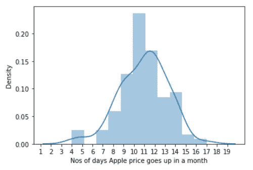
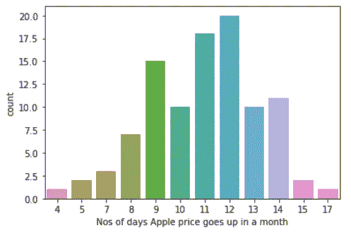
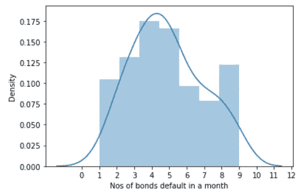
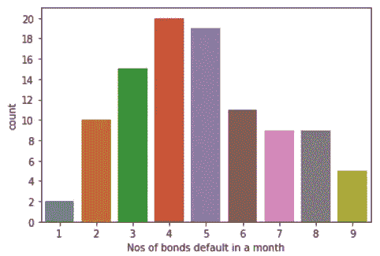
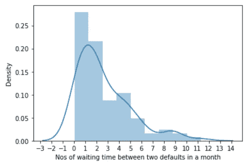

# 发现数学和数据科学问题之间的联系

> 原文：<https://towardsdatascience.com/discover-the-link-between-math-and-data-science-problems-a98fe9866a4f?source=collection_archive---------43----------------------->

## [入门](https://towardsdatascience.com/tagged/getting-started)

L 了解如何使用你的数学和统计学知识最有效地解决数据科学和机器学习问题。这是一个数列，我们将从随机数开始。


照片由[布雷特·乔丹](https://unsplash.com/@brett_jordan?utm_source=medium&utm_medium=referral)在 [Unsplash](https://unsplash.com?utm_source=medium&utm_medium=referral) 拍摄

## **数据科学博客系列:**

当我开始重温我的数学和统计知识(阅读线性代数、微积分和概率)以将这些知识与机器学习概念结合起来，最终应用于金融时，我经历了巨大的困难。

我并没有纠结于数学和统计概念本身——我有一些相关的背景，谢天谢地，只要点击一下鼠标，就可以获得大量的在线参考资料——但我纠结于如何在机器学习(ML)和深度学习(DL)问题中使用这些概念。我努力在数学概念和它们在 ML 和 DL 中的应用之间建立清晰的逻辑联系，我努力在 ML 和 DL 的上下文中找到这些概念背后的目的。

不幸的是，几个小时的谷歌搜索没有帮助，因为没有精确和简明的材料可以解决这一点。我不得不通过艰难的方式了解这一点，这时候我想到要开始一个博客系列来为同病相怜的人降低它的音量。

在本系列中，我将挑选一个统计或数学主题，并将其简化到最基本的水平，以便人们可以在 ML 和 DL 的应用程序中使用它。我的意图不是阐明数学和统计理论，也不是 ML 和 DL 概念，而是这两者之间的联系。换句话说，我会假设你对这些概念有一个基本的了解，我不会试图教你这些概念(至少在这个博客系列中不会)。

那我们系好安全带，从不起眼的**随机数**开始。

**随机性**:在我们进入随机数之前，让我们先了解随机性及其重要性。我们日常和职业生活中的未来事件没有一件是绝对确定的；下周末见你的朋友，后天和你的老板打电话，计划明天一早去慢跑，没有什么是确定的。

而涉及到商业问题时；一只股票下周五的收盘价，一只债券下月底的信用评级，未来三个月的新客户数量，这些都是不确定的。这是因为大量的因素影响他们的结果。

不确定性越多，随机性就越大。但是我们没有任何选择，我们必须预测商业事件的结果以便做出决定。

怎么办？我们必须减少事件结果中随机性的影响，这样才能有把握地做出商业决策。如何减少随机性的影响？简单。将随机性纳入结果的计算中，以减轻随机性的影响。怎么做呢？进来的是随机数。

**随机数(RN) :** 关于 RN 的几个要点。我们借助计算机为我们生成 RN。然而，计算机内部发生的事情没有一件是随机的，因此计算机生成的 RN 来自确定性的程序，并且是伪随机的。因此，像加密解决方案这样的关键应用不应该基于伪随机数。此外，随机数生成(RNG)过程越随机，我们的计算就越有预测能力，因此选择一个强大的 RNG (Mersenne-Twister 是最常见的，对我们的大多数常规业务问题都相当有效)。

**随机数分布(RND)** :所以我们明白我们需要 RN，但这还不够，我们还需要知道我们需要什么类型的 RN，因为每种类型的 RN 都与特定类型的业务问题相关联。RN 的类型由它们所来自的概率分布(PD)决定(例如，均匀、正态等。).在这种情况下，RND 和 PD 是相同的。为了理解随机数和 PD 之间的联系，我们需要知道随机变量的定义。随机变量是一个可以以一定概率呈现一定随机数的变量。这些概率的集合被称为随机变量的*概率分布*。概率分布指定总概率(始终为 1)如何在各种可能的结果中分布。例如，你已经用相应的概率计算了明天布伦特原油收盘价的所有可能值，并将它们存储在一个随机变量 **S** 中。在这种情况下， **S** 的不同值及其概率就是 **S** 的 PD。

每个 PD 遵循一定的规则，并具有一组参数(例如，平均值、方差、偏斜度、峰度等。)决定了 RN 的产生。

现在是最后一个问题，我们如何知道我需要哪个 RND 来解决我的业务问题？为此，彻底了解业务问题，并选择最能描述问题的 RND。当分布的条件与问题的条件相匹配时，RND 最好地描述了问题的特征。例如，你认为一只股票明天的开盘价将是今天收盘价的 90%到 110%,每种可能性都是一样的。在这种情况下，您可以绘制一组 10，000 个一致的 RN，其下限和上限分别为-0.1 和 0.1，并将今天的收盘价乘以这些 RN，然后对其进行平均，以得出明天的开盘价(股票价格预测并不完全是这样做的，但希望您明白这一点)。

另一方面，如果你认为一个股票指数的月度运动遵循一个具有特定平均值和标准差的正态分布模式，那么你需要画出一组具有特定平均值和标准差的正态 rn，并将这些 RN 应用于股票指数价格的计算。同样不同的是，如果你持有不同到期日的高风险债券投资组合，并且你认为一年内平均有 3 只债券违约，那么你需要从参数λ = 3 的泊松分布中抽取随机数，以在一定程度上模拟你的投资组合中的实际违约数量。

对于任何称职的数据分析师或从业者来说，了解 PD 的概念是不容置疑的。它为分析和推断统计提供了基础。在数以百计的发行版中，只有少数几个我们需要在日常使用中更深入地了解。我在这里选了其中的五个:**均匀、二项、正态、泊松和指数**。我计划有一个帖子来讨论它们的应用，以及这些分布在未来量子金融中的用例。

无论如何，这是足够的理论，现在让我们用 Python 实际执行这些概念。

下面是我们前面提到的不同类型的 PDs 的计算工具，以及 Numpy 中相关的随机数生成函数的例子和用法。

# **均匀分布**

当一个随机变量在给定范围内取任何值的可能性相等(即具有相同的概率)时，称该随机变量遵循均匀分布。在 Numpy 中，均匀分布的随机数生成函数种类最多。让我们一个一个来看看。

```
**np.random.randint(40, 100, 10)**array([64, 82, 43, 75, 48, 40, 90, 78, 81, 76])
```

—从半开区间中的“离散均匀”分布返回 10 个介于 40 和 100 之间的随机整数。半开区间表示随机选择中不包括高边界值，但包括低边界值。注意:您可以将下限值设置为负值。

```
**np.random.randint(10, size = 50)** array([3, 7, 0, 8, 3, 4, 3, 9, 5, 7, 9, 3, 3, 2, 9, 7, 8, 3, 4, 3, 0, 3,2, 8, 8, 0, 6, 2, 3, 0, 2, 9, 8, 8, 3, 4, 0, 9, 0, 7, 5, 9, 7, 3, 4, 4, 5, 2, 3, 0]) 
```

—如果您只向`np.random.randint` 传递一个参数，那么该参数将被视为高值，低值将默认为零。例如，上面的命令从“离散均匀”分布返回 50 个整数，高值为 10，低值为 0。

```
**np.random.random_integers(10, size = 50)**array([5, 2, 9, 10, 1, 8, 9,  4,  2, 6, 6,  4, 5, 4, 7, 9, 9, 6, 7,  8, 10,  1,  1,  5,  6,  7,  1,  6, 10,  1,  8, 8, 4, 4, 3, 10, 1,  8,  4,  3,  7,  4,  7,  8,  1,  2,  2,  7,  1,  8])
```

—返回“离散均匀”分布的整数，与`np.random.randint`有一些微小的差异。`np.random.randint`的默认低电平是零，而`np.random.random_integers`的默认低电平是 1。还有，前者半开，后者全开。

注意:`np.random.random_integers` 即将弃用。

```
**np.random.random_sample((3,4))** array([[0.61879859, 0.61965074, 0.25047645, 0.9547143 ],
       [0.62274851, 0.25153697, 0.79753309, 0.78389591],
       [0.30247623, 0.00885101, 0.87795343, 0.48111766]])
```

—从半开放空间中的“连续均匀”分布返回介于 0 和 1 之间的随机浮点数的 3*4 数组。`np.random.random_sample` 有两个别名:`np.random.random`和`np.random.ranf`

```
**np.random.rand(2, 3)**array([[0.40629507, 0.59574751, 0.04639712],
       [0.65445587, 0.96331397, 0.45717752]])**np.random.random_sample((2,3))**array([[0.39825425, 0.70531165, 0.33423643],
       [0.04037576, 0.34760155, 0.98907074]])
```

— `np.random.rand`同样从半开放空间中的“连续均匀”分布返回 0 和 1 之间的随机浮点数。唯一的区别在于如何处理参数。使用`[np.random.rand](https://docs.scipy.org/doc/numpy/reference/generated/numpy.random.rand.html)`，输出数组的每个维度的长度是一个单独的参数。对于`numpy.random.random_sample`，shape 参数是一个单一的元组。

```
**np.random.uniform(1, 10, size = (3,4))**array([[8.84719423, 7.7877443 , 6.69353674, 1.47646953],
       [6.0509388 , 9.49876916, 3.5175086 , 5.32753145],
       [8.79560377, 3.93732568, 3.67322864, 9.94109316]])
```

—从半开放空间中的“连续均匀”分布返回介于 1 和 10 之间的随机浮点数的 3*4 数组。早期的函数总是返回 0 和 1 之间的浮点数，而 **np.random.uniform** 可以返回任何用户定义范围之间的浮点数。您可以将下限值设置为负值。

注意:对于上述所有函数，如果没有提供参数，则返回一个值。

# **正态分布**

当一个随机变量的大部分值在平均值附近，少数值在尾部时，这个随机变量具有正态分布。分布离平均值越远，得到的值就越少，从而表明平均值更有可能出现(即概率更高)。让我们看看下面几个正态分布生成函数:

```
**np.random.randn(3,4)**array([[ 0.05056171,  0.49995133, -0.99590893,  0.69359851],
       [-0.41830152, -1.58457724, -0.64770677,  0.59857517],
       [ 0.33225003, -1.14747663,  0.61866969, -0.08798693]])
```

—返回一个 3*4 的随机浮点数组，平均值为 0，标准正态分布的标准偏差为 1

```
**np.random.standard_normal((3,4))**array([[ 0.05056171,  0.49995133, -0.99590893,  0.69359851],
       [-0.41830152, -1.58457724, -0.64770677,  0.59857517],
       [ 0.33225003, -1.14747663,  0.61866969, -0.08798693]])
```

同 **np.random.randn** 唯一不同的是提供论据的方式。这个函数采用一个元组(而不是整数)来指定输出的大小

```
**np.random.normal(1,2, size=(3,4))**array([[ 1.88245497,  0.3382597 ,  5.86154237,  0.49581574],
       [ 1.21921968,  4.16496223, -0.81846481, -0.18327332],
       [ 1.37520645,  0.34026008, -1.38552922,  0.59024698]])
```

—帮助生成具有用户定义的平均值和标准偏差的随机数。上面的示例返回一个 3*4 的随机浮点数组，平均值为 1，标准正态分布的标准偏差为 2。您还可以明确提及 **loc** 和 **scale** 参数，以明确定义平均值和标准偏差，如下所示

```
**np.random.normal(loc = 1, scale = 2, size=(3,4))**array([[ 1.88245497,  0.3382597 ,  5.86154237,  0.49581574],
       [ 1.21921968,  4.16496223, -0.81846481, -0.18327332],
       [ 1.37520645,  0.34026008, -1.38552922,  0.59024698]])
```

## **正态离散分布**

上面所有的例子都是生成具有正常连续分布的随机数的函数。没有默认函数可用于生成正态离散分布(即正态随机整数值)。下面是实现这一点的几种替代方法，这些函数从标准正态分布生成 10*5 的随机整数数组，平均值为 2，标准偏差为 3。

```
# There is no direct way to generate random integers for normal distribution, following are few workarounds and the best is 'd' as there is no trailing decimals**a = np.trunc(np.random.normal(2, 3, size=(10,5)))
b = np.rint(np.random.normal(2, 3, size=(10,5)))
c = np.round(np.random.normal(2, 3, size=(10,5)))
d = np.random.normal(2, 3, size=(10,5)).astype(int)**# to replace -0 with 0
**a = np.where(a == -0, 0, a) 
b = np.where(b == -0, 0, b) 
c = np.where(c == -0, 0, c)****print(a); print('\n') 
print(b); print('\n') 
print(c); print('\n') 
print(d)**[[ 6\.  0\.  0\. -1\.  4.]
 [-4\.  7\.  0\.  2\.  1.]
 [ 6\. -4\.  1\.  0\.  5.]
 [-1\.  1\.  0\.  2\.  3.]
 [-1\.  5\.  4\.  3\.  4.]
 [ 0\.  1\.  0\.  1\.  3.]
 [ 0\.  0\.  0\.  0\.  0.]
 [ 1\. -1\.  2\.  6\.  4.]
 [ 1\.  0\.  0\.  7\.  2.]
 [ 0\.  2\.  8\.  2\.  3.]]

[[ 3\.  1\. -1\.  1\.  1.]
 [ 4\.  5\.  5\.  3\.  5.]
 [ 0\.  6\.  4\.  1\.  3.]
 [ 2\.  5\.  7\.  9\. -2.]
 [-2\.  0\.  2\.  5\.  3.]
 [-4\.  1\.  4\.  3\.  4.]
 [ 1\.  1\.  3\.  3\.  3.]
 [ 2\.  0\.  3\.  2\.  5.]
 [ 6\.  3\.  1\.  0\.  3.]
 [ 2\.  1\.  2\.  0\.  4.]]

[[ 1\.  6\.  3\.  4\. -1.]
 [ 3\.  4\. -1\.  1\.  2.]
 [-2\.  3\.  5\. -1\.  3.]
 [-2\.  2\. -3\.  5\.  3.]
 [ 2\.  0\.  6\.  8\. -4.]
 [ 6\.  7\.  3\. -2\.  5.]
 [ 1\.  0\. -2\.  4\.  4.]
 [ 0\.  4\. -1\.  4\.  2.]
 [ 1\.  2\.  5\.  4\.  4.]
 [ 2\.  2\.  4\.  3\.  4.]]

[[ 1 -5  5  8  3]
 [ 1  1  1  2 -1]
 [ 0  0  2  1  3]
 [ 1  4  2  8 -3]
 [ 0  4  9  1  2]
 [ 1  5  1  4  1]
 [-1  2  3  5  1]
 [ 0  3  2  2  1]
 [ 5  3  7  5  3]
 [-2  3  3  4  5]]
```

# **二项式分布**

当一个随机变量在任何给定的情况下只取两个值中的一个时，它具有二项式分布，并且任何值出现的概率在每种情况下都是相同的(试验)。换句话说，二项式随机变量显示了特定事件在固定次数的试验中发生的频率。

```
**np.random.binomial(22, .5, 100)**array([ 9, 11,  9, 12, 12, 15, 10, 10, 10, 12, 10, 10, 11,  8, 10, 12, 11, 9,  8,  9, 12, 14, 11,  9,  8,  8, 12, 13, 11,  8,  8, 10, 12, 11, 11, 13, 10,  9, 11, 10, 10, 12,  7, 11, 11, 12, 10,  8,  8, 11, 11, 11, 11, 13, 11, 15,  9, 13, 10, 14, 16, 12,  6,  9, 10, 16,  6, 11, 12,  7, 11, 13,  8, 11, 11, 12, 12, 11, 12,  8, 13, 12, 15,  8, 12, 10, 12,  9, 10, 13, 13, 12, 13, 10,  9,  9,  4, 12, 12,  7])
```

**—** 从二项分布中返回 100 个随机整数，进行 22 次试验，每次试验的成功概率为 50%。可以这样想，假设从历史数据来看，苹果股票价格在任何一天上涨的概率是 50%，一个月有 22 个交易日(平均)，你想知道苹果价格在一个月内不同天数上涨的概率。所以你做了 100 次这样的实验，得出了上面显示的结果。

为了更好地理解这些数字，你需要绘制一个直方图。

```
**import seaborn as sns
plt.xlabel('Nos of days Apple price goes up in a month')**
**sns.distplot(np.random.binomial(n=22, p=0.5, size=100), hist=True, kde=True))
plt.show**
```



从上面的直方图中，你可以清楚地看到苹果股票价格在一个月内不同天数上涨的概率。一个月内价格上涨 11 天的概率是 25%，一个月内上涨 14 天的概率是 10%，一个月内上涨 4 天的概率是 5%，以此类推。如果您绘制如下的计数图，将会更加清楚:

```
**plt.xlabel('Nos of days Apple price goes up in a month')
sns.countplot(np.random.binomial(n=22, p=0.5, size=100))
plt.show**
```



上面的计数图显示，在你进行的 100 次实验中——在 20 次实验中，苹果价格在一个月内上涨了 12 天，在 10 次实验中，苹果价格上涨了 14 天，以此类推。

二项分布的一种特殊情况是伯努利分布，其中试验次数总是 1。下面是伯努利随机数发生器函数的一个例子

```
**np.random.binomial(1, 0.6, size=100)**array([1, 1, 1, 0, 1, 0, 1, 1, 0, 1, 1, 0, 1, 1, 0, 1, 1, 1, 1, 1, 0, 0, 1, 1, 1, 0, 0, 1, 1, 0, 0, 0, 0, 1, 1, 1, 1, 1, 0, 1, 0, 0, 0, 0,1, 0, 1, 1, 1, 0, 1, 0, 0, 1, 1, 1, 1, 0, 0, 1, 1, 1, 0, 1, 1, 1,
1, 1, 1, 1, 0, 1, 1, 1, 0, 0, 0, 1, 1, 0, 1, 0, 1, 1, 1, 1, 0, 0,
0, 0, 1, 1, 1, 0, 1, 0, 1, 1, 0, 0])
```

# **泊松分布**

当随机变量用某些值来描述某一事件在给定空间或时间内发生的概率时，它具有泊松分布。

```
**np.random.poisson(5, 100)** array([9, 3, 2, 5, 3, 8, 9, 5, 8, 7, 5, 4, 2, 6, 5, 2, 4, 4, 5, 5, 6, 6, 6, 2, 8, 6, 4, 4, 5, 2, 6, 5, 2, 4, 5, 5, 2, 7, 7, 4, 5, 6, 7, 7, 4, 5, 5, 8, 5, 6, 3, 4, 4, 4, 6, 3, 9, 4, 9, 7, 4, 8, 7, 3, 2, 3,
5, 3, 4, 9, 4, 4, 3, 3, 2, 6, 5, 8, 3, 3, 4, 5, 7, 4, 4, 8, 5, 8,
3, 5, 3, 3, 3, 4, 7, 8, 6, 1, 1, 2])
```

**—** 从泊松分布返回 100 个随机整数，期望比率为 5。这么想吧，假设过去的数据显示，平均来说，公司债券领域一个月内有五只债券违约。你想知道一个月内不同数量的债券违约的概率。所以你进行了 100 次实验，得出了上面显示的结果。

像二项式一样，为了更好地理解这些数字，你可以绘制直方图和计数图。直方图显示了一个月内不同数量的债券违约的概率，而计数图描述了你进行的 100 次实验中一个月内不同债券违约的数量。

```
**plt.xlabel('Nos of bonds default in a month')
sns.distplot(np.random.poisson(5, 100), hist=True, kde=True)
sns.countplot(np.random.poisson(5, 100))
plt.show**
```



# **指数分布**

指数分布与泊松分布成反比。当随机变量用某些值来描述特定事件发生之前的时间时，它遵循指数分布。换句话说，与泊松过程相关的等待时间分布是指数分布。

```
**random.exponential(scale=2.4, size=100)**array([ 9.06140756,  0.95891383,  4.90338297,  2.20290367,  2.56006299, 0.03202048,  1.88378882,  6.63501052,  0.42636625,  
                           .
                           .
                           .  
0.44203044,  3.54720377,  1.14886891, 11.75031166,  1.59421014,
1.40063617,  3.2650319 ,  6.32941804,  1.91424698,  0.95795208])
```

—从平均等待时间为 2.4 时间单位的指数分布中返回 100 个随机整数。继续前面的泊松例子，如果一个月内有五只债券违约，那么两次违约之间的时间间隔是 2.4 天(1/5)。您想要找出两次违约之间不同天数的概率。所以你进行了 100 次实验，得出了上面显示的结果(*为了节省空间，我压缩了输出)。*

像前面一样，如果你画出分布图，你就能更好地解读它。下面的直方图显示，下一次违约前 0 到 2 天的等待时间具有最大的可能性。注意，这个结论只有在单位时间内发生 5 次违约时才成立，反之，在两次违约之间，衰减率为 2.4 个单位的等待时间。

```
**plt.xlabel('Nos of waiting time between two defaults in a month')
sns.distplot(random.exponential(scale=2.4, size=100), hist=False, kde=True)
plt.show**
```



**注意:**根据设计，二项式和泊松分布是离散分布，因此这些函数总是返回整数，而指数分布是连续分布(也是根据设计)，并且总是返回浮点数。

## 尾注

从 Numpy 1.17 开始，引入了一个新的随机数生成器来从各种分布中生成样本值。在新的方法中，生成器被定义为一个需要实例化的容器类，然后该实例将用于从您喜欢的任何分布中生成随机值。例如:

```
new_rand = np.random.default_rng()new_rand.uniform(0,1,5) # generate 5 Uniform Random Variables from Uniform Distribution
```

欲了解更多关于新发电机的详情，请点击此链接[https://numpy.org/doc/stable/reference/random/](https://numpy.org/doc/stable/reference/random/)

# 结论

这是我在博客系列中的第一篇文章，我们探索了数学和数据科学的实际应用之间的联系，以及我们的数学和统计知识如何帮助我们轻松有效地解决数据科学问题。希望关于随机数及其相关概念以及它们在数据科学中的用法的简要概述对您有所帮助。

**其他资源和参考:**

有关随机变量和随机数生成的详细信息:

*https://docs . scipy . org/doc/numpy-1 . 16 . 0/reference/routines . random . html*

对于单变量分布关系的可视化表示:

【http://www.math.wm.edu/~leemis/chart/UDR/UDR.html】T5[T6](http://www.math.wm.edu/~leemis/chart/UDR/UDR.html)

如果你想了解更多关于梅森图勒工艺的信息:

[*https://www . si cara . ai/blog/2019-01-28-how-computer-generate-random-numbers*](https://www.sicara.ai/blog/2019-01-28-how-computer-generate-random-numbers)

一篇关于如何用 Python 生成随机数的好文章:

[*https://machinelingmastery . com/how-to-generate-random-numbers-in-python/*](https://machinelearningmastery.com/how-to-generate-random-numbers-in-python/)

感谢阅读！请继续探索，如有任何疑问或建议，请随时给我发邮件:

**sasank.majumdar@gmail.com**

[**https://www.linkedin.com/in/sasank-majumdar-5616047/**](https://www.linkedin.com/in/sasank-majumdar-5616047/)