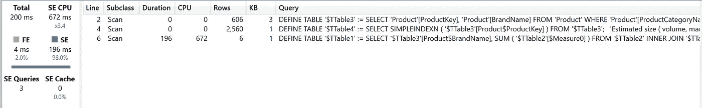
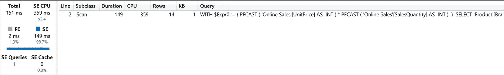
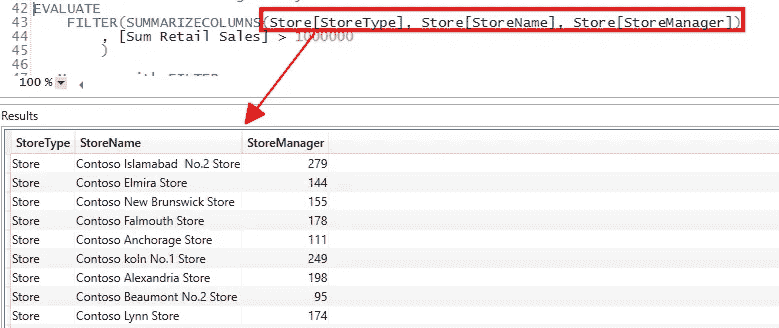
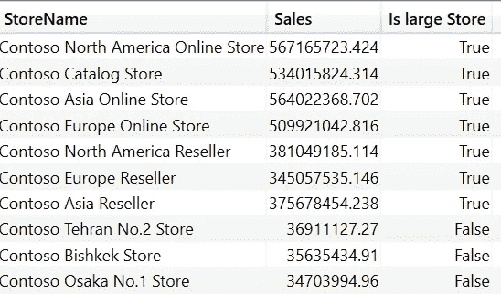
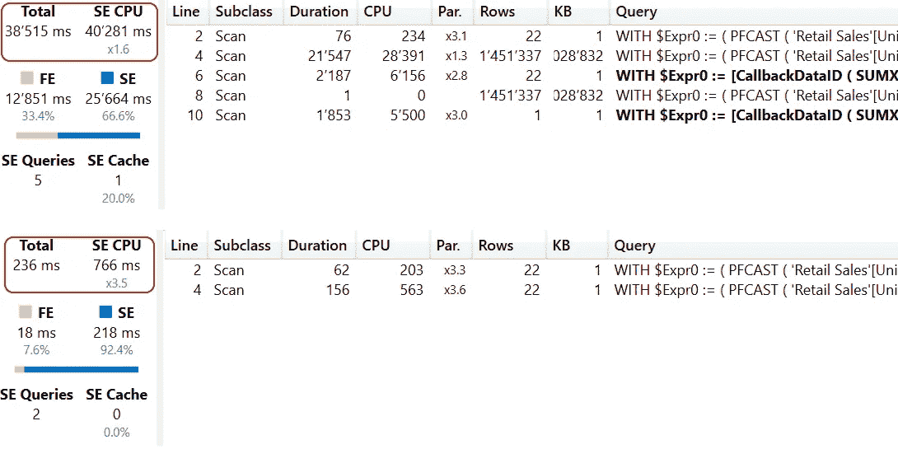

# 发现 DAX 中 FILTER()的强大功能

> 原文：<https://towardsdatascience.com/discover-the-power-of-filter-in-dax-4bfeac3dd786?source=collection_archive---------3----------------------->

## DAX 中的 FILTER()函数是强大的，但是它有一些复杂性。让我们深入研究这些细节，以便更好地理解 FILTER()函数。


由[内森·杜姆劳](https://unsplash.com/@nate_dumlao?utm_source=medium&utm_medium=referral)在 [Unsplash](https://unsplash.com?utm_source=medium&utm_medium=referral) 上拍摄的照片

# 介绍

大多数人都知道 DAX 中的 FILTER()函数。

但是，有可能你误用它或者没有使用这个功能的全部力量。

例如，前段时间，我看到一个类似这样的查询:

```
EVALUATE
    SUMMARIZECOLUMNS(
        ‘Product’[BrandName]
        ,”Sales”, CALCULATE([Sum Online Sales]
            ,FILTER(‘Product’
            ,’Product’[ProductCategoryName] = “Computers”
            )
        )
    )
```

虽然这个查询在语法上是正确的，但它不是最佳的。

在下图中，您可以看到来自 DAX Studio 的计时信息:



图 1 —使用过滤器的查询时间(按作者分类)

一个更好的版本是这个:

```
EVALUATE
    SUMMARIZECOLUMNS(
        ‘Product’[BrandName]
        ,”Sales”, CALCULATE([Sum Online Sales]
            ,’Product’[ProductCategoryName] = “Computers”
            )
        )
```

这是 DAX Studio 中不带滤波器的服务器计时:



图 2 —不使用过滤器的查询计时()(图由作者提供)

当您查看 SE CPU 时间时，可以看到第二个查询在没有过滤的情况下几乎需要一半的处理时间。

而且，虽然第一个查询需要三个存储引擎操作才能完成，但第二个查询只需一个 SE 操作就可以处理。

让我们看看为什么会发生这种情况，以及我们可以用 FILTER()函数做些什么。

# 到底什么是过滤器()

过滤函数是一个迭代器，就像 SUMX 和其他 X 函数一样。

因此，您可以使用行上下文和上下文转换来释放 FILTER()的全部功能。

如果您不熟悉 DAX 中的上下文转换，可以看看我关于这个主题的文章:

[https://towards data science . com/whats-fancy-about-context-transition-in-DAX-efb 5d BC 4c 01](/whats-fancy-about-context-transition-in-dax-efb5d5bc4c01)

FILTER()是一个迭代器的事实解释了为什么当它与 CALCULATE()或 CALCULATETABLE()一起使用时，它比添加一个“普通”过滤器要慢，如上所示。

但是，当您需要使用基于行的表达式或基于度量过滤数据时，您需要使用 filter()。

另一个事实是 FILTER()返回一个表。因此，您可以使用 FILTER()生成过滤表，并在您的数据模型或度量中使用它们。

# 使用过滤器()创建 DAX 表

因为 FILTER()返回一个表，所以您可以使用它在 Power BI 中创建一个计算表或查询您的模型。或者，您可以使用函数在模型中创建一个计算表。

以下查询显示了一个使用 FILTER 查询表并筛选结果的示例:

```
EVALUATE
 FILTER(Store
        ,Store[StoreType] <> “Store”
        )
```

作为迭代器，您可以使用行上下文来过滤结果:

```
EVALUATE
 FILTER(‘Online Sales’
   ,’Online Sales’[UnitPrice] * ‘Online Sales’[SalesQuantity] > 1000
   )
```

当然，这是一个非常昂贵的查询，因为必须对在线销售表中的每一行执行两列的乘法。但是它可以完全由存储引擎运行，因此可以使用所有可用的 CPU 内核，这使得这种方法非常高效。

虽然存储引擎(SE)可以在多个 CPU 核心上处理数据，但公式引擎(FE)每次查询只能使用一个 CPU 核心。因此，无论什么可以由 SE 处理，都比用 FE 处理更有效。

接下来，我们可以使用上下文转换来查找销售额超过 1，000，000 的商店:

```
EVALUATE
 FILTER(Store
        ,[Sum Retail Sales] > 1000000
        )
```

正如我们将在下一节中看到的那样，使用度量来过滤表的可能性对于计算结果是很方便的。

但是，这些查询总是返回筛选表中的所有列。如果我只想检索列的子集，该怎么办？

在这种情况下，我可以使用表函数只获取我感兴趣的列。

例如:

```
EVALUATE
    FILTER(SUMMARIZECOLUMNS(Store[StoreType]
                            ,Store[StoreName]
                            ,Store[StoreManager])
             ,[Sum Retail Sales] > 1000000
             )
```

下面是上面查询的结果:



图 3 —带列选择的查询(作者提供的图)

FILTER()接受所有表函数作为第一个参数。

# 在 CALCULATE()和 CALCULATETABLE()中使用

CALCULATE()和 CALCULATETABLE()接受表作为筛选参数。

由于这个事实，您可以使用 FILTER()生成一个表，并使用这种机制修改测量的结果。

查看以下带有度量值[大型商店]的查询:

```
DEFINE
 MEASURE ‘All Measures’[Large Stores] =
          CALCULATE([Sum Retail Sales]
                     ,FILTER(Store
                             ,[Sum Retail Sales] > 100000000
                             )
                     )

 EVALUATE
 CALCULATETABLE(
                SUMMARIZECOLUMNS(Store[StoreName]
                      ,”Sales”, [Sum Retail Sales]
                      ,”Is large Store”, IF([Large Stores]>0
                                              ,TRUE(), FALSE())
                      )
                      ,’Date’[Year] = 2020
                )
 ORDER BY [Is large Store] DESC, [Sum Retail Sales] DESC
```

该查询旨在查找 2020 年销售额超过 100，000，000 美元(美元、€或其他金额)的所有商店。

查询结果见下图:



图 4 —使用过滤器()的测量结果(由作者提供)

让我们分析一下这里发生了什么:

1.  该查询使用 SUMMARIZECOLUMNS()生成所有商店的列表
2.  CALCULATETABLE()用于添加 2020 年的过滤器
3.  我调用[零售总额]度量来获得 2020 年每家商店的销售额
4.  我调用度量[大型商店]并检查结果是否大于 0
    a。如果是，我返回 TRUE()
    b。如果不是，我返回 FALSE()

该度量使用现有的筛选器上下文来计算结果。过滤器上下文包含 2020 年的过滤器。

FILTER()函数在评估销售额超过 100，000，000 的商店列表时会考虑此筛选器。
FILTER()返回高于阈值的商店列表。

CALCULATE()仅对这些商店执行[零售总额]的计算，因为 FILTER()的结果用作度量值中的筛选修饰符。
因此我们可以在查询中使用一个 check，像 IF(【大型商店】> 0，TRUE()，FALSE())，来生成期望的输出。

# 注意上下文转换

当您使用 FILTER()时，上下文转换是一个重要的主题。

假设我们想要过滤我们的销售交易，以便只获得值为 1000 或更大的行。

您可能想使用 FILTER()来构造一个表，并将这个表用作 SUMX()的源:

```
Large Sales Amount =SUMX(
    FILTER(
           ‘Retail Sales’
  ,’Retail Sales’[SalesQuantity] * ‘Retail Sales’[UnitPrice] >= 1000
  )
  ,[Sum Retail Sales]
 )
```

这里，我使用 FILTER()生成一个高于上述阈值的事务列表。

虽然结果可能是正确的，但我通过调用 SUMX 中的[零售总额]度量来触发上下文转换。

更好更快的方法是以下措施:

```
Large Sales Amount =CALCULATE (
 [Sum Retail Sales],
   FILTER (
           ALL ( ‘Retail Sales’[SalesQuantity]
                 ,‘Retail Sales’[UnitPrice] ),
   ‘Retail Sales’[SalesQuantity] * ‘Retail Sales’[UnitPrice] >= 1000
   )
 )
```

在这里，我使用 CALCULATE()中的度量，并使用 FILTER()在“OnlineSales”表上应用一个过滤器来计算所需的结果。

性能上的差异非常明显，如下图所示:



图 5 —好的与坏的过滤器()使用的比较(作者提供的图表)

第一个度量显示了第一个度量的计时和查询计划，使用 SUMX()和 FILTER()。在下面，您可以看到第二个测量的计时使用了 CALCULATE()和 FILTER()。

原因在查询计划中是显而易见的，您可以看到查询处理了 1'451'337 行两次。此外，还执行了两个 CallbackDataID 步骤，在公式和存储引擎之间推送数据。这些操作非常昂贵。

# 结论

FILTER()函数对于 DAX 工具箱来说是必不可少的。

您需要了解他的能力以及使用该功能时的潜在问题。

但是，它给了你很多增强 DAX 表达的机会。

总结一下:

*   FILTER()是迭代器
*   FILTER()返回一个表格
*   可以在 CALCULATE()中使用 FILTER()来设置过滤器上下文
*   您可以在 FILTER()中使用上下文转换
*   如果使用不当，可能会降低 DAX 表达式的速度

一旦您正确理解了这个函数，您就可以开始在正确的地方使用它，并释放 FILTER()的全部威力。


[大卫·苏亚雷斯](https://unsplash.com/@davidprspctive?utm_source=medium&utm_medium=referral)在 [Unsplash](https://unsplash.com?utm_source=medium&utm_medium=referral) 上拍照

# 参考

FILTER()函数在本页描述:[过滤器— DAX 指南](https://dax.guide/filter/)

这个页面有一个嵌入的视频，有更多的信息和例子。

关于在 CALCULATE()中使用 FILTER()时应避免的信息，可在此处找到:[避免在 DAX 中使用 FILTER 作为筛选参数— DAX | Microsoft Docs](https://docs.microsoft.com/en-us/dax/best-practices/dax-avoid-avoid-filter-as-filter-argument)

我使用 Contoso 样本数据集，就像我以前的文章一样。你可以从微软[这里](https://www.microsoft.com/en-us/download/details.aspx?id=18279)免费下载 ContosoRetailDW 数据集。

Contoso 数据可以在 MIT 许可下自由使用，如这里的[所述](https://github.com/microsoft/Power-BI-Embedded-Contoso-Sales-Demo)。

我扩大了数据集，使 DAX 引擎工作更努力。
在线销售表包含 6300 万行(而不是 1260 万行)，零售表包含 1550 万行(而不是 340 万行)。

<https://medium.com/@salvatorecagliari/membership> 