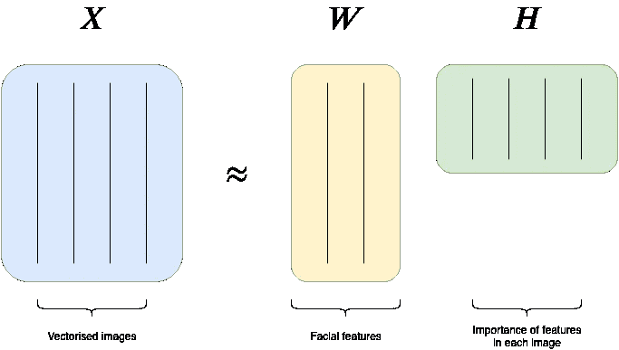
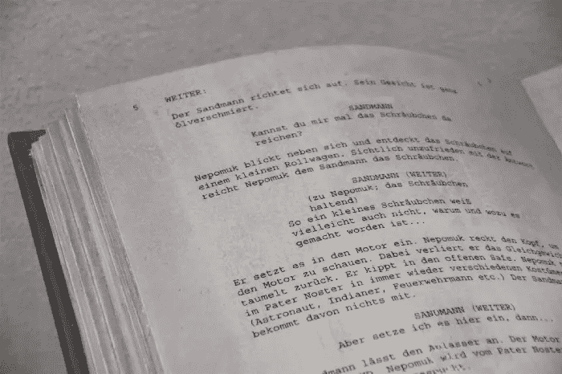
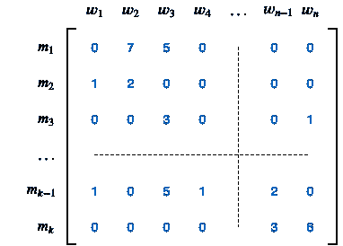
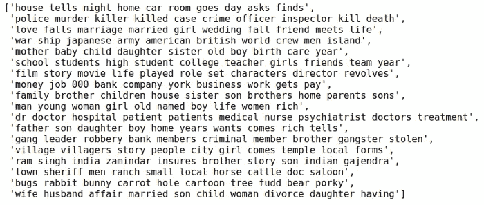

# 像数据科学家一样发现电影的灵魂

> 原文：<https://towardsdatascience.com/discover-the-soul-of-a-movie-like-a-data-scientist-3753cd96e231?source=collection_archive---------30----------------------->

## 从描述中提炼出这部电影固有的缺点

Ahmet Yal nkaya 在 [Unsplash](https://unsplash.com/s/photos/movie?utm_source=unsplash&utm_medium=referral&utm_content=creditCopyText) 上拍摄的照片

在这个故事中，我们有一个特定的目标:给定一部电影的情节，我们如何发现它的灵魂？怎样才能定位到最有意义的词，让我们想投入时间去看一部电影？哪些概念容易引起我们的共鸣，哪些符号让我们对图片的波长产生共鸣？

在本文中，我们探索如何使用非负矩阵分解(NMF)来模拟一组电影的类型或主题。此外，我们为每种类型确定最重要的词，并提出描述每部电影的潜在特征。我们可以稍后通过*迁移学习*使用这些特性来解决其他问题。

> [学习率](https://www.dimpo.me/newsletter?utm_source=medium&utm_medium=article&utm_campaign=nmf)是为那些对 AI 和 MLOps 的世界感到好奇的人准备的时事通讯。你会在每周五收到我关于最新人工智能新闻和文章的更新和想法。在这里订阅！

# 什么是 NMF？

NMF 是一种矩阵分解技术，很像奇异值分解(SVD)，但我们将结果矩阵约束为非负的，而不是正交的。

给定一个矩阵`X`，我们想把它分解成两个矩阵`W`和`H`，这样`X ≈ W x H`。我们使用近似等号`≈`,因为与奇异值分解不同，NMF 产生原始矩阵的近似值。而且`W`和`H`的每个元素都是非负的。

> *如果矩阵* `*X*` *保存人脸图像，* `*W*` *将捕捉这些人脸的面部特征以及* `*H*` *这些特征在每幅图像中的相对重要性。*

直观地说，我们可以把这两个矩阵想成这样:假设我们有一个矩阵`X`，其中每一列都是一张人脸的矢量化图像。`W`表示面部特征(如鼻子、眉毛、胡须等。)和`H`捕捉每个图像中特征的相对重要性。

作者图片

既然我们对 NMF 的成就有了一个展望，我们就准备动手了。但是首先，我们再简单地转到单词规范化和 TF-idf。

# 密度与重要性

*词频——逆文档频率* (TF-idf) 是信息检索中常用的一种权重度量。它的作用是衡量一个词对语料库中的文档有多重要。

TF-idf 由两个术语组成。第一个是术语频率，计算一个单词在文档中出现的归一化频率。因此，单词在文档中出现的次数除以该文档中的总单词数。

> TF 衡量一个单词在文档中出现的频率，而 idf 计算一个单词的重要性。

第二个术语是反向文档频率(idf)。这是通过语料库中文档数量的对数除以出现特定术语的文档数量来计算的。因此，从第一项中，我们得到了单词的频率，而第二项通过对频繁出现的单词进行加权并对罕见的单词进行放大，为我们提供了每个单词的重要性。

# 回到我们的任务

现在我们对 NMF 和 TF-idf 有了一个很好的了解，我们已经准备好着手解决眼前的问题；我们如何从一个电影情节中发掘更多？

由[瓦尔德马尔·布兰德](https://unsplash.com/@waldemarbrandt67w?utm_source=unsplash&utm_medium=referral&utm_content=creditCopyText)在 [Unsplash](https://unsplash.com/s/photos/screenplay?utm_source=unsplash&utm_medium=referral&utm_content=creditCopyText) 上拍摄的照片

# 数据集

对于这个实验，我们使用由 [JustinR](https://www.kaggle.com/jrobischon) 在[CC BY-SA 4.0](https://creativecommons.org/licenses/by-sa/4.0/)creative commons 许可下创建的[维基百科电影情节](https://www.kaggle.com/jrobischon/wikipedia-movie-plots/metadata)数据集。该数据集包含来自世界各地的 34，886 部电影的信息，如*标题、类型、上映年份、导演、情节、*等。不过我们将要使用的尺寸只是标题和 T21 情节。

此外，我们还使用了 Philippe Rémy 的英语常用名数据集，原因我们将在下面进一步解释。

# 用 NMF 进行主题建模

现在让我们深入研究代码，并从我们的工作中获益。首先，我们需要加载数据。我们将维基百科电影情节数据加载到内存中，对 50%的电影进行采样以避免内存问题，并只保留我们关心的列(即电影*标题*和*情节*)。我们还加载英语名字数据集。

接下来，我们准备电影情节，将它们存储在一个列表中，使用 TF-idf 对它们进行规范化和矢量化。目的是建立一个矩阵`X`，其中行类似于电影，列是在所有情节组合中出现的唯一单词。因此，矩阵`X`中的单元格`ij`捕获了`j`这个词在电影`i`的情节中出现了多少次。例如，在下面的矩阵中，我们可以看到单词`2`在电影`1`的情节中出现了`7`次。

作者图片

现在让我们看看 python 代码。我们使用方便的 scikit-learn 的`TfidfVectorizer`类来实现我们的目的。这个类将一个叫做`stop_words`的东西作为参数。这些都是常用词，如“*一”、“是”、“该”、“T22”等。，没有任何实际意义，也没有任何价值。*

除了这些单词之外，我们还会传递英文名字，因此我们也可以将它们排除在流程之外。在矢量器完成对单词的处理后，我们可以得到最终的词汇表，供以后使用。

现在我们有了矩阵`X`，我们想像之前看到的那样，把它分解成两个矩阵`W`和`H`。为此，我们可以使用 scikit-learn 提供的`NMF`因子分解器。分解需要一个名为`n_components`的参数。这些是主题的数量，或者在我们的例子中是电影主题，我们希望返回。

我们现在准备好研究每一个流派的灵魂。我们想找到每个主题最重要的词是什么。这个过程从情节中提取主题，并对电影主题进行建模。除了两个辅助函数之外，我们已经具备了实现这一目标所需的一切。让我们在下面定义它们。

结果是每个`18`主题的前`10`个单词，因为我们将`n_components`设置为`18`。那么，它们是什么？

18 个主题中每个主题的前 10 个单词—图片由作者提供

有些主题乍一看没有意义，但它们中的大多数都是特定流派的代表。例如，倒数第二个是关于动画和卡通的，第二个是关于犯罪的，我们在倒数第三排有一个西部主题，在中间的某个地方有一个医学主题。对于 10 到 15 行代码来说，这是一个令人印象深刻的结果！

# 结论

在这个故事中，我们探讨了非负矩阵分解(NMF)以及如何使用它进行主题建模。NMF 在[人脸分解](https://scikit-learn.org/stable/auto_examples/decomposition/plot_faces_decomposition.html#sphx-glr-auto-examples-decomposition-plot-faces-decomposition-py)、[协同过滤](http://www.quuxlabs.com/blog/2010/09/matrix-factorization-a-simple-tutorial-and-implementation-in-python/)、[化学](https://ieeexplore.ieee.org/document/1532909)、[基因表达](https://www.ncbi.nlm.nih.gov/pmc/articles/PMC2623306/)等等方面都有各种应用。您现在已经有了进一步检查它并在项目中使用它所需的东西。

这个故事的灵感来自于雷切尔·托马斯关于计算线性算法的课程。

# 关于作者

我的名字是 [Dimitris Poulopoulos](https://www.dimpo.me/?utm_source=medium&utm_medium=article&utm_campaign=nmf) ，我是一名为 [Arrikto](https://www.arrikto.com/) 工作的机器学习工程师。我曾为欧洲委员会、欧盟统计局、国际货币基金组织、欧洲央行、经合组织和宜家等主要客户设计和实施过人工智能和软件解决方案。

如果你有兴趣阅读更多关于机器学习、深度学习、数据科学和数据操作的帖子，请关注我的[媒体](https://towardsdatascience.com/medium.com/@dpoulopoulos/follow)、 [LinkedIn](https://www.linkedin.com/in/dpoulopoulos/) 或 Twitter 上的 [@james2pl](https://twitter.com/james2pl) 。

所表达的观点仅代表我个人，并不代表我的雇主的观点或意见。