# Discover Urban viewer:一个交互式 web 地图，用于可视化全球城市地区的人口

> 原文：<https://towardsdatascience.com/discover-urban-viewer-an-interactive-web-map-to-visualize-population-of-urban-areas-worldwide-f36df1fe420d?source=collection_archive---------26----------------------->

## 如何在传单中创建包含全球城市群的网络地图

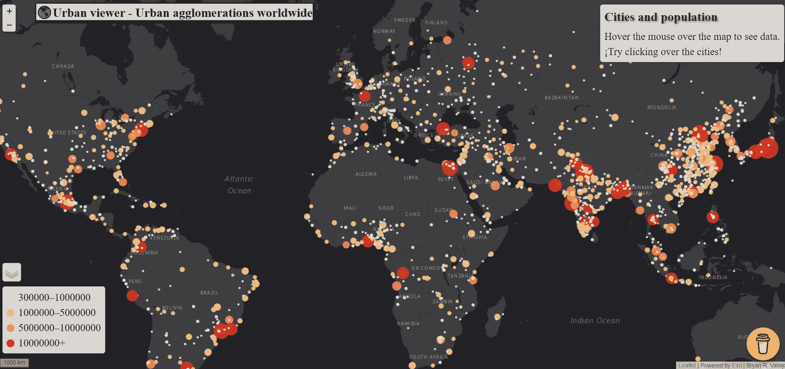

图片由作者提供。城市浏览器:包含全球城市群的交互式网络地图

世界正在城市化。2018 年，全球城市住区容纳了约 55.3%的世界人口。联合国的预测估计，到 2030 年，60%的世界人口将居住在城市聚集区。城市化的主要趋势揭示了政府对使人类住区具有包容性、安全性、弹性和可持续性的关注[1]。由于城市新陈代谢(废物)，自然正在产生毁灭性的影响，当局主要关注的是通过创建有效的减少废物的过程来减少这种影响，例如回收利用、替代能源或化石燃料的转换，等等。

> 都市观众[这里！](https://bryanvallejo16.github.io/urban-viewer-worldwide/)
> 储存库[这里！](https://github.com/bryanvallejo16/urban-viewer-worldwide)

联合国做了一个引人入胜的人口修订，名为: [***世界城市化前景:2018 年修订的***](https://www.un.org/en/events/citiesday/assets/pdf/the_worlds_cities_in_2018_data_booklet.pdf)*显示了全球**城市群**的人口预测。因此，我们将正确理解*城市群*的概念，这是我们在此实践中使用的划界，并将其与另外两个城市概念区分开来:*市区和都市圈*。*

***市区**代表市区的行政核心。它保持了一个中心界限。下一个概念是**城市群**，它指的是划定城市边界的毗连城区或建成区的范围。最后，**大都市区域**代表了经济和社会相互联系的边界，通过商业或通勤模式相互联系。这些概念可以在提到的 2018 年修订版中进行审查。*

> *“本练习的目的是创建一个交互式网络地图，以活页形式显示 2020 年全球城市群的估计人口”*

> ***数据***

*我们在这个地图可视化实践中使用的数据集来自联合国经济和社会事务部人口动态部。具体来说，我们使用的是*文件 12* ，其中包含了 1950-2035 年按国家划分的 2018 年拥有 30 万或以上居民的城市群的人口(千人)[2]该数据集在 3.0 版的知识共享协议下获得许可。*

*《2018 年人口修订版》发布了包含大量城市预测信息的出版物，可在 [*出版物部分*](https://population.un.org/wup/Publications/) 找到。*

> ***练习***

*该练习分为两个部分:1)数据格式，以及 2)城市查看器 web 地图创建。*

****1)数据格式****

*从[下载页面](https://population.un.org/wup/Download/)下载数据集`[WUP2018-F12-Cities_Over_300K.xls](https://population.un.org/wup/Download/Files/WUP2018-F12-Cities_Over_300K.xls)`后。您可能会注意到，这是一个 excel 文件，其结构不适合使用，尤其是在传单地图中。此外，您必须正确构建数据集，例如:*

*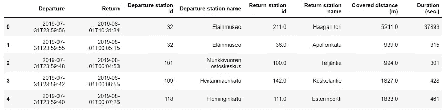*

*图片由作者提供。表格的正确结构示例。*

*您可以直接在 excel 中完成，您可能需要保留列:`Urban Agglomeration`、`Latitude`、`Longitude`和`2020`。然后，您必须以这种方式更改列名:`Urban Agglomeration`到`City_name`和`2020`到`a2020`，以便它匹配城市查看器的代码。*

*当你有了合适的结构后，将它保存为`.csv`，然后在 *geopandas* 中打开它，并将几何列(经度，纬度)作为一个几何对象包含进来。您可以在文章[***赫尔辛基的自行车共享系统运动:用交互式流程图进行聚合和可视化***](/visualization-of-bike-sharing-system-movements-in-helsinki-with-an-interactive-flow-map-451d897104fe) ***的 ***数据生成***部分回顾这个过程。*** 最后保存为 GeoJSON，名称`pop_cities.geojson`。您会发现数据集已经在[存储库](https://github.com/bryanvallejo16/urban-viewer-worldwide)中。*

*为小叶映射手动完成的最后一步是在数据集中添加变量的名称。[小叶网有个例子](https://leafletjs.com/examples/geojson/)。因此，我们要使用的最终数据集应该是这样的:*

*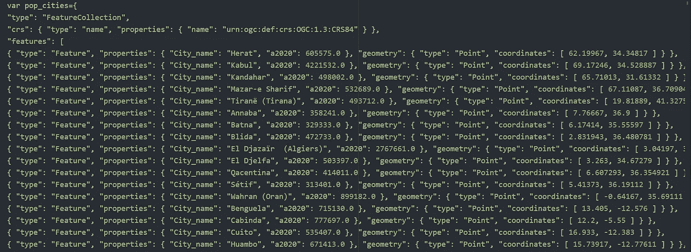*

*图片由作者提供。数据集可在城市查看器中使用*

*如果您想要自动创建更多不同年份的数据集，或者在创建 GeoJSON 时需要帮助，请随时寻求支持。您可以在[***LinkedIn***](https://www.linkedin.com/in/bryanrvallejo/)上的我的个人资料中联系我，或者干脆在本文中留言。*

****2)城市观者创作****

*现在，我们必须创建一个包含必要文件的存储库，以使 Urban Viewer 正常工作。我们添加了一个名为`css` 的文件夹和另一个名为`js.`的文件夹，我们还添加了一个名为`index.html`的 HTML 文件，你可以通过在本地磁盘上克隆这个库来获得这些文件。因此，您的本地文件夹可能如下所示:*

*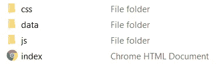*

*图片由作者提供。知识库结构。*

*注意在*数据文件夹*中已经有一个`pop_cities.geojson`文件，它是步骤 1)的结果。要使用文件进行 web 映射，我推荐使用[**Atom**](https://atom.io/)**或者简单地使用[**notepad++**](https://notepad-plus-plus.org/downloads/)**。*****

***首先，我们将下载并复制 [**传单 API**](https://leafletjs.com/) 用于文件夹`js.`中的 web 制图。此外，我们添加一个空的 JS 文件，在本例中命名为`main.js`***

***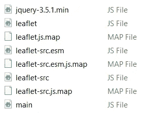***

***图片由作者提供。js 文件夹的结构***

***然后，在文件夹`css` 中，我们添加来自传单的 CSS 文件和一个空文件，我们在本例中称之为`style.css` CSS 文件夹，如下所示:***

***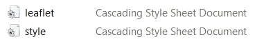***

***图片由作者提供。CSS 文件夹的结构***

****2.1)将文件加载到 index.html****

***我们将使用 Atom 或 Notepad++打开*index.html*文件，并开始加载文件。它将包含一个**头部**和一个**主体**。在主体部分，我们包含了运行地图动画的主要文件，还有传单文件和数据文件。它包括来自 ESRI 的基本地图。***

```
***<!DOCTYPE HTML>
<html>
 <head>
  <meta charset="utf-8">
  <title>Urban Viewer Demo</title> <!--link to stylesheet-->
  <link rel="stylesheet" href="css/style.css"><!-- link to leaflet stylesheet-->
  <link rel="stylesheet" href="css/leaflet.css"></head><body>
  <!-- title of your map-->
  <h1> 🌎Urban viewer - Urban agglomerations worldwide  </h1><!-- division div for the map -->
  <div id="map"></div><!-- link to leaflet javascript library-->
  <script src="js/leaflet-src.js"></script><!-- load Esri Leaflet because we want to use an Esri basemap -->
  <script src="[https://unpkg.com/esri-leaflet@2.3/dist/esri-leaflet.js](https://unpkg.com/esri-leaflet@2.3/dist/esri-leaflet.js)"></script><!--link to the files that contains geoJson data-->
  <script src="data/pop_cities.geojson" type="text/javascript"> </script><!-- link to main javascript file -->
  <script src="js/main.js"></script></body>
<html>***
```

****2.2)map-style . CSS 中的参数****

***我们必须设计 HTML 对象的样式，我们在。css 文件中的对象:*标题、正文、图例和地图*。打开`style.css`，包含下一段代码:***

```
***h1{
 position: fixed;
 font-family: "Times New Roman", Times, serif;
 font-size: 24px;
  box-shadow: 2px 2px 3px 3px black;
 background: lightgray;
    color: black;
    margin-left:5%;
    margin-top: 0.6%;
    z-index: 2;
}body{
 width: 100%;
 height: 100%;
 margin: 0px;
 font-family: "Helvetica Neue", Arial, Helveticam sans-serif;
}.info {
    padding: 6px 8px;
    font-family: "Times New Roman", Times, sans-serif;
    font-size: 20px;
    background: white;
    background: rgba(255,255,255,0.8);
    box-shadow: 0 0 15px rgba(0,0,0,0.2);
    border-radius: 5px;
}
.info h3 {
  font-size: 24px;
  font-family:  "Times New Roman", Times, serif;text-shadow: 2px 2px 5px gray;
    margin: 0 0 5px;
    color: #282825   ;
}.legendcolor {
    line-height: 18px;
    color: #555;
}
.legend i {
    width: 18px;
    height: 18px;
    float: left;
    margin-right: 8px;
    opacity: 1;
}.legend .circle {
  border-radius: 50%;
  width: 15px;
  height: 15px;
  margin-top: 8px;
}#map {
 height:100%;
 width:100%;
 left:0%;
 overflow:hidden;
 position:fixed;
 border:1px #444 solid;
}***
```

***您可能会注意到它包含可视化参数，如字体、位置或地图大小。如果你想重新设计你自己的城市观察器，你可以改变它们。***

***添加 CSS 代码后，如果您在浏览器中打开 index.html，您可能会看到如下所示的空白画布:***

***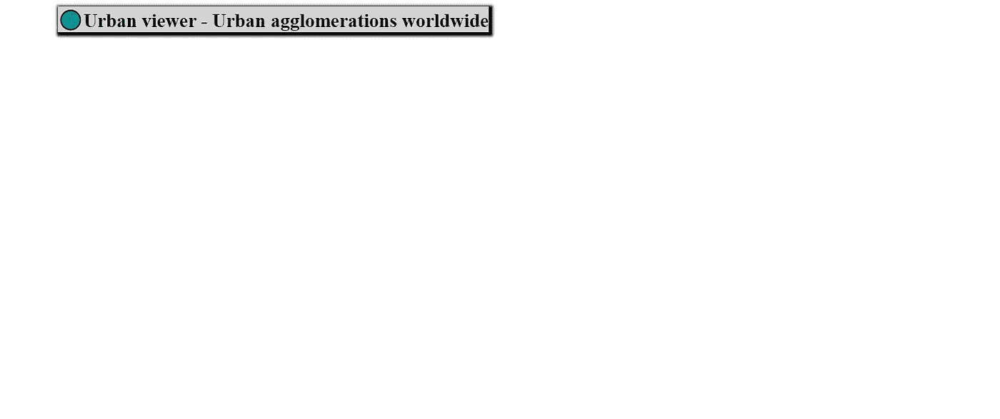***

***图片由作者提供。空画布***

****2.3)创建城市浏览器****

***在这里，我们将开始用传单创建地图。是时候打开并开始编辑`main.js`文件了。我们一步一步来。你可以看一下 [***传单互动 Choropleth Map***](https://leafletjs.com/examples/choropleth/) 的例子，我在建立 Map 变量和定义图例颜色时得到了一些帮助。***

***首先，我们为地图添加一个变量，定义缩放级别和中心。然后，我们添加 OSM (OpenStreetMap)和 ESRI 作为底图。您可以在此处更改属性，例如您的姓名或机构名称，以便在最终的 web 地图中显示。***

```
***// ADDING BASE MAPS, MAP AND SCALE BAR
var map = L.map('map').setView([25, 12], 3);var osm = 
L.tileLayer('[https://{s}.tile.openstreetmap.org/{z}/{x}/{y}.png',{attribution:'Open](https://{s}.tile.openstreetmap.org/{z}/{x}/{y}.png',{attribution:'Open) Street Maps | Bryan R. Vallejo'});var esri = 
L.tileLayer('[https://server.arcgisonline.com/ArcGIS/rest/services/World_Imagery/MapServer/tile/{z}/{y}/{x}'](https://server.arcgisonline.com/ArcGIS/rest/services/World_Imagery/MapServer/tile/{z}/{y}/{x}'), {attribution: 'Tiles &copy; Esri &mdash; Source: Esri, i-cubed, USDA, USGS, AEX, GeoEye, Getmapping, Aerogrid, IGN, IGP, UPR-EGP, and the GIS User Community | Bryan R. Vallejo',maxZoom: 18});var esridark = 
L.esri.basemapLayer('DarkGray',{attribution: 'Bryan R. Vallejo'});var esrigray = 
L.esri.basemapLayer('Gray',{attribution: 'Bryan R. Vallejo'});esridark.addTo(map)var basemaps={
  'DarkGray': esridark,
  'Satellite': esri,
 'OSM': osm
}L.control.scale({imperial:false, position:'bottomleft'}).addTo(map);***
```

***如果在浏览器中刷新 index.html 文件，它应该是这样的:***

***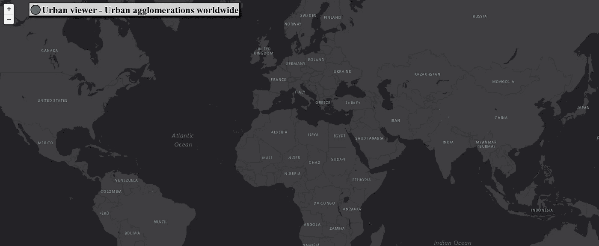***

***图片作者。从带有 ESRI 底图的传单添加地图对象***

***现在，我们将添加数据集，并在*信息框*中包含检索人口信息的函数。如有必要，务必检查[活页示例](https://leafletjs.com/examples/choropleth/)。***

```
***//FUNCTIONS/Function to highlight Featuresfunction highlightFeature(e) {
  var activefeature = e.target;
  activefeature.setStyle({
    weight: 5,
    color: '#F0F92B',
    dashArray: '',
    fillOpacity: 0.3
  });
  if (!L.Browser.ie && !L.Browser.opera) {
    activefeature.bringToFront();
  } info.update(activefeature.feature.properties);
}//function for resetting the highlight
function resetHighlight(e) {
  cities.resetStyle(e.target);
  info.update();
}function zoomToFeature(e) {
  map.flyTo(e.target.getLatLng(),6);
}//to call these methods we need to add listeners to our features
//the word ON is a short version of addEventListenerfunction interactiveFunction(feature, layer) {
  layer.on({
    mouseover: highlightFeature,
    mouseout: resetHighlight,
    click: zoomToFeature,
  } );
}***
```

***然后，我们将继续添加功能。第一个是根据人口数量定义圆的 ***半径大小*** 。第二个，圆圈 的 ***颜色。第三个，根据点的大小(人口)和颜色定义点的 ***样式*** 。******

```
***// calculate the circles' radius given the cities' populationfunction getRadius(pop) {
var maxSymbolsize = 20; // maximum symbol size
var maxValue = 37393129; // highest population value in the dataset
r = maxSymbolsize * Math.sqrt(pop/maxValue); // proportional by area
return r;
}// create the circles' stylefunction getColor(d) {
return d > 10000000  ? '#d7301f' :
        d > 5000000  ? '#fc8d59' :
        d > 1000000   ? '#fdcc8a' :
        '#fef0d9' ;
      }// radius calculated with function above and population property form GeoJSON as inputfunction style(feature) {
  return {
    radius: getRadius(feature.properties.a2020), 
    fillColor:getColor(feature.properties.a2020),
    color: "#000",
    weight: 1,
    opacity: 0,
    fillOpacity: 0.9
  };
}***
```

***目前，我们已经定义了创建 web 地图交互的功能，以及城市群的风格(大小和颜色)。***

***下一步，添加城市层。***

```
***// Add circles, popups and tooltips to the mapvar cities=L.geoJson(pop_cities, {
  pointToLayer: function (feature, latlng) {
    return L.circleMarker(latlng, style(feature));
  },
  onEachFeature: interactiveFunction
}).addTo(map)***
```

***如果您在浏览器中刷新`index.html`,它可能看起来像这样:***

***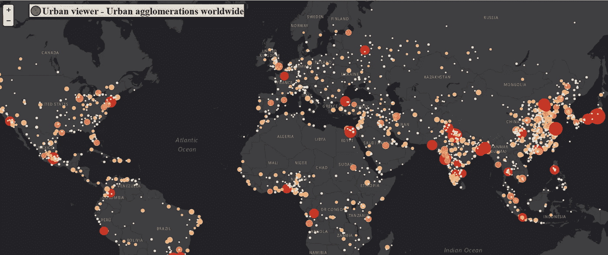***

***图片由作者提供。《城市观察》中的城市群初窥***

***下一步是在 infobox 中检索每个城市的居民数量。为此，我们可以包含一个 infobox 对象和使它具有交互性的功能。***

```
***//ADDING A INFO CONTROL BOX
var info = L.control();info.onAdd = function (map) {
  this._div = L.DomUtil.create('div', 'info'); // create a div with a class "info"
  this.update();
  return this._div;
};// method that we will use to update the control based on feature properties passed
info.update = function (props) {
  this._div.innerHTML = '<h3> Cities and population </h3>' +  (props ?
    '<b>'+props.City_name +'</b>'+ ' 🌆' +'<br/>' + props.a2020 + ' Inhabitants in 2020':
    'Hover the mouse over the map to see data.'+'<br/>'+'¡Try clicking over the cities!' );
  };info.addTo(map);***
```

***如果刷新 index.html 文件，信息框可能如下所示:***

***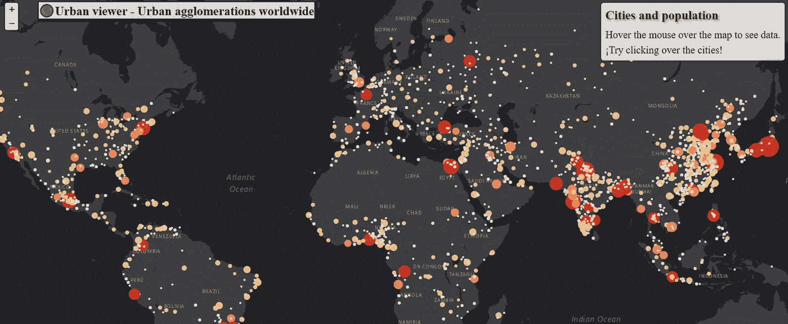***

***图片由作者提供。添加到城市查看器的信息框***

***然后，我们通过一个循环添加定义类颜色的图例。***

```
***//ADDING A LEGEND WITH COLORSvar legendcolor = L.control({position: 'bottomleft'});
legendcolor.onAdd = function (map) {
  var div = L.DomUtil.create('div', 'info legend'),
  grades = [300000, 1000000, 5000000, 10000000],
  labels = [];

// loop through our density intervals and generate a label with a colored square for each intervalfor (var i = 0; i < grades.length; i++) {
  div.innerHTML +=
  '<i class ="circle" style="background:' + getColor(grades[i] + 1) + '"></i> ' +
  grades[i] + (grades[i + 1] ? '&ndash;' + grades[i + 1] + '<br>' : '+');
}
return div;
};legendcolor.addTo(map);***
```

***如果您在浏览器中刷新`index.html`文件。您会注意到，当您将鼠标悬停在城市上方时，infobox 会检索信息。此外，还会添加带有适当颜色的图例。看起来是这样的:***

***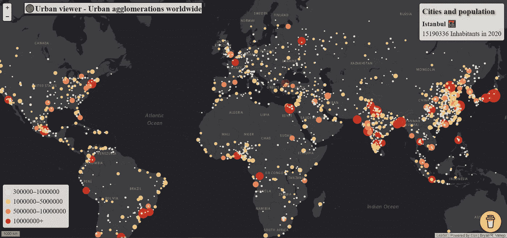***

***图片由作者提供。添加了图例的城市查看器。***

***最后一步是添加一个图层控制器，如果需要，可以打开底图和城市。***

```
***//ADDING A LAYER CONTROL
var features={
  'Cities': cities
}var legend = L.control.layers(basemaps, features, {position: 'bottomleft', collapsed:true}).addTo(map);***
```

***现在，如果需要，你可以改变基本地图并关闭城市。最后，使用 OSM 底图，城市查看器看起来是这样的:***

***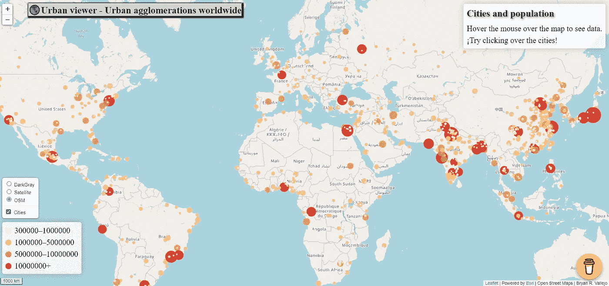***

***图片由作者提供。带有 OSM 底图的城市查看器。***

> ******推荐******

***如果你在 JavaScript 方面经验丰富，你可以继续给**城市浏览器**添加功能。例如，你可以添加*搜索框*，这样你就可以输入城市。这取决于你想赋予它的效用。本练习中解释的主要用于可视化和信息。用户可以快速查看全球*城市群的人口*。***

> ***如果您对创建**城市查看器**感兴趣，并且需要支持来创建您自己的基于 web 地图的项目。在我的个人资料上 Ping 我[**LinkedIn**](https://www.linkedin.com/in/bryanrvallejo/)**。*****

> *****参考文献*****

***[1]联合国经济和社会事务部人口司(2018 年)。***2018 年世界城市—数据手册(ST/ESA/ SER。*一/417)**。***

***[2]联合国经济和社会事务部人口司(2018 年)。 ***《世界城市化前景:2018 年修订本*** ，网络版。***