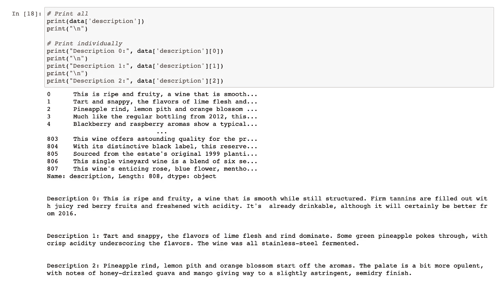
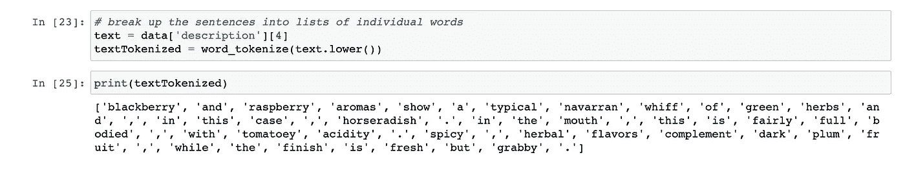
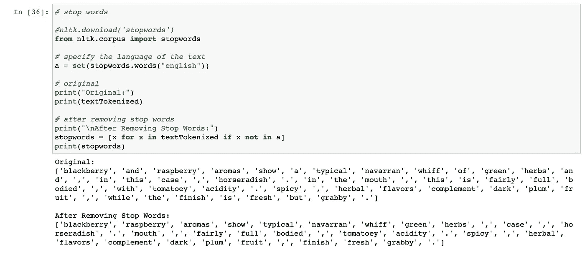
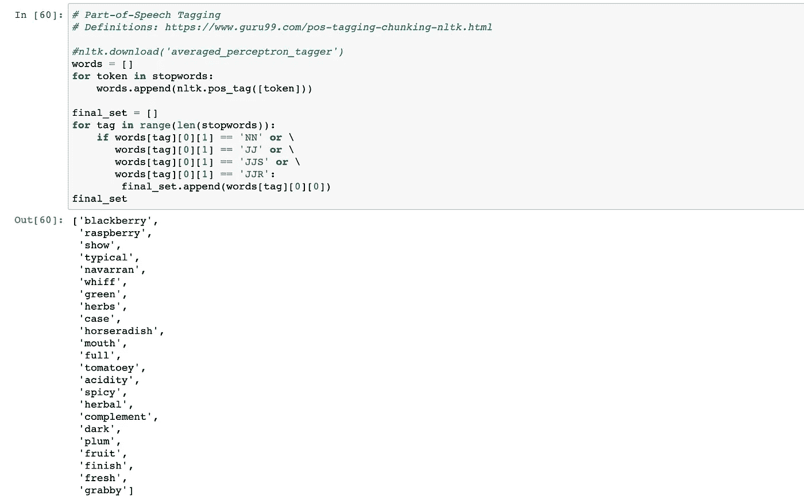
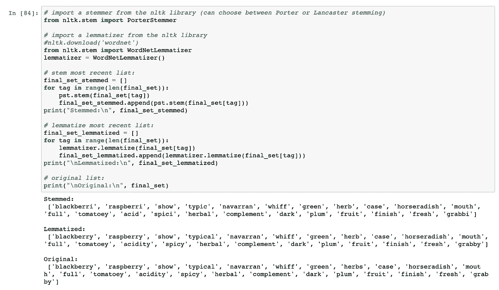

# 通过探索性文本分析发现您的完美眼镜

> 原文：<https://towardsdatascience.com/discover-your-perfect-glass-with-exploratory-text-analysis-3ac0b4d9b0e5?source=collection_archive---------39----------------------->

## 品酒大师欢欣鼓舞！

由[丹尼尔·沃格尔](https://unsplash.com/@vogel11?utm_source=unsplash&utm_medium=referral&utm_content=creditCopyText)在 [Unsplash](https://unsplash.com/s/photos/wine?utm_source=unsplash&utm_medium=referral&utm_content=creditCopyText) 上拍摄的照片

我第一个承认——我对酒一无所知。我只知道偶尔会抿一口喜欢的，大部分时候会抿一口实在不喜欢的。因此，尽管我个人无法区分雪松味的葡萄酒和橡木味的葡萄酒(或者说实话，雪松味和泡泡糖味的葡萄酒)，但我知道有些东西让我喜欢某些葡萄酒，只是我不知道是什么。

输入文本分析和超过 130，000 条不同葡萄酒评论的数据集，从 9 美元的 Trader Joe's Chardonnay 到 15，000 美元的法国香槟的 Dom Perignon 玫瑰金([谢谢，Kaggle](https://www.kaggle.com/zynicide/wine-reviews) ！).

这个数据集对于文本分析/自然语言处理来说是惊人的，因为它包括了数千个段落来描述选择中的每一种葡萄酒，在混合中使用了神话般的词语，如 *"* "酸涩"、"乡村"、"辛辣"、"白垩"、"多汁"，甚至是"奶酪"。为了更好地理解这些描述有多宏大，下面是第 20 条观察的全文:

成熟的黑浆果香味混合着丰富的黑胡椒、烤香草和烟草的味道。口感自然是橡木味，但酸红醋栗的味道闪闪发光，给人一点轻浮的感觉。”

或者观察#25:

这款来自高海拔地区的葡萄酒被命名为皮诺，散发着橡木和泥土混合在一起的浓郁芳香。产量很小，它提供了浓郁浓郁的覆盆子和黑莓的味道，充满了烟熏的香料和柔滑的口感。”

光是看这些描述就让我想成为一个品酒师！

# 本教程的数据

我已经将 Kaggle 数据上传到[这个 Github repo](https://github.com/amawest/Wine-Reviewer-NLP-Python/blob/master/wine.csv) 中，所以你可以下载它并使用`wine.csv`跟踪它。您还需要导入一些库(典型的库，如 NumPy、Pandas 和用于文本分析的 NLTK 库),然后我们就可以开始比赛了。

如果您想查看文本框，可以使用`data['description'][i]`功能:

这就是我们要做的！我们♥️预先清理数据。

# 1 |标记化

**标记化**往往是文本分析的第一步。它描述了将复杂的句子分解成更小单元的过程，这通常意味着将一个句子分解成一系列单词。使用 NLTK，标记文本框非常简单:

输出如下所示:

如您所见，`word_tokenize`函数会自动假设您希望每个单词组成一个新的单元，但是您也可以根据需要按单词的成对或三元组进行标记。

如果你正在使用 R，我相信`stringr`包将是你完成标记化的最好朋友([这里有一个我找到的关于 R 使用 stringr](https://www.mjdenny.com/Text_Processing_In_R.html) 的很好的教程)。

# 2 |删除停用字词

停用词是语言中最常见的词。单词“The”、“a”、“at”、“for”、“above”、“on”、“is”、“all”是停用词的一些例子。这些单词在文本块中通常是最没有意义的，因此在分析之前通常被移除。

我们可以使用 NLTK 库删除这些停用词，如下所示:

结果是一个新列表，其中的单词“The”、“and”和“from”是从文本中的每个列表中新删除的:

奇怪的是，删除停用词并没有删除像“.”这样无意义的标点符号还有“，”。为了消除这些问题，我们将继续讨论…

# 3 |词性标注

**词性标注**用于根据定义和上下文为给定文本中的每个单词分配词性，然后我们可以对其进行过滤。原来在小学花在学习名词、动词和形容词之间的区别上的所有时间可能最终会有回报！

Clippy:从 2005 年开始给我带来噩梦(GIF 来自 [GIPHY](https://giphy.com/gifs/everyone-word-sharing-13V60VgE2ED7oc)

有许多工具可用于词性标记，一些最广泛使用的标记在 NLTK、Spacy、TextBlob、Standford 和 CoreNLP 库中。幸运的是，我们可以再次使用 NLTK 库:

在我的循环中使用“NN”、“JJ”、“JJS”和“JJR”告诉计算机保留所有名词和形容词。要查看所有可能缩写的完整列表，[你可以参考 guru99 这里的列表](https://www.guru99.com/pos-tagging-chunking-nltk.html)。

只过滤名词和形容词，这是我们的新结果:

现在你知道了！(边注:如果有人知道什么是“纳瓦拉”，请在评论中启发我们。)

# 4 |词干/词汇化(可选)

**词干化**是指将单词规格化为其基本形式或词根形式。例如，单词*诱饵，诱饵*和*诱饵*都变成了词根是‘诱饵’。类似地，**词条化**是用一点额外的努力将一个单词转换成它的基本形式的过程。

那有什么区别呢？词汇化考虑上下文，将单词转换成它有意义的基本形式，而词干化只是删除最后几个字符，不那么好奇。词汇化可以带来更好的结果，但前提是人类已经首先进入并为计算机提供了一个有意义的词汇来匹配单词和词根。词干提取需要较少的人工干预，计算成本也较低，但是更容易出现错误和拼写错误。

2005 年的电脑在词汇化方面不会很出色(GIF 也来自 [GIPHY](https://giphy.com/gifs/windows-bliss-xp-MaUHcoeTZ7dquWTv55)

在我的计算机转换回拨号之前，让我们继续看代码…

下面是上述代码块的最终输出:

如您所见，我将这一部分指定为最可选的，因为词干化和词汇化不一定会改善您的列表。在使用 Kaggle 的真实世界葡萄酒数据时，stemming 只是把“blackberry”改成了“blackberry”，把“mouth”改成了“mout”，看起来一点用都没有。需要人工输入的词汇化没有提取任何已知的基本词汇，因此列表保持不变。

要点:词干化和词汇化*可能*有用——但是如果你这样做的话，请确保你对数据做了双重处理！

# 结论

在本教程中，我们复习了标记化、停用词、词性标注、词汇化和词干化的基础知识。我一次针对一个列表分析每个函数，但是人们可以使用来自我的 Github 的这些脚本一次分析所有的数据。你可以通过下载完整的 zip 文件并运行`filters.py`来试用我的葡萄酒推荐器，在那里我将这些浓缩的列表与字典中常见的描述符[甜、咸、土、果味、花香和苦味的葡萄酒](https://github.com/amawest/Wine-Reviewer-NLP-Python/blob/master/Add_Categories.ipynb)进行了比较。谁知道呢，也许你下一个最喜欢的酒就在你当地的熟食店卖呢！

特别感谢我的 CS 5010 项目团队，其中我的贡献是你在上面看到的文本分析/NLP 部分，以及 Dhilip Subramanian，他有一个自己的[很棒的文本挖掘教程](https://medium.com/towards-artificial-intelligence/text-mining-in-python-steps-and-examples-78b3f8fd913b)。再次感谢阅读，干杯！🥂

照片由[雷·轩尼诗](https://unsplash.com/@rayhennessy?utm_source=unsplash&utm_medium=referral&utm_content=creditCopyText)在 [Unsplash](https://unsplash.com/s/photos/fireworks?utm_source=unsplash&utm_medium=referral&utm_content=creditCopyText) 上拍摄

# 来源

1.  [https://www.kaggle.com/zynicide/wine-reviews](https://www.kaggle.com/zynicide/wine-reviews)
2.  [https://medium . com/forward-artificial-intelligence/text-mining-in-python-steps-and-examples-78 B3 F8 FD 913 b](https://medium.com/towards-artificial-intelligence/text-mining-in-python-steps-and-examples-78b3f8fd913b)
3.  [https://www.guru99.com/pos-tagging-chunking-nltk.html](https://www.guru99.com/pos-tagging-chunking-nltk.html)
4.  [https://www.mjdenny.com/Text_Processing_In_R.html](https://www.mjdenny.com/Text_Processing_In_R.html)